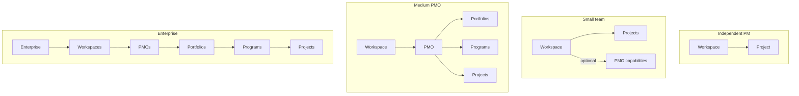

# ADR-PMF-012: Progressive Disclosure Does Not Alter the Domain

Status: Accepted
Date: 2026-07-18
Decision owners: Founder / Product Authority; PMFreak Architecture
Supersedes: None
Superseded by: None

## Context

PR1 (`docs/product-architecture/01-canonical-domain-model.md`) audited PMFreak's implementation against the product's stated PMI/enterprise vision. Two of its findings bear directly on this ADR.

First, unlike almost every other area of the audit, PR1 §37 found that progressive disclosure is **existing, real infrastructure, not a gap**: `src/features/runtime/capability-reveal/` implements a working reveal-stage engine. It defines five ordered stages (`CapabilityRevealStage`: `activation → awareness → guidance → governance/constraint → organizational`), computed from onboarding completion, evidence density, continuity maturity, plan tier, and governance-directive capability (`capability-reveal-selectors.ts`). It gates thirteen domains (`REVEAL_DOMAIN_ORDER` in `capability-reveal-contract.ts`: `core, projects, vault, memory, risks, stakeholders, delivery, coordination, interventions, executive, governance, scope, lessons`) per stage. It carries four role profiles (`pm, pmo, executive, ops`), each with its own domain priority order (`ROLE_DOMAIN_PRIORITIES`). It recognizes three plan tiers (`free, pro, pmo`) — PR1 confirms no `enterprise` tier exists at the application level, consistent with the dead billing-plan enum finding (PR1 §12 C-2). A separate, orthogonal gate exists for pilot/founder profile (`src/lib/workspace/pilot-capability-set.ts`): `founder` sees everything; `pilot` hides `/governance, /policies, /audit, /trust/agents, /capabilities, /trials, /intelligence` regardless of reveal stage. PR1 §37's own conclusion: *"This system is a sound foundation to build the brief's requested segment configurations on top of — it already computes 'what's unlocked' from real signals; it does not yet have Enterprise, Portfolio (PMI), or a ratified Program relationship to gate, because those don't exist yet."* This ADR treats that conclusion as an instruction: future gating work for Enterprise, Portfolio, and Program extends this engine; it does not build a parallel one.

Second, PR1 §38 evaluated five illustrative segment configurations (Independent PM, Small team, Medium PMO, Enterprise, Consultancy) against what capability-reveal can support today, and found a real, evidenced contradiction (PR1 §11, §38): the onboarding wizard currently **blocks** "Create Project" until "Create Command Center" (i.e., PMO creation) is completed — `getting-started-flow.tsx:359-371`, with the tooltip *"Create a Command Center first to give your projects governance, objectives, and agent context."* This directly contradicts the Independent-PM segment's intended experience, in which PMO should stay invisible and optional, revealed only once a second project or teammate appears. PR1 does not fix this; it flags it as friction that a future PR must correct.

The founder has now ratified the full canonical hierarchy this progressive-disclosure system will eventually gate: `Enterprise → Workspace → PMO → Portfolio → Program → Project`, with optional shortcuts `Workspace → Project`, `PMO → Project`, `Portfolio → Program`, and `Portfolio → Project` (a Program's membership in a PMO is always mandatory, per ADR-PMF-005 Rule 1; only its Portfolio nesting is optional) (per `docs/product-architecture/01.1-domain-ratification.md` and the sibling ADRs ratifying each level — ADR-PMF-001 for Enterprise, ADR-PMF-004 for Portfolio, ADR-PMF-005 for Program). A hierarchy that deep, applied uniformly, would overwhelm an independent PM who only ever needs a Workspace and a Project. Progressive disclosure is how the product reconciles a domain model that must be complete with a user experience that must not be. This ADR formalizes the rule that keeps those two commitments from drifting apart: hiding a level of the hierarchy is a presentation decision, never a domain decision.

## Decision

**The UI may hide complexity without eliminating the enterprise domain.** The full canonical hierarchy — Enterprise, Workspace, PMO, Portfolio, Program, Project, and their optional shortcuts — exists conceptually at all times, for every tenant, regardless of what any given user's UI currently reveals. Progressive disclosure (what capability-reveal shows a given user at a given stage) and auto-creation (rows materialized automatically, such as `ensureUserWorkspace` or `ensureDefaultPmo`) are presentation and onboarding concerns. They are not domain-model concerns, and they must never be read as evidence that an entity is optional, deprecated, or absent from the model.

Hiding an entity does not mean the entity does not exist. Auto-creation does not mean the entity is irrelevant. These are two independent claims and must not be collapsed into one: an Independent PM whose UI never shows "PMO" may have a Project with no PMO at all — per ADR-PMF-003 Rules 5–6, a universal invisible default PMO is not permitted, and per ADR-PMF-006 Rules 2 and 5, a Project without a PMO is a permanent, valid state, not a placeholder for one. What this rule guarantees is only that *if* a PMO row exists for that tenant (whether auto-created under an explicit opt-in, per ADR-PMF-003 Rule 6, or created manually later), hiding it from the UI does not make it any less real. A Small Team whose UI never shows "Portfolio" still occupies a domain position where Portfolio applies once built, in exactly the same conditional sense — visibility is a UI fact, existence is a data fact, and this rule speaks only to the latter given the former is hidden. The canonical model (ADR-PMF-001 through ADR-PMF-008 and this ADR's sibling decisions) is the single source of truth for what PMFreak's domain *is*. `capability-reveal` and `pilot-capability-set` are the single source of truth for what a given user currently *sees*. These are two different questions, answered by two different systems, and no future work may collapse them into one.

## Domain Rules

1. The canonical hierarchy (`Enterprise → Workspace → PMO → Portfolio → Program → Project`, with shortcuts `Workspace → Project`, `PMO → Project`, `Portfolio → Program`, `Portfolio → Project`) applies to every tenant at all times, whether or not any level above Workspace is yet implemented or yet visible to that tenant's users. (A Program's membership in a PMO is always mandatory, per ADR-PMF-005 Rule 1 — only its Portfolio nesting is optional; "shortcuts" here means a child may skip an intermediate parent, not that a mandatory parent becomes optional.)
2. Progressive disclosure operates strictly at the presentation layer. It determines which domains (`REVEAL_DOMAIN_ORDER`) and which navigable surfaces a user sees at their current reveal stage and role; it must never determine, gate, or imply the existence of a row, relationship, or entity in the data model.
3. Auto-creation (e.g., `ensureUserWorkspace`, `ensureDefaultPmo`) is an onboarding convenience that materializes real rows invisibly. An auto-created row is exactly as real as a manually created one; invisibility at creation time confers no lesser status.
4. A reveal stage or plan tier that does not yet gate a given level (Enterprise, Portfolio, or a ratified Program relationship, per PR1 §37) is a statement that the *gate* does not exist yet, not that the *level* does not exist. The absence of an `enterprise` plan tier in `capability-reveal`'s current three tiers (`free, pro, pmo`) is a gating gap, not evidence against Enterprise's ratified existence (ADR-PMF-001).
5. Progressive-disclosure configurations are illustrative, not exhaustive, and are not mandatory sequences a tenant must pass through. A tenant may occupy any point on the hierarchy that its plan, role, and administrative decisions warrant; no segment configuration below implies that reaching it requires having passed through the ones listed before it.
6. Any future gating of Enterprise, Portfolio, or Program visibility must extend the existing `capability-reveal` stage/domain/role model (`CapabilityRevealStage`, `REVEAL_DOMAIN_ORDER`, `ROLE_DOMAIN_PRIORITIES`) and the orthogonal `pilot-capability-set` gate. A new, parallel gating system must not be built for these levels.
7. No onboarding flow may block creation or use of a lower level of the hierarchy (e.g., Project) on completion of a higher level (e.g., PMO) unless that dependency reflects a genuine domain requirement (e.g., a Project's `workspace_id` is NOT NULL) rather than a presentation choice. Where such a block exists today for non-required levels, it is a defect against this ADR, not a feature of it.
8. Segment configuration is a UI/onboarding artifact derived from role, plan tier, and reveal stage. It must never be persisted as, or confused with, a schema-level constraint on which entities a tenant is "allowed" to have.

## Alternatives Considered

- **Model the domain per-segment** (e.g., an "Independent PM domain" that literally lacks a PMO concept, distinct from a "Medium PMO domain" that has one). Rejected: this would require N parallel schemas or type hierarchies, one per segment, and would make every future cross-segment feature (e.g., upgrading an Independent PM to a Small Team) a data migration instead of a UI change. It also contradicts the ratified single canonical hierarchy (ADR-PMF-001 through ADR-PMF-008), which exists precisely so the domain does not fork by customer type.
- **Treat auto-created rows (default Workspace, default PMO) as second-class or provisional** until a user explicitly interacts with them. Rejected: PR1 §16–17 confirms these rows are real, RLS-enforced, FK-consistent rows from the moment of creation (`ensureUserWorkspace`, `ensureDefaultPmo`) — there is no technical basis for treating them as less real, and doing so in product reasoning would invite exactly the kind of drift (a row that exists in the database but that the team stops treating as authoritative) PR1 found repeatedly elsewhere in the audit (e.g., the dead `plan='enterprise'` value, PR1 §12 C-2).
- **Delay ratifying this rule until Enterprise/Portfolio/Program gating is actually built**, on the theory that a disclosure principle for entities that aren't gated yet is premature. Rejected: the risk is exactly reversed — without this rule ratified now, a future PR2 implementer has no guardrail against building segment-specific data models, and the capability-reveal engine's own documented limitation (PR1 §37: it does not yet gate Enterprise/Portfolio/Program) would be the only signal available, which is easy to misread as "those levels don't need to exist yet" rather than "the gate for them doesn't exist yet."
- **Fix the onboarding "Create Project blocked by Create Command Center" contradiction as part of this ADR.** Rejected: this is a PR1.1 documentation-only ADR; the fix is implementation work explicitly deferred to a future PR2 (see Out of Scope). This ADR's job is to state the rule the fix must satisfy, not to perform the fix.

## Positive Consequences

- Gives PR2 implementers a single, unambiguous rule for every future segment-configuration or onboarding decision: hide freely, never delete conceptually.
- Retroactively validates `capability-reveal` as sound prior art (PR1 §37) rather than something to be replaced, saving PR2 the cost of designing a new gating system from scratch.
- Resolves a class of future disputes before they happen — e.g., "should we add an `enterprise` plan tier now that Enterprise is ratified" becomes a scoping question for PR2, not a re-litigation of whether Enterprise exists.
- Makes the four illustrative segment configurations (Independent PM, Small team, Medium PMO, Enterprise) explicit and reproducible without freezing them as the only valid configurations a tenant can reach.
- Gives the onboarding-blocker contradiction (PR1 §11, §38) a documented, ratified target state to fix against, even though the fix itself is out of scope here.

## Negative Consequences

- Ratifying "the full domain always exists" without also ratifying when Enterprise, Portfolio, and Program gating will actually be built means capability-reveal will keep silently under-gating those levels (no `enterprise` plan tier, no Portfolio/Program domains in `REVEAL_DOMAIN_ORDER`) for an indefinite period after this ADR, with no forcing function attached.
- Teams unfamiliar with this ADR may still reach for a per-segment schema shortcut under delivery pressure (e.g., a nullable-everything "lite mode" flag) unless this decision is actively enforced in PR2 code review.
- Because auto-created rows are declared fully real (Rule 3), any future bug in `ensureUserWorkspace`/`ensureDefaultPmo` that produces malformed or orphaned rows is now unambiguously a domain-integrity bug, not a cosmetic onboarding bug — this raises the bar for that code path's correctness without adding new tests or guards in this PR.

## Risks

- **Gate-drift risk:** the longer Enterprise/Portfolio/Program remain ungated in `capability-reveal`, the more likely some other UI surface (a hardcoded route check, a hand-rolled feature flag) will emerge to gate them ad hoc, violating Rule 6. Mitigation: Rule 6 exists specifically to preempt this; enforcement is a PR2/code-review responsibility, not something this ADR can guarantee by itself.
- **Segment-table misreading risk:** the four illustrative configurations in this ADR could be mistaken for a mandatory onboarding funnel (e.g., "every tenant must pass through Small Team before reaching Medium PMO"). Rule 5 exists specifically to forbid that reading, but the risk is real given how similar the Mermaid diagram below looks to a funnel diagram.
- **Unfixed-contradiction risk:** because this ADR explicitly does not fix the "Create Project blocked by Create Command Center" defect (PR1 §11, §38), that friction persists in production after this ADR ships, and a reader who only sees this ADR (not PR2) could mistakenly believe the contradiction has already been resolved. The Migration Implications and Out of Scope sections below are written to prevent that misreading.

## Security and Data Implications

- None. This ADR ratifies a presentation-versus-domain distinction; it does not touch RLS policy, schema, or any access-control code path. The Workspace-level RLS boundary (408/409 tables, 10/10 cross-tenant rejection per PR1 §16) is unaffected.
- Rule 3 (auto-created rows are fully real) has one latent security-adjacent implication for future work: because hidden/auto-created rows are declared fully real and not provisional, any future authorization logic must not use "was this row auto-created" or "is this row currently hidden from the user's reveal stage" as a proxy for access control. Reveal stage governs what a UI *shows*; it must never be conflated with what RLS or application-layer authorization *permits*. This ADR does not change any existing authorization code, but it forecloses that shortcut for future implementers.

## Migration Implications

No migration is executed by this ADR. The following is a description of what a future PR2 implementation effort would need to plan for — it is not authorized, scheduled, or started by this document:

- Extend `src/features/runtime/capability-reveal/capability-reveal-contract.ts` and `capability-reveal-selectors.ts` to add gating for Enterprise, Portfolio, and Program once those levels have their own schema/ADR-level implementation (per ADR-PMF-001, ADR-PMF-004, ADR-PMF-005) — most plausibly as new entries in `REVEAL_DOMAIN_ORDER` and a fourth plan tier (`enterprise`) alongside `free, pro, pmo`, consistent with Rule 6.
- Fix the onboarding contradiction flagged in PR1 §11/§38: remove or relax the "Create Command Center first" block in `getting-started-flow.tsx:359-371` so that Project creation for the Independent PM segment does not require prior, explicit PMO creation — consistent with Rule 7's prohibition on non-required hierarchy blocks. This is the specific, evidenced defect this ADR ratifies a target state against but does not itself fix.
- Reconcile `pilot-capability-set.ts`'s hidden-route list (`/governance, /policies, /audit, /trust/agents, /capabilities, /trials, /intelligence`) against the newly ratified levels, to ensure pilot-profile hiding and reveal-stage hiding compose correctly once Enterprise/Portfolio/Program-scoped routes exist.
- Define, in a future ADR or PR2 design doc, the specific reveal-stage/role/plan-tier combination that unlocks each of Portfolio and Program once they are built, consistent with the segment table in Domain Rules and PR1 §38.

## UX Implications

- No UI, navigation, route, or copy changes are made by this ADR.
- This ADR is the ratified target state that future onboarding/navigation work must design against: hide by default, reveal progressively, never imply deletion.
- The four segments below are illustrative examples of how disclosure should look once Portfolio, Program, and Enterprise gating exist; they are not a final, closed list, and a given tenant's actual configuration is determined by `capability-reveal`'s computed stage/role/plan inputs, not by manually selecting one of these four rows.

- Consistent with Domain Rule 5, none of the four subgraphs above implies the others are prerequisite stages; each represents a valid, independently-reachable configuration of the same underlying canonical hierarchy, with different subsets revealed.

## Compatibility Implications

- Backward compatible: this ADR ratifies a rule about how existing and future entities are presented; it does not rename, remove, or restructure anything `capability-reveal`, `pilot-capability-set`, or any onboarding component currently does.
- `docs/architecture/workspace-pmo-project-hierarchy.md` is unaffected beyond what ADR-PMF-001 already superseded; this ADR adds no further supersession.
- This ADR does not resolve, and is not blocked by, the specific onboarding defect it flags (PR1 §11/§38's "Create Project blocked by Create Command Center" tooltip). That remains live in production after this ADR ships and is explicitly deferred, not fixed, here.
- Compatible with, and depends on, ADR-PMF-001 (Enterprise), ADR-PMF-004 (Portfolio), and ADR-PMF-005 (Program) for its Domain Rules to be meaningful — this ADR ratifies how those levels are *disclosed*, not that they exist; their existence is ratified by their own ADRs.

## Out of Scope

- Any change to `src/features/runtime/capability-reveal/**` or `src/lib/workspace/pilot-capability-set.ts` code.
- Any fix to the onboarding wizard's "Create Command Center first" block (`getting-started-flow.tsx:359-371`) — flagged here, fixed later, per Migration Implications.
- Addition of an `enterprise` plan tier, or Portfolio/Program domains, to the capability-reveal contract.
- Any database schema change, migration, table, column, or FK.
- Any route, API endpoint, or UI surface change.
- Definition of the precise reveal-stage thresholds or role-priority orderings that will eventually gate Enterprise, Portfolio, or Program — left to PR2 design work.

## Validation

- This decision is validated by ratification: recorded as Accepted, with Founder / Product Authority and PMFreak Architecture as decision owners, formalizing the instruction PR1 §37 already pointed to ("this system is a sound foundation to build the brief's requested segment configurations on top of") and closing the presentation-versus-domain ambiguity that PR1's segment table (§38) left implicit.
- No code, schema, or test changes accompany this ADR, so there is no build, lint, typecheck, or test suite to run against it. The applicable check is documentary: this file follows the mandatory ADR section format, states the ratified decision without presenting it as open, accurately describes current-state evidence (verified directly against `src/features/runtime/capability-reveal/capability-reveal-contract.ts`, `capability-reveal-selectors.ts`, and `src/lib/workspace/pilot-capability-set.ts` in the course of writing this document), and does not claim the onboarding contradiction it cites has been fixed.
- Future validation belongs to PR2: once Enterprise/Portfolio/Program gating is added to `capability-reveal` and the onboarding blocker is fixed, both changes must be validated against the rules in this ADR — specifically, that hiding a level never removes its underlying row, and that no non-required level blocks creation of a lower one (Rule 7).

## References

- `docs/product-architecture/01-canonical-domain-model.md` — PR1, §11, §16–17, §37, and §38 of which this ADR directly builds on and formalizes.
- `docs/product-architecture/01.1-domain-ratification.md` — the PR1.1 ratification document authored alongside this ADR, recording the full set of founder-ratified domain decisions this ADR is one part of.
- `docs/adr/ADR-PMF-001-enterprise-workspace-separation.md` — ratifies Enterprise as a distinct canonical entity; this ADR's Enterprise segment and Domain Rule 4 depend on it.
- `docs/adr/ADR-PMF-004-portfolio-domain-semantics.md` — ratifies Portfolio's domain semantics; this ADR's Medium PMO and Enterprise segments depend on it.
- `docs/adr/ADR-PMF-005-program-domain-semantics.md` — ratifies Program's domain semantics; this ADR's Medium PMO and Enterprise segments depend on it.
- `src/features/runtime/capability-reveal/capability-reveal-contract.ts` — source of `REVEAL_DOMAIN_ORDER` and `ROLE_DOMAIN_PRIORITIES`, cited in Context and Domain Rule 6.
- `src/features/runtime/capability-reveal/capability-reveal-selectors.ts` — source of `CapabilityRevealStage` computation and stage-to-domain mapping, cited in Context.
- `src/lib/workspace/pilot-capability-set.ts` — source of the orthogonal pilot/founder gate, cited in Context and Migration Implications.
- `getting-started-flow.tsx:359-371` — source of the "Create Command Center first" onboarding block cited in Context, Domain Rule 7, and Migration Implications.
