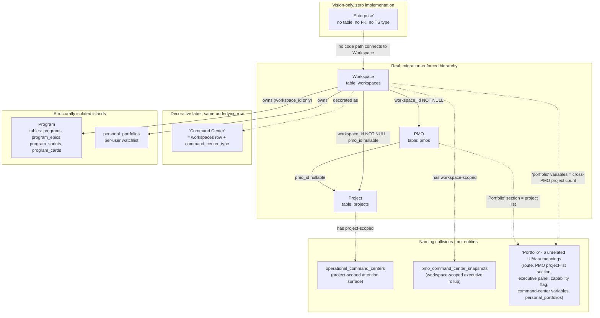
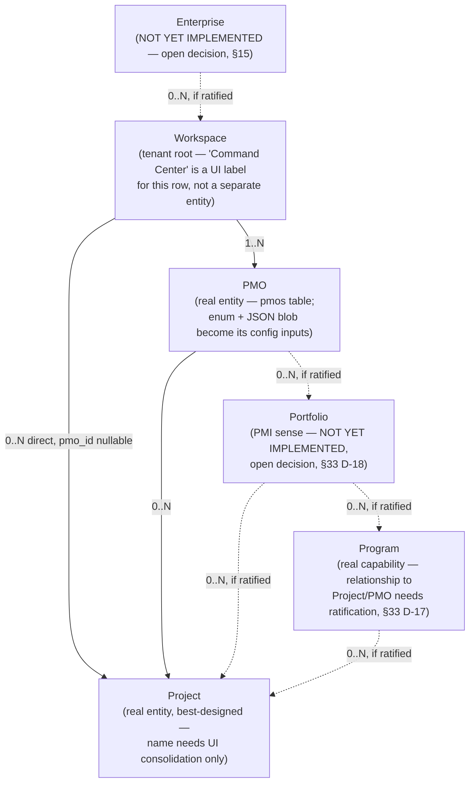
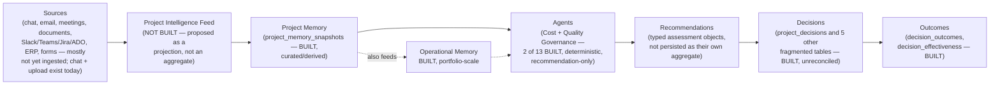
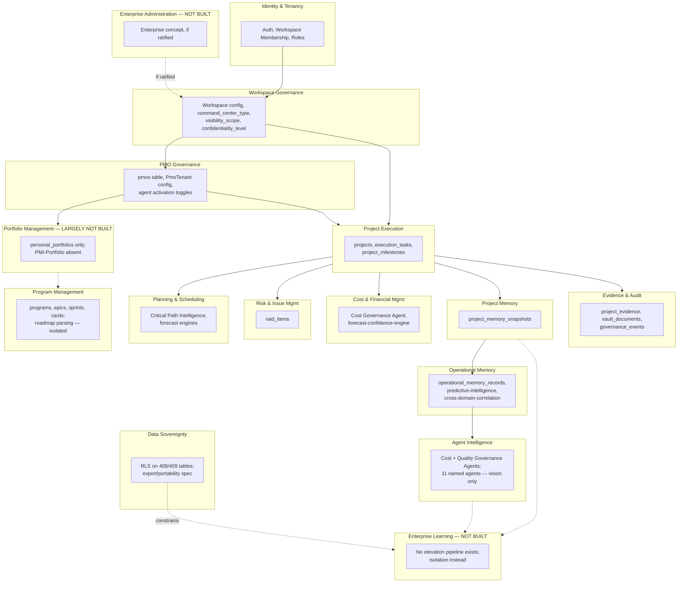
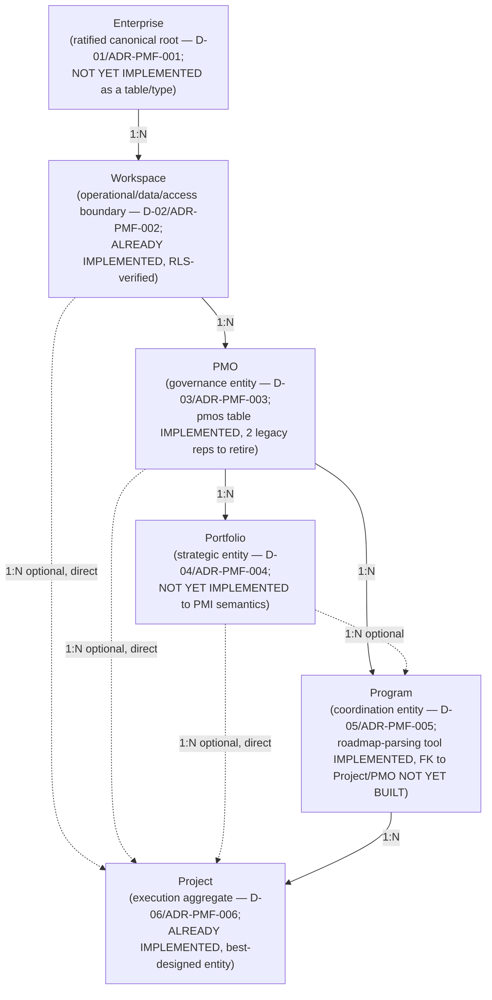
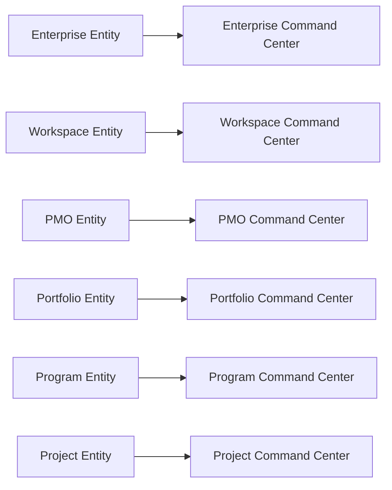

# PMFreak — Canonical Enterprise & PMI Domain Model (PR1)

**Type:** Research / domain-modeling audit. Documentation only. No product code, styles, routes, APIs, or database schema were modified to produce this report.

> **Amendment notice (PR1.1, 2026-07-18 — Founder Ratification):** The founder has since ratified product decisions **D-01** (Enterprise is a canonical entity, distinct from Workspace), **D-17** (Program is PMI-Program — a coordination entity connected to PMO/Portfolio/Project), and **D-18** (Portfolio is built to PMI semantics, as a PMO-owned strategic entity) — along with a complete set of companion decisions covering Workspace, PMO, Project, Command Center, Project Intelligence Feed, Project Memory, Enterprise Intelligence, methodology, and progressive disclosure. These are now **ratified product instructions**, not open questions. They are formalized in:
> - §47 [Founder-Ratified Product Decisions](#47-founder-ratified-product-decisions)
> - §48 [Ratified Canonical Target Model](#48-ratified-canonical-target-model)
> - §49 [Current Implementation vs Ratified Target](#49-current-implementation-vs-ratified-target)
> - `docs/product-architecture/01.1-domain-ratification.md` (the authoritative ratification record)
> - `docs/adr/ADR-PMF-001` through `ADR-PMF-012`
>
> **This ratification does not retroactively change what code exists.** Everything below this notice (§1–§46) is preserved unmodified as the original PR1 audit and its evidence — including the "Open Product Decisions" table in §43, which is left intact as the historical record of the questions as they stood *before* ratification, with pointers added to where each is now resolved. No implementation was performed by this amendment; PR2 has not started.

---

## 1. Executive Summary

PMFreak's database already implements a real, migration-enforced, RLS-verified three-level hierarchy: **Workspace → PMO → Project**. That part of the domain is sound. The problem this audit finds is not that the hierarchy is wrong — it is that **four additional concepts (Command Center, Portfolio, Program, and "Enterprise") were layered on top of, or beside, that hierarchy at different times, by different sprints, without ever being reconciled against it or against each other.**

Concretely:

- **"Command Center" is not an entity.** It is a decorative label applied simultaneously to five different objects: the Workspace row itself, the PMO-creation wizard, a `<h1>` on the `/projects` list page, an unrelated PMO-scoped ops dashboard (`/pmo-command-center`), and the `pmo_type` taxonomy. This is confirmed by the codebase's own internal design note: *"A Command Center is not a new table. It is the existing `workspaces` table."*
- **"PMO" has three historically-accumulated, only-partly-reconciled data representations**: an enum value on `workspaces` (2026-07-02), a JSON config blob (`PmoTenant`, predates that), and — since 2026-08-28 — a real first-class child table (`pmos`) with its own FK chain into `projects`. Only the third is a genuine entity; the audit recommends the other two be treated explicitly as configuration of that entity, not separate things.
- **"Portfolio" has six live, unrelated meanings** in the current codebase, and **zero of them implement the PMI meaning of Portfolio** (a strategic grouping of Programs/Projects for investment prioritization). The one structurally real "portfolio" table (`personal_portfolios`) is a **per-user saved list**, not an organizational aggregate.
- **"Program" is a real, well-built, well-tested capability** (parse a roadmap document into Epics → Sprints → Cards) that has **zero foreign-key relationship to Projects, PMOs, or Portfolios**, in either the database or the TypeScript layer. It is reachable from the sidebar but is a structural island. This is the clearest case in the whole audit of Category F ("feature incomplete") rather than duplication: the capability is good, its place in the hierarchy was simply never built.
- **"Enterprise" has zero implementation backing anywhere in the repository** — no table, no FK, no TypeScript type. It exists only as (a) a billing-plan string value that the application layer has already made unreachable (see §12), and (b) an unrelated UX-polish feature-module name. The product vision's use of "Enterprise" is currently pure aspiration.

None of this is new confusion introduced by this audit — a sibling, unmerged branch (`claude/pmfreak-architecture-audit-r6fhfo`) ran an earlier conceptual audit and reached similar factual findings, but recommended **collapsing** Command Center, Portfolio, and Program out of the product vocabulary entirely. This PR's mandate is the opposite: these are legitimate PMI/enterprise concepts that the product's own stated vision requires, and the correct fix is to **finish connecting them to the real hierarchy, not delete them.** Where this document disagrees with that prior audit, it says so explicitly (see §12, §33).

The database layer is closer to "correct" than the presentation layer. **Almost every finding in this report is a naming/connection/governance gap layered on top of a sound Workspace → PMO → Project spine — not a spine that needs to be rebuilt.**

---

## 2. Scope

This PR covers: conceptual domain modeling, entity inventory, duplication classification, bounded-context and aggregate proposals, PMI alignment, progressive disclosure design, and a decision/ADR backlog for product ratification. It is limited to the enterprise/PMO/portfolio/program/project layer and the systems that directly touch it (Command Center, Project Intelligence Feed, Project Memory, specialized agents, foresight, Enterprise Intelligence).

## 3. Non-goals

This PR does **not**: modify product code, components, styles, routes, navigation, breadcrumbs, in-app copy, the database schema, migrations, APIs, or contracts; implement progressive disclosure; rename anything; retire any route; fix any defect; or begin PR2 (implementation). Where this document says a table/route/component "should" change, that is a recommendation for a future, separately-ratified PR — nothing here was executed.

---

## 4. Baseline Validation

| Item | Value |
| --- | --- |
| Repository | `Architects-of-Change-Protocol/pmfreak` |
| Working branch | `claude/pmfreak-canonical-domain-4j6x2o` |
| HEAD at session start | `7ad9f73430e7dfc1e594f5d90932ee63c5a3f599` ("docs(audit): Sprint 0 baseline verification — BASELINE VERIFIED", #529) |
| Baseline commit required by roadmap | `b09c111c6155783fd960c4026c5bb9620b5d2804` |
| Baseline exists? | Yes — `git cat-file -e b09c111c` succeeded |
| HEAD is descendant of baseline? | Yes — `git merge-base --is-ancestor b09c111c HEAD` succeeded; `git log b09c111c..HEAD` shows exactly one commit on top (the Sprint 0 baseline-verification doc, itself docs-only) |
| Working tree | Clean (`git status` → "nothing to commit, working tree clean"), both before and after this session's research |
| Legacy shell branch? | No — current branch is one commit ahead of `main`@`b09c111c`, which is itself the commit that *fixed* the legacy-shell regression (#528); `tests/legacy-shell-quarantine.test.mjs` guards this |

**Regression guards executed this session** (all read-only; `node_modules` had to be installed via `npm install` — 586 packages — since the environment started with no dependencies installed; this is an environment-setup action, not a product-code change):

| Check | Result |
| --- | --- |
| `npm run lint:aoc-boundaries` | Pass — "no forbidden product/API/SDK/test imports of legacy governance runtime" |
| `npm run check:aoc-boundaries` (includes `check:protocol-consumers`) | Pass (exit 0). Report-mode consumer-boundary audit logs 35 pre-existing deep/ownership-bypass imports inside `src/aoc/**` — these are **known, already-tracked** architectural debt in the AOC protocol layer, unrelated to this audit's scope, and the check does not fail the build on them (report mode, not enforcement mode). |
| `npm run typecheck` (`tsc --noEmit`) | Clean, zero errors, after dependency install |
| `npm test` (`tsx --test tests/*.test.mjs tests/*.test.ts`) | **12,453 / 12,453 tests pass**, 0 fail, 0 cancelled |

**Conclusion: BASELINE VERIFIED.** This session builds on a demonstrably healthy, ancestrally-correct, non-regressed baseline.

---

## 5. Product Vision

Per the PR brief (restated here as the standing frame of reference for every recommendation below): PMFreak is not a task manager, a chat wrapper, a dashboard, or a traditional PMO tool. It is meant to function as **a system of operational intelligence for Projects, Programs, Portfolios, and PMO** — capturing information from many channels, structuring it into operational memory, watching execution, recommending actions, anticipating scenarios, and converting project outcomes into reusable organizational intelligence. This vision explicitly presumes Portfolio and Program are *real, distinct* levels of the hierarchy, not decorative synonyms for Workspace or PMO. Every recommendation in this document is evaluated against that standard: **preserve legitimate complexity; eliminate only accidental duplication, dead code, and naming collisions.**

## 6. Methodology

Research was performed by five parallel, read-only investigation passes (database schema, TypeScript domain/service layer, routes/navigation/UI terminology, agents/memory/intelligence architecture docs, ADRs/governance/data-sovereignty), each independently re-verifying claims against **current HEAD** rather than trusting prior documentation — including re-verifying, line-by-line, a set of claims from an unmerged sibling-branch audit that predates this branch's shell-unification commit. Findings below are cited to file path (and line number where practical). Where evidence was ambiguous or a prior audit's claim could not be independently confirmed on current HEAD, this is stated explicitly rather than silently resolved.

---

## 7. Sources Reviewed

**Baseline/audit docs:** `docs/product-architecture/00-baseline-verification.md`; `docs/audits/conceptual-model-architecture-audit-2026-07-18.md` (unmerged sibling branch `claude/pmfreak-architecture-audit-r6fhfo`, commit `9faf1c1`, cited as evidence throughout, **not adopted as this document's recommendation** — see §12/§33); `artifacts/validation-sprint-2026-07-16/EXECUTIVE-REPORT.md` (referenced by the hierarchy doc, not independently re-read in full this session).

**Architecture docs:** `docs/architecture/workspace-pmo-project-hierarchy.md`; `docs/architecture/command-center-foundation.md`; `docs/architecture/CURRENT_STATE_OPERATIONAL_MEMORY.md`; `docs/architecture/customer-owned-organizational-memory-framework.md`; `docs/architecture/cost-governance-agent.md`; `docs/architecture/quality-governance-agent.md`; `docs/architecture/autonomous-intervention-runtime.md`; `docs/architecture/critical-path-intelligence-runtime.md`; `docs/architecture/predictive-operational-intelligence.md`; `docs/architecture/data-export-sovereignty-architecture.md`; `docs/architecture/CURRENT_STATE_ORGANIZATIONAL_DIGITAL_TWIN.md`; `docs/architecture/CURRENT_STATE_CROSS_DOMAIN_CORRELATION.md`; `docs/ux/command-center-conversational-shell-audit.md`.

**Governance/security/release:** `docs/security/rls-tenant-isolation-audit-phase-3.md`; `docs/release/rls-tenant-isolation-report.md`; `docs/founder-program/00-architecture-decision-record.md` (the repo's only genuine ADR); full survey of `docs/governance/` (IP-compliance only — no tenancy governance content found there).

**Schema:** `src/lib/db/database-contract.ts` (10,723 lines, declared authoritative); 151 files in `supabase/migrations/*.sql`, sampled and grep-swept exhaustively for the hierarchy cluster, summarized for the decision/memory/agent clusters.

**Code:** `src/app/(protected)/layout.tsx`; `src/components/pmfreak/operational-shell.tsx`; `src/lib/workspace/navigation-hierarchy.ts`; `src/lib/workspace/derived-lens-metadata.ts`; `src/features/navigation/module-registry.ts`; `src/components/pmfreak/ContextScopeBar.tsx`; `src/lib/pmos/pmo-service.ts`; `src/lib/pmo/pmo-tenant-types.ts`; `src/lib/command-center/command-center-types.ts`; `src/lib/portfolio/types.ts`; `src/lib/program*/**`; `src/lib/memory/organization-memory.ts`; `src/lib/operational-memory/**` (197 files, surveyed); `src/lib/agents/**` (89 files, surveyed); `src/lib/governance/cost/**`, `src/lib/governance/quality/**`; `src/features/runtime/capability-reveal/**`; `src/lib/workspace/pilot-capability-set.ts`; `src/lib/feature-gates.ts`; `src/lib/billing.ts`; onboarding/wizard components (`getting-started-flow.tsx`, `create-pmo-wizard.tsx`); `src/app/(protected)/pmo/invite-team/page.tsx`; `src/app/(protected)/projects/page.tsx`; `src/app/(protected)/pmos/[pmoId]/page.tsx`; `tests/legacy-shell-quarantine.test.mjs`.

Every claim below traces to one of these sources. Where a claim originates from the sibling-branch audit and was **not** independently re-verified on current HEAD by this session, it is marked "carried forward, not re-verified."

---

## 8. Current-State Domain Map



**Reading this diagram:** the solid arrows are the one part of the model that is genuinely sound. Everything dotted is either a synonym for something that already has a name (Command Center → Workspace), a structural island reachable by URL but disconnected from the FK graph (Program), a word reused for six unrelated things (Portfolio), or a concept with no implementation at all (Enterprise).

---

## 9. Current Entity Inventory

| Entity (as named in code/DB) | Location | Type | Storage | State | Relations | Problem | Recommendation |
| --- | --- | --- | --- | --- | --- | --- | --- |
| **Workspace** | `workspaces` table; `src/lib/workspaces.ts` | Aggregate root / tenant | Table, RLS-enforced | Active | Root of everything; 1–N `pmos`, `projects` (direct FK too), `programs`, `personal_portfolios` | Also called "Command Center," and (per prior audit, not re-verified) "Account"/"Organization" in some UI copy | Preserve as sole tenant root. Reconcile naming (see §12). |
| **PMO (entity)** | `pmos` table; `src/lib/pmos/pmo-service.ts` | Entity (aggregate, workspace-scoped) | Table, RLS-enforced, added 2026-08-28 | Active, newest of 3 PMO representations | `workspace_id` NOT NULL; parent of `projects.pmo_id` (nullable) | Two older, sibling representations of "PMO" still exist (below) | Preserve as the canonical PMO entity. Retire the other two as *inputs to* this entity, not synonyms. |
| **PMO (enum value)** | `workspaces.command_center_type = 'company_pmo'` | Enum value on Workspace | Column, since 2026-07-02 | Active, legacy relative to `pmos` table | None — a type tag, not a row | The word "PMO" names both the container-type tag and the real child entity | See §12, §14 decision D-05. |
| **PMO (config blob)** | `PmoTenant` type, `workspace_governance.governance_jsonb` (schema v2) | Value object, 1:1 with Workspace | JSON in `workspace_governance` table | Active | 1:1, no independent identity | Invisible to users but pollutes type/service naming | Absorb explicitly as PMO *configuration*, not a PMO. |
| **Command Center** | `workspaces.command_center_type` + `/command-center` route + `/pmo-command-center` route + `/projects` page `<h1>` + Create Command Center wizard | Not an entity — see §22 | N/A | Active, 5 distinct usages | N/A | Total naming collision, confirmed by the code's own comment: *"A Command Center is not a new table. It is the existing `workspaces` table."* | Formal ratification that Command Center is an **experience**, not an entity (§22). |
| **`operational_command_centers`** | Table, `20260710000000_operational_command_center.sql` | Projection/snapshot, project-scoped | Table | Active | `workspace_id` + `project_id` NOT NULL | Name collides with `pmo_command_center_snapshots` and the `/command-center` route despite being a different scope | Rename candidate in a future PR; document today as "Project Operational Snapshot." |
| **`pmo_command_center_snapshots`** | Table, `20260718000000_pmo_command_center.sql` | Projection/snapshot, workspace-scoped | Table | Active | `workspace_id` only (no `pmo_id`, predates `pmos` table) | Named "PMO" but keyed to the whole workspace, not a `pmos` row — predates the real PMO entity and was never reconciled with it | Reconcile FK to `pmos.id` in a future migration, or rename to "Workspace Executive Snapshot." |
| **Portfolio (route)** | `/portfolio`, `src/lib/portfolio/types.ts` | Page/projection | Derived from `projects`, `raid_items` | Active | Keyed by `projectId` only | Breadcrumb calls it "Project Controls," page calls it "Portfolio" | See §18, §33 D-18. |
| **Portfolio (PMO section)** | `src/app/(protected)/pmos/[pmoId]/page.tsx:80` | UI section label | N/A (renders `pmo.projects`) | Active | Literally "list of this PMO's projects" | Same word as the route above, unrelated data | Rename in future PR; do not reuse "Portfolio" for a plain project list. |
| **`personal_portfolios`** | Table, `20260714000000_personal_portfolio_foundation.sql` | Entity, per-user | Table, RLS: `owner_id = auth.uid()` | Active | `workspace_id` NOT NULL, `owner_id`; join table to `projects` | Legitimate, narrow concept (a personal saved list) wearing the same name as the PMI strategic-Portfolio concept, which doesn't exist yet | Keep the entity; keep the word only if disambiguated from PMI-Portfolio (§18). |
| **Program** | `programs`, `program_epics`, `program_sprints`, `program_cards` tables; `src/lib/program*/**` | Entity (isolated aggregate) | Table, RLS-enforced | Active, well-built, well-tested | `workspace_id` only — **zero FK to `projects` or `pmos`**, confirmed at both DB and TS layers | Name implies "groups Projects" (PMI meaning); implementation is "parse a document into a backlog," structurally unconnected to Project/PMO | Category F (feature incomplete) — see §19, §33 D-17. |
| **Project** | `projects` table; used almost everywhere | Aggregate root (operational unit) | Table, RLS-enforced | Active, best-designed entity in the system | `workspace_id` NOT NULL, `pmo_id` nullable (trigger-enforced to match workspace) | Called "Project" (majority), "Context"/"Operational Context" (`/projects` page), "Initiative" (onboarding wizard) — same row, 3 UI names | Category H (right entity, wrong/inconsistent naming) — see §20, §33 D-19. |
| **Sprint / Epic / Card (Program-tree)** | `program_sprints`, `program_epics`, `program_cards` | Value objects, Program-scoped only | Table | Active | Belong only to `programs`, never to `projects` | Agile-specific vocabulary applied inside an isolated tool, not available to non-agile Projects | See §21. |
| **`project_milestones`** | Table, `project_id`+`workspace_id` NOT NULL | Entity, Project-scoped | Table, has `forecast_date`/`baseline_date` | Active | Connected to Project (unlike Program-tree milestones, `program_cards.type='MILESTONE'`, which are not) | Two disconnected "Milestone" concepts | See §21. |
| **Task** | `execution_tasks` table | Entity, Project-scoped | Table | Active, consistent | `project_id` | None significant | Preserve. |
| **RAID (Risk/Assumption/Issue/Dependency)** | `raid_items` table | Entity, unified | Table | Active, consistent | `workspace_id`, nullable `project_id`, `category` enum | None significant — this is the one place the team *did* unify a group of related concepts correctly | Preserve as the model for how PMI-adjacent groupings should be handled. |
| **Decision** | `project_decisions`, `decision_outcomes`, `decision_effectiveness`, `constitutional_decisions`, `operational_decisions`, `operational_decision_records`, dozens of `agent_pmo_*_decisions` | Fragmented, ≥6+ independent tables | Table (multiple) | Active, fragmented | None cross-reference each other | Genuine technical duplication (Category C), backend-only, not user-visible | Flag as debt; out of this PR's scope to resolve (see §40 gaps). |
| **Stakeholder** | No dedicated table; embedded JSON in agent-handoff tables; `/stakeholder-intel` page is a derived analysis | Not a first-class entity | JSON fields only | Partial | None | Named as a PMI-standard concept but has no CRUD entity | See §33 open question. |
| **Meeting** | `/meetings` page only, no dedicated table | Utility, not a persistent domain entity | None | Partial | Not scoped to Project | Named like a domain entity, behaves like a stateless utility | Note as a gap, not this PR's job to resolve. |
| **Evidence/Document** | `project_evidence`, `project_evidence_content`, `evidence_items`, `vault_documents` | Entity cluster | Table | Active | `project_id`/`workspace_id` | Multiple tables, not obviously unified, not deep-audited this session | Flag for future schema audit. |
| **Project Memory** | `project_memory_snapshots` table; `src/lib/memory/organization-memory.ts` | Aggregate, Project-scoped, curated | Table | Active | `project_id` | Distinct from Operational Memory and chat history (confirmed, not conflated) | See §24. |
| **Operational Memory** | `operational_memory_records`, `operational_intervention_records`; `src/lib/operational-memory/**` (197 files) | Large analytical subsystem | Table + large runtime | Active, verifiably built (matches its own design docs) | `workspace_id`/`project_id` scoped | Name collides with a **separate, legacy** table `operational_memory_entries` (text-keyed, pre-hierarchy) | Technical duplication (Category C) — see §12. |
| **Chat History** | `context_conversations`/`context_messages` | Raw transcript, scope-isolated | Table | Active | One thread per `workspace\|pmo\|project` scope, CHECK-constrained | None — cleanly isolated by design | Preserve. |
| **Enterprise Intelligence / Knowledge elevation** | Aspirational only: `customer-owned-organizational-memory-framework.md` | Not built | 2 of ~14 specified tables exist (`organizational_memory`, `organizational_memory_sources`) | Aspirational (7:1 spec-to-build ratio) | N/A | Largest aspirational-vs-built gap in the repo | See §27, §38. |
| **Agent (specialized, per PMI role)** | 13 named in vision; only Cost Governance Agent and Quality Governance Agent exist | Domain capability, not autonomous service | Pure functions | 2 of 13 built | N/A — not entity-attached in code, deterministic, recommendation-only | Vision describes 13 agents; 2 exist | See §25. |
| **Enterprise** | Nowhere — see §15 | Not implemented | None | Vision-only | N/A | Zero implementation; a `plan='enterprise'` billing value exists in the DB but is dead in application code (see §12) | See §15, §38 open question. |

---

## 10. Current Data Model

| Concept | Implementation today | Problem | Canonical model (this PR's recommendation) | Migration required |
| --- | --- | --- | --- | --- |
| Workspace | `workspaces` table, decorated with `command_center_type`/`owner_type`/`visibility_scope` | Decoration conflates "Workspace" and "Command Center" naming | Workspace remains the sole tenant aggregate; the decoration columns are Workspace *configuration*, not a second entity | None (rename of columns only, future PR) |
| PMO | 3 representations: enum value, JSON blob, `pmos` table | Historical layering, not reconciled | `pmos` table is canonical; enum/blob become inputs consumed at PMO-creation time only | Data-migration to fully retire the enum/blob read-paths (future PR) |
| Portfolio (PMI sense) | Does not exist as a table | No entity for "strategic grouping of programs/projects for investment decisions" | New aggregate needed: `portfolios` (workspace- or PMO-owned) with join tables to `projects`/`programs` | New table + migration (future PR, requires product ratification — see §33 D-18) |
| Portfolio (personal sense) | `personal_portfolios` table | Name collides with the PMI sense above | Keep table; disambiguate name in UI only (e.g., "Saved Projects") | None to DB; UI rename only (future PR) |
| Program | `programs`/`program_epics`/`program_sprints`/`program_cards`, workspace-scoped only | No FK to `projects` or `pmos` despite the PMI name implying containment of Projects | Requires product ratification of what "Program" should mean here (see §19, §33 D-17) before any FK is added | Conditional — depends on ratification |
| Command Center | Not a table; a label on Workspace + 2 unrelated snapshot tables | 5 different objects share the name | No entity needed; formalize as "operational experience" (§22); rename `pmo_command_center_snapshots` to avoid PMO-table collision | Column/label rename only (future PR) |
| Project | `projects` table, `pmo_id` nullable, `workspace_id` NOT NULL | 3 UI names for the same row | No schema change; UI copy consolidation only (future PR) | None |
| Decision | 6+ independent tables | No FK unification | Out of scope for this PR to resolve; flagged as technical debt | Future audit needed |
| Operational Memory | Two tables share the "operational memory" name: legacy `operational_memory_entries` (text-keyed) and current `operational_memory_records` (uuid-keyed) | Naming collision, different schemas, different eras | Deprecate/rename the legacy table explicitly | Future migration |
| Enterprise | No table | Pure vision-language with a dead billing-enum echo (`plan='enterprise'` allowed by DB CHECK, but application `SubscriptionPlan` type only recognizes `free\|pro\|pmo`, silently coercing any `'enterprise'` row to `'free'`) | Open product decision — see §15, §38 | Depends entirely on ratification of what "Enterprise" should mean |
| Enterprise Intelligence / knowledge elevation | 2 of ~14 spec'd tables built | Aspirational document far outpaces implementation | Do not build against the aspirational spec until product ratifies a scoped v1 (see §27) | Future, scoped migration |

---

## 11. Current Route and UI Model

Re-verified against **current HEAD** (not the stale sibling branch). All claims below are independently confirmed this session unless marked otherwise.

| Route | Sidebar label | Breadcrumb label | Page `<h1>`/banner | Entity it actually touches | Inconsistency |
| --- | --- | --- | --- | --- | --- |
| `/dashboard` | "Summary" (`navigation-hierarchy.ts:18`) | "Overview" (`derived-lens-metadata.ts:13`) | "Summary" | Workspace | 2-way mismatch (sidebar vs. breadcrumb) |
| `/command-center` | "Execution" (`navigation-hierarchy.ts:19`) | "Delivery Status" (`derived-lens-metadata.ts:14`) | "Command Center" (banner) | Project (primary) + cross-PMO workspace strip | **3-way mismatch** — sidebar, breadcrumb, and page banner all disagree simultaneously; also mixes project- and workspace-level data on one screen |
| `/executive` | "Executive" | "Leadership View" | "Executive" | Workspace-level rollup | Sidebar/h1 agree; breadcrumb disagrees |
| `/portfolio` | "Portfolio" | "Project Controls" | "Portfolio" | Document/risk history, keyed by `projectId` only | Sidebar/h1 agree; breadcrumb disagrees; underlying data has no PMI-Portfolio semantics |
| `/workspaces`, `/pmos`, `/projects`(list), `/programs` | Yes, "utility" tier | — | "Workspaces" / "PMOs" / **"Operational Command Center"** / "Executable Programs" | Workspace / PMO / Project / Program | `/projects` list page's own `<h1>` is a **6th** distinct "Command Center" usage |
| `/create-command-center` | Reachable from primary nav ("Create Center") | — | "Create your Command Center" | Actually creates a **PMO** row (`savePmoTenant` → materializes `pmos`) | The primary "create" CTA in the whole product creates an entity whose name (PMO) never appears in its own UI |
| `/create-pmo` | Not in nav | — | Redirect → `/create-command-center` | N/A | Legacy redirect stub |
| `/pmo-command-center`, `/pmo-executive-reporting`, `/pmo-governance-compliance`, `/pmo-interventions`, `/pm-registry`, `/pm-capacity`, `/pm-performance` | **None are in `navigation-hierarchy.ts`** | — | Each has its own real `<h1>` | Workspace/PMO-scoped ops dashboards | Fully built, cross-linked to each other, reachable from the main hierarchy via exactly **one** buried link (`/pmos/[pmoId]/reports` → "Workspace executive reporting" → `/pmo-executive-reporting`) |
| `/founder-program`, `/policy-dry-run-gate`, `/policy-implementation-planning` | Not in nav, **not in `route-policy-registry.ts`** | — | Real, non-stub pages | N/A | Zero inbound links repo-wide; orphaned |
| `/pmos/[pmoId]` | (child of PMOs) | — | PMO name + a section literally titled **"Portfolio"** (`pmos/[pmoId]/page.tsx:80`) that renders `pmo.projects` | PMO | The word "Portfolio" here means "this PMO's project list," unrelated to `/portfolio` above |

**Independently confirmed still true on current HEAD** (i.e., the shell-unification commit `b09c111c` did not touch these): the 4-source navigation-label disagreement (`navigation-hierarchy.ts` used for sidebar text via `capability-reveal-selectors.ts:84-97`; `derived-lens-metadata.ts` used for breadcrumb text via `operational-shell.tsx:2240`; per-page banners as a third live source; `src/features/navigation/module-registry.ts` confirmed genuinely dead — its only importer, `ContextScopeBar.tsx`, is itself never imported anywhere in `src/`); the PMO Ops Suite's invisibility from the main shell; the "Command Center" five-object overload; the "Portfolio" six-meaning overload; the onboarding wizard still blocking "Create Project" until "Create Command Center" is completed first (`getting-started-flow.tsx:359-371`, tooltip: *"Create a Command Center first to give your projects governance, objectives, and agent context"*); and the post-activation screen still saying **"Your PMO Brain is active"** and inviting the user to add their **"PMO team"** (`src/app/(protected)/pmo/invite-team/page.tsx:37,40`) — the only point in the entire flow where the word "PMO" is used in front of the user, with no stated connection to the "Command Center" they were just told they created.

**Partially revised from the sibling-branch audit:** `/programs` **is** now present in the main sidebar (`navigation-hierarchy.ts:26`, "Programs") — it is no longer *navigationally* orphaned, only *data-model* isolated (zero FK to `projects`/`pmos`/`workspaces` beyond `workspace_id`). One additional orphaned route (`/policy-implementation-planning`) was found beyond what the prior audit listed.

---

## 12. Contradictions

Documented plainly, with evidence, impact, and — per instructions — **without silently choosing a winner.**

| # | Contradiction | Evidence | Impact |
| --- | --- | --- | --- |
| C-1 | Two competing models of what "PMO" means coexist in production. The 2026-07-02 model ("Command Center Foundation") treats PMO as *one type value* on a decorated Workspace (`command_center_type = 'company_pmo'`), stating explicitly *"PMO is one type of Command Center, not the universal container."* The 2026-08-28 model ("Workspace → PMO → Project Hierarchy") makes PMO a **first-class child entity** of Workspace, with Projects belonging to it. Both migrations are live; nothing in the schema or code reconciles the two definitions. | `docs/architecture/command-center-foundation.md:10`; `supabase/migrations/20260828000001_workspace_pmo_project_hierarchy.sql` | A workspace can have `command_center_type = 'company_pmo'` (implying it *is* a company-level PMO) while separately owning zero, one, or many rows in the real `pmos` table — there is no code path enforcing any relationship between the two, so these can silently disagree per workspace. |
| C-2 | The DB `plan` CHECK constraint on the state table allows `'enterprise'` as a valid billing-plan value, but the application-level `SubscriptionPlan`/`Plan` TypeScript types only define `"free" \| "pro" \| "pmo"`. | `supabase/migrations/20260428120000_p0_state_tables.sql:16` (`check (plan in ('free','pro','enterprise'))`) vs. `src/lib/billing.ts:5,52-58` (`toPlan()` silently coerces any other value, including `'enterprise'`, to `'free'`) | Any row that ever gets `plan = 'enterprise'` (directly via SQL, a future billing integration, or manual ops) is **silently downgraded to free-tier capabilities** by the application layer with no error, log, or warning. This is the clearest concrete evidence that "Enterprise" was planned for at the database layer and then abandoned at the application layer without cleanup. |
| C-3 | Two tables both use the name "Command Center": `operational_command_centers` (project-scoped attention surface) and `pmo_command_center_snapshots` (workspace-scoped executive rollup, predates the `pmos` table and has no FK to it). | `supabase/migrations/20260710000000_operational_command_center.sql`; `20260718000000_pmo_command_center.sql` | Neither table references the other or the real `pmos` table. "PMO Command Center" in this table's name does not mean "a `pmos` row's command center" — it predates PMO existing as an entity at all. |
| C-4 | Two tables both represent "operational memory": legacy `operational_memory_entries` (created 2026-05-12, `project_id`/`company_id` typed as **text**, pre-hierarchy) and the current `operational_memory_records` system (uuid-typed, workspace/project-scoped, 197 supporting files, the system actually described by `CURRENT_STATE_OPERATIONAL_MEMORY.md`). | `supabase/migrations/20260512130000_operational_memory_v1.sql` vs. the Operational Memory subsystem docs/migrations | Anyone reading "operational memory" in the schema without also reading the surrounding migration history could easily query or extend the wrong table. |
| C-5 | The customer-owned-organizational-memory framework doc is written and internally cited as if implemented ("implementation-ready," full 14-table spec, 9-role permission model, 0–100 sovereignty score, full lifecycle with revocation/expiration), but only 2 of its ~14 specified tables exist in migrations. | `docs/architecture/customer-owned-organizational-memory-framework.md` (644 lines) vs. `supabase/migrations/20260617010000_organizational_memory_foundation.sql` (2 tables) | This is the single largest aspirational-vs-built gap found in the repository. Any product or engineering conversation that treats this doc as ground truth for what exists today will be wrong by roughly 7×. |
| C-6 | The sibling-branch conceptual audit (`docs/audits/conceptual-model-architecture-audit-2026-07-18.md`, unmerged) recommends **eliminating** Command Center, Portfolio (5 of 6 uses), and Program-as-a-hierarchy-level from the product vocabulary. This PR's own brief states the opposite premise: these are legitimate PMI concepts the product's vision requires, and the job is to connect them, not delete them. | Compare `docs/audits/conceptual-model-architecture-audit-2026-07-18.md` §5/§11 with this PR's brief §1 | Two audits of the same repository, run one day apart, reach opposite top-line recommendations. This document does not silently pick a winner — see §33 for how each disputed term is resolved as an open decision rather than a fait accompli. |
| C-7 | `docs/architecture/workspace-pmo-project-hierarchy.md` states Workspace is *"the whole organization"* with no tier above it, while the product vision (§5, and this PR's own brief) explicitly frames a hierarchy topped by **Enterprise → Workspace**. | `docs/architecture/workspace-pmo-project-hierarchy.md:18` vs. this PR's brief §14–15 | The only implemented architecture doc for the hierarchy explicitly caps it at Workspace; the vision language asks for a level above that which does not exist anywhere in code, schema, or that doc. |

---

## 13. Duplication Classification

| Case | Category | Evidence | Severity | Recommendation |
| --- | --- | --- | --- | --- |
| Command Center ≡ Workspace | **A — semantic duplication** (same object, two names) | `command-center-foundation.md:14`: *"A Command Center is not a new table. It is the existing `workspaces` table."* | High (user-facing) | Merge naming. One canonical product name for the tenant root. Requires ADR + product ratification (does the org prefer "Workspace" or "Command Center" as the *user-facing* word — the underlying entity stays the same either way). |
| Workspace / PMO / Portfolio / Project as a set | **B — legitimate distinct entities, poorly communicated** | §9 inventory; each has a real, distinguishable purpose per PMI once properly connected | Medium (communication, not architecture) | Do not merge. Fix labeling/navigation only. |
| `operational_command_centers` vs. `pmo_command_center_snapshots` | **C — technical duplication** (same name pattern, different scope, no reconciling FK) | §12 C-3 | Medium (backend-only) | Rename one or both to remove the shared "Command Center" substring; no user-facing UI change required since neither is directly user-labeled today. |
| `operational_memory_entries` vs. `operational_memory_records` | **C — technical duplication** | §12 C-4 | Medium (backend-only, risk of future engineer confusion) | Formally deprecate the legacy table; migrate any residual reads. |
| Six "Portfolio" surfaces | **D — projection confused with entity** (5 of 6) + **B — legitimate distinct concept** (`personal_portfolios`, 1 of 6) | §9, §11 | High (user-facing, and blocks a real PMI concept from ever being built cleanly) | Do not eliminate the *word* "Portfolio" — reserve it for the PMI meaning once built (§33 D-18); rename the other 5 usages. |
| Program isolated from Project/PMO | **F — feature incomplete** | §9, §11; zero FK confirmed at DB and TS layers | High (blocks the PMI "Program groups Projects" reading of the word) | Do not delete or rename away from "Program." Ratify what "Program" should mean here (§33 D-17) before adding any FK. |
| Project named "Project"/"Context"/"Initiative" | **H — correct entity, inconsistent naming** | §9, §11 | Medium (user-facing, easy fix, but out of scope to execute in this PR) | Freeze to one name in a future copy-only PR. |
| PMO's 3 representations (enum/blob/table) | **G — right name, technically fragmented implementation** | §9, §12 C-1 | High (architectural, not just cosmetic) | Requires ADR — see §34. |
| Decision fragmentation (6+ tables) | **C — technical duplication** | §9, §10 | Low user-facing / Medium engineering debt | Out of this PR's scope; flag for a dedicated future audit. |
| `PILOT_HIDDEN_HREFS` / `module-registry.ts` dead code | **E — legacy, confirmed dead** | `src/features/navigation/module-registry.ts`, only importer `ContextScopeBar.tsx` never imported anywhere | Low | Safe to delete in a future PR (confirmed zero live consumers this session). |
| "Enterprise" | **F — feature incomplete**, arguably **not yet started** rather than incomplete | §9, §12 C-2, C-7 | High (blocks the entire top of the vision's stated hierarchy) | Requires product ratification before any schema work — see §15, §33, §38. |

---

## 14. Canonical Domain Model

The canonical model recommended by this audit keeps every legitimate PMI level, resolves every naming collision by pointing multiple words at the correct existing thing (or flagging a genuine gap to be built), and introduces **no entity that isn't already justified by either existing schema or the explicit product vision.**



Solid arrows are implemented and RLS-verified today. Dashed arrows are either genuinely absent (Enterprise, Portfolio-as-PMI-concept) or present as data but not yet connected (Program↔Project/PMO) — both require product ratification before implementation, per §33.

---

## 15. Enterprise Definition

Answering each question from the brief directly, with evidence:

- **Is Enterprise a real entity today?** No. Zero `enterprise_id` anywhere in the repository; zero `enterprises` table; zero TypeScript `Enterprise` type/interface/class.
- **Does it represent the contractual client / an organization / a tenant boundary / billing / global governance?** None of these are implemented. The only trace is a dead billing-plan enum value (`plan='enterprise'`, unreachable from application code — §12 C-2) and an unrelated UX-polish module named `enterprise-ux` (onboarding tour quality, not tenancy).
- **Can it have multiple Workspaces / multiple PMOs?** Not applicable — there is no code path linking any entity to a level above Workspace.
- **How does it differ from Organization / Tenant?** These words also have no dedicated entity in this codebase; "Workspace" is the sole implemented tenant boundary (§16).
- **Should it exist as an aggregate root / entity / tenant / configuration or billing boundary / concept only?**

This is the single largest open product decision in the whole audit (see §33 D-01, §38). This document does not invent an answer. What the evidence supports is: **if a level above Workspace is needed** (e.g., for a consultancy managing multiple client Workspaces, or a genuine multi-workspace enterprise customer), it does not exist today in any form — schema, type, or route — and must be designed from scratch, not "discovered" by renaming something that already exists. The billing-plan enum value is the one signal that someone, at some point, expected this to matter, but it was never carried through.

## 16. Workspace Definition

- **What does it represent?** The tenant root. Confirmed by `docs/architecture/workspace-pmo-project-hierarchy.md:18`: *"the whole organization; a user can belong to many."*
- **Is it an access/data/security boundary?** Yes, confirmed by direct migration evidence: 408 of 409 tables have `ENABLE ROW LEVEL SECURITY`; a live two-workspace SQL smoke test (`docs/release/rls-tenant-isolation-report.md`) exercised 10/10 cross-tenant SELECT/INSERT/UPDATE/DELETE attempts and all were correctly rejected; a genuine `workspace_memberships` RLS infinite-recursion bug (F26) was found and fixed via a `SECURITY DEFINER` helper.
- **Can a Workspace contain multiple PMOs?** Yes — `pmos.workspace_id` is a plain FK, no uniqueness constraint limiting count.
- **Can it contain Projects directly?** Yes — `projects.workspace_id` is NOT NULL and independent of `pmo_id`, which is nullable. A Project can exist in a Workspace with no PMO at all.
- **Is a default Workspace auto-created?** Yes — `ensureUserWorkspace` runs on first login (`command-center-foundation.md:50-53`), with `command_center_type = NULL` until the user configures it.
- **Verdict:** Workspace is the aggregate root and the security/data/tenancy boundary, simultaneously. This triple role is intentional and correctly implemented — the confusion is purely about which *word* users see for it (Workspace vs. Command Center vs., per unverified prior-audit claims, "Account"/"Organization").

## 17. PMO Definition

- **Is PMO an entity?** Yes, as of the `pmos` table (2026-08-28) — the canonical answer. Two older representations (enum value, JSON blob) are legacy inputs to this entity, not separate PMOs (§9, §12 C-1).
- **More than one PMO per Workspace?** Yes, confirmed (`pmos.workspace_id` FK, no uniqueness constraint).
- **Can a PMO operate across Workspaces?** No — `pmos` is strictly workspace-scoped; no cross-workspace PMO exists or is designed.
- **Can a Project exist without a PMO?** Yes — `projects.pmo_id` is nullable by explicit design ("legacy compatibility... application code treats NULL as 'unassigned'"). Every existing project was backfilled to a default PMO, but new projects can, in principle, be created unassigned.
- **Is there a default, invisible PMO for independent PMs?** Functionally yes in practice — `ensureDefaultPmo` attaches new projects to a workspace's default PMO automatically — but this is not the same as guaranteeing zero PMOs is a first-class supported state; see §33 D-05 for the open decision on whether zero-PMO should be a permanently valid state (small-team segment) or whether the default-PMO backfill should remain mandatory.
- **What does it administer?** Per `pmo_type` taxonomy (`company_pmo|team_portfolio|independent|client_portfolio|improvement_program|personal`) plus the `PmoTenant` config blob (agent activation toggles, governance profile, identity/vault settings).
- **Verdict:** PMO should be treated as a real, workspace-scoped aggregate that optionally groups Projects — matching the PMI meaning cleanly, once the enum/blob legacy representations are explicitly demoted to "PMO configuration inputs."

## 18. Portfolio Definition

- **Does Portfolio group Projects? Programs? Investments?** Not today, in any of its six current implementations. The only structurally real "portfolio" (the `personal_portfolios` table) groups Projects for exactly one user, as a saved list — not for strategic prioritization.
- **Is its objective strategy/prioritization?** That is the PMI meaning the product vision implies, but no current code path supports cross-project strategic aggregation, benefit tracking, or investment prioritization.
- **Can a Project belong to multiple Portfolios? Exist outside one?** Not applicable — no such construct exists.
- **Can a Portfolio cross PMO or Workspace boundaries?** Not applicable.
- **What relationship does it have to budget/capacity/aggregate risk?** None implemented; `/portfolio` today shows document/risk history keyed by `projectId`, not an aggregate financial or risk rollup across a named set of projects.
- **Verdict:** The PMI concept of Portfolio **does not exist in this codebase today.** This is not a naming problem to fix with a rename — it is a missing aggregate. See §33 D-18 for the ratification question of whether and how to build it, and §12/§13 for the six naming collisions currently squatting on the word.

## 19. Program Definition

- **Does Program group related Projects?** Not today — zero FK from `programs` to `projects`, confirmed at both DB (`database-contract.ts`) and TypeScript (`ProgramRow` has no `project_id`/`pmo_id` field; `PortfolioSummary`/`PortfolioProjectHealth` types have zero `programId` field either) layers.
- **Can it belong to a Portfolio?** Not applicable — Portfolio (PMI sense) doesn't exist either (§18).
- **Can it cross PMOs or Workspaces?** No — `programs.workspace_id` is its only tenancy anchor; it cannot cross workspaces, and has no PMO relationship to cross.
- **How does it model benefits/dependencies/outcomes?** It doesn't, in the PMI sense. What it models is a document-to-backlog pipeline: `program_roadmap_sources` → `program_roadmap_parse_results` → `program_materializations` → `program_epics`/`program_sprints`/`program_cards`.
- **How does it differ from Initiative? From Portfolio? From Project?** "Initiative" is actually a UI synonym for **Project** in the onboarding wizard (§20), unrelated to Program. Program differs from Portfolio in that Portfolio doesn't exist at all; Program differs from Project in that it's a document-parsing tool, not an execution unit.
- **Is Program currently isolated? Feature-incomplete or duplication?** Isolated, confirmed. **Classification: Category F (feature incomplete), not duplication.** The capability (structured document → Epic/Sprint/Card backlog) is real, tested, and valuable — it simply never gained a relationship to the rest of the hierarchy that its name implies it should have.
- **Verdict:** This is the clearest case in the entire audit of "do not delete, do connect." See §33 D-17 for the specific fork in the road: does "Program" here mean the PMI Program (a set of related Projects), in which case a **new relationship** needs to be added on top of the untouched roadmap-parsing capability; or does the roadmap-parsing tool deserve to keep the name "Program" and the PMI meaning should be expressed some other way? Both are legitimate; this document does not choose.

## 20. Project Definition

- **Is Project the central unit of execution?** Yes, unambiguously — the best-designed, most consistent entity in the system.
- **Aggregate root?** `projects` table, `id` PK.
- **What lives exclusively here?** `execution_tasks`, `project_milestones`, `project_evidence`/`project_evidence_content`, `project_memory_snapshots`, project-scoped `context_conversations`.
- **What can be elevated?** Nothing is currently elevated automatically anywhere in the system (§27) — this is itself a finding, not an omission by this document.
- **Can it exist without PMO/Portfolio/Program?** Without PMO: yes (`pmo_id` nullable). Without Portfolio: yes, trivially, since Portfolio doesn't exist. Without Program: yes, since no relationship exists at all.
- **Can it belong to multiple Programs/Portfolios?** Not applicable today (no such relationships exist); this is an open question for whichever design is ratified for Program/Portfolio (§33 D-17, D-18).
- **How does it link to Workspace?** `workspace_id` NOT NULL, always.
- **Memory, agents, forecast, decisions, risk, schedule, cost, communications?** See §23–§27 and §9 — each of these has a real, if sometimes fragmented, connection to Project specifically (Project Memory, RAID via `raid_items.project_id`, Task via `execution_tasks.project_id`, Cost Governance Agent operating on project-scoped baselines).
- **What makes Project the operational heart of PMFreak?** It is the one level of the hierarchy where every other subsystem in the repository (memory, chat, evidence, RAID, tasks, milestones, the two governance agents that exist) actually attaches consistently. Its only real defect is the UI naming inconsistency (§9, §11, §33 D-19) — not its architecture.

---

## 21. Sprint, Iteration, Epic, and Milestone

| Term | Classification | Evidence | Notes |
| --- | --- | --- | --- |
| Sprint (`program_sprints`) | Agile-specific | Belongs only to the isolated Program tree | Not available to non-agile Projects; imposes agile vocabulary only within the roadmap-builder tool, never on Project itself — this is actually the *correct* boundary (PMFreak does not force Sprint on predictive-methodology Projects), it's just invisible because nobody has documented it as intentional |
| Epic (`program_epics`) | Agile-specific | Same as above | Same |
| Card (`program_cards`, `type` incl. EPIC/SPRINT/TASK/PROMPT/MILESTONE/DELIVERABLE/CUSTOM) | PMFreak-specific | Generic work-item abstraction inside Program tree | The `type='MILESTONE'` card is disconnected from `project_milestones` — two "Milestone" concepts that never meet |
| Milestone (`project_milestones`) | PMI-aligned | Project-scoped, `forecast_date`/`baseline_date` | This is the methodology-neutral, PMI-aligned Milestone; it is the one that should be considered canonical |
| `methodology` field on `projects` | Technical/internal | Added 2026-08-28 alongside `pmo_id` | Exists at the schema level but was not found wired to any UI gating of Sprint/Epic visibility this session — flagged as unverified, not confirmed either way |

**Recommendation direction (not executed here):** `project_milestones` should remain the one PMI-aligned Milestone concept surfaced to all Projects regardless of methodology; the Program-tree's Sprint/Epic/Card vocabulary should stay scoped to Program specifically (which is itself an optional, document-driven tool) and never be presented as mandatory for a predictive/waterfall Project.

## 22. Command Center Decision

The brief's hypothesis — *"PMO, Portfolio, Program and Project are entities; Command Center is the operational experience applied over an entity"* — is **substantially validated, with one correction.**

Validated:
- The codebase's own internal doc states plainly: *"A Command Center is not a new table. It is the existing `workspaces` table."* (`command-center-foundation.md:14`)
- No `command_centers` table exists anywhere.
- The `/command-center` route is exactly an "operational experience applied over an entity" — specifically over **Project** primarily (its per-project execution surface), with a secondary cross-PMO workspace strip layered on (per `workspace-pmo-project-hierarchy.md:122-127`).

Correction needed to the hypothesis: **the word "Command Center" is not applied consistently to one entity at a time** — it is currently used for a Workspace-level experience (the creation wizard, the `command_center_type` taxonomy), a Project-level experience (`/command-center` route), and two backend snapshot tables at two different scopes (`pmo_command_center_snapshots` = workspace-scoped, `operational_command_centers` = project-scoped), plus an unrelated internal-ops page (`/pmo-command-center`) and a stray `<h1>` on the `/projects` list page. **Five to six distinct objects, one label.**

**Recommended framing for ratification:** "Command Center" should become a UI/UX term meaning *"the primary operational view rendered for whichever entity (Workspace, PMO, or Project) the user is currently scoped to,"* consistent with `Enterprise Command Center` / `PMO Command Center` / `Portfolio Command Center` / `Program Command Center` / `Project Command Center` all being **views**, never new database rows. Concretely: `Create Command Center` today creates a **PMO** (verified — `savePmoTenant` materializes a `pmos` row); this should be renamed in a future PR to say what it does ("Create PMO" or "Set Up Your PMO"), not because "Command Center" is a bad brand, but because a *creation* action must name the entity it creates, and today it doesn't.

**Consequences flagged, not executed:** database (no change needed — no entity to migrate); routes (none renamed here); navigation (label disagreement documented in §11, not fixed); permissions (unaffected); dashboards (the ten dashboard-like surfaces catalogued by the sibling audit remain, unconsolidated, pending product decision on whether that consolidation is itself in-scope for a future PR — this document takes no position on dashboard count, only on entity/view classification).

## 23. Project Intelligence Feed Position

**This concept does not exist in the codebase today** — no `Feed`, `ProjectFeed`, `IntelligenceFeed`, or `ActivityStream` type/table was found anywhere. The only literal string match is a UI heading, "Executive Intelligence Feed," on `/projects` (`src/app/(protected)/projects/page.tsx:216`), which is not backed by any distinct data model.

Since it must be *positioned*, not designed, in this PR: the closest structural analogs already in the codebase are `PlatformEventRow` (used inside `DecisionLineage.events`, a normalized-event shape) and the project-scoped `context_conversations`/`context_messages` (raw chat log). Evaluating the brief's proposed classifications against what exists:

- **Not a single aggregate** — there is no natural transactional consistency boundary spanning "everything that happens on a project," and forcing one would conflict with the already-real, separately-owned aggregates (Chat, RAID, Decisions, Evidence, Tasks) that would need to feed it.
- **Best framed as a projection/read-model**, composed by re-reading events already owned by other bounded contexts (Chat, Evidence, RAID, Decision, Task, Milestone), **not** as a new source of truth.
- **Project Memory (§24) is the curated, authoritative layer** the Feed should ultimately summarize *into* — the Feed is the raw/normalized view; Memory is the extracted, trusted state.

Recommended lifecycle stages (per the brief's own vocabulary), positioned but not built:

```
Raw Source (chat, email, doc upload, integration webhook)
  → Normalized Event (a PlatformEventRow-shaped record)
    → Evidence (project_evidence, if durable/attributable)
      → Proposed Entity (e.g., a detected Risk, Decision, or Action — unconfirmed)
        → Approved Record (promoted into raid_items / project_decisions / execution_tasks, etc.)
          → Recommendation (from a governance agent, §25)
            → Decision → Action → Outcome
              → Pattern Candidate (§27, not yet built)
```



**Open question flagged for §38:** whether the Feed should be Project-only or also exist at Program/PMO scope. No evidence in the codebase today supports or forecloses either — the context-scope model (`workspace|pmo|project`) used by chat is a plausible template if a multi-level Feed is wanted later, but nothing currently implements it for a feed specifically.

## 24. Project Memory Position

Confirmed distinct, well-separated systems — **not conflated**, contrary to what a first read of the brief's warning ("don't let chat history become memory automatically") might expect to find as a problem here:

| System | Scope | Table(s) | Authoritative or derived? |
| --- | --- | --- | --- |
| **Project Memory** | Project | `project_memory_snapshots` | Curated/derived — an extracted, structured summary (objective, phase, milestones, blockers, risks, commitments, dependencies) |
| **Operational Memory** | Workspace/Project, portfolio-scale analytics | `operational_memory_records`, `operational_intervention_records` | Derived, with `unresolvedWeight` that *increases* over time while unresolved (a deliberate design choice distinct from the vault's decaying "nutrient" scores) |
| **Chat History** | `workspace\|pmo\|project` (never mixed, CHECK-constrained) | `context_conversations`/`context_messages` | Authoritative raw transcript — explicitly the *unprocessed* log that memory is derived from, not memory itself |
| **Agent Memory** | Agent tool-execution context | `agent_memory_records` and related | Authoritative for agent runtime state, not a domain-memory concept |
| **Personal Memory** (a fourth axis not named in the brief) | Per-PM, cross-project | `src/lib/personal-memory/**` | Derived, scoped to one PM user rather than one project |

**What can be corrected, what requires lineage:** Project Memory snapshots are derived/regenerable, so correction is implicitly supported by regeneration rather than a formal amendment workflow (no evidence of an explicit correction/audit trail was found this session — flagged as unverified rather than confirmed absent). Operational Memory has real, implemented lineage (`parent_record_id` self-referencing FK, cycle-safe traversal, `buildCausalityChain()`).

**What feeds agents / Enterprise Intelligence:** Operational Memory is the system most directly built to feed the two real governance agents (Cost, Quality). No system in the current codebase feeds Enterprise Intelligence, because Enterprise Intelligence has no elevation pipeline built at all (§27).

**Chat-to-memory boundary, confirmed intact:** chat is explicitly documented as one *ingestion source type* among several, not a first-class memory tier — this is the correct, already-implemented guard against the exact failure mode the brief warns about.

## 25. Agent Position

**Reality check against the vision's 13 named agents:** only **2 exist** — Cost Governance Agent (`src/lib/governance/cost/cost-governance-agent.ts`) and Quality Governance Agent (`src/lib/governance/quality/quality-governance-agent.ts`). Both are deterministic pure functions composing several sub-evaluators (baseline drift, burn rate, forecast confidence, procurement risk, billing readiness for Cost), not autonomous services, not classes, not registered against any per-Project/Program/Portfolio/PMO attachment point in code.

A separate, PMO-tenant-scoped **configuration list** exists — `AgentId` (`scope|timeline|cost|quality|resource|stakeholder|delivery-intelligence|executive-synthesis|portfolio-arbitration`, 9 items, each an on/off toggle stored per PMO) — but **no code was found that reads this toggle list to gate any actual analysis function.** The configuration and the two real agents are unwired to each other.

Where they live in the domain (for the 2 that exist): they consume Project-scoped baselines/snapshots and produce a typed assessment object (e.g., `CostGovernanceAssessment`) — never write directly to `project_decisions` or any other authoritative table.

**Boundary against becoming source-of-truth — explicitly and repeatedly documented, not just informally implied:**
- `docs/architecture/autonomous-intervention-runtime.md`: *"Deterministic recommendation-only intervention intelligence... blocking autonomous external execution."* Lists explicit blocked actions (external messaging, destructive actions, cross-tenant targeting); *"No external execution path is exposed; engine only returns explainable recommendations, safety profiles, and fallback paths."*
- Feedback events are typed `proposed/accepted/rejected/executed/successful/failed` — implying a human accept/reject gate.
- Critical Path Intelligence (a real, implemented runtime, not literally an "agent" — no persona, no action loop) documents "anti-hallucination safeguards": evidence-first outputs, confidence dampening, no calendar-date hallucination.

**Relation to Project/Program/Portfolio/PMO:** the two built agents are Project-scoped in practice (operate on project-level cost/quality baselines); nothing in the codebase attaches an agent to Program or Portfolio, both because neither has a stable data model to attach to yet (§18, §19) and because no such agent code exists regardless.

**Verdict:** the domain *boundary philosophy* (agents observe/recommend, humans decide/approve, no autonomous execution) is well-established and consistently stated across multiple independent docs — this part of the vision is architecturally sound even though only 2 of 13 named agent roles have code behind them today. This PR does not design the missing 11 agents; it records that they are vision, not implementation.

## 26. Foresight Position

"Foresight" is a real, literal term used exactly twice in the codebase's documentation (`docs/architecture/predictive-operational-intelligence.md`, section header "Operational foresight philosophy," and a function reference `retrievePredictiveOperationalIntelligence`). It is explicitly **not** designed as its own bounded domain or entity. Per the doc's own framing, evaluated against the brief's proposed classifications:

- **Not a standalone domain** — it has no entity, no table of its own; it is built entirely on top of two other real systems: Continuity Retrieval (over Operational Memory) and Cross-Domain Correlation.
- **Best classified as: a transversal capability / projection layer**, consumed by the PM copilot and an executive digest, surfacing deterministic trajectory inference — the doc is explicit that this is *"deterministic operational trajectory inference (not statistical prophecy)"*, with anti-noise controls (dedup, minimum-confidence thresholds) and stated uncertainty reasons, deliberately **not** LLM/agent-driven.
- Related, narrower forecast concepts exist scattered per-domain rather than unified: `forecast_confidence` inside Cost Governance and Critical Path Intelligence, a distinct `executive-decision-simulation` runtime for portfolio-level "what-if" analysis, and scenario modeling inside the Organizational Digital Twin subsystem — none share a common `Forecast`/`Scenario` base type.

**Verdict:** Foresight lives conceptually as a **cross-cutting projection capability that reads from Operational Memory + Cross-Domain Correlation and is surfaced through agents/copilot**, not as a domain of its own. This matches the brief's "capability of agents / capability transversal" options rather than "dominio propio" or "bounded context."

## 27. Enterprise Intelligence Position

**No elevation pipeline exists.** Zero grep hits anywhere in the repository for "pattern candidate," "validated pattern," or any cross-tenant knowledge-elevation mechanism as an implemented concept. "Lesson learned" appears exactly once, as an unimplemented *category* inside the aspirational memory-framework spec (§9, §12 C-5) — not as a working pipeline.

The architecture's actual, implemented answer to the underlying concern (don't let one customer's knowledge leak into another's) is **not** a governed promotion pipeline — it is **hard, structural, RLS-enforced isolation**, stated as an absolute in multiple independent docs:
- `operational-runtime-memory.md`: *"`companyId` — tenant boundary (never crossed)"*; `assertScopeIsolation()` throws on cross-company/cross-workspace access before every retrieval return.
- `command-center-foundation.md`: *"Agents and memory only ever retrieve from the active Command Center — there is no cross-workspace query path in the RLS policies."*
- Even the *learning* system that exists (`intervention-efficacy-learning.md`, correlating intervention types with recovery outcomes) is RLS-scoped per workspace/project — there is no org-wide or cross-tenant learning corpus, by design, not by gap.


**This is the single most consequential open decision in the whole audit, and it is a genuine tension, not just a gap.** The vision (§5, §9 of the brief) asks for evidence → observation → inference → hypothesis → recommendation → decision → pattern candidate → validated pattern → Enterprise Intelligence, explicitly crossing Project → Program → Portfolio → PMO → Workspace → Enterprise with governance at each step. The *implemented* architecture's stated philosophy is the opposite: isolation is enforced by never allowing the query to cross a boundary in the first place, rather than by governing what crosses. **These two design intents are not simultaneously true today.** Building the elevation pipeline the vision describes will require either (a) scoping "Enterprise Intelligence" to *within* a single Workspace only (multiple PMOs/Portfolios/Programs/Projects elevating knowledge to their shared Workspace, never beyond it — compatible with today's isolation model), or (b) introducing an explicit, governed, opt-in cross-workspace elevation mechanism for the small subset of use cases where it's wanted (e.g., a consultancy's own internal cross-client benchmarking, always requiring the data owner's explicit consent per record). This document does not choose between (a) and (b) — see §33 D-14, §38.

---

## 28. Bounded Context Map



| Bounded context | Responsibility | Aggregate roots | Source of truth | Overlaps found | ACL needed |
| --- | --- | --- | --- | --- | --- |
| Identity & Tenancy | Auth, membership, roles | `workspace_memberships` | Supabase auth + this table | None significant | — |
| Enterprise Administration | Not built | — | — | Billing-plan enum (§12 C-2) is the only trace | Would need one if built |
| Workspace Governance | Tenant config, visibility, confidentiality | `Workspace` | `workspaces` table | "Command Center" naming collision (§22) | — |
| PMO Governance | PMO entity + config | `PMO` | `pmos` table (canonical) + legacy enum/blob (deprecated inputs) | 3 historical representations (§12 C-1) | Needed between legacy blob reads and the `pmos` table |
| Portfolio Management | Not built (PMI sense) | — | — | 6 naming collisions (§18) | — |
| Program Management | Roadmap→backlog capability | `Program` | `programs` tree | Isolated from Project/PMO (§19) | Needed if/when connected |
| Project Execution | Core operational unit | `Project` | `projects` table | Naming only (§20) | — |
| Planning & Scheduling | Critical path, forecasting | (service, not aggregate) | `src/lib/critical-path/**` | None significant | — |
| Risk & Issue Management | RAID | `RaidItem` | `raid_items` | None — cleanly unified | — |
| Cost & Financial Management | Cost governance | (service) | `src/lib/governance/cost/**` | None significant | — |
| Scope & Change Management | Not deep-audited this session | — | — | — | — |
| Quality Management | Quality governance | (service) | `src/lib/governance/quality/**` | None significant | — |
| Resource Management | Not implemented as named agent; not deep-audited | — | — | — | — |
| Stakeholder Management | No dedicated entity | — | JSON fields only | Not a first-class entity despite PMI-standard status | — |
| Communications Management | Not deep-audited this session | — | — | — | — |
| Operational Memory | Portfolio/enterprise-scale analytics | `OperationalMemoryRecord` | `operational_memory_records` | Legacy `operational_memory_entries` collision (§12 C-4) | Needed to retire legacy table |
| Evidence & Audit | Documents, evidence, audit trail | `Evidence` | `project_evidence`, `vault_documents` | Multiple tables, not deep-unified | — |
| Agent Intelligence | Deterministic recommendation engines | (service, not aggregate) | Cost/Quality Governance Agents | Vision (13 agents) vs. built (2) (§25) | — |
| Recommendations & Approvals | Human approval gate for agent output | Not a distinct table set found this session | — | — | — |
| Forecasting & Scenarios | Cross-cutting projection | (service) | Scattered per-domain forecast engines (§26) | No shared base type | — |
| Enterprise Learning | Not built | — | — | Contradicts today's absolute-isolation stance (§27) | Needed if built |
| Integrations | Not deep-audited this session | — | — | — | — |
| Data Sovereignty | Tenant isolation, export/portability | (policy layer) | RLS policies + `data-export-sovereignty-architecture.md` | Aspirational sovereignty-scoring not built | — |
| Reporting & Analytics | PMO Ops Suite, executive reporting | (service) | `pmo_command_center_snapshots` + related | Invisible from main nav (§11) | — |
| Notifications & Escalations | Not deep-audited this session | — | — | — | — |

---

## 29. Aggregate Map

| Aggregate | Boundary | Invariants (as implemented) | Lifecycle owner | Cross-aggregate references |
| --- | --- | --- | --- | --- |
| **Workspace** | `workspaces` + `workspace_memberships` | Tenant root; every scoped table must carry `workspace_id` | Self | Referenced by nearly every other table |
| **PMO** | `pmos` | `workspace_id` NOT NULL; a project's `pmo_id`, if set, must share the project's `workspace_id` (DB trigger `enforce_project_pmo_same_workspace`, added specifically to close a cross-workspace assignment bug found during validation) | Self, within Workspace | References Workspace; referenced by Project |
| **Project** | `projects` | `workspace_id` NOT NULL; `pmo_id` nullable but workspace-consistent | Self, within Workspace/PMO | References Workspace, optionally PMO; referenced by Task, Milestone, RAID, Evidence, Project Memory, Chat |
| **Program** | `programs` + `program_epics` + `program_sprints` + `program_cards` | `workspace_id` NOT NULL on every level; internal epic/sprint/card containment enforced | Self, within Workspace only | **No reference to Project/PMO/Portfolio today** — isolated by construction |
| **Project Memory** | `project_memory_snapshots` | 1:1-ish curated snapshot per project (regenerable) | Derived from Project + Chat + Evidence | References Project |
| **Operational Memory record** | `operational_memory_records` | Lineage via self-referencing `parent_record_id`, cycle-safe | Derived from Project/Workspace activity | References Workspace/Project |
| **RAID item** | `raid_items` | `workspace_id` required, `project_id` nullable, `category` enum | Self | References Workspace, optionally Project |
| **Decision** (fragmented) | 6+ separate tables, no shared aggregate | Each internally consistent; **no cross-table invariant enforced** | Each table's own writer path | None to each other — this is the fragmentation problem (§12) |
| **Agent Recommendation** (Cost/Quality Governance) | Ephemeral output object, not persisted as its own aggregate this session confirmed it is returned, not written back to a table by the agent function itself | Deterministic given inputs | Caller | References Project-scoped baseline/snapshot inputs |
| **Enterprise Knowledge** | Not built | N/A | N/A | N/A |

**Prohibited direct mutations (as documented, not all independently re-verified this session):** agents do not write directly to `project_decisions`/`raid_items`/etc. — outputs are typed assessment objects returned to callers, consistent with the recommendation-only boundary in §25.

---

## 30. Entity Relationship Model

```mermaid
erDiagram
    WORKSPACE ||--o{ PMO : "contains (1..N)"
    WORKSPACE ||--o{ PROJECT : "contains directly (0..N)"
    WORKSPACE ||--o{ PROGRAM : "contains (0..N, isolated)"
    WORKSPACE ||--o{ PERSONAL_PORTFOLIO : "contains (0..N, per-user)"
    PMO ||--o{ PROJECT : "governs (0..N, optional)"
    PROJECT ||--o{ EXECUTION_TASK : "has"
    PROJECT ||--o{ PROJECT_MILESTONE : "has"
    PROJECT ||--o{ RAID_ITEM : "has (optional link)"
    PROJECT ||--|| PROJECT_MEMORY_SNAPSHOT : "has curated"
    PROJECT ||--o{ PROJECT_EVIDENCE : "has"
    PROGRAM ||--o{ PROGRAM_EPIC : "has"
    PROGRAM_EPIC ||--o{ PROGRAM_SPRINT : "has"
    PROGRAM_SPRINT ||--o{ PROGRAM_CARD : "has"
    PERSONAL_PORTFOLIO }o--o{ PROJECT : "saves (join table)"
    PROGRAM ..}o PROJECT : "NO FK — isolated, ratification pending"
    PORTFOLIO_PMI ..}o PROGRAM : "NOT BUILT"
    PORTFOLIO_PMI ..}o PROJECT : "NOT BUILT"
    ENTERPRISE ..o{ WORKSPACE : "NOT BUILT"
```

## 31. Cardinalities

| Relationship | Cardinality | Enforced how |
| --- | --- | --- |
| Enterprise → Workspace | N/A (not built) | — |
| Workspace → PMO | 1 : 0..N | FK `pmos.workspace_id` |
| Workspace → Project (direct) | 1 : 0..N | FK `projects.workspace_id` NOT NULL |
| PMO → Project | 1 : 0..N (optional) | FK `projects.pmo_id`, nullable |
| Workspace → Program | 1 : 0..N | FK `programs.workspace_id`, **isolated from Project/PMO** |
| Program → Epic → Sprint → Card | 1:N at each level | FKs within the Program tree |
| Project → Task | 1 : 0..N | FK `execution_tasks.project_id` |
| Project → Milestone | 1 : 0..N | FK `project_milestones.project_id` |
| Project → RAID item | 0..1 : 0..N | FK `raid_items.project_id`, nullable (workspace-level RAID also possible) |
| User → Personal Portfolio | 1 : 0..N | `personal_portfolios.owner_id` |
| Personal Portfolio → Project | N : M | join table `personal_portfolio_projects` |
| Portfolio (PMI) → Program/Project | N/A (not built) | — |

## 32. Invariants

| Invariant | Enforced by |
| --- | --- |
| A Project's `pmo_id`, if set, must belong to the same Workspace as the Project | DB trigger `enforce_project_pmo_same_workspace` (added after validation-sprint found a cross-workspace assignment gap via direct SQL) |
| A context conversation is scoped to exactly one of `workspace\|pmo\|project`, never mixed | CHECK constraint + partial unique index on `context_conversations` |
| A workspace-B member cannot read/write workspace-A data | RLS policies keyed through `workspace_memberships`, live-tested (§16) |
| A `personal_portfolios` row is only visible/writable by its `owner_id` | RLS policy `portfolio_owner_access` |
| Deleting a PMO does not delete its Projects | `projects.pmo_id ON DELETE SET NULL` |
| Deleting a Program Epic sets dependent Cards' `epic_id` to NULL rather than cascading delete | `program_cards.epic_id ON DELETE SET NULL` |

## 33. Domain Events

Conceptual only — no event infrastructure exists in the codebase today (this section proposes events consistent with the canonical model; it does not describe anything implemented).

| Event | Producer | Consumers | Payload (conceptual) | Crosses Workspace boundary? |
| --- | --- | --- | --- | --- |
| `WorkspaceCreated` | Workspace Governance | Onboarding, Identity & Tenancy | `workspaceId`, `createdByUserId` | No |
| `PMOCreated` | PMO Governance | Navigation, Onboarding | `pmoId`, `workspaceId`, `pmoType` | No |
| `ProjectCreated` | Project Execution | PMO Governance, Project Memory, Navigation | `projectId`, `workspaceId`, `pmoId?` | No |
| `ProjectLinkedToProgram` | Program Management (if built) | Project Execution, Reporting | `projectId`, `programId` | No |
| `ProjectLinkedToPortfolio` | Portfolio Management (if built) | Project Execution, Reporting | `projectId`, `portfolioId` | No |
| `EvidenceReceived` | Evidence & Audit | Project Intelligence Feed (if built), Project Memory | `projectId`, `evidenceId`, `sourceType` | No |
| `ProjectMemoryUpdated` | Project Memory | Agent Intelligence, Foresight | `projectId`, `snapshotId` | No |
| `RiskDetected` | Risk & Issue Mgmt | Agent Intelligence, Project Intelligence Feed | `projectId`, `raidItemId` | No |
| `RecommendationCreated` | Agent Intelligence | Recommendations & Approvals | `agentId`, `projectId`, `recommendationId` | No |
| `RecommendationApproved` | Recommendations & Approvals (human gate) | Decision, Action | `recommendationId`, `approvedByUserId` | No |
| `ActionCreated` | Recommendations & Approvals | Project Execution | `actionId`, `projectId` | No |
| `ForecastUpdated` | Forecasting & Scenarios | Project Intelligence Feed, Executive views | `projectId`, `forecastType`, `confidence` | No |
| `OutcomeRecorded` | Project Execution | Enterprise Learning (if built) | `projectId`, `outcomeId` | Only if elevation is explicitly ratified (§27) |
| `PatternCandidateCreated` | Enterprise Learning (not built) | Governance review queue | — | Only if built, and only with explicit per-record consent given today's isolation stance |
| `PatternValidated` | Enterprise Learning (not built) | Enterprise Intelligence store | — | Same as above |
| `KnowledgeRevoked` | Enterprise Learning (not built) | Enterprise Intelligence store | — | Same as above |

Every event whose consumer sits above Workspace is explicitly marked conditional on the §27/§38 ratification — none of them can be assumed safe to cross a tenant boundary under the architecture as it exists today.

---

## 34. Data Ownership

| Data | Owner | Notes |
| --- | --- | --- |
| Workspace config (`command_center_type`, `visibility_scope`, `confidentiality_level`) | Workspace | `data_owner` FK to `auth.users` names the accountable person |
| PMO config (`PmoTenant` blob, agent toggles) | PMO (once canonicalized), currently `workspace_governance` | Legacy 1:1-with-Workspace storage |
| Project data (tasks, milestones, evidence, memory) | Project | Never elevated automatically today (§20) |
| RAID items | Project, or Workspace if `project_id` is null | — |
| Operational Memory | Workspace/Project | Never crosses tenant boundary (§27) |
| Agent recommendations | Ephemeral, returned to caller | Not persisted as an aggregate this session confirmed |
| Enterprise Intelligence | Not built | Ownership question is itself part of §38 |

## 35. Security Boundaries

Confirmed, migration-enforced, and live-tested (§4, §16): **Workspace is the security boundary.** 408 of 409 tables have RLS enabled; the one exception (`agent_attestation_nonces`) is intentionally service-role-only. A live two-workspace SQL smoke test exercised 10/10 cross-tenant operations, all correctly rejected. One real bug (infinite RLS recursion on `workspace_memberships`) was found and fixed via a `SECURITY DEFINER` helper during that validation. Two legacy tables (`onboarding_analyses`, `governance_audit_events`) still use a legacy `company_id`-based RLS pattern rather than `workspace_id`, tracked as non-blocking residual work (`RR-RLS-LEGACY`) — flagged here as inherited, unresolved technical debt, not something this PR fixes.

## 36. Data Sovereignty

`docs/architecture/data-export-sovereignty-architecture.md` (866 lines) frames sovereignty as **export/portability rights**, not intelligence-sharing: workspace-scoped `export_jobs`, redaction of provider secrets/internal prompts, an internal "AOC Assurance Sovereignty Index" metric. This is consistent with, and reinforces, the isolation-not-elevation posture found in §27 — sovereignty today means "a tenant can get their data out," not "a tenant can control what of their data is learned from elsewhere." Any future Enterprise Intelligence elevation design (§38) must be reconciled with this document, not designed independently of it.

## 37. Progressive Disclosure

Unlike most of this audit, this section reports **existing, real infrastructure** — not a gap. `src/features/runtime/capability-reveal/` implements a working reveal-stage engine:

- **Stages** (`CapabilityRevealStage`): `activation → awareness → guidance → governance/constraint → organizational`, computed from onboarding completion, evidence density, continuity maturity, plan tier, and governance-directive capability.
- **Domains** gated per stage: `core, projects, vault, memory, risks, stakeholders, delivery, coordination, interventions, executive, governance, scope, lessons` (`REVEAL_DOMAIN_ORDER`).
- **Role profiles**: `pm, pmo, executive, ops`, each with its own domain priority order (`ROLE_DOMAIN_PRIORITIES`).
- **Plan tiers**: `free, pro, pmo` (confirmed — no `enterprise` tier exists at the application level, consistent with §12 C-2).
- **A separate, orthogonal gate** exists for pilot/founder profile (`pilot-capability-set.ts`): `founder` sees everything; `pilot` hides `/governance, /policies, /audit, /trust/agents, /capabilities, /trials, /intelligence` regardless of reveal stage.

This system is a sound foundation to build the brief's requested segment configurations (§38) on top of — it already computes "what's unlocked" from real signals; it does not yet have Enterprise, Portfolio (PMI), or a ratified Program relationship to gate, because those don't exist yet.

## 38. Segment Configurations

Per the brief's five segments, evaluated against what's actually implementable today given §14–19 and the real progressive-disclosure engine (§37):

```mermaid
flowchart TB
    subgraph Indep["Independent PM"]
        I1[Workspace] --> I2[Project]
    end
    subgraph Small["Small team"]
        S1[Workspace] --> S2[Projects]
        S1 -.->|optional| S3[PMO capabilities]
    end
    subgraph MedPMO["Medium PMO"]
        M1[Workspace] --> M2[PMO]
        M2 --> M3[Projects]
        M2 -.->|if ratified| M4[Portfolio]
        M4 -.->|if ratified| M5[Program]
    end
    subgraph Ent["Enterprise — NOT BUILT"]
        E1["Enterprise (open decision)"] -.-> E2[Workspaces]
        E2 --> E3[PMOs]
        E3 --> E4[Portfolios — not built]
        E4 --> E5[Programs — isolated today]
        E5 --> E6[Projects]
    end
    subgraph Consult["Consultancy"]
        C1["Workspace per client\n(pattern already supported —\neach Workspace is fully isolated)"]
    end
```



| Segment | Entities visible | Hidden | Defaults/auto-created | Upgrade path | Risk / notes |
| --- | --- | --- | --- | --- | --- |
| Independent PM | Workspace (invisible as a concept, just "your account"), Project | PMO, Program, Portfolio, Governance | Workspace auto-created on signup (`ensureUserWorkspace`); default PMO auto-attached to first project (`ensureDefaultPmo`), invisibly | Reveal PMO explicitly once a 2nd project or teammate appears | Today's onboarding **blocks** "Create Project" until "Create Command Center" (i.e., PMO) is completed (§11) — this contradicts the "PMO invisible for independents" goal and is a real, evidenced friction point, not a hypothetical one |
| Small team | Workspace, Projects | PMO (optional), Program, Portfolio, Governance | Same as above | Offer PMO grouping at 2nd project | `capability-reveal` engine already supports gating this by stage/role |
| Medium PMO | Workspace, PMO, Projects | Portfolio (not built), Governance until earned | PMO created explicitly by user | Portfolio/Program, once ratified and built | Cannot fully deliver this segment's promise until Portfolio (PMI) exists (§18) |
| Enterprise | All levels including Enterprise | Nothing, but Enterprise itself doesn't exist | N/A | N/A | Entirely blocked on §15/§38 ratification — this segment cannot be built today without first deciding what Enterprise means |
| Consultancy | One Workspace per client | Cross-client data, by the RLS isolation already proven in §16/§35 | Each client Workspace independently bootstrapped | An "agency Enterprise" layer would need the same ratification as the Enterprise segment | The isolation this segment *needs* (never mixing Client A and Client B data) is already the strongest-verified property in the whole system (§16) — this segment is the closest to "just works today," modulo no UI for an operator to manage many Workspaces at once |

---

## 39. PMI Alignment Matrix

| Term | Classification | Notes |
| --- | --- | --- |
| Workspace | PMFreak-specific (functions as tenant/organization) | No direct PMI equivalent; closest is "organization" in PMI's enterprise environmental factors sense |
| PMO | PMI-aligned | Matches PMI's Project Management Office definition once the 3 legacy representations are reconciled (§12 C-1) |
| Portfolio | PMI-aligned in name; **not implemented** to PMI semantics today | See §18 |
| Program | PMI-aligned in name; **implemented capability serves a different purpose** (document-to-backlog parsing) | See §19 — requires disambiguation, not deletion |
| Project | PMI-aligned | Best-implemented entity in the system |
| Sprint / Epic (Program tree) | Agile-specific | Correctly scoped to the optional Program tool, not imposed on all Projects |
| Milestone (`project_milestones`) | PMI-aligned | Methodology-neutral, correctly Project-scoped |
| RAID (Risk/Assumption/Issue/Dependency) | PMI-aligned | Correctly unified under one table/category enum |
| Stakeholder | PMI-aligned in name; no dedicated entity | Gap, not a duplication |
| Task (`execution_tasks`) | PMI-aligned (generic "activity"/"work package") | Consistent |
| Command Center | PMFreak-specific | Not a PMI term; should never be presented as a PMI-standard concept |
| "PMO Brain" / "Operating Skeleton" | PMFreak-specific, informal copy | Jargon, not a domain term |
| Enterprise (as used in the vision) | PMFreak-specific / aspirational | Not a PMI term either — PMI's own standards don't define a formal "Enterprise" entity above Portfolio; this word choice is the product's own, and should not be presented as PMI-required |
| `workspace_id`, `command_center_type`, `PmoTenant`, `owner_type`, `visibility_scope`, `confidentiality_level` | Technical/internal | Never user-facing vocabulary |
| Foresight | PMFreak-specific capability name | Conceptually adjacent to PMI's risk/forecast practices but not a PMI term itself |

**No claim of PMI certification, compliance, or endorsement is made or should be made anywhere in the product** — this audit found no evidence of, and does not recommend, any such claim.

## 40. Current Gaps

1. Enterprise: zero implementation (§15).
2. Portfolio (PMI sense): zero implementation (§18).
3. Program ↔ Project/PMO relationship: not built (§19).
4. Project Intelligence Feed: not built, not even positioned until this document (§23).
5. Enterprise Intelligence elevation pipeline: not built, and in tension with the implemented isolation model (§27).
6. 11 of 13 named specialized agents: not built (§25).
7. Stakeholder, Meeting, Communications: no dedicated entities (§9).
8. Decision fragmentation: 6+ unreconciled tables (§9, §12).
9. Legacy naming collisions requiring cleanup: `operational_command_centers` vs. `pmo_command_center_snapshots`; `operational_memory_entries` vs. `operational_memory_records`; dead billing `'enterprise'` enum value; dead `module-registry.ts`/`ContextScopeBar.tsx`.
10. UI naming inconsistency: Project/Context/Initiative; 4-way disagreement on `/command-center` label; "Portfolio" 6-way collision.
11. Onboarding friction contradicting the "PMO invisible for independents" goal (§38).

## 41. Future Migration Requirements

Not designed in this PR (explicitly out of scope); listed only so a future implementation PR knows what will eventually be needed, contingent on ratification:

- Deprecation path for `operational_memory_entries` (legacy) in favor of `operational_memory_records`.
- Deprecation path for the `command_center_type`/`PmoTenant` read-paths in favor of `pmos` as sole source of truth.
- New `portfolios` table + join tables, if D-18 is ratified toward building the PMI concept.
- New relationship (FK or join table) between `programs` and `projects`/`pmos`, if D-17 is ratified toward the PMI reading of Program.
- New tenancy layer above Workspace, if D-01/D-15 is ratified toward building "Enterprise."
- Scoped, minimal version of the organizational-memory framework (§12 C-5), rather than the full aspirational 14-table spec, if any elevation pipeline is ratified.

## 42. Risks

| Risk | Likelihood | Impact | Notes |
| --- | --- | --- | --- |
| A future PR "fixes" naming by silently adopting the sibling audit's simplification recommendation, deleting Portfolio/Program/Command Center from the vocabulary | Medium | High | Would contradict this PR's own mandate and the product vision; requires explicit product ratification either way (§33) |
| Enterprise Intelligence gets built as a literal implementation of the aspirational 644-line spec without re-scoping | Medium | High | 7:1 spec-to-build gap already exists once (§12 C-5); repeating that pattern at Enterprise scope would be worse |
| Someone queries/extends `operational_memory_entries` believing it's the current Operational Memory system | Low-Medium | Medium | Confirmed live naming collision (§12 C-4) |
| A billing integration writes `plan = 'enterprise'` expecting it to grant enterprise capabilities | Low | Medium-High | Would silently downgrade to free-tier with no error (§12 C-2) — a real latent bug, not hypothetical |
| Program gets a Project FK added without first ratifying which semantic ("groups Projects" vs. "roadmap tool") it should carry | Medium | Medium | Would lock in an accidental interpretation |
| Cross-workspace Enterprise Intelligence gets built in a way that violates the already-proven, live-tested RLS isolation guarantees | Low (given how explicit the existing isolation docs are) | Very High | Would be a genuine security regression, not just a modeling error — any future design here needs its own security review, not just a product decision |

## 43. Open Product Decisions

Twenty items, per the brief's required list, plus the domain-specific decisions raised above. Confidence is this audit's confidence in the *evidence*, not a recommendation of certainty about the *answer* — every "High confidence" item below is high confidence that the option described is what the evidence supports, not that it is what product should choose.

> **This table is preserved as the historical record of these questions as they stood at the end of PR1, before ratification.** D-01, D-17, and D-18 have since been **ratified** by the founder (PR1.1, 2026-07-18) — see §47 and the linked ADRs. Their rows below are annotated with the ratified answer rather than rewritten, so the original options/evidence/confidence framing remains intact.

| ID | Decision | Option A | Option B | Option C | Recommendation | Evidence | Confidence | Blocks PR2? |
| --- | --- | --- | --- | --- | --- | --- | --- | --- |
| D-01 | Are Enterprise and Workspace distinct entities? | **Yes — build Enterprise above Workspace ← RATIFIED, see §47 D-01 / ADR-PMF-001** | No — Workspace is the top; "Enterprise" stays a vision/marketing word only | Enterprise = a *view* over a set of Workspaces the same operator manages, no new entity | ~~This document does not choose~~ **RATIFIED toward Option A (2026-07-18) — see §47** | §9, §12 C-2/C-7, §15 | High (on the evidence), N/A (on the decision) | **No longer blocks — ratified** |
| D-02 | Is Workspace a data/security boundary? | Yes | No | — | **Yes** — already true, live-tested | §16, §35 | High | No (already resolved) |
| D-03 | Can a Workspace contain multiple PMOs? | Yes | No | — | **Yes** — already true | §17 | High | No (already resolved) |
| D-04 | Can a Project exist without a PMO? | Yes | No | — | **Yes** — already true (`pmo_id` nullable) | §17, §20 | High | No (already resolved) |
| D-05 | Should a default, invisible PMO be guaranteed for every Project? | Yes, always backfill | No, allow permanently-unassigned Projects for independents | Backfill only above a team-size threshold | Open — current backfill is real but its permanence for the independent-PM segment isn't ratified | §17, §38 | Medium | Partially — affects onboarding flow design |
| D-06 | Can a Project belong to multiple Portfolios? | Yes | No, one Portfolio only | — | Not answerable — Portfolio doesn't exist yet; must be decided as part of D-18 | §18 | N/A until D-18 | Yes (via D-18) |
| D-07 | Can a Project belong to multiple Programs? | Yes | No, one Program only | — | Not answerable — depends on D-17 | §19 | N/A until D-17 | Yes (via D-17) |
| D-08 | Can a Program cross Portfolios? | Yes | No | — | Not answerable until both exist | §18, §19 | N/A | Yes |
| D-09 | Can a Program cross PMOs? | Yes | No | — | Recommend **No** if D-17 is ratified toward the PMI meaning, to mirror how Project↔PMO already works | §17, §19 | Medium | Yes |
| D-10 | Is Command Center an entity or a view? | Entity | **View over Workspace/PMO/Project** | — | **View** — validated by the codebase's own "not a new table" statement | §22 | High | No — but naming cleanup is deferred to a future PR |
| D-11 | Is Project Intelligence Feed an aggregate or a projection? | Aggregate | **Projection over existing bounded contexts** | — | **Projection** | §23 | Medium (nothing built yet to be fully certain) | Yes (blocks feed design) |
| D-12 | Is Project Memory distinct from chat history? | Yes | No | — | **Yes** — already true, confirmed distinct | §24 | High | No (already resolved) |
| D-13 | Does Enterprise Intelligence belong to Enterprise or Workspace? | Enterprise | **Workspace (given no Enterprise exists, and isolation is absolute today)** | A new, explicitly-consented cross-workspace mechanism | Recommend scoping to Workspace unless/until D-01 is ratified toward a real Enterprise entity | §27 | Medium | Yes |
| D-14 | How is knowledge elevated? | Automatic | **Governed, human-reviewed promotion, evidence+confidence+lineage required** | No elevation at all — isolation only, as today | This document does not choose between "build a governed pipeline" and "keep pure isolation" — both are legitimate, opposite answers to the same evidence | §27, §38 | Medium | Yes |
| D-15 | How is segregation between clients protected? | RLS as today | Additional application-layer checks | — | **RLS as today** — already proven live under test | §16, §35 | High | No (already resolved) |
| D-16 | Should Sprint be universal or methodology-specific? | Universal | **Methodology-specific (agile-only, scoped to Program tool)** | — | **Methodology-specific** — matches current, correct implementation | §21 | High | No (already resolved, just undocumented as intentional) |
| D-17 | Does "Program" mean PMI-Program (groups Projects) or the roadmap-parsing tool it is today? | **PMI-Program — add new relationship on top of existing tool ← RATIFIED, see §47 D-05 / ADR-PMF-005** | Roadmap tool keeps the name; PMI meaning expressed some other way (or not at all) | Both — rename the roadmap tool, free "Program" for a new PMI-aligned construct | ~~This document explicitly does not choose~~ **RATIFIED toward Option A (2026-07-18) — see §47** | §19, §33 | Medium | **No longer blocks — ratified** |
| D-18 | Should Portfolio be built to PMI semantics? | **Yes — new `portfolios` aggregate ← RATIFIED, see §47 D-04 / ADR-PMF-004** | No — retire the word from anywhere except `personal_portfolios`, per the sibling audit's recommendation | Yes, but scoped only within a single PMO, not cross-PMO | ~~This document does not choose~~ **RATIFIED toward Option A, scoped to one PMO per rules D-04.11/.12 (2026-07-18) — see §47** | §18, §12 C-6 | Medium | **No longer blocks — ratified** |
| D-19 | Which of Project/Context/Initiative is the one user-facing name? | Project | Context | Initiative | **Project** — already the majority usage and the technical name everywhere else | §20, §11 | High | No — but requires a copy-only future PR to execute |
| D-20 | Which concepts should be hidden in onboarding for independent PMs? | Everything above Project | PMO visible but optional | Current behavior (PMO creation mandatory before Project creation) | Recommend moving away from **current behavior**, which contradicts the stated small-user vision — but the specific replacement needs ratification | §38 | Medium | Partially — affects onboarding UX in a future PR |

---

## 44. ADR Candidates

No ADR convention exists in this repository today (only one genuine ADR was found, `docs/founder-program/00-architecture-decision-record.md`, scoped to a single feature). This audit recommended establishing `docs/adr/` as a repo-wide convention and proposed the following candidates, in priority order.

> **Status update (PR1.1, 2026-07-18):** All twelve ADRs below (and two more covering decisions not originally scoped as ADR candidates in PR1 — Project as execution aggregate and Project Intelligence Feed as a formally-named record) have now been written and accepted. See §47 for the full ADR Index with file paths.

| Priority | ADR candidate | Depends on ratifying | Status |
| --- | --- | --- | --- |
| 1 | PMO canonicalization: `pmos` table is the sole source of truth; `command_center_type` enum and `PmoTenant` blob become read-only legacy inputs, deprecation path defined | D-05 | **Accepted — ADR-PMF-003** |
| 2 | Command Center as a UI/UX term, never an entity; rename `Create Command Center` action to name the entity it actually creates | D-10 | **Accepted — ADR-PMF-007** |
| 3 | Program semantic decision (PMI-Program vs. roadmap-parsing tool) | D-17 | **Accepted — ADR-PMF-005** |
| 4 | Portfolio: build to PMI semantics, or formally retire the word outside `personal_portfolios` | D-18 | **Accepted — ADR-PMF-004** |
| 5 | Enterprise Intelligence elevation model: governed pipeline vs. pure isolation | D-13, D-14 | **Accepted — ADR-PMF-010** |
| 6 | Enterprise entity: build, or remain vision-only language | D-01 | **Accepted — ADR-PMF-001** |
| 7 | Project Intelligence Feed: formal projection design over existing bounded contexts | D-11 | **Accepted — ADR-PMF-008** |
| 8 | Decision-table unification (6+ fragmented tables) | (not covered by the 20-item matrix; flagged in §40/§42 as its own future audit) | Not ratified this PR — remains open, see §25 of `01.1-domain-ratification.md` |
| 9 | Data sovereignty vs. cross-tenant learning reconciliation | D-13, D-14, and §36 | **Accepted — ADR-PMF-010** (folded in) |
| 10 | Progressive disclosure segment rollout, formalizing the existing `capability-reveal` engine against the five segments in §38 | D-05, D-20 | **Accepted — ADR-PMF-012** |
| — | Workspace as operational/data/access boundary (not originally a candidate — formalized because Enterprise's ratification required clarifying what sits below it) | D-02 | **Accepted — ADR-PMF-002** |
| — | Project as the central execution aggregate | D-06 | **Accepted — ADR-PMF-006** |
| — | Project Memory distinct from chat history | D-09/D-12 | **Accepted — ADR-PMF-009** |
| — | Sprint/Iteration as methodology-specific, not universal | D-16 | **Accepted — ADR-PMF-011** |

## 45. Ratification Plan

1. ~~Circulate this document and the sibling conceptual audit (`docs/audits/conceptual-model-architecture-audit-2026-07-18.md`) together to product/architecture leadership, explicitly flagging §12 C-6 as the central disagreement to resolve first (simplify-away vs. connect-and-preserve).~~ **Done.** The founder resolved §12 C-6 explicitly in favor of connect-and-preserve, not the sibling audit's simplify-away recommendation — see §47.
2. ~~Ratify D-01 (Enterprise), D-17 (Program), and D-18 (Portfolio) as the three highest-leverage decisions~~ **Done (PR1.1, 2026-07-18)** — along with every other item in §43, not only the top three.
3. ~~Once D-01/D-17/D-18 are ratified, write the corresponding ADRs (§44, priorities 1–6).~~ **Done** — twelve ADRs accepted, see §47.
4. Only after ADRs are ratified should a PR2 (implementation) be scoped — and PR2 should be split by ADR, not attempted as one large refactor, given how independent these decisions are from each other (e.g., D-10's Command Center rename does not require D-18's Portfolio decision to be resolved first). **This step is now unblocked** — PR2 may be scoped following this ratification — **but PR2 has not started and is not started by this document.**

## 46. Final Status

```text
DOMAIN MODEL REQUIRES PRODUCT DECISIONS
```

*(Status as recorded at the close of PR1, preserved verbatim below as the historical record.)*

The database's Workspace → PMO → Project spine is sound, RLS-verified, and does not need to be rebuilt. But this audit surfaces genuine, high-leverage product decisions (Enterprise's existence, Program's semantic, Portfolio's build-vs-retire fork, and the elevation-vs-isolation tension in Enterprise Intelligence) that determine the shape of a large fraction of any future implementation work. None of these can be resolved by evidence alone — they are product decisions, and this document deliberately does not make them silently. **PR2 should not begin until at minimum D-01, D-17, and D-18 are ratified.**

- **Repository:** `Architects-of-Change-Protocol/pmfreak`
- **Branch:** `claude/pmfreak-canonical-domain-4j6x2o`
- **Initial HEAD:** `7ad9f73430e7dfc1e594f5d90932ee63c5a3f599`
- **Baseline commit:** `b09c111c6155783fd960c4026c5bb9620b5d2804`
- **Documentation commit:** (recorded after this file is committed — see commit immediately following this document in the branch history)
- **Files created:** `docs/product-architecture/01-canonical-domain-model.md`
- **Files modified:** none
- **Product code modified:** No
- **Routes modified:** No
- **Database modified:** No
- **Migrations created:** No
- **PR2 started:** No
- **Recommended next step:** Product/architecture ratification of D-01, D-17, and D-18 (§43), followed by ADR authorship (§44) for the ratified decisions, before any implementation PR is scoped.

> **PR1.1 amendment status (2026-07-18):** The recommended next step above has been carried out in full — see §47–§49 below, `docs/product-architecture/01.1-domain-ratification.md`, and `docs/adr/ADR-PMF-001` through `ADR-PMF-012`. The updated overall status as of this amendment is **DOMAIN MODEL RATIFIED** (see the ratification document's Final Status section for the authoritative statement). This PR1 document's own final-status block above is left unmodified as the historical record of what PR1 concluded; it does not retroactively describe the current state.

---

## 47. Founder-Ratified Product Decisions

This section records, as ratified fact, the founder's resolution of every item in §43 (and additional decisions beyond that table's scope). Each decision below is an **instruction**, not a recommendation — it must not be re-litigated as an open question in future work. Implementation is out of scope for this PR; only the target semantics are ratified here. Full rule sets, contracts, and cardinalities are formalized in `docs/product-architecture/01.1-domain-ratification.md` and the corresponding ADR; this section is a compact index.

| ID | Decision area | Ratified answer | ADR | Resolves §43 item(s) |
| --- | --- | --- | --- | --- |
| D-01 | Enterprise vs. Workspace | Enterprise is a canonical entity, distinct from and superior to Workspace; may contain multiple Workspaces; may be auto-created/hidden for small customers; is not billing, not a dashboard, not a replacement for Workspace or PMO | `ADR-PMF-001` | §43 D-01 |
| D-02 | Workspace boundary | Workspace is the operational, data, and access boundary within an Enterprise; nothing crosses Workspaces automatically; consultancies use one Workspace per client | `ADR-PMF-002` | §43 D-02, D-15 (reaffirmed) |
| D-03 | PMO semantics | PMO is an organizational/governance entity (standards, templates, governance, reporting, portfolio/program oversight), not a Workspace alias; no invisible universal default PMO | `ADR-PMF-003` | §43 D-03, D-04, D-05 (partially — permanence question resolved toward no-mandatory-backfill) |
| D-04 | Portfolio semantics | Portfolio is a strategic entity (investment/priority/capacity/risk/value), PMO-owned 1:N, optional Program/Project children, one primary Portfolio per Project/Program initially, no many-to-many, no cross-Workspace/cross-PMO | `ADR-PMF-004` | §43 D-06, D-08 (partially), D-18 |
| D-05 | Program semantics | Program coordinates related Projects for joint benefits, PMO-owned 1:N, optional Portfolio parent, one primary Program per Project initially, no many-to-many, no cross-Workspace/cross-PMO; current disconnection classified as incomplete integration, must not be deleted | `ADR-PMF-005` | §43 D-07, D-08 (partially), D-09, D-17 |
| D-06 | Project semantics | Project is the central execution aggregate, always Workspace-scoped, optionally PMO/Portfolio/Program-scoped; the hierarchy must never block fast Project creation | `ADR-PMF-006` | §43 D-19 (semantics only — the naming-consolidation execution remains a future copy-only PR) |
| D-07 | Command Center semantics | Command Center is an operational experience/projection over a governed entity, never an entity itself, never independently created | `ADR-PMF-007` | §43 D-10 |
| D-08 | Project Intelligence Feed | A composite projection over existing bounded contexts (Chat, Evidence, RAID, Decision, Task, Milestone), not an aggregate, not the sole source of truth; preserves the Raw Source → ... → Outcome pipeline without auto-promotion at any stage | `ADR-PMF-008` | §43 D-11 |
| D-09 | Project Memory | Governed, structured, traceable operational knowledge distinct from chat history; chat can feed it but never automatically becomes authoritative | `ADR-PMF-009` | §43 D-12 (reaffirmed) |
| D-10 | Enterprise Intelligence | Belongs to Enterprise; incorporates only governed/ratified knowledge with full provenance; must never weaken Workspace-level RLS isolation; elevation requires evidence+confidence+review+lineage+applicability+ratification | `ADR-PMF-010` | §43 D-13, D-14 |
| D-11 | Sprint/Iteration | Sprint is optional and methodology-specific (agile/hybrid); Iteration is the general abstraction name; Milestone remains the one cross-methodology concept; methodology configurable per Project | `ADR-PMF-011` | §43 D-16 (reaffirmed) |
| D-12 | Progressive disclosure | The full enterprise domain exists at all times regardless of what the UI reveals; hiding ≠ absence; auto-creation ≠ irrelevance | `ADR-PMF-012` | §43 D-20 (semantics only — the onboarding-blocker fix remains future-PR work) |

**Not ratified by this PR (remain open, per §11 of the founder's brief):** exact technical model of Enterprise; tenant-migration strategy; future Portfolio/Program many-to-many; Program cross-PMO; Portfolio cross-PMO; shared services across Workspaces; exact storage strategy; event infrastructure; vector storage; detailed knowledge-ratification workflow; Enterprise billing; final visible navigation names; final routes; API contracts; final database shape; feature flags; migration plan; implementation order; final UI. These belong to PR2 and later.

## 48. Ratified Canonical Target Model

This is the target-state domain capability model, ratified 2026-07-18. It supersedes §14's dashed/solid distinction with a fully ratified hierarchy — **ratified does not mean implemented**; see §49 for the gap-by-gap comparison against current code.



Solid arrows are mandatory relationships in the ratified target model. Dashed arrows are the ratified **optional shortcuts** (Workspace→Project, PMO→Project, Portfolio→Project) that preserve progressive disclosure and fast Project creation (D-06, D-12) — they are not weaker relationships, just optional ones. This diagram represents ratified domain **capability**, not a mandatory onboarding sequence, and not a claim that every level must be visible or populated for every customer (§48 pairs with D-12/ADR-PMF-012).

**Entity vs. projection model** (Command Center, D-07/ADR-PMF-007):



Every Command Center in this diagram is a **view/projection** over its entity — never a second entity, never independently created (D-07). None of the six variants above require a dedicated table unless a persistent *view configuration* is needed, in which case that configuration belongs to the view, not to a new governed entity.

## 49. Current Implementation vs Ratified Target

This table is the authoritative gap ledger for this ratification. It restates §10/§13/§40 (current state, unchanged by this PR) against the newly ratified target (§47/§48), and must not be read as a claim that any gap below has been closed by this PR.

| Concept | Current implementation state (unchanged by this PR) | Ratified target state | Gap type | Closes in |
| --- | --- | --- | --- | --- |
| Enterprise | No table, no FK, no TS type anywhere; only trace is a dead `plan='enterprise'` billing-enum value silently coerced to `'free'` (§12 C-2, §15) | Canonical aggregate root above Workspace, 1:N to Workspace, may be auto-created/hidden for small customers (D-01) | Missing capability — full build | PR2, scope TBD |
| Workspace | Real, migration-enforced, RLS-verified tenant boundary; 408/409 tables RLS-enabled; overloaded with "Command Center" naming on `command_center_type`/`visibility_scope`/`confidentiality_level` (§16, §22, §35) | Operational/data/access boundary under Enterprise, semantics unchanged, naming to be disentangled from Command Center (D-02) | Naming/config disentanglement, not structural | Future copy/config PR |
| PMO | Three layered representations: enum (2026-07-02), `PmoTenant` JSON blob, and the canonical `pmos` table (2026-08-28) — not fully reconciled (§9, §12 C-1, §17) | Single canonical `pmos`-table entity; enum/blob become configuration inputs only, deprecation path required (D-03) | Model mismatch — legacy-input reconciliation | PR2, scope TBD |
| Portfolio | Zero PMI-sense implementation; 6 unrelated naming collisions; `personal_portfolios` is a real but unrelated per-user watchlist (§9, §18) | New `portfolios` aggregate, PMO-owned 1:N, optional Program/Project children, one primary each, no cross-PMO/cross-Workspace (D-04) | Missing canonical model — new table + migration | PR2, scope TBD |
| Program | Real, tested roadmap-to-backlog capability (`programs`/`program_epics`/`program_sprints`/`program_cards`); zero FK to `projects`/`pmos`, `workspace_id`-only tenancy (§9, §19, §29-31) | Connected coordination entity: PMO-owned 1:N, optional Portfolio, 1:N to Project, one primary Program per Project, roadmap tool preserved underneath (D-05) | Integration gap — new FK/relationship, not a rebuild | PR2, scope TBD |
| Project | Real, best-designed entity; `workspace_id` NOT NULL, `pmo_id` nullable, workspace-consistency trigger enforced; 3 UI names (Project/Context/Initiative) (§9, §20, §29) | Central execution aggregate, semantics ratified as-is; UI-name consolidation to "Project" remains outstanding (D-06, D-19) | Refinement — naming/UX only, no structural gap | Future copy-only PR |
| Command Center | Label applied to 5-6 different objects (Workspace row+wizard, `/command-center` route, `pmo_command_center_snapshots`, `operational_command_centers`, `/pmo-command-center`, `/projects` `<h1>`); "Create Command Center" actually creates a PMO (§9, §11, §22) | Formalized as a view/projection term over any governed entity; creation actions must name the entity they create (D-07) | Naming/semantic gap — no schema change needed | PR2/PR3, UI-scoped |
| Project Intelligence Feed | Not built; no `Feed`/`IntelligenceFeed`/`ActivityStream` type or table; only a UI heading with no backing model (§23) | Composite projection over Chat/Evidence/RAID/Decision/Task/Milestone, preserving the full Raw Source→Outcome pipeline (D-08) | Product gap — new projection to design and build | Sprint/PR TBD |
| Project Memory | `project_memory_snapshots` real and distinct from chat history; no explicit correction/audit-trail mechanism confirmed (§24) | Governed knowledge with source/actor/date/context/evidence/confidence/validation/lineage/corrections preserved (D-09) | Architecture gap — governance metadata completeness | Sprint/PR TBD |
| Enterprise Intelligence | No elevation pipeline exists anywhere; architecture instead enforces hard RLS isolation with no cross-workspace query path — in tension with any future elevation model (§27) | Belongs to Enterprise; only governed/ratified knowledge elevates, six-part gate (evidence/confidence/review/lineage/applicability/ratification), isolation guarantees preserved (D-10) | Missing capability — governed pipeline design, reconciled with existing isolation | Sprint/PR TBD, security-reviewed |
| Sprint/Iteration | Sprint/Epic already correctly scoped to the isolated Program tree only; no generic "Iteration" type exists; `methodology` field on `projects` not confirmed wired to UI gating (§21) | Sprint stays optional/methodology-specific; "Iteration" is the ratified future vocabulary for a methodology-neutral abstraction if/when needed (D-11) | Mostly already correct — verify `methodology` gating, reconcile Program-Card `MILESTONE` with `project_milestones` | Future verification PR |
| Progressive disclosure | Real, working `capability-reveal` engine (stages/domains/roles/plan tiers) already exists; onboarding currently blocks "Create Project" until "Create Command Center"/PMO is done, contradicting the independent-PM vision (§37, §38) | Full domain exists regardless of UI reveal state; future gates for Enterprise/Portfolio/Program extend this existing engine, do not replace it (D-12) | Ahead of the domain model in infrastructure; blocked by the onboarding contradiction above | Future onboarding-fix PR |

No migration, schema change, route change, or code change was made to close any gap in this table — this PR ratifies the target column only.
