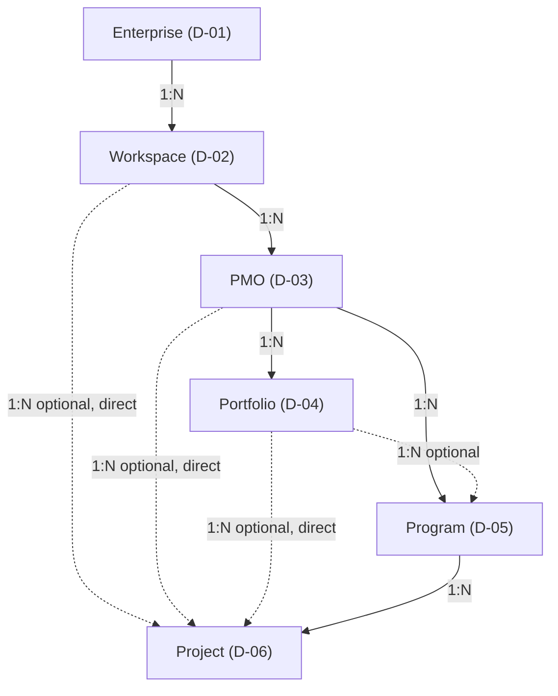
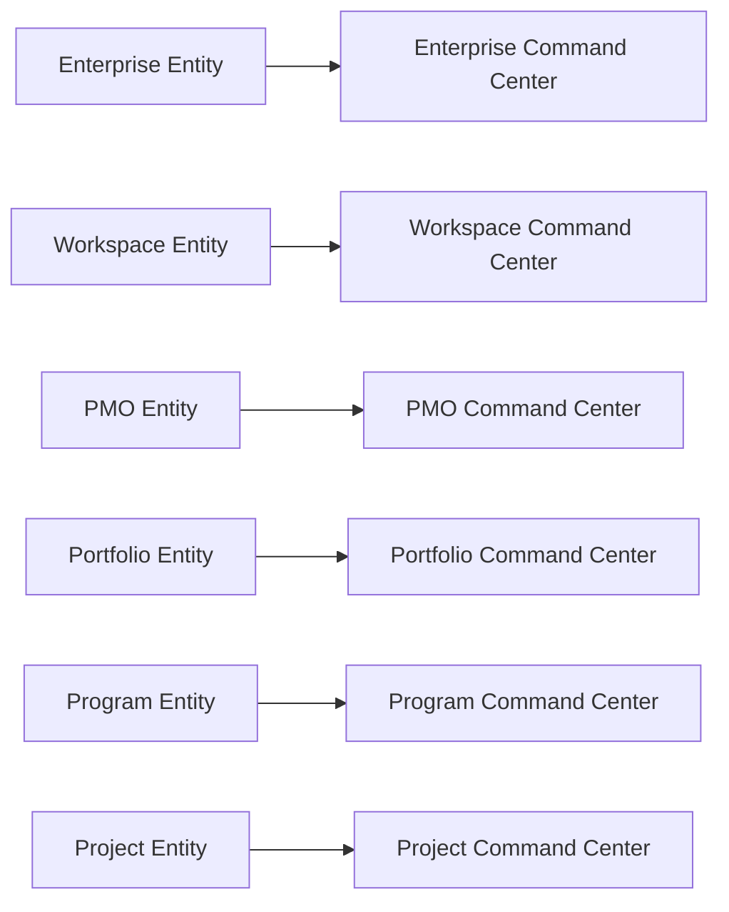
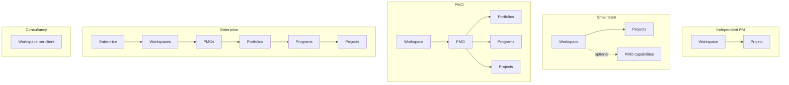
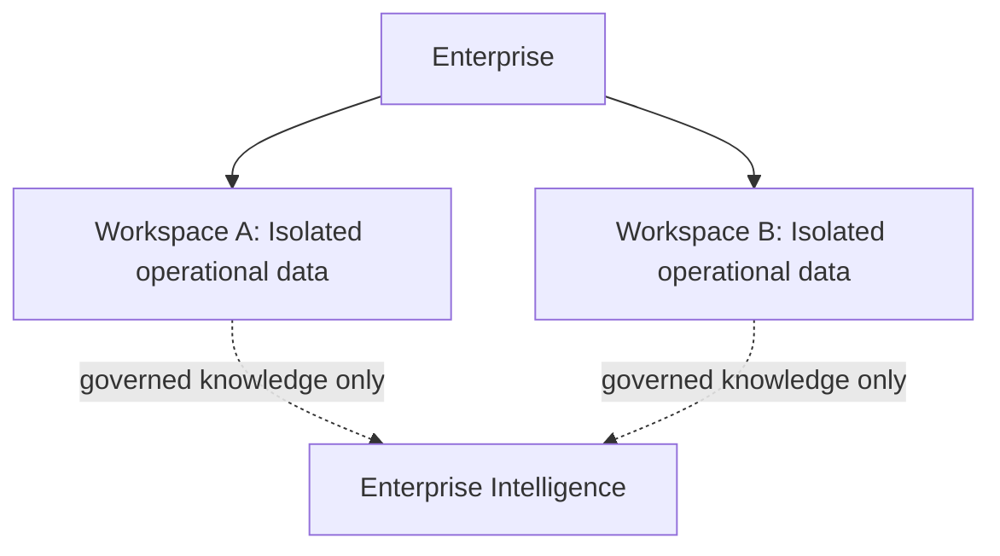

# PMFreak — PR1.1: Founder Ratification of the Canonical Enterprise & PMI Domain Model

**Type:** Product ratification record. Documentation only. No product code, styles, routes, APIs, database schema, or migrations were modified to produce this document.

---

## 1. Executive Summary

PR1 (`docs/product-architecture/01-canonical-domain-model.md`) audited PMFreak's implementation against its stated enterprise/PMI vision and concluded:

```text
DOMAIN MODEL REQUIRES PRODUCT DECISIONS
```

It found a real, migration-enforced, RLS-verified `Workspace → PMO → Project` spine, but left Command Center, Portfolio, Program, and Enterprise unresolved — correctly declining to decide product questions from a research/audit mandate. This document records the founder's ratification of those decisions and every other open item PR1 raised. It closes D-01 (Enterprise), D-17 (Program), and D-18 (Portfolio) — the three decisions PR1 identified as blocking nearly everything else — along with the full companion set covering Workspace, PMO, Project, Command Center, Project Intelligence Feed, Project Memory, Enterprise Intelligence, methodology, and progressive disclosure.

**This is a ratification of product intent, not an implementation.** No table was created, no migration was written, no route was renamed, no code was touched. What changed is that twelve product decisions that were previously open, multi-option questions are now founder instructions, formalized as twelve accepted ADRs and this record. Where this document says the ratified target model requires X, that is a statement of what future implementation work (PR2 and beyond) must build toward — not a claim that X exists today. Every ratified decision is cross-checked against PR1's current-state evidence, and every current-state gap PR1 found remains an open gap after this document, unless explicitly noted otherwise.

The result:

```text
DOMAIN MODEL RATIFIED
```

— contingent on the consistency checks in §27 of this document, all of which passed (see §28 Final Status).

## 2. Purpose

To convert the founder's ratified product decisions into formal architectural contracts — cardinalities, invariants, per-entity contracts, and Architecture Decision Records — so that PR2 (implementation) can be scoped against a stable, unambiguous domain model instead of against open questions. This document is the single authoritative index of what was decided; the twelve ADRs it points to are the durable, individually-referenceable record of each decision's reasoning.

## 3. Inputs

- `docs/product-architecture/00-baseline-verification.md` — Sprint 0 baseline verification.
- `docs/product-architecture/01-canonical-domain-model.md` — PR1's domain audit (current-state evidence, entity inventory, contradictions, duplication classification, bounded-context map, aggregate map, PMI alignment matrix, and the 20-item Open Product Decisions table this document resolves).
- The founder's ratification brief for PR1.1 (decisions D-01 through D-12 as given, cardinality matrix, invariants, canonical hierarchy diagram, and the required deliverable list).
- The unmerged sibling audit `docs/audits/conceptual-model-architecture-audit-2026-07-18.md`, referenced by PR1 §12 C-6 as the "simplify-away" counter-position this ratification explicitly does not adopt (see §5, §23).

## 4. Authority and Ratification Scope

The decisions in this document are issued under founder / product authority, per the "Founder-Ratified Product Decisions" mandate that opened this PR. They are binding product instructions for all future PMFreak architecture and implementation work. They are **not**:

- A claim that any of the target state described here is implemented today (see §23, §49 of PR1 for the gap ledger, reproduced by reference, not duplicated, in this document).
- A migration, schema change, route change, or code change — none was made.
- The start of PR2. PR2 has not been scoped or started by this document.
- A closure of every open question PR1 raised — twenty-plus items remain genuinely open and are listed in §25.

Scope is limited to the enterprise/PMO/portfolio/program/project domain layer and the systems that directly touch it: Command Center, Project Intelligence Feed, Project Memory, Enterprise Intelligence, methodology (Sprint/Iteration), and progressive disclosure.

## 5. Decisions Ratified

Twelve decisions, each formalized as its own accepted ADR. This section is the compact index; full context, rules, alternatives, and consequences live in the linked ADR.

| # | Decision | Ratified answer | ADR |
| --- | --- | --- | --- |
| D-01 | Is Enterprise a canonical entity distinct from Workspace? | **Yes.** Enterprise is the canonical root for organizational identity, contractual relationship, billing, global policy, cross-Workspace administration, data sovereignty, integration governance, and Enterprise Intelligence. Does not replace Workspace or PMO; not a dashboard; not a billing plan. | [ADR-PMF-001](../adr/ADR-PMF-001-enterprise-workspace-separation.md) |
| D-02 | Is Workspace the operational/data/access boundary? | **Yes**, within an Enterprise. Nothing crosses Workspaces automatically; consultancies use one Workspace per client; cross-client intelligence prohibited by default. | [ADR-PMF-002](../adr/ADR-PMF-002-workspace-boundary.md) |
| D-03 | Is PMO an organizational/governance entity? | **Yes**, distinct from Workspace and Command Center. No invisible universal default PMO; a default PMO is only an explicit onboarding/configuration choice. | [ADR-PMF-003](../adr/ADR-PMF-003-pmo-governance-semantics.md) |
| D-04 | Is Portfolio a strategic entity? | **Yes**, PMO-owned, for investment/priority/capacity/risk/value grouping of Programs and Projects. One primary Portfolio per Project/Program initially; no many-to-many; no cross-Workspace/cross-PMO. | [ADR-PMF-004](../adr/ADR-PMF-004-portfolio-domain-semantics.md) |
| D-05 | Is Program a coordination/benefits entity? | **Yes**, PMO-owned, coordinating related Projects for joint benefits. One primary Program per Project initially; no many-to-many; no cross-Workspace/cross-PMO; current disconnection is incomplete integration, not duplication — must not be deleted. | [ADR-PMF-005](../adr/ADR-PMF-005-program-domain-semantics.md) |
| D-06 | Is Project the central execution unit? | **Yes.** Always Workspace-scoped, optionally PMO/Portfolio/Program-scoped. The hierarchy above it must never block fast Project creation. | [ADR-PMF-006](../adr/ADR-PMF-006-project-execution-aggregate.md) |
| D-07 | Is Command Center an experience, not an entity? | **Yes.** A view/projection over a governed entity (Enterprise/Workspace/PMO/Portfolio/Program/Project Command Center), never independently created. "Create Command Center" is conceptually wrong when it actually creates another entity. | [ADR-PMF-007](../adr/ADR-PMF-007-command-center-operational-experience.md) |
| D-08 | Is Project Intelligence Feed a composite projection? | **Yes.** A projection over Chat/Evidence/RAID/Decision/Task/Milestone, not an aggregate, not the sole source of truth. Preserves Raw Source → Normalized Event → Evidence → Proposed Record → Approved Record → Recommendation → Decision → Action → Outcome without auto-promotion at any stage. | [ADR-PMF-008](../adr/ADR-PMF-008-project-intelligence-feed.md) |
| D-09 | Is Project Memory distinct from chat history? | **Yes.** Governed, structured, traceable knowledge (source/actor/date/context/evidence/confidence/validation/lineage/corrections). Chat feeds it but never automatically becomes authoritative. | [ADR-PMF-009](../adr/ADR-PMF-009-project-memory-separation.md) |
| D-10 | Does Enterprise Intelligence belong to Enterprise, governed? | **Yes.** Only ratified knowledge elevates, with a six-part gate (evidence, confidence, review, lineage, applicability, ratification). Must never weaken proven Workspace-level RLS isolation; nothing crosses Workspace or client boundaries automatically. | [ADR-PMF-010](../adr/ADR-PMF-010-enterprise-intelligence-governance.md) |
| D-11 | Is Sprint methodology-specific, not universal? | **Yes.** Sprint applies to agile/hybrid Projects only. "Iteration" is the reserved general-abstraction name. Milestone is the one cross-methodology concept. Methodology is configurable per Project. | [ADR-PMF-011](../adr/ADR-PMF-011-methodology-specific-iterations.md) |
| D-12 | Does progressive disclosure leave the domain intact? | **Yes.** The full enterprise domain exists regardless of what the UI reveals. Hiding an entity ≠ the entity not existing. Auto-creation ≠ the entity being irrelevant. | [ADR-PMF-012](../adr/ADR-PMF-012-progressive-disclosure.md) |

These decisions resolve PR1 §43 items D-01 through D-20, as mapped in §47 of the updated `01-canonical-domain-model.md`. Items not directly addressed by D-01–D-12 above (e.g., the exact naming-consolidation execution for D-19, the onboarding-blocker fix for D-05/D-20) are ratified at the semantic level here but remain execution work for a future PR — see §24 and §25.

## 6. Canonical Hierarchy

Ratified target-state domain capability model:



Solid arrows: mandatory relationships in the target model, including PMO→Program — every Program belongs to exactly one PMO, always (D-05, ADR-PMF-005 Rule 1); a Program is never optional at the PMO level. Dashed arrows: ratified **optional shortcuts** — Workspace→Project, PMO→Project, Portfolio→Program, Portfolio→Project — that exist specifically so progressive disclosure and fast Project creation (D-06, D-12) are never blocked by the fuller hierarchy, and so a Program may attach directly under its mandatory PMO parent without also requiring a Portfolio parent. This diagram represents ratified domain **capability**. It does not represent:

- A mandatory onboarding sequence.
- A claim that all levels must be visible simultaneously for any given customer.
- A claim that every Project must use Portfolio and Program.

**Entity vs. Command Center projection model (D-07):**



Every right-hand node is a view/projection over the entity on its left — never a second entity, never independently created.

**Project intelligence flow (D-08):**


**Knowledge elevation (D-10):**


**Progressive disclosure (D-12):**



**Boundary model (D-02, D-10):**



Enterprise Intelligence receives only ratified knowledge that has passed the six-part elevation gate (D-10) — never a raw cross-Workspace query path.

## 7. Cardinalities

Ratified as initial contracts. They may evolve via a future ADR; they are not migrations executed by this PR; many-to-many relationships are explicitly out of the initial model except where noted.

| Relationship | Cardinality |
| --- | --- |
| Enterprise → Workspace | 1:N |
| Workspace → Enterprise | N:1 obligatory |
| Workspace → PMO | 1:N |
| PMO → Workspace | N:1 obligatory |
| Workspace → Project (direct) | 1:N optional |
| Project → Workspace | N:1 obligatory |
| PMO → Portfolio | 1:N |
| Portfolio → PMO | N:1 obligatory |
| PMO → Program | 1:N |
| Program → PMO | N:1 obligatory |
| PMO → Project (direct) | 1:N optional |
| Project → PMO | N:1 optional |
| Portfolio → Program | 1:N optional |
| Program → Portfolio | N:1 optional |
| Portfolio → Project (direct) | 1:N optional |
| Project → Portfolio | N:1 optional (at most one primary) |
| Program → Project | 1:N |
| Project → Program | N:1 optional (at most one primary) |
| Project → Command Center | 1:1 conceptual/projection |
| PMO → Command Center | 1:1 conceptual/projection |
| Portfolio → Command Center | 1:1 conceptual/projection |
| Program → Command Center | 1:1 conceptual/projection |
| Enterprise → Enterprise Intelligence | 1:1 conceptual |
| Workspace → Enterprise Intelligence contribution | 1:N governed |
| Project → Project Memory | 1:1 logical |
| Project → Intelligence Feed | 1:1 UI projection |
| Project → Agent Recommendations | 1:N |
| Recommendation → Decision | 0..1 |
| Decision → Action | 0..N |
| Action → Outcome | 0..N |

## 8. Invariants

**Tenancy and data**
1. Every Workspace belongs to an Enterprise.
2. Every Project belongs to exactly one Workspace.
3. No operational entity may cross a Workspace without an explicit contract.
4. No knowledge may cross clients.
5. Enterprise Intelligence preserves Workspace and Project provenance.

**PMO**
6. Every PMO belongs to exactly one Workspace.
7. Portfolio and Program belong to a PMO.
8. A Project may exist without a PMO.
9. PMO is not a synonym for Workspace.

**Portfolio**
10. Portfolio is not a label/tag.
11. Portfolio has strategic purpose.
12. A Portfolio does not cross Workspace.
13. In the initial model, a Project has at most one primary Portfolio.

**Program**
14. Program coordinates related Projects.
15. Program is not Portfolio.
16. Program does not cross Workspace.
17. In the initial model, a Project has at most one primary Program.

**Project**
18. Project is the central unit of execution.
19. Project may exist without Portfolio.
20. Project may exist without Program.
21. Project may exist without PMO.
22. Project retains unique identity within its Workspace.

**Command Center**
23. Command Center is not an organizational entity.
24. Command Center is never created independently.
25. Command Center always operates over an existing entity or scope.

**Memory and Intelligence**
26. Chat history is not Project Memory.
27. Inference is not evidence.
28. Recommendation is not decision.
29. Decision is not action.
30. Action is not outcome.
31. Candidate pattern is not ratified pattern.
32. Only governed knowledge may be elevated to Enterprise.

## 9. Enterprise Contract

- **Type:** Aggregate root. **Parent:** none.
- **Owns/relates:** 1:N Workspace (mandatory child relationship); 1:1 conceptual Enterprise Intelligence.
- **Not:** a dashboard; a billing plan; a replacement for Workspace or PMO.
- **May be:** auto-created and hidden for small customers (progressive disclosure, D-12).
- **Current state:** zero implementation (no table, FK, or type) — see PR1 §15, §12 C-2.
- Full rules: [ADR-PMF-001](../adr/ADR-PMF-001-enterprise-workspace-separation.md).

## 10. Workspace Contract

- **Type:** Aggregate root / operational, data, and access boundary. **Parent:** Enterprise (N:1, obligatory in target model).
- **Owns/relates:** 1:N PMO; 1:N Project (direct, optional); RLS/tenancy boundary for all scoped data.
- **Not:** Command Center; PMO; a generic label for arbitrary screens.
- **May be:** auto-created for simple experiences; one per client for consultancies.
- **Current state:** already real, migration-enforced, RLS-verified (408/409 tables, 10/10 live cross-tenant rejection test) — see PR1 §16, §35. Overloaded with "Command Center" naming on `command_center_type`/`visibility_scope`/`confidentiality_level`.
- Full rules: [ADR-PMF-002](../adr/ADR-PMF-002-workspace-boundary.md).

## 11. PMO Contract

- **Type:** Aggregate root / organizational governance entity. **Parent:** Workspace (N:1, obligatory).
- **Owns/relates:** 1:N Portfolio; 1:N Program; 1:N Project (direct, optional).
- **Not:** Workspace; Command Center.
- **Administers:** standards, templates, practices, governance, reporting, metrics, escalation, knowledge, portfolio oversight, program oversight.
- **No** invisible universal default PMO as a technical requirement; a default PMO is only an explicit onboarding/configuration decision.
- **Current state:** three historically-layered representations (enum, `PmoTenant` JSON blob, canonical `pmos` table) — only the table is canonical going forward; see PR1 §9, §12 C-1, §17.
- Full rules: [ADR-PMF-003](../adr/ADR-PMF-003-pmo-governance-semantics.md).

## 12. Portfolio Contract

- **Type:** Aggregate root / strategic entity. **Parent:** PMO (N:1, obligatory).
- **Owns/relates:** 1:N Program (optional); 1:N Project (direct, optional).
- **Not:** a folder; a dashboard; a tag; "all projects"; a synonym for PMO or Program.
- **Constraints:** at most one primary Portfolio per Project/Program initially; no many-to-many; no cross-Workspace; cross-PMO Portfolio out of scope initially.
- **Future capability (not this PR):** prioritization, investment, capacity, aggregate risk, benefits, scenarios, strategic alignment.
- **Current state:** zero PMI-sense implementation; six unrelated naming collisions today; `personal_portfolios` is a real but unrelated per-user watchlist — see PR1 §9, §18.
- Full rules: [ADR-PMF-004](../adr/ADR-PMF-004-portfolio-domain-semantics.md).

## 13. Program Contract

- **Type:** Aggregate root / coordination and benefits entity. **Parent:** PMO (N:1, obligatory).
- **Owns/relates:** optional Portfolio parent; 1:N Project.
- **Not:** Portfolio; Initiative.
- **Constraints:** at most one primary Program per Project initially; no many-to-many; no cross-Workspace; cross-PMO Program out of scope initially.
- **Manages (future capability, not this PR):** benefits, dependencies, outcomes, coordination, shared risks, cross-cutting decisions.
- **Must not be deleted** for being currently disconnected — classified as a valid capability with incomplete integration.
- **Current state:** real, tested roadmap-to-backlog capability (`programs`/`program_epics`/`program_sprints`/`program_cards`); zero FK to `projects`/`pmos` today — see PR1 §9, §19, §29–31.
- Full rules: [ADR-PMF-005](../adr/ADR-PMF-005-program-domain-semantics.md).

## 14. Project Contract

- **Type:** Aggregate root / central unit of execution. **Parent:** Workspace (N:1, obligatory).
- **Owns/relates:** optional PMO, primary Portfolio, primary Program; owns or coordinates context, operational memory, schedule, tasks, risks, issues, costs, decisions, stakeholders, communications, documents, evidence, recommendations, forecasts, agents.
- **May exist:** directly under Workspace; directly under PMO; inside a Portfolio without a Program; inside a Program.
- **Invariant:** the hierarchy above Project must never block fast Project creation.
- **Current state:** already the best-implemented entity (`workspace_id` NOT NULL, `pmo_id` nullable, workspace-consistency trigger enforced); three inconsistent UI names (Project/Context/Initiative) — see PR1 §9, §20, §29.
- Full rules: [ADR-PMF-006](../adr/ADR-PMF-006-project-execution-aggregate.md).

## 15. Command Center Contract

- **Type:** Projection/experience, applied over any governed entity — never an entity itself.
- **Variants:** Enterprise, Workspace, PMO, Portfolio, Program, and Project Command Center — all views, never new rows.
- **Rule:** the user creates Enterprise/Workspace/PMO/Portfolio/Program/Project; the system presents a Command Center to operate or supervise it. "Create Command Center" is conceptually incorrect if it actually creates another entity.
- **No dedicated table required** unless persistent view configuration exists — and if so, that configuration belongs to the view, not to a new governed entity.
- **Current state:** applied inconsistently to 5–6 different objects today (Workspace row/wizard, `/command-center` route mixing Project+Workspace data, `pmo_command_center_snapshots`, `operational_command_centers`, `/pmo-command-center`, `/projects` `<h1>`); "Create Command Center" currently creates a PMO — see PR1 §9, §11, §22.
- Full rules: [ADR-PMF-007](../adr/ADR-PMF-007-command-center-operational-experience.md).

## 16. Project Intelligence Feed Contract

- **Type:** Composite projection, not an aggregate, not the sole source of truth. **Primarily belongs to:** Project.
- **Pipeline:** Raw Source → Normalized Event → Evidence → Proposed Record → Approved Record → Recommendation → Decision → Action → Outcome. Events preserve provenance; no automatic promotion between stages (inference≠fact, recommendation≠decision, decision≠action).
- **May include** chat, but is not simply chat history.
- **Future capability (not this PR):** aggregated/projected feeds at Program, Portfolio, and PMO scope — these do not replace the Project feed.
- **Current state:** does not exist in the codebase today; no `Feed`/`IntelligenceFeed`/`ActivityStream` type or table — see PR1 §23.
- Full rules: [ADR-PMF-008](../adr/ADR-PMF-008-project-intelligence-feed.md).

## 17. Project Memory Contract

- **Type:** Governed knowledge boundary, logically 1:1 with Project. Distinct from chat history.
- **Must preserve:** source, actor, date, context, evidence, confidence, validation status, lineage, corrections.
- **May be consumed by** agents. **May feed from** chat history, but chat never automatically becomes authoritative memory.
- **Must distinguish** facts, inferences, decisions, and outcomes.
- **Current state:** `project_memory_snapshots` real and already distinct from chat history; no explicit correction/audit-trail mechanism confirmed — see PR1 §24.
- Full rules: [ADR-PMF-009](../adr/ADR-PMF-009-project-memory-separation.md).

## 18. Enterprise Intelligence Contract

- **Type:** Governed knowledge aggregate, conceptually belonging to Enterprise; preserves Workspace and Project provenance.
- **Elevation path:** Project evidence → pattern candidate → Program/Portfolio aggregation → PMO review → Workspace ratification → Enterprise Intelligence. Elevation requires evidence, confidence, review, lineage, applicability, and ratification.
- **Must support:** expiration, contradiction, invalidation, revocation, deletion, scope.
- **Not:** a generic vector store; aggregated chat history.
- **Must distinguish:** facts, observations, recommendations, decisions, outcomes, candidate patterns, ratified patterns.
- **Absolute constraint:** nothing crosses Workspaces or clients automatically — this must not weaken today's proven RLS isolation.
- **Current state:** no elevation pipeline exists anywhere; the implemented architecture instead enforces hard RLS isolation with no cross-workspace query path — a genuine tension this contract resolves toward governed, gated elevation, not automatic crossing — see PR1 §27.
- Full rules: [ADR-PMF-010](../adr/ADR-PMF-010-enterprise-intelligence-governance.md).

## 19. Methodology Contract

- Sprint is not a universal entity for all Projects — it applies to agile or hybrid Projects.
- The general abstraction, when needed, is named **Iteration**.
- Sprint may be modeled as a subtype, a modality, a Scrum-specific label, or a methodological configuration.
- Predictive-methodology Projects must not be forced to use Sprint.
- Milestone is a cross-cutting capability, available regardless of methodology.
- Epic must not be mandatory for all Projects.
- Methodology must be configurable per Project.
- **Current state:** Sprint/Epic already correctly scoped to the isolated Program tree only (not imposed on non-agile Projects) — this is already-correct-but-undocumented behavior; the `methodology` field on `projects` exists but its UI-gating wiring is unverified; `program_cards.type='MILESTONE'` remains disconnected from `project_milestones` — see PR1 §21.
- Full rules: [ADR-PMF-011](../adr/ADR-PMF-011-methodology-specific-iterations.md).

## 20. Progressive Disclosure Contract

- The full enterprise domain exists at all times; the UI reveals only the levels necessary for a given user.
- Hiding an entity does not mean the entity does not exist. Auto-creation does not mean the entity is irrelevant.
- Illustrative configurations (capability, not mandatory sequence): Independent PM (Workspace → Project); Small team (Workspace → Projects, optional PMO capabilities); PMO (Workspace → PMO → {Portfolios, Programs, Projects}); Enterprise (Enterprise → Workspaces → PMOs → Portfolios → Programs → Projects).
- **Current state:** a real, working reveal-stage engine already exists (`capability-reveal`, stages/domains/role-profiles/plan-tiers) — ahead of the domain model in infrastructure, not behind it. Current onboarding blocks "Create Project" until "Create Command Center" (PMO) is done, contradicting the Independent-PM vision — a known, unfixed contradiction — see PR1 §37, §38.
- Full rules: [ADR-PMF-012](../adr/ADR-PMF-012-progressive-disclosure.md).

## 21. Data Segregation Contract

Formalizing invariants 1–5 and D-02/D-10's isolation guarantees as a single cross-cutting contract:

- Every Workspace belongs to an Enterprise; every Project belongs to exactly one Workspace.
- No operational entity crosses a Workspace boundary without an explicit, governed contract.
- No knowledge crosses clients, under any circumstance, by default.
- Consultancies use one Workspace per client; this pattern is already fully supported by the existing RLS model (PR1 §16, §35, §38) and requires no new mechanism.
- Enterprise Intelligence, once built, must preserve Workspace and Project provenance on every elevated record and must not introduce a query path that crosses Workspace boundaries outside the governed elevation gate defined in §18/§22.
- This contract is a restatement, not a change: today's RLS enforcement (408/409 tables, live-tested) is the reference implementation this contract requires any future Enterprise-level work to preserve, not weaken.

## 22. Knowledge Elevation Contract

Formalizing the elevation pipeline referenced in §6 and §18 as its own contract:

1. **Evidence** originates in Projects.
2. **Patterns** may be aggregated at Program, Portfolio, and PMO level.
3. **Knowledge** may be elevated to Workspace.
4. **Only ratified knowledge** may be elevated to Enterprise.
5. Nothing crosses Workspaces automatically at any stage of this pipeline.
6. Nothing crosses clients at any stage.
7. Elevation at each stage requires: evidence, confidence, review, lineage, applicability, ratification.
8. Elevated knowledge must support expiration, contradiction, invalidation, revocation, deletion, and scope — it is not a permanent, append-only fact store.
9. A candidate pattern is never treated as a ratified pattern until it has explicitly passed this gate.

This contract does not specify a storage mechanism, workflow tool, or review UI — those are PR2+ decisions, explicitly listed as open in §25.

## 23. Current-State Contradictions

This document does not resolve or paper over any contradiction PR1 documented. The following remain true after this ratification and are unchanged by it:

- **PR1 §12 C-1** — three coexisting, only-partly-reconciled representations of "PMO" (enum, JSON blob, table). D-03/ADR-PMF-003 ratifies the target (table is canonical), but the legacy enum/blob still exist in the codebase today.
- **PR1 §12 C-2** — the dead `plan='enterprise'` billing-enum value, silently coerced to `'free'` by `toPlan()`. Still present; not touched by this PR.
- **PR1 §12 C-3** — `operational_command_centers` and `pmo_command_center_snapshots` still share the "Command Center" name pattern with no reconciling FK.
- **PR1 §12 C-4** — `operational_memory_entries` (legacy) and `operational_memory_records` (current) still both exist under the "operational memory" name.
- **PR1 §12 C-5** — the aspirational `customer-owned-organizational-memory-framework.md` (644 lines, ~14 tables specified) still has only 2 of its tables actually built. D-10/ADR-PMF-010 explicitly warns against building the full spec verbatim in any future work.
- **PR1 §12 C-6** — the sibling audit's "simplify away Command Center/Portfolio/Program" recommendation is explicitly **not adopted** by this ratification; this document's decisions (D-04, D-05, D-07) go the opposite direction (connect and preserve), consistent with PR1's own original mandate.
- **PR1 §12 C-7** — `workspace-pmo-project-hierarchy.md`'s "Workspace is the whole organization, nothing above it" framing is now formally superseded by D-01/ADR-PMF-001 for future work, but the document itself has not been edited or corrected by this PR.
- **Onboarding blocker** — the wizard still blocks "Create Project" until "Create Command Center" (PMO) is completed, directly contradicting D-06 (rule 11) and D-12. Flagged in ADR-PMF-006, ADR-PMF-007, and ADR-PMF-012; not fixed by any of them.
- **Six-way "Portfolio" naming collision** and **three-way "Project/Context/Initiative" naming inconsistency** — both still present in the UI; ratified target semantics do not retroactively rename anything.

No code was changed to fix, hide, or mask any of the above. They are future-PR work, itemized in §24.

## 24. Required Future Migrations

Not designed in this PR — listed so a future PR2 knows what is eventually needed, contingent on the ratification above:

- New `enterprises` table (or equivalent) + FK chain from `workspaces`, if/when Enterprise is implemented (D-01).
- Deprecation path for the PMO `command_center_type` enum and `PmoTenant` blob read-paths, converging on the `pmos` table as sole source of truth (D-03).
- New `portfolios` table + join tables to `programs`/`projects`, with a "primary Portfolio" constraint mechanism (D-04).
- New relationship (FK or join table) between `programs` and `projects`/`pmos`/`portfolios`, with a "primary Program" constraint mechanism (D-05).
- UI copy consolidation of Project/Context/Initiative to "Project" (D-06 semantics, PR1 D-19 execution).
- Rename of the "Create Command Center" CTA/route to name the entity it actually creates; reconciliation of `pmo_command_center_snapshots`/`operational_command_centers` naming and FKs (D-07).
- Design and build of the Project Intelligence Feed projection layer (D-08).
- An explicit correction/audit-trail mechanism for Project Memory (D-09).
- A scoped (not full-spec) Enterprise Intelligence elevation pipeline, reconciled with `data-export-sovereignty-architecture.md` (D-10).
- Verification of `methodology`-field UI gating; reconciliation of `program_cards.type='MILESTONE'` with `project_milestones` (D-11).
- Extension of the existing `capability-reveal` engine to gate Enterprise/Portfolio/Program once built; fix of the onboarding "Create Project blocked by Create Command Center" contradiction (D-12).
- Deprecation of the legacy `operational_memory_entries` table in favor of `operational_memory_records` (pre-existing gap, PR1 §12 C-4, not tied to a specific D-xx decision but relevant to any future memory work).

None of the above is scoped, sequenced, or started by this document.

## 25. Out-of-Scope Decisions

The following remain genuinely open and are explicitly **not** closed by this ratification:

1. Exact technical model of Enterprise (columns, service layer, API shape).
2. Tenant-migration strategy for existing customers.
3. Future many-to-many for Portfolio↔Project/Program.
4. Future many-to-many for Program↔Project.
5. Program cross-PMO.
6. Portfolio cross-PMO.
7. Shared services between Workspaces.
8. Exact storage strategy for any new table.
9. Event infrastructure (no event system exists today; §33 of PR1's Domain Events is conceptual only).
10. Vector storage strategy.
11. Detailed knowledge-ratification workflow (who reviews, what tooling, what SLA).
12. Enterprise billing model.
13. Final visible navigation names.
14. Final routes.
15. API contracts.
16. Final database shape.
17. Feature flags.
18. Migration plan and sequencing.
19. Implementation order across ADRs.
20. Final UI.

These belong to PR2 and later, and should be scoped per-ADR rather than as one large refactor, per PR1 §45's original recommendation (now executed, see §5 above).

## 26. ADR Index

| ADR | Title | File | Status |
| --- | --- | --- | --- |
| ADR-PMF-001 | Enterprise and Workspace Separation | `docs/adr/ADR-PMF-001-enterprise-workspace-separation.md` | Accepted |
| ADR-PMF-002 | Workspace as Operational and Data Boundary | `docs/adr/ADR-PMF-002-workspace-boundary.md` | Accepted |
| ADR-PMF-003 | PMO Governance Semantics | `docs/adr/ADR-PMF-003-pmo-governance-semantics.md` | Accepted |
| ADR-PMF-004 | Portfolio Domain Semantics | `docs/adr/ADR-PMF-004-portfolio-domain-semantics.md` | Accepted |
| ADR-PMF-005 | Program Domain Semantics | `docs/adr/ADR-PMF-005-program-domain-semantics.md` | Accepted |
| ADR-PMF-006 | Project as Execution Aggregate | `docs/adr/ADR-PMF-006-project-execution-aggregate.md` | Accepted |
| ADR-PMF-007 | Command Center as Operational Experience | `docs/adr/ADR-PMF-007-command-center-operational-experience.md` | Accepted |
| ADR-PMF-008 | Project Intelligence Feed Semantics | `docs/adr/ADR-PMF-008-project-intelligence-feed.md` | Accepted |
| ADR-PMF-009 | Project Memory and Conversation Separation | `docs/adr/ADR-PMF-009-project-memory-separation.md` | Accepted |
| ADR-PMF-010 | Enterprise Intelligence Governance | `docs/adr/ADR-PMF-010-enterprise-intelligence-governance.md` | Accepted |
| ADR-PMF-011 | Methodology-Specific Iterations | `docs/adr/ADR-PMF-011-methodology-specific-iterations.md` | Accepted |
| ADR-PMF-012 | Progressive Disclosure | `docs/adr/ADR-PMF-012-progressive-disclosure.md` | Accepted |

No prior repo-wide ADR convention existed before this PR (PR1 §44 found exactly one prior ADR, scoped to a single feature: `docs/founder-program/00-architecture-decision-record.md`). `docs/adr/` is now established as the ADR home for this domain.

## 27. Readiness for PR2

Consistency checks performed before closing this document (see §15 of the founder's brief):

- All 12 ADRs exist, at `docs/adr/ADR-PMF-00{1..9}` / `ADR-PMF-01{1,2}`, each Status: Accepted, each using the mandated 14-section template.
- No cardinality contradictions found between this document, the ADRs, and the updated `01-canonical-domain-model.md` §47–§49.
- No definitional contradictions found: Command Center appears consistently as experience/projection across all references; Project Memory appears consistently separated from chat history; Enterprise Intelligence appears consistently under Enterprise with governed elevation; Workspace appears consistently as the operational/data/access boundary; Project appears consistently as the central execution unit; Sprint appears consistently as optional/methodology-specific.
- Relative links from this document to the ADRs and to `01-canonical-domain-model.md` use correct relative paths (`../adr/...`).
- `01-canonical-domain-model.md` §47–§49 were added without deleting or rewriting its original historical evidence (§1–§46 preserved verbatim, with an amendment notice and forward pointers only).
- No product code, route, API, schema, or migration file was touched — confirmed by `git status`/`git diff --stat` restricted to `docs/product-architecture/` and `docs/adr/` (see §28).

**PR2 may now be scoped**, per-ADR as recommended, once a human maintainer picks it up. This document does not start PR2.

## 28. Final Status

```text
DOMAIN MODEL RATIFIED
```

Founder-ratified decisions D-01 through D-12 are formalized as twelve accepted ADRs and cross-referenced consistently across this document and the updated `01-canonical-domain-model.md`. No blocking contradiction was found. D-01 (Enterprise), D-17 (Program), and D-18 (Portfolio) — the three decisions PR1 flagged as blocking nearly everything else — are ratified, along with every other item PR1's Open Product Decisions table raised that this brief addressed. Genuinely open, out-of-scope items (§25) remain open and are not claimed as resolved.

- **Repository:** `Architects-of-Change-Protocol/pmfreak`
- **Branch:** `claude/pmfreak-domain-ratification-6dzubi`
- **Initial HEAD:** `b82b05e4abd896a014eb9af17c1e9d52aa28fe5d`
- **Baseline commit:** `b09c111c6155783fd960c4026c5bb9620b5d2804`
- **PR1 documentation commit:** `b82b05e4abd896a014eb9af17c1e9d52aa28fe5d` ("docs: define canonical enterprise and PMI domain model", #530) — the branch's initial HEAD already contains PR1's document; the exact hash `5ac3d734df37725accf4bbb065518fc0d38452ed` cited in the originating brief was not found in this repository's history, but this commit satisfies the same requirement (contains the PR1 document, and is a verified descendant of the baseline).
- **PR1.1 documentation commit:** recorded after this file is committed — see the commit immediately following this document in the branch history.
- **Files created:** `docs/product-architecture/01.1-domain-ratification.md`; `docs/adr/ADR-PMF-001-enterprise-workspace-separation.md` through `docs/adr/ADR-PMF-012-progressive-disclosure.md` (12 files).
- **Files modified:** `docs/product-architecture/01-canonical-domain-model.md` (amendment notice, §47–§49 added, §43/§44/§45/§46 annotated — no deletions of prior content).
- **ADRs created:** 12 (ADR-PMF-001 through ADR-PMF-012), all Status: Accepted.
- **Product code modified:** No.
- **Routes modified:** No.
- **APIs modified:** No.
- **Database modified:** No.
- **Migrations created:** No.
- **PR2 started:** No.
- **Final status:** `DOMAIN MODEL RATIFIED`.
- **Recommended next step:** Scope PR2 per-ADR (not as one large refactor), starting with the three highest-leverage, most self-contained items — ADR-PMF-003 (PMO canonicalization), ADR-PMF-007 (Command Center rename), and ADR-PMF-004/005 (Portfolio/Program schema) — per the sequencing logic in PR1 §45 and this document's §24.

Stop. PR2 not executed.
