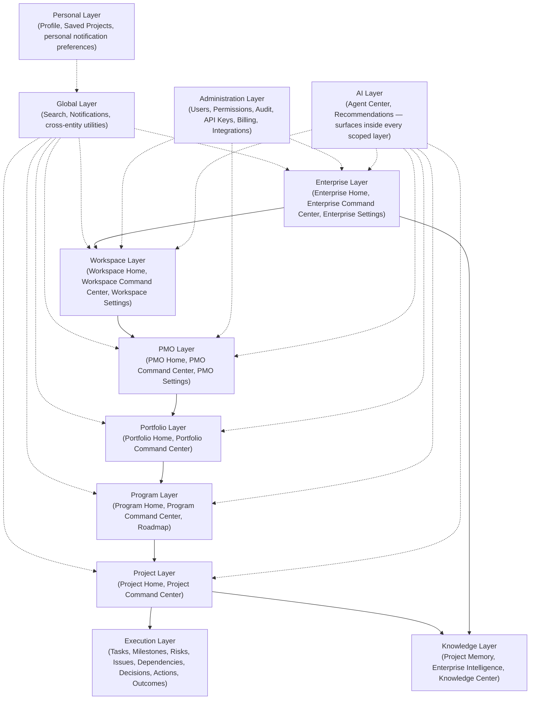
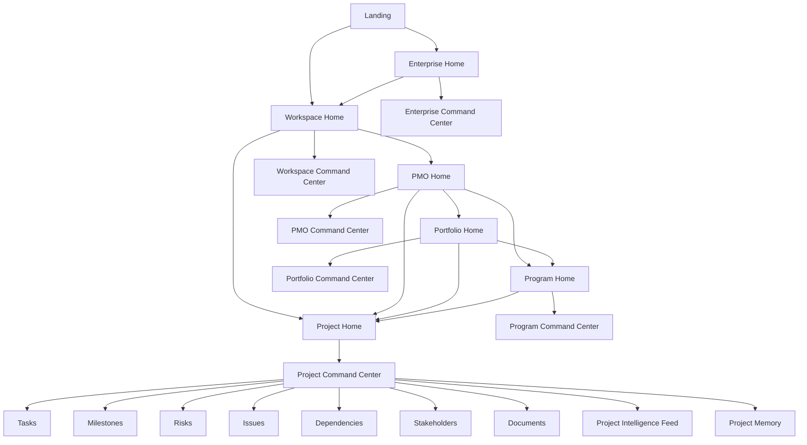
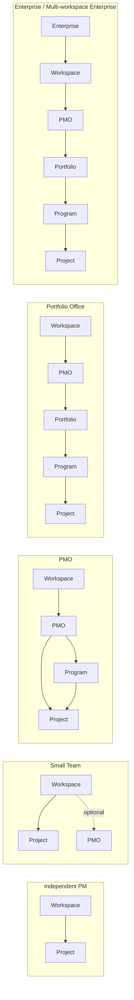
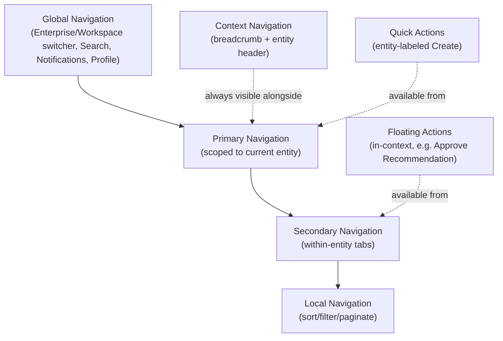
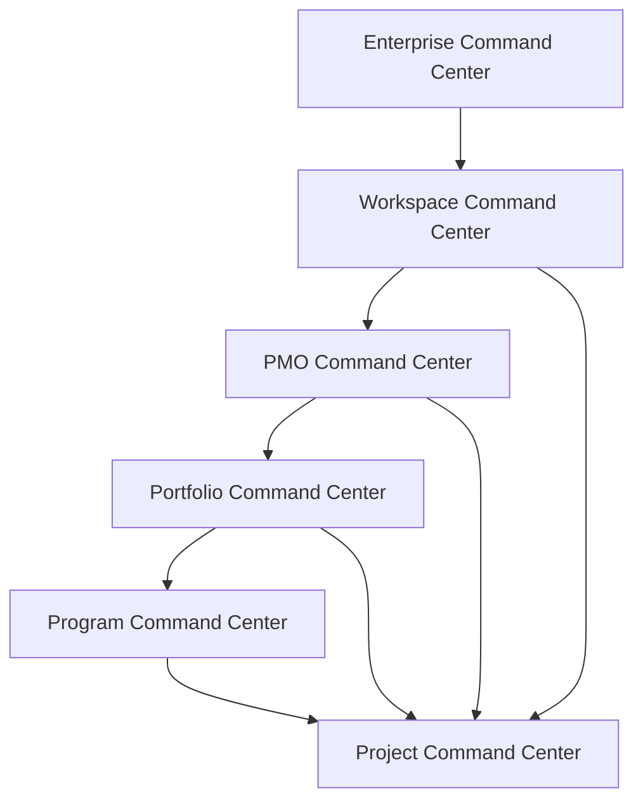
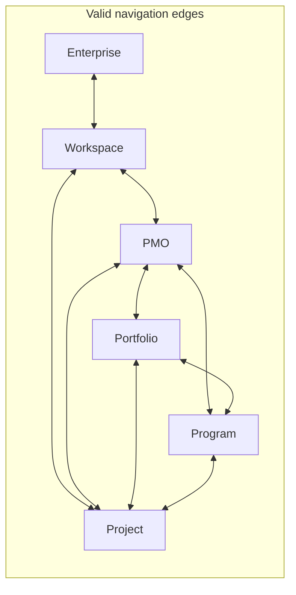
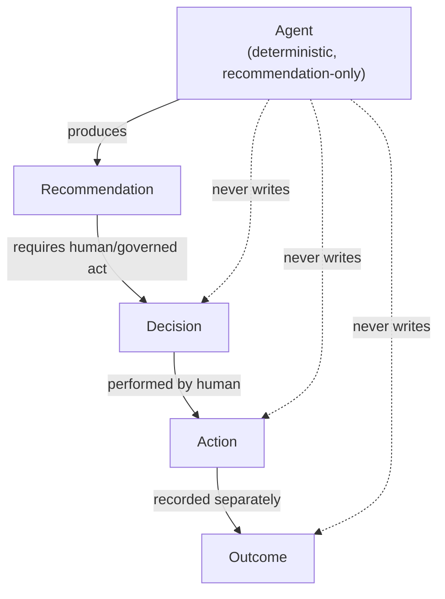
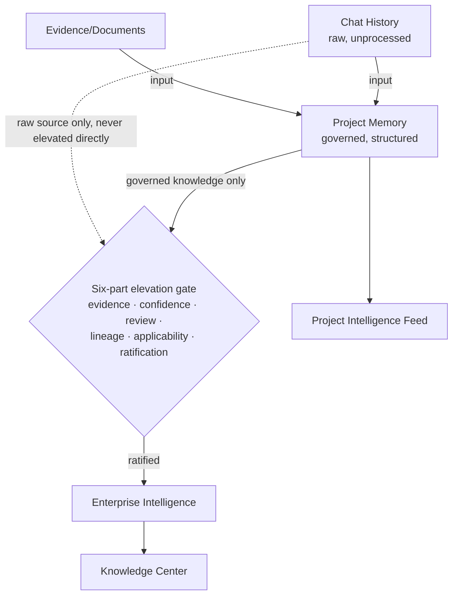
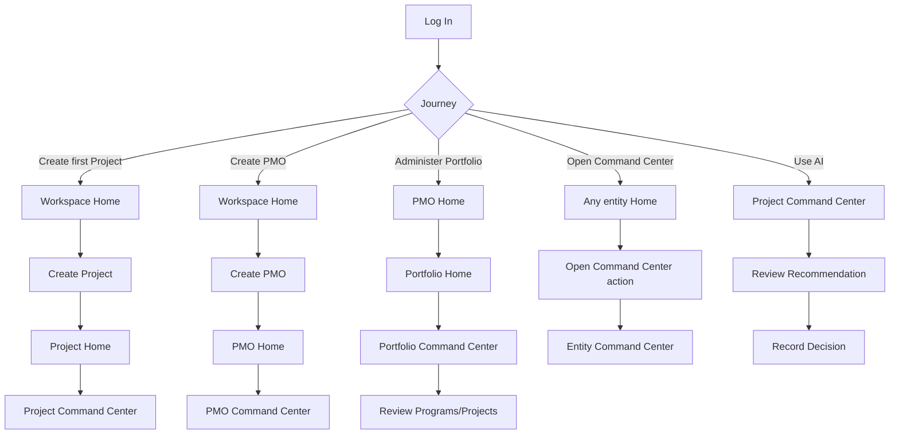

# PMFreak — Canonical Information Architecture (PR3)

**Type:** Product/UX architecture. Documentation only. No product code, components, React, Next.js, Supabase, APIs, navigation, menus, layouts, CSS, Tailwind, database, migrations, schemas, or tests were modified to produce this report.

**Status:** Ratified information architecture. Binding on all future design and implementation PRs (PR4+).

---

## 0. Baseline Validation

| Item | Value |
| --- | --- |
| Repository | `Architects-of-Change-Protocol/pmfreak` |
| Working branch | `claude/pmfreak-canonical-ia-vqprzx` |
| HEAD at session start | `0a77b41` — "docs: establish canonical product language (#532)" |
| Working tree | Clean (`git status` → "nothing to commit, working tree clean") |
| PR0 (baseline) | Present — `docs/product-architecture/00-baseline-verification.md` |
| PR1 (domain discovery) | Present — `docs/product-architecture/01-canonical-domain-model.md` |
| PR1.1 (domain ratification) | Present — `docs/product-architecture/01.1-domain-ratification.md` |
| PR2 (canonical language) | Present — `docs/product-architecture/02-canonical-product-language.md`, `02-product-copy-style-guide.md` |
| ADR001–016 | Present — `docs/adr/ADR-PMF-001` through `ADR-PMF-016`, all `Status: Accepted` |

**Conclusion: PR2 is available. Proceeding.** (If any prerequisite had been missing, this document would not exist and the session would have terminated with `INFORMATION ARCHITECTURE BLOCKED`.)

---

## 1. Authority

This document does not reinterpret, re-derive, or re-litigate the domain or the vocabulary. It takes the following as fixed, binding authority and builds the experience architecture strictly on top of it:

- `docs/product-architecture/01-canonical-domain-model.md` — entity inventory, contradictions, duplication classification (PR1).
- `docs/product-architecture/01.1-domain-ratification.md` — the ratified target hierarchy and cardinalities (PR1.1).
- `docs/product-architecture/02-canonical-product-language.md` — the binding glossary, forbidden synonyms, naming rules (PR2).
- `docs/product-architecture/02-product-copy-style-guide.md` — tone, voice, per-surface copy rules.
- `docs/adr/ADR-PMF-001` through `ADR-PMF-016` — the ratified decision record.

Every entity name, relationship, cardinality, and forbidden synonym used below is taken verbatim from those sources. Where this document introduces something new, it is explicitly **experience architecture** (screens, navigation, disclosure, journeys) — never a new domain decision. Where an illustrative user segment or screen goes beyond what PR1/PR1.1/PR2 explicitly named (e.g. Government, Portfolio Office), it is built strictly by composing already-ratified entities and the already-ratified progressive-disclosure engine, and is flagged as an **IA-level configuration**, not a new domain ratification — see §7.

### 1.1 Ratified Entity Hierarchy (restated, not reinterpreted)

```
Enterprise → Workspace → PMO → Portfolio → Program → Project → (Task / Milestone / Risk / Issue / Dependency / Decision / Recommendation / Action / Outcome)
```

Ratified optional shortcuts: `Workspace → Project`, `PMO → Project`, `Portfolio → Program`, `Portfolio → Project`. Program → PMO is the one relationship that is **always mandatory, never optional** (ADR-PMF-005 Rule 1). Command Center is **not a hierarchy member** — it is a projection applied over any of the six Aggregates (Enterprise, Workspace, PMO, Portfolio, Program, Project). No many-to-many relationship exists anywhere in the model.

This diagram represents ratified domain **capability**, not a mandatory click-path. Every screen and flow in this document is designed so that a tenant may enter, and remain, at any point on this hierarchy without ever being forced through levels above it.

---

## 2. Executive Summary

PMFreak's Canonical Information Architecture answers, definitively, how the product is organized, what screens exist, how a user moves between them, what is shown first, what stays hidden until needed, and what must never be hidden. It is built on one governing idea, repeated at every level of this document: **the domain model (PR1/PR1.1) is the single source of truth for what PMFreak *is*; this document is the single source of truth for what a user *sees and does*, and when.** The two are never allowed to drift — a hidden entity still exists; a visible screen never implies an entity that isn't real.

Six Aggregates form the spine: Enterprise, Workspace, PMO, Portfolio, Program, Project. Each Aggregate has exactly one Home screen and exactly one Command Center (an entity-qualified operational experience, never a bare or independently-created thing — ADR-PMF-007, ADR-PMF-014). Below Project, execution entities (Task, Milestone, Risk, Issue, Dependency, Decision, Recommendation, Action, Outcome, Stakeholder, Document) each have exactly one home screen, always Project-scoped. Cross-cutting Global Layer screens (Search, Notifications, Profile) and Personal Layer screens (Saved Projects) sit outside the hierarchy entirely, reachable from anywhere.

Navigation always follows the domain: no screen is reachable through a path that implies an entity relationship that does not exist. Progressive disclosure hides levels a tenant does not use — it never deletes them from the model, and it never blocks the fast path (Workspace → Project) behind a level the tenant hasn't chosen to use (ADR-PMF-012).

This document, together with `03-screen-catalog.md`, `03-navigation-contracts.md`, and `03-user-journeys.md`, is the complete, binding Information Architecture contract PR4 (and every implementation PR after it) must build against.

---

## 3. IA Principles

These ten principles govern every decision in this document. Each is a direct consequence of the ratified domain model and vocabulary — none introduces a new domain concept.

1. **Domain before Screens.** No screen is designed until the entity it represents is ratified. Every screen in the inventory (§6) traces to exactly one entity or projection already defined in PR1.1/PR2.
2. **Navigation follows Domain.** A user can only navigate along an edge that exists in the ratified hierarchy (§1.1) or an explicitly ratified shortcut. Navigation is never invented to make a screen reachable — if a path would imply a relationship the domain model doesn't have (e.g. Project → Portfolio without a primary Portfolio set), that path does not exist.
3. **Progressive Disclosure.** The full hierarchy exists conceptually for every tenant at all times; the UI reveals only what a given segment's configuration calls for (ADR-PMF-012). Hiding a level is a UI decision; it is never a claim that the level doesn't exist.
4. **One Screen, One Purpose.** Every screen in the inventory has exactly one stated purpose. A screen that would serve two purposes is two screens (or one screen with a clearly scoped tab), never one ambiguous one — this is the direct experience-layer fix for the "Command Center" five-object collision PR1 found.
5. **One Entity, One Home.** Every Aggregate has exactly one canonical Home screen and exactly one canonical Command Center. No entity is ever given a second, competing home under a different name.
6. **Context before Action.** A user is always shown the entity and scope they are acting within before being offered an action on it. No action button appears without its governing context (breadcrumb, entity header) visible on the same screen.
7. **Create before Manage.** A newly created entity lands the user on that entity's Home/Command Center immediately — management screens (Settings, Administration, Permissions) are always one deliberate navigation away, never the default landing after creation.
8. **Read before Configure.** A user opens an entity into its Command Center (a read/operational experience) by default; Settings is a distinct, secondary screen reached deliberately, never the default view of an entity.
9. **Experience over Navigation.** The Command Center for an entity is designed to answer "what do I need to know and do right now" without requiring further navigation; navigation exists for everything the Command Center doesn't already answer.
10. **Enterprise without Complexity.** The full Enterprise → Workspace → PMO → Portfolio → Program → Project hierarchy must be available for the tenants who need it, and completely invisible in the UI to the tenants who don't (§7). Enterprise-grade depth and independent-PM simplicity are the same product, never two products.

---

## 4. Experience Layers

Twelve layers organize every screen in the product. A layer is not a navigation tier by itself — it is a classification of *what kind of concern* a screen belongs to, used consistently across the Screen Inventory (§6) and the Screen Catalog.



| Layer | Governs | Entities in scope | Always visible? |
| --- | --- | --- | --- |
| **Enterprise Layer** | Organizational identity, cross-Workspace administration, billing, data sovereignty | Enterprise | No — hidden until an Enterprise exists (§7) |
| **Workspace Layer** | The operational/data/access boundary | Workspace | Yes — every tenant has one |
| **PMO Layer** | Governance, standards, templates, Portfolio/Program oversight | PMO | No — hidden until a PMO is created |
| **Portfolio Layer** | Investment/priority/capacity/risk grouping of Programs/Projects | Portfolio | No — hidden until built/created |
| **Program Layer** | Coordination of related Projects for joint benefits | Program | No — hidden until created |
| **Project Layer** | The central execution aggregate | Project | Yes — every tenant creates Projects |
| **Execution Layer** | Task, Milestone, Risk, Issue, Dependency, Decision, Recommendation, Action, Outcome | Always Project-scoped | Yes, once a Project exists |
| **Knowledge Layer** | Project Memory, Enterprise Intelligence, Knowledge Center | Project, Enterprise | Project Memory yes; Enterprise Intelligence no (Enterprise-gated) |
| **Administration Layer** | Users, Permissions, Audit, API Keys, Billing, Integrations | Workspace, Enterprise | Role-gated, not segment-gated |
| **Personal Layer** | Profile, Saved Projects, personal preferences | User (not a hierarchy entity) | Yes, per-user |
| **Global Layer** | Search, Notifications | Cross-entity | Yes |
| **AI Layer** | Agent Center, in-context Recommendations | Cross-entity, surfaced wherever an entity has Agent output | Yes, wherever applicable — see §21 |

---

## 5. Screen Inventory

Every screen below traces to exactly one entity or projection already ratified in PR1/PR1.1/PR2 (IA Principle 1). Fields follow the brief's required minimum: **Name, Purpose, Parent, Children, Visible To, Required Role, Entity, Projection, Primary Actions, Entry Points, Exit Points, Future Dependencies.** "Projection: Yes" means the screen is a composed read view (per ADR-PMF-015's Projection definition), not a table with independent identity. Full variants/states/overlays for each screen are in `03-screen-catalog.md`; full navigation contracts are in `03-navigation-contracts.md`.



### 5.1 Global & Personal Layer

#### Landing
- **Purpose:** Pre-authentication entry surface; establishes product identity and routes to sign-up/sign-in.
- **Parent:** None (root of the Global Layer).
- **Children:** Sign Up flow, Log In flow.
- **Visible To:** Guest.
- **Required Role:** None.
- **Entity:** None.
- **Projection:** No.
- **Primary Actions:** Sign Up, Log In.
- **Entry Points:** Direct URL, marketing links, invitation links.
- **Exit Points:** Workspace Home (post-auth default redirect).
- **Future Dependencies:** Enterprise SSO discovery (requires Enterprise entity to exist).

#### Search (Global)
- **Purpose:** Cross-entity search across everything the user has access to.
- **Parent:** Global Nav (reachable from every screen).
- **Children:** None (results route directly into entity Homes).
- **Visible To:** All authenticated users.
- **Required Role:** Member+.
- **Entity:** None — federated projection over all entities the user can read.
- **Projection:** Yes.
- **Primary Actions:** Search, filter by entity type, open result.
- **Entry Points:** Global Nav search field, keyboard shortcut.
- **Exit Points:** Any entity Home/Command Center the result belongs to.
- **Future Dependencies:** Knowledge Search and Agent Search variants (§18) depend on Knowledge Layer and AI Layer maturity.

#### Notifications
- **Purpose:** Aggregated, cross-entity feed of events the user is entitled to see.
- **Parent:** Global Nav.
- **Children:** None.
- **Visible To:** All authenticated users.
- **Required Role:** Member+.
- **Entity:** None — projection over events across every entity the user can read.
- **Projection:** Yes.
- **Primary Actions:** Mark read, open source entity, configure preferences.
- **Entry Points:** Global Nav bell icon, deep links from email/push.
- **Exit Points:** The entity/screen the notification references.
- **Future Dependencies:** Per-entity notification rules once Enterprise-level governance exists.

#### Profile
- **Purpose:** The user's own identity, preferences, and cross-Workspace membership list.
- **Parent:** Global Nav (user menu).
- **Children:** Notification preferences, Saved Projects.
- **Visible To:** All authenticated users.
- **Required Role:** None (self-scoped).
- **Entity:** User (not a hierarchy entity — out of the Enterprise→Project spine by design).
- **Projection:** No.
- **Primary Actions:** Edit profile, manage preferences, switch Workspace.
- **Entry Points:** Global Nav avatar.
- **Exit Points:** Workspace Home, Saved Projects.
- **Future Dependencies:** None.

#### Saved Projects
- **Purpose:** A user's personal, per-user saved list of Projects (`personal_portfolios`, canonically renamed — never the strategic Portfolio entity, per PR2 §6 Forbidden Synonyms).
- **Parent:** Profile.
- **Children:** None.
- **Visible To:** Owning user only.
- **Required Role:** None (self-scoped).
- **Entity:** Saved Projects (distinct, narrow entity — not Portfolio).
- **Projection:** No — has its own row-level identity, but is a personal utility, not a hierarchy Aggregate.
- **Primary Actions:** Save Project, remove Project, open Project.
- **Entry Points:** Profile menu, "Save" action on any Project Home.
- **Exit Points:** Project Home.
- **Future Dependencies:** None.

### 5.2 Enterprise Layer

#### Enterprise Home
- **Purpose:** Landing screen for the Enterprise scope — cross-Workspace summary and entry point to Enterprise-level governance.
- **Parent:** Global Nav (Enterprise switcher), reachable directly for Enterprise-segment users.
- **Children:** Enterprise Command Center, Workspace list, Enterprise Settings, Knowledge Center (Enterprise Intelligence).
- **Visible To:** Enterprise segment only — hidden entirely for every other segment (§7).
- **Required Role:** Enterprise Administrator, Executive.
- **Entity:** Enterprise.
- **Projection:** No — this is the entity's Home, not a derived view.
- **Primary Actions:** Create Workspace, Open Enterprise Command Center.
- **Entry Points:** Global Nav Enterprise switcher, post-login redirect for Enterprise-tier users.
- **Exit Points:** Workspace Home, Enterprise Command Center, Enterprise Settings.
- **Future Dependencies:** Enterprise entity has zero implementation today (PR1 §15) — this screen cannot be built until Enterprise is schema-backed.

#### Enterprise Command Center
- **Purpose:** The Enterprise's primary operational experience — cross-Workspace health, governance, and intelligence in one composed view.
- **Parent:** Enterprise Home (terminal breadcrumb node, per ADR-PMF-014 Rule 4).
- **Children:** None (composed of widgets, not child screens — see Screen Catalog).
- **Visible To:** Enterprise segment only.
- **Required Role:** Enterprise Administrator, Executive.
- **Entity:** Enterprise.
- **Projection:** Yes.
- **Primary Actions:** Review cross-Workspace health, open Enterprise Intelligence, review governance exceptions.
- **Entry Points:** "Open Enterprise Command Center" from Enterprise Home, Search, Notifications.
- **Exit Points:** Workspace Home (drill into any Workspace), Knowledge Center.
- **Future Dependencies:** Enterprise Intelligence elevation pipeline (ADR-PMF-010) — zero implementation today.

### 5.3 Workspace Layer

#### Workspace Home
- **Purpose:** Landing screen for a Workspace — the default post-login destination for every tenant.
- **Parent:** Enterprise Home (if an Enterprise exists), otherwise the root landing after Log In.
- **Children:** PMO Home(s), Direct Projects list, Workspace Settings, Workspace Command Center.
- **Visible To:** All authenticated members of the Workspace.
- **Required Role:** Member+.
- **Entity:** Workspace.
- **Projection:** No.
- **Primary Actions:** Create Project, Create PMO, Open Workspace Command Center.
- **Entry Points:** Post-login default redirect, Workspace switcher, breadcrumb root.
- **Exit Points:** Project Home, PMO Home, Workspace Command Center, Workspace Settings.
- **Future Dependencies:** Multi-workspace switcher polish for Enterprise/Consultancy segments.

#### Workspace Command Center
- **Purpose:** Workspace's primary operational experience — cross-PMO, cross-direct-Project health and status.
- **Parent:** Workspace Home (terminal breadcrumb node).
- **Children:** None (widgets only).
- **Visible To:** All Workspace members.
- **Required Role:** Member+ (read); Workspace Administrator (configure).
- **Entity:** Workspace.
- **Projection:** Yes.
- **Primary Actions:** Review Workspace health, drill into PMO/Project.
- **Entry Points:** "Open Workspace Command Center" from Workspace Home.
- **Exit Points:** PMO Home, Project Home.
- **Future Dependencies:** Reconciliation of `pmo_command_center_snapshots` naming collision (PR1 §12 C-3) is a schema-layer fix, out of this document's scope.

### 5.4 PMO Layer

#### PMO Home
- **Purpose:** Landing screen for a PMO once created — governance, Portfolio/Program oversight, and PMO-owned Projects.
- **Parent:** Workspace Home.
- **Children:** Portfolio Home(s), Program Home(s), Direct Projects, PMO Settings, PMO Command Center.
- **Visible To:** Users with PMO access.
- **Required Role:** PMO Manager, PMO Member.
- **Entity:** PMO.
- **Projection:** No.
- **Primary Actions:** Create Portfolio, Create Program, Create Project, Open PMO Command Center.
- **Entry Points:** Workspace Home PMO list, breadcrumb.
- **Exit Points:** Portfolio Home, Program Home, Project Home, PMO Command Center.
- **Future Dependencies:** Retirement of the two legacy PMO representations (`command_center_type` enum, `PmoTenant` blob) into configuration inputs (PR1.1) is a schema-layer fix.

#### PMO Command Center
- **Purpose:** PMO's primary operational experience — Portfolio/Program/Project health rollup and governance actions.
- **Parent:** PMO Home (terminal breadcrumb node).
- **Children:** None (widgets only).
- **Visible To:** Users with PMO access.
- **Required Role:** PMO Manager.
- **Entity:** PMO.
- **Projection:** Yes.
- **Primary Actions:** Review governance exceptions, review Portfolio/Program/Project health, approve standards/templates.
- **Entry Points:** "Open PMO Command Center" from PMO Home.
- **Exit Points:** Portfolio Home, Program Home, Project Home.
- **Future Dependencies:** Must not be confused with the internal `/pmo-command-center` ops dashboard (ADR-PMF-014 Rule 6) — that surface is out of user-facing IA scope entirely.

### 5.5 Portfolio Layer

#### Portfolio Home
- **Purpose:** Landing screen for a Portfolio — investment/priority/capacity/risk view across its Programs and Projects.
- **Parent:** PMO Home (obligatory).
- **Children:** Program Home(s), Direct Projects, Portfolio Command Center.
- **Visible To:** PMO Manager, Portfolio Manager, Executive.
- **Required Role:** Portfolio Manager+.
- **Entity:** Portfolio.
- **Projection:** No.
- **Primary Actions:** Create Program, attach Project, Open Portfolio Command Center.
- **Entry Points:** PMO Home Portfolio list, breadcrumb.
- **Exit Points:** Program Home, Project Home, Portfolio Command Center.
- **Future Dependencies:** Portfolio has zero implementation today (PR1 §18) — this screen cannot be built until the `portfolios` aggregate exists in schema.

#### Portfolio Command Center
- **Purpose:** Portfolio's primary operational experience — investment/priority rollup across Programs and Projects.
- **Parent:** Portfolio Home (terminal breadcrumb node).
- **Children:** None (widgets only).
- **Visible To:** PMO Manager, Portfolio Manager, Executive.
- **Required Role:** Portfolio Manager+.
- **Entity:** Portfolio.
- **Projection:** Yes.
- **Primary Actions:** Review investment/priority health, drill into Program/Project.
- **Entry Points:** "Open Portfolio Command Center" from Portfolio Home.
- **Exit Points:** Program Home, Project Home.
- **Future Dependencies:** Depends entirely on Portfolio's schema existing.

### 5.6 Program Layer

#### Program Home
- **Purpose:** Landing screen for a Program — coordination and benefits view across its Projects.
- **Parent:** PMO Home (obligatory, always), optionally reached via Portfolio Home.
- **Children:** Project list, Roadmap, Epics/Sprints, Program Command Center.
- **Visible To:** Program Manager, PMO.
- **Required Role:** Program Manager+.
- **Entity:** Program.
- **Projection:** No.
- **Primary Actions:** Create Project, import Roadmap, Open Program Command Center.
- **Entry Points:** PMO Home or Portfolio Home Program list, breadcrumb.
- **Exit Points:** Project Home, Roadmap, Program Command Center.
- **Future Dependencies:** Program currently has zero FK to Project/PMO in the database (PR1 §9) — Program Home cannot show real child Projects until that connection is built.

#### Program Command Center
- **Purpose:** Program's primary operational experience — coordination/benefits rollup across Projects.
- **Parent:** Program Home (terminal breadcrumb node).
- **Children:** None (widgets only).
- **Visible To:** Program Manager, PMO.
- **Required Role:** Program Manager+.
- **Entity:** Program.
- **Projection:** Yes.
- **Primary Actions:** Review coordination health, review joint-benefit tracking, drill into Project.
- **Entry Points:** "Open Program Command Center" from Program Home.
- **Exit Points:** Project Home, Roadmap.
- **Future Dependencies:** Same FK dependency as Program Home.

#### Roadmap
- **Purpose:** The planning artifact parsed into a Program's Epic/Sprint/Card backlog — Program's input document, not a universal timeline.
- **Parent:** Program Home.
- **Children:** Epics, Sprints, Cards (Program-tree only, never imposed on non-agile Projects — ADR-PMF-011).
- **Visible To:** Program Manager, Program members.
- **Required Role:** Program Manager+.
- **Entity:** Program (via `program_epics`/`program_sprints`/`program_cards`).
- **Projection:** No — has its own storage, scoped strictly to Program.
- **Primary Actions:** Upload/parse roadmap, edit Epic/Sprint/Card.
- **Entry Points:** Program Home.
- **Exit Points:** Program Command Center.
- **Future Dependencies:** Same FK dependency as Program Home — Roadmap items cannot connect to real Projects until Program↔Project FK exists.

### 5.7 Project Layer

#### Project Home
- **Purpose:** Landing screen for a Project — the canonical fast-path entity every segment reaches, regardless of hierarchy depth used.
- **Parent:** Whichever entry path was used — Workspace Home (direct), PMO Home (direct), Portfolio Home (direct), or Program Home. Canonical structural parent is always Workspace (obligatory FK); PMO/Portfolio/Program are optional primary links.
- **Children:** Project Command Center, Tasks, Milestones, Risks, Issues, Dependencies, Stakeholders, Documents, Project Intelligence Feed, Project Memory.
- **Visible To:** Project members.
- **Required Role:** Contributor+.
- **Entity:** Project.
- **Projection:** No.
- **Primary Actions:** Open Project Command Center, log Task/Risk/Issue, invite Stakeholder.
- **Entry Points:** Any parent entity's Project list, Search, Notifications, direct link.
- **Exit Points:** Project Command Center, any Execution Layer screen.
- **Future Dependencies:** None — this is the best-implemented entity in the system (PR1 §9) and must never be gated behind PMO/Portfolio/Program creation (ADR-PMF-006 Rule 11).

#### Project Command Center
- **Purpose:** The Project's primary operational experience — the single screen that answers "what do I need to know and do right now" for this Project.
- **Parent:** Project Home (terminal breadcrumb node).
- **Children:** None (composed of widgets: Intelligence Feed widget, Health widget, Task widget, Risk/Issue widget, Recommendation widget — see Screen Catalog).
- **Visible To:** Project members.
- **Required Role:** Contributor+.
- **Entity:** Project.
- **Projection:** Yes.
- **Primary Actions:** Review Intelligence, Approve Recommendation, Record Decision, Close Milestone.
- **Entry Points:** "Open Project Command Center" from Project Home, Search, Notification deep-link.
- **Exit Points:** Project Intelligence Feed, Project Memory, any Execution Layer screen.
- **Future Dependencies:** Today's `/command-center` route mixes Project-level and cross-PMO Workspace-level data on one screen (PR1 §11) — this is the exact violation IA Principle 4 exists to prevent; a future implementation PR must split that screen along entity lines.

### 5.8 Execution Layer (always Project-scoped)

For brevity, the eleven Execution Layer screens share an identical structural shape — each is documented individually because each is a distinct required screen, but their Parent/Visible-To/Required-Role columns are identical:

- **Parent:** Project Home.
- **Children:** None (each may have item-level detail drawers — see Screen Catalog).
- **Visible To:** Project members.
- **Required Role:** Contributor+ (Decisions/Actions require Project Manager to record; Recommendations are system/Agent-generated, reviewed by Contributor+).
- **Entity:** The named entity, always Project-scoped.
- **Entry Points:** Project Home, Project Command Center, Project Intelligence Feed.
- **Exit Points:** Project Home, Project Command Center.

| Screen | Purpose | Entity | Projection | Primary Actions | Future Dependencies |
| --- | --- | --- | --- | --- | --- |
| **Tasks** | Assignable, trackable units of execution | Task | No | Create, assign, complete Task | None |
| **Milestones** | The one cross-methodology, PMI-aligned checkpoint | Milestone | No | Create, close Milestone | Reconcile with `program_cards.type='MILESTONE'` (ADR-PMF-011) — schema-layer, out of scope |
| **Risks** | RAID category: potential future negative event | Risk | No | Log, mitigate, close Risk | None |
| **Issues** | RAID category: a problem that has already occurred | Issue | No | Log, resolve Issue | None |
| **Dependencies** | RAID category: a blocking relationship between units of work | Dependency | No | Log, resolve Dependency | None |
| **Stakeholders** | Individuals/groups with interest or influence over the Project | Stakeholder | No (not yet a first-class entity — PR1 §9) | Add, manage Stakeholder | Stakeholder has no dedicated table today; this screen is aspirational until a `stakeholders` aggregate exists |
| **Documents** | Evidence/document repository substantiating facts, decisions, recommendations | Evidence/Document | No | Upload, tag, link Evidence | Reconcile `project_evidence`/`vault_documents` fragmentation (PR1 §9) — schema-layer |
| **Recommendations** | Agent- or governance-produced suggestions awaiting a Decision | Recommendation | Yes (pipeline stage) | Review, approve/reject Recommendation | None |
| **Decisions** | Distinct, attributable choices — never auto-derived from a Recommendation | Decision | No | Record Decision (never "edit" — only superseded) | None |
| **Actions** | Work performed as a result of a Decision | Action | No | Log, complete Action | None |
| **Outcomes** | What actually happened following an Action — recorded separately | Outcome | No | Record Outcome | None |

### 5.9 Knowledge Layer

#### Project Intelligence Feed
- **Purpose:** Composite, chronological/semantic projection over Chat, Evidence, RAID, Decision, Task, Milestone — never an independent source of truth.
- **Parent:** Project Command Center (also reachable from Project Home).
- **Children:** None.
- **Visible To:** Project members.
- **Required Role:** Contributor+.
- **Entity:** Project.
- **Projection:** Yes — composite over multiple bounded contexts (ADR-PMF-008).
- **Primary Actions:** Review item, approve Recommendation, record Decision.
- **Entry Points:** Project Command Center, Project Home.
- **Exit Points:** Recommendations, Decisions, Documents (the sources it composes).
- **Future Dependencies:** Does not exist in the codebase today (PR1) — only a decorative heading with no backing model.

#### Project Memory
- **Purpose:** Governed, structured, traceable Project knowledge — distinct from raw Chat History.
- **Parent:** Project Home.
- **Children:** None.
- **Visible To:** Project members.
- **Required Role:** Contributor+.
- **Entity:** Project.
- **Projection:** No — has independent, curated storage (`project_memory_snapshots`), distinct from the Feed's live composition.
- **Primary Actions:** Browse facts/inferences/decisions/outcomes, view lineage, view corrections.
- **Entry Points:** Project Home, Project Command Center.
- **Exit Points:** Knowledge Center (if elevation to Enterprise Intelligence is ratified for this Workspace).
- **Future Dependencies:** No explicit correction/audit-trail mechanism exists yet (ADR-PMF-009) — flagged, not fixed, here.

#### Knowledge Center
- **Purpose:** Enterprise Intelligence browsing surface — ratified, elevated knowledge only, with full provenance.
- **Parent:** Enterprise Home (primary) or Workspace Home (Workspace-scoped subset, pre-Enterprise).
- **Children:** None.
- **Visible To:** Enterprise segment; Workspace-scoped variant for any segment once elevation exists.
- **Required Role:** Enterprise Administrator, Executive, PMO Manager (Workspace-scoped variant).
- **Entity:** Enterprise Intelligence.
- **Projection:** Yes.
- **Primary Actions:** Browse patterns (candidate/ratified), review provenance, ratify a candidate pattern.
- **Entry Points:** Enterprise Home, Enterprise Command Center.
- **Exit Points:** Project Memory (drill into a pattern's origin Project).
- **Future Dependencies:** Elevation pipeline (ADR-PMF-010) has zero implementation today — only 2 of ~14 aspirational tables exist.

### 5.10 Administration Layer

#### Settings (family: Workspace / PMO / Portfolio / Program / Enterprise Settings)
- **Purpose:** Configuration screen scoped to exactly one entity — never a cross-entity settings dump.
- **Parent:** The respective entity's Home screen.
- **Children:** None.
- **Visible To:** Administrators/Managers of that entity.
- **Required Role:** Entity-appropriate Administrator/Manager role.
- **Entity:** The scoping entity (Workspace, PMO, Portfolio, Program, or Enterprise).
- **Projection:** No.
- **Primary Actions:** Edit configuration, manage entity-level defaults.
- **Entry Points:** Entity Home (deliberate secondary navigation, never the default landing — IA Principle 8).
- **Exit Points:** Entity Home.
- **Future Dependencies:** None.

#### Administration
- **Purpose:** Cross-cutting administrative hub — the parent surface for Users, Permissions, Audit, API Keys, Billing, Integrations.
- **Parent:** Workspace Home or Enterprise Home (scope depends on where invoked).
- **Children:** Users, Permissions, Audit, API Keys, Billing, Integrations.
- **Visible To:** Administrators only.
- **Required Role:** Workspace Administrator, Enterprise Administrator.
- **Entity:** Workspace or Enterprise (whichever scope it was opened from).
- **Projection:** No.
- **Primary Actions:** Navigate to a child administration screen.
- **Entry Points:** Workspace Settings, Enterprise Settings.
- **Exit Points:** Any child screen below.
- **Future Dependencies:** None.

| Screen | Purpose | Entity | Primary Actions | Future Dependencies |
| --- | --- | --- | --- | --- |
| **Users** | Manage Workspace/Enterprise membership | Workspace/Enterprise | Invite, remove, change role | None |
| **Permissions** | Manage role-based access | Workspace/Enterprise | Assign, revoke permission | None |
| **Audit** | Immutable log of administrative and governance actions | Workspace/Enterprise | Filter, export audit log | None |
| **API Keys** | Manage programmatic access credentials | Workspace/Enterprise | Create, revoke key | None |
| **Billing** | Subscription plan and payment management | Workspace/Enterprise | Change plan, update payment method | `enterprise` plan tier does not exist yet — `plan='enterprise'` is a dead, unreachable value (PR1 §12 C-2) |
| **Integrations** | Third-party connections (Chat, calendar, etc.) | Workspace | Connect, disconnect integration | None |

Each Administration child screen's own Parent/Visible-To/Required-Role/Entry-Exit fields mirror **Administration** above; they are omitted from the table for brevity but are identical in shape.

### 5.11 Cross-Scope Screens

These screens exist once conceptually but manifest at multiple scopes (Enterprise/Workspace/PMO/Portfolio/Program/Project) — each manifestation is a distinct screen instance with the scoping entity substituted, not a single ambiguous screen (IA Principle 4 forbids the alternative).

| Screen | Manifests at | Purpose | Projection | Primary Actions |
| --- | --- | --- | --- | --- |
| **Reports** | PMO, Portfolio, Program, Enterprise | Formal, exportable rollups for governance/executive review | Yes | Generate, export, schedule report |
| **Health Center** | Enterprise, Workspace, PMO, Portfolio, Program, Project | Qualitative rollup indicator (Green/Yellow/Red), always scope-qualified | Yes | Drill into health driver |
| **Forecast Center** | Project, Program, Portfolio | Deterministic, evidence-based projection of future state — never presented as statistical prophecy | Yes | Review forecast, review evidence basis |
| **Calendar** | Workspace, Project | Scheduling view | Yes | View, filter by scope |
| **Timeline** | Project, Program, Portfolio | Scheduled sequence of dates/phases | Yes | View, filter, export |
| **Agent Center** | Project (primary), Program, Portfolio, PMO, Workspace, Enterprise | Where a user reviews what each Agent (deterministic, recommendation-only capability) currently observes and recommends for that scope | Yes | Review Agent output, adjust Agent configuration |

Every manifestation follows the identical rule from §5.8's Execution Layer table: Parent = the scoping entity's Home or Command Center; Visible To = members of that scope; Entity = the scoping entity; Entry/Exit = the scoping entity's Command Center.

### 5.12 Search Variants

`Search (Global)` is documented in §5.1. Three additional scoped variants exist, each a narrower projection of the same global index:

| Screen | Scope | Purpose |
| --- | --- | --- |
| **Workspace Search** | Workspace | Search restricted to one Workspace's entities |
| **Project Search** | Project | Search restricted to one Project's Tasks/Documents/Decisions/etc. |
| **Knowledge Search** | Enterprise Intelligence / Project Memory | Search restricted to governed knowledge only, never raw Chat History |
| **Agent Search** | AI Layer | Search restricted to Agent-produced Recommendations/observations |

---

## 6. Screen Count Summary

| Layer | Screen count (canonical, excludes variants/states — see Screen Catalog) |
| --- | --- |
| Global & Personal | 5 |
| Enterprise | 2 |
| Workspace | 2 |
| PMO | 2 |
| Portfolio | 2 |
| Program | 3 |
| Project | 2 |
| Execution | 11 |
| Knowledge | 3 |
| Administration | 8 (1 hub + 6 children + Settings family) |
| Cross-scope | 6 (each manifesting at 2–6 scopes) |
| Search variants | 4 |
| **Total canonical screens** | **50** |

No entity defined in PR1/PR1.1 lacks a screen (§32 validates this explicitly). No screen above lacks a governing entity.

---

## 7. Progressive Disclosure Model

The full canonical hierarchy exists conceptually for every tenant at all times. Progressive disclosure governs only what a given segment's UI *currently reveals* — never what exists (ADR-PMF-012). This section extends the five segments explicitly named in the ratified documents (Independent PM, Small Team, PMO, Enterprise, Consultancy) with four additional illustrative configurations the brief requires (Government, Large Program, Portfolio Office, Multi-workspace Enterprise). **These four are IA-level compositions of already-ratified entities and the already-ratified `capability-reveal` engine — they introduce no new domain concept, entity, or relationship, and are not themselves ratified as distinct plan tiers until a future PR does so explicitly.**



| Segment | Levels revealed by default | Levels hidden | Notes |
| --- | --- | --- | --- |
| **Independent PM** | Workspace (shown as "your account"), Project, Task, Milestone, Risk, Issue | PMO, Portfolio, Program, Enterprise, Governance, Administration | Fastest possible path: Log In → Create Project. Never blocked by PMO creation (ADR-PMF-006 Rule 11). |
| **Small Team** | + Dependency, Stakeholder; PMO optionally revealed | Portfolio, Program, Enterprise, Governance | PMO reveal is opt-in, not forced. |
| **PMO** (Medium PMO) | Workspace, PMO, Program, Project, PMO Health, Reports | Portfolio (until built), Enterprise | Program → PMO is mandatory once a Program exists (ADR-PMF-005 Rule 1). |
| **Portfolio Office** | Workspace, PMO, Portfolio, Program, Project, all Health/Report/Forecast screens | Enterprise (unless one exists) | A PMO-segment configuration where Portfolio governance is the primary lens — same entities as PMO segment, different default landing (Portfolio Home instead of PMO Home) and default navigation emphasis. |
| **Enterprise** | All names, all levels | None | Enterprise Command Center and Knowledge Center become primary landing surfaces. |
| **Multi-workspace Enterprise** | All Enterprise-segment screens + Workspace switcher promoted to primary nav | None | Same entity set as Enterprise; the only IA difference is that Workspace switching becomes a first-class, frequent action rather than a rare one. |
| **Consultancy** | One Workspace per client; full hierarchy available within each Workspace | Cross-client visibility (never revealed, by RLS design — not a disclosure setting) | Workspace boundary is the client boundary; switching Workspaces is the primary navigation action. |
| **Government** | Same entity set as PMO/Portfolio Office; Administration Layer (Audit, Permissions) promoted to primary nav by default | Nothing hidden beyond the standard PMO-segment defaults | An IA-level configuration variant emphasizing Audit and Permissions visibility for compliance-heavy procurement contexts — composes existing Administration Layer screens; introduces no new entity. |
| **Large Program** | Program Home promoted to a primary landing surface alongside Project Home; Roadmap and Program Command Center emphasized | Portfolio (unless also present) | An IA-level configuration for tenants whose primary unit of coordination is the Program, not the Project list — composes existing Program Layer screens only. |

**Rule:** No onboarding flow, wizard, feature gate, or permission check may require creation of a level above Project as a precondition for creating a Project (ADR-PMF-006 Rule 11). Where this is currently violated (the PMO-before-Project onboarding block, PR1.1 §23), it is a named defect in the current implementation, not a feature this IA endorses — see §29 Navigation Anti-patterns.

---

## 8. Navigation Model

### 8.1 Global Navigation
Always visible, every screen: Enterprise switcher (if an Enterprise exists), Workspace switcher (if the user belongs to more than one), Search, Notifications, Profile menu.

### 8.2 Primary Navigation
The scoped hierarchy nav, rendered relative to the current entity: Projects, Programs, PMO (if created), Governance/Administration (if the user has the role). Exact composition per scope, per PR2 §10 (verbatim, restated as binding IA):

- **Workspace navigation:** Projects, PMOs (if any), Direct Projects, Workspace Settings.
- **PMO navigation:** Portfolios, Programs, Projects, PMO Health, PMO Settings.
- **Portfolio navigation:** Programs, Projects, Portfolio Health.
- **Program navigation:** Projects, Roadmap, Epics, Sprints, Program Health.
- **Enterprise navigation:** Workspaces, Enterprise Intelligence, Enterprise Settings, Enterprise Health.

### 8.3 Secondary Navigation
Within-entity tabs that do not change scope: e.g. inside Project Home, tabs for Tasks / Milestones / Risks / Issues / Dependencies / Stakeholders / Documents. Secondary nav never crosses an entity boundary.

### 8.4 Context Navigation
The entity-header + breadcrumb strip present on every scoped screen (§10) — shows current Enterprise/Workspace/PMO/Portfolio/Program/Project context and allows jumping to an ancestor, never a sibling or descendant, without an explicit selection step.

### 8.5 Local Navigation
Within a single screen: pagination, sort, filter controls on list-shaped screens (Tasks, Risks, Documents, etc.).

### 8.6 Footer Navigation
Legal, support, documentation links — static, present on Landing and Settings-family screens only.

### 8.7 Quick Actions
A persistent, entity-aware "Create" affordance available from any Home screen, always labeled for the entity it creates (Create Project, Create Task, Create Risk — never a bare "Create," per PR2 §9 button-naming rules).

### 8.8 Floating Actions
Contextual, in-page actions tied to the object currently in view (e.g. "Approve Recommendation" floating action inside the Project Intelligence Feed). Never navigates away from the current screen by itself — it performs the action and updates the current view.

### 8.9 Breadcrumb Navigation
See §11 Breadcrumb Contracts.



---

## 9. Entry Flows

How each profile enters the product, per PR1.1 §20 and the ratified segment logic (§7 above extends these to the full nine-role list requested).

| Profile | Entry path | Default landing |
| --- | --- | --- |
| **Independent PM** | Sign Up → auto-created default Workspace | Workspace Home → prompted to Create Project |
| **PM** (team member) | Invitation link → accept → join existing Workspace | Project Home (the Project they were invited to) |
| **PMO Manager** | Log In → Workspace Home → PMO already exists | PMO Home |
| **Executive** | Log In → Workspace Home or Enterprise Home (role-gated) | Enterprise Command Center or PMO Command Center (read-heavy, rarely creates) |
| **Portfolio Manager** | Log In → PMO Home → Portfolio already exists | Portfolio Home |
| **Program Manager** | Log In → PMO Home or Portfolio Home → Program already exists | Program Home |
| **Administrator** | Log In → Workspace Home | Administration (via Workspace Settings) |
| **Consultant** | Log In → Workspace switcher (multiple client Workspaces) | Workspace Home of the most recently active client Workspace |
| **Guest** | Shared link (read-only) | The single shared entity screen only — no navigation to sibling/ancestor entities they aren't granted |

---

## 10. Creation Flows

Documented as architecture only — no implementation. Every creation flow ends on the created entity's own Home/Command Center (IA Principle 7), never on a management screen.

| Entity created | Trigger | Flow | Lands on |
| --- | --- | --- | --- |
| **Enterprise** | Enterprise Administrator action (Enterprise segment only) | Name Enterprise → configure billing/contract basics → confirm | Enterprise Home |
| **Workspace** | Any user (Sign Up auto-creates one) or Enterprise Administrator (adds another) | Name Workspace → confirm | Workspace Home |
| **PMO** | Workspace member with permission | Name PMO → select `pmo_type` → confirm (labeled **Create PMO**, never "Create Command Center" — ADR-PMF-014 Rule 2) | PMO Home |
| **Portfolio** | PMO Manager | Name Portfolio → set investment/priority basics → confirm | Portfolio Home |
| **Program** | PMO Manager or Portfolio Manager | Name Program → optionally attach to Portfolio → optionally import Roadmap → confirm | Program Home |
| **Project** | Any Workspace member with permission, at any hierarchy depth | Name Project → optionally attach PMO/Portfolio/Program (never required) → confirm | Project Home |
| **Task** | Project member | Name Task → assign → set due date → confirm | Project Home (Tasks tab) |
| **Milestone** | Project Manager+ | Name Milestone → set date → confirm | Project Home (Milestones tab) |
| **Decision** | Project Manager+ | Record Decision (attach originating Recommendation if one exists) → confirm | Project Intelligence Feed / Decisions |
| **Recommendation** | System/Agent-generated, never user-created directly | (N/A — Agent produces; user reviews) | Project Intelligence Feed |
| **Agent** | PMO Manager or Workspace Administrator (configuration act, not a domain-entity creation) | Select Agent capability → configure scope → activate | Agent Center |

**Rule enforced across every row above:** creating any entity below Project never requires creating anything above it first (IA Principle 7, ADR-PMF-006 Rule 11).

---

## 11. Command Center Architecture

Six Command Centers exist — one per Aggregate — and are the **same kind of thing** applied to six different entities (ADR-PMF-007). None is independently created; each is *presented* once its entity exists (ADR-PMF-014 Rule 3).



#### Enterprise Command Center
- **Purpose:** Cross-Workspace health, governance exceptions, Enterprise Intelligence entry point.
- **Audience:** Enterprise Administrator, Executive.
- **Widgets:** Workspace health grid, governance exception list, Enterprise Intelligence highlights.
- **Context:** Enterprise.
- **Navigation:** Drill into any Workspace, open Knowledge Center.
- **Actions:** Review governance exceptions, open Knowledge Center.
- **Projections:** Cross-Workspace rollup (read-only composition, no independent storage).
- **Read Models:** Aggregated Workspace health, Enterprise Intelligence highlight feed.
- **Future Evolution:** Cannot be built until Enterprise is schema-backed (PR1 §15).

#### Workspace Command Center
- **Purpose:** Cross-PMO, cross-direct-Project operational status for the Workspace.
- **Audience:** All Workspace members (read), Workspace Administrator (configure).
- **Widgets:** PMO/Project health grid, recent activity, Recommendation summary.
- **Context:** Workspace.
- **Navigation:** Drill into PMO or Project.
- **Actions:** Review Workspace health, drill into PMO/Project.
- **Projections:** Composed over PMO and Project health.
- **Read Models:** Workspace-level rollup.
- **Future Evolution:** Requires reconciling `pmo_command_center_snapshots`' current lack of FK to `pmos` (schema-layer, out of this document's scope).

#### PMO Command Center
- **Purpose:** Governance, standards, and Portfolio/Program/Project health rollup for the PMO.
- **Audience:** PMO Manager, PMO members.
- **Widgets:** Portfolio/Program/Project health grid, governance exception list, template/standard compliance.
- **Context:** PMO.
- **Navigation:** Drill into Portfolio, Program, or Project.
- **Actions:** Review governance exceptions, approve standards/templates.
- **Projections:** Composed over Portfolio, Program, and Project health.
- **Read Models:** PMO-level rollup.
- **Future Evolution:** Must be kept distinct from the internal `/pmo-command-center` ops dashboard (ADR-PMF-014 Rule 6).

#### Portfolio Command Center
- **Purpose:** Investment, priority, capacity, and risk rollup across Programs and Projects.
- **Audience:** Portfolio Manager, PMO Manager, Executive.
- **Widgets:** Investment/priority grid, capacity view, risk rollup.
- **Context:** Portfolio.
- **Navigation:** Drill into Program or Project.
- **Actions:** Review investment/priority health, drill into Program/Project.
- **Projections:** Composed over Program and Project health.
- **Read Models:** Portfolio-level rollup.
- **Future Evolution:** Cannot be built until Portfolio's schema exists (zero implementation today).

#### Program Command Center
- **Purpose:** Coordination and joint-benefit tracking across the Program's Projects.
- **Audience:** Program Manager, PMO.
- **Widgets:** Project coordination grid, benefit-tracking summary, Roadmap status.
- **Context:** Program.
- **Navigation:** Drill into Project, open Roadmap.
- **Actions:** Review coordination health, review benefit tracking.
- **Projections:** Composed over Project status and Roadmap.
- **Read Models:** Program-level rollup.
- **Future Evolution:** Requires the Program↔Project FK that does not exist today (PR1 §9) — highest-priority schema gap for this Command Center to become real.

#### Project Command Center
- **Purpose:** The single screen answering "what do I need to know and do right now" for this Project.
- **Audience:** Project members.
- **Widgets:** Intelligence Feed widget, Health widget, Task widget, Risk/Issue widget, Recommendation widget.
- **Context:** Project.
- **Navigation:** Open Project Intelligence Feed, open Project Memory, drill into any Execution Layer screen.
- **Actions:** Review Intelligence, Approve Recommendation, Record Decision, Close Milestone.
- **Projections:** Composed over Chat, Evidence, RAID, Decision, Task, Milestone (via the Project Intelligence Feed pipeline).
- **Read Models:** Project-level composite.
- **Future Evolution:** Today's `/command-center` route incorrectly mixes Project-level and cross-PMO Workspace-level data (PR1 §11) — a future implementation PR must split it strictly along entity lines to conform to this architecture.

---

## 12. Entity Ownership Matrix

| Entity | Owner | Creator | Editors | Readers | Observers | System | Agents |
| --- | --- | --- | --- | --- | --- | --- | --- |
| Enterprise | Enterprise Administrator | Enterprise Administrator | Enterprise Administrator | Executive, all Workspace Administrators | All Enterprise-segment users | — | Enterprise Intelligence elevation (read-only) |
| Workspace | Workspace Administrator | Any user (auto) or Enterprise Administrator | Workspace Administrator | All Workspace members | Consultant (per-client) | — | — |
| PMO | PMO Manager | Workspace member with permission | PMO Manager | All Workspace members | Executive | — | Governance Agents (Cost, Quality) |
| Portfolio | Portfolio Manager | PMO Manager | Portfolio Manager, PMO Manager | PMO members, Executive | — | — | — |
| Program | Program Manager | PMO Manager, Portfolio Manager | Program Manager | PMO/Portfolio members | — | — | — |
| Project | Project Manager | Any Workspace member with permission | Project Manager, Contributors | Project members | Stakeholders (read-only) | — | Cost Governance Agent, Quality Governance Agent (recommendation-only) |
| Task | Assignee | Project member | Assignee, Project Manager | Project members | — | — | — |
| Milestone | Project Manager | Project Manager | Project Manager | Project members | — | — | — |
| Risk / Issue / Dependency | Project Manager | Any Project member | Project Manager, Contributors | Project members | — | — | Governance Agents (recommend, never resolve) |
| Recommendation | System | Agent (system-generated) | — (never edited, only approved/rejected) | Project members | — | Yes | Yes — sole creator |
| Decision | Project Manager | Project Manager | — (never edited, only superseded) | Project members | — | — | Never — Agents cannot record Decisions |
| Action | Assignee | Project Manager | Assignee | Project members | — | — | — |
| Outcome | Project Manager | Project Manager | — (append-only) | Project members | — | — | — |
| Stakeholder | Project Manager | Project Manager | Project Manager | Project members | — | — | — |
| Document/Evidence | Uploader | Any Project member | Uploader, Project Manager | Project members | — | — | Ingested as Raw Source into Intelligence Feed |
| Project Memory | System (curated) | System (from governed Project activity) | — (append-only, corrections supersede) | Project members | — | Yes | Reads for context, never writes directly |
| Enterprise Intelligence | Enterprise Administrator | System (via six-part elevation gate) | — (append-only, lifecycle-managed) | Enterprise-segment users | — | Yes | Reads for cross-Project pattern recommendation |
| Saved Projects | Owning user | Owning user | Owning user | Owning user only | — | — | — |

---

## 13. Visibility Matrix

What each role can see. "✓" = visible when the entity exists and disclosure reveals that level for the tenant's segment (§7); "—" = never visible to that role regardless of segment.

| Entity | PM | PMO | Enterprise | Consultant | Executive | Admin | Guest |
| --- | --- | --- | --- | --- | --- | --- | --- |
| Enterprise | — | — | ✓ | — | ✓ | ✓ (Enterprise Admin only) | — |
| Workspace | ✓ (own) | ✓ | ✓ | ✓ (own client's) | ✓ | ✓ | — |
| PMO | ✓ (if member) | ✓ | ✓ | ✓ (own client's) | ✓ | ✓ | — |
| Portfolio | — (unless assigned) | ✓ | ✓ | ✓ (own client's) | ✓ | ✓ | — |
| Program | ✓ (if member) | ✓ | ✓ | ✓ (own client's) | ✓ | ✓ | — |
| Project | ✓ (own) | ✓ | ✓ | ✓ (own client's) | ✓ | ✓ | ✓ (shared item only) |
| Task/Milestone/Risk/Issue/Dependency | ✓ (own Project) | ✓ | ✓ | ✓ (own client's) | ✓ (summary) | ✓ | — |
| Decision/Action/Outcome | ✓ (own Project) | ✓ | ✓ | ✓ (own client's) | ✓ | ✓ | — |
| Recommendation | ✓ (own Project) | ✓ | ✓ | ✓ (own client's) | ✓ | ✓ | — |
| Project Memory | ✓ (own Project) | ✓ | ✓ | ✓ (own client's) | ✓ (summary) | ✓ | — |
| Enterprise Intelligence | — | — (unless elevated to their Workspace) | ✓ | — | ✓ | ✓ (Enterprise Admin only) | — |
| Administration (Users/Permissions/Audit/API Keys/Billing) | — | — (unless also Admin) | — (unless also Admin) | — (unless also Admin) | — (unless also Admin) | ✓ | — |
| Saved Projects | ✓ (own only) | ✓ (own only) | ✓ (own only) | ✓ (own only) | ✓ (own only) | ✓ (own only) | — |

Guest visibility is always item-scoped, never entity-Home-scoped — a Guest with a shared Project link sees that Project's shared screen only, never the Project Home's full navigation into siblings.

---

## 14. Dashboard Strategy

Distinct concepts, never interchangeable (PR2 §4 Forbidden Synonyms: Dashboard ≠ Command Center):

| Concept | Definition | Scope | Read/write |
| --- | --- | --- | --- |
| **Dashboard** | A read-only summary view of metrics/status — narrower than Command Center; one widget's worth of content | Any entity | Read-only |
| **Command Center** | The full operational experience for an entity — composes multiple Dashboards/widgets plus actions | Enterprise/Workspace/PMO/Portfolio/Program/Project | Read + action |
| **Overview** | A brief orientation summary shown inline (e.g. at the top of a Home screen) — smaller than a Dashboard | Any entity Home | Read-only |
| **Summary** | Synonym-controlled: used only for a compact numeric rollup (e.g. "3 open Risks") — never used to mean Dashboard or Command Center | Any entity | Read-only |
| **Health** | A qualitative Green/Yellow/Red rollup indicator — always scope-qualified ("Project Health," never bare "Health") | Any entity | Read-only |
| **Feed** | The Project Intelligence Feed specifically — a chronological/semantic composite, never a synonym for Dashboard | Project | Read + action |
| **Workspace Home** | The Workspace's landing screen — contains an Overview, not a full Dashboard | Workspace | Read + navigate |
| **Landing** | The pre-authentication marketing screen — has no relationship to Dashboard/Command Center at all | None (Global) | Read-only, unauthenticated |

**Rule:** a Command Center may contain Dashboards and Health widgets as components; a Dashboard never contains a Command Center. This one-way containment is what prevents the "Command Center as decorative label" collision PR1 found from recurring.

---

## 15. Navigation Rules

1. **Never navigate in a way that implies a relationship the domain model doesn't have.** Example: a user cannot jump directly from a Project to a Portfolio unless that Project has a primary Portfolio set (via Program or direct link) — if it does not, "Portfolio" simply does not appear as a navigable target from that Project.
2. **Never break context to satisfy a shortcut.** Project → Workspace → Portfolio → Program is not a valid navigation path if it discards the Project's actual PMO/Portfolio/Program context along the way — the user must always land on the ancestor that is actually this Project's ancestor, never a sibling reached by coincidence.
3. **Valid navigation is always along a ratified edge:** Enterprise↔Workspace, Workspace↔PMO, Workspace↔Project (direct), PMO↔Portfolio, PMO↔Program, PMO↔Project (direct), Portfolio↔Program, Portfolio↔Project (direct), Program↔Project. No other entity-to-entity navigation edge exists.
4. **Command Center is always the terminal node of any navigation path that includes it**, never an intermediate hop to something else (ADR-PMF-014 Rule 4).
5. **A user can always return to Project Home from any Execution Layer screen in exactly one step.** No Execution Layer screen is ever more than one hop from its owning Project.
6. **No navigation path may require passing through a Command Center to reach a Home screen**, or vice versa — Home and Command Center are siblings reachable from each other directly, never nested inside one another.
7. **Cross-Workspace navigation only exists for Enterprise-segment users and Consultants**, and always requires an explicit Workspace-switch action — it is never an implicit side effect of following a breadcrumb or a "next" link.
8. **Guest navigation never exposes ancestor or sibling entities** the Guest was not explicitly granted (§13).



---

## 16. Breadcrumb Contracts

Full contract detail is in `03-navigation-contracts.md`. The canonical maximal trail:

```
Enterprise ↓ Workspace ↓ PMO ↓ Portfolio ↓ Program ↓ Project ↓ Project Command Center
```

A user entering via a ratified shortcut sees the shortened, still-accurate trail — e.g. entering via `Workspace → Project` shows `Workspace ↓ Project ↓ Project Command Center`, never implying PMO/Portfolio/Program were required or skipped improperly. Command Center is always the trail's terminal, entity-qualified node (ADR-PMF-014 Rule 4) — never a mid-trail level.

---

## 17. Context Preservation

The following context must survive every navigation action within a session, until the user deliberately changes it:

| Context | Preserved across | Reset when |
| --- | --- | --- |
| **Workspace** | All navigation within that Workspace | Explicit Workspace switch |
| **PMO** | Navigation among that PMO's Portfolios/Programs/Projects | Navigating to a Project outside that PMO, or explicit PMO switch |
| **Portfolio** | Navigation among that Portfolio's Programs/Projects | Navigating outside that Portfolio, or explicit switch |
| **Program** | Navigation among that Program's Projects | Navigating outside that Program, or explicit switch |
| **Project** | Navigation among that Project's Execution Layer screens | Navigating to a different Project |
| **Filters** | Within a single list-shaped screen across pagination/sort | Navigating away from that screen |
| **Dates** (selected range) | Across Health/Forecast/Timeline/Calendar screens within the same entity scope | Navigating to a different entity scope |
| **Search** (query + filters) | Within the Search results screen, including back-navigation from a result | Starting a new search |
| **Selection** (multi-select on a list screen) | Within that screen only | Any navigation away from the screen |

---

## 18. Empty State Strategy

Every empty state names the canonical entity and its creation verb, and never implies a higher hierarchy level is required unless genuinely true (PR2 style guide, ADR-PMF-016):

- **Project Home, no Tasks yet:** "No Tasks yet. Create Task to get started." — never "Create a PMO first."
- **Workspace Home, no Projects yet:** "No Projects yet. Create Project to get started." — the single most important empty state in the product, since it is every Independent PM's first screen.
- **PMO Home, no Portfolios yet:** "No Portfolios yet. Create Portfolio to get started." — never blocks Program or Project creation.
- **Knowledge Center, nothing elevated yet:** States plainly that no knowledge has been elevated yet and why (six-part gate, ADR-PMF-010) — never implies the feature is broken.
- **Search, no results:** States plainly, offers a broadened scope (e.g. "Search all Workspaces" for Enterprise-segment users) — never a dead end.
- **Guest, shared item revoked/expired:** States plainly that access has ended, with no navigation to any other screen.

---

## 19. Search Strategy

| Search variant | Index scope | Entry point | Notes |
| --- | --- | --- | --- |
| **Global Search** | Everything the user can read, across every entity type | Global Nav | Default variant |
| **Workspace Search** | One Workspace | Workspace Home | Consultants use this to stay inside one client's boundary |
| **Project Search** | One Project's Tasks/Documents/Decisions/Risks/etc. | Project Home | |
| **Knowledge Search** | Project Memory + Enterprise Intelligence only, never raw Chat History | Knowledge Center | Enforces the Memory-vs-Chat distinction (ADR-PMF-009) at the search layer |
| **Agent Search** | Agent-produced Recommendations/observations only | Agent Center | |

No search variant ever crosses a Workspace boundary except Global Search for Enterprise-segment users, and even then, results are grouped and labeled by Workspace — never silently merged.

---

## 20. Notification Strategy

Notifications are a Global Layer projection over every entity the user can read (§5.1). Rules:

1. A notification always names the entity and scope it originates from (never a bare "something changed").
2. A notification for a Recommendation, Decision, Action, or Outcome names that pipeline stage explicitly — never collapses one into another (PR2 §4, ADR-PMF-016).
3. Notification deep-links always land the user in full context (breadcrumb intact), never on an orphaned detail view.
4. Enterprise-level governance exceptions and PMO-level governance exceptions are visually distinguished from ordinary activity notifications.
5. Guests receive notifications only for the specific shared item they were granted, never for its ancestor entities.

---

## 21. AI Interaction Model

Per ADR-PMF-007's Agent boundary and PR2's glossary (Agent = "a named, deterministic, recommendation-only capability that observes and recommends; never autonomously executes"):

- **Where AI appears:** The Agent Center (all scopes), the Recommendation widget inside every Command Center, the Project Intelligence Feed, and inline Recommendation surfaces inside Execution Layer screens (Risks, Issues, Decisions).
- **Where AI does not appear:** Administration Layer screens (Users, Permissions, Audit, API Keys, Billing) — governance/access-control actions are never Agent-mediated. Decision and Outcome screens never show an Agent as the recorder — only a human/governed process can record a Decision (Entity Ownership Matrix, §12).
- **What it can do:** Observe, generate a Recommendation, surface a pattern candidate, respond to a user query about the entity's current state. Every Agent output is visually and textually distinct from a Decision, Action, or Outcome (ADR-PMF-016).
- **What it cannot do:** Record a Decision, execute an Action, close a Milestone, modify Permissions, or claim autonomy/certainty beyond what has been ratified. Agent-authored copy never uses "I" in a way that implies autonomous personhood (PR2 style guide).



---

## 22. Knowledge Architecture



- **Project Memory:** governed, structured, traceable — preserves source, actor, date, context, evidence, confidence, validation status, lineage, and corrections (never silent overwrite).
- **Enterprise Intelligence:** Enterprise-rooted, governed aggregate; only knowledge that clears all six elevation-gate criteria may be included; carries full provenance; never crosses a Workspace or client boundary automatically.
- **Knowledge Center:** the browsing surface for Enterprise Intelligence (and, at Workspace scope pre-Enterprise, for a Workspace's own elevated patterns).
- **Recommendations / Evidence / Observations / Decisions / Outcomes:** each a distinct, never-collapsed type throughout this architecture, per PR2 §4 and ADR-PMF-016.

---

## 23. Experience Maps

Full experience narratives are in `03-user-journeys.md`. Summarized entry-to-mastery maps here:

```mermaid
flowchart LR
    subgraph IndependentPM["Independent PM"]
        IPM1[Sign Up] --> IPM2[Workspace Home] --> IPM3[Create Project] --> IPM4[Project Command Center]
    end
    subgraph EnterpriseMap["Enterprise"]
        E1[Log In] --> E2[Enterprise Home] --> E3[Enterprise Command Center] --> E4[Drill into Workspace] --> E5[Drill into PMO] --> E6[Drill into Project]
    end
    subgraph ConsultancyMap["Consultancy"]
        C1[Log In] --> C2[Workspace Switcher] --> C3[Client Workspace Home] --> C4[Client Project Command Center]
    end
    subgraph PMOMap["PMO"]
        P1[Log In] --> P2[PMO Home] --> P3[PMO Command Center] --> P4[Drill into Portfolio/Program] --> P5[Drill into Project]
    end
    subgraph PortfolioOfficeMap["Portfolio Office"]
        PO1[Log In] --> PO2[Portfolio Home] --> PO3[Portfolio Command Center] --> PO4[Drill into Program] --> PO5[Drill into Project]
    end
    subgraph ExecutiveMap["Executive"]
        X1[Log In] --> X2[Enterprise or PMO Command Center] --> X3[Review Health/Reports] --> X4[Drill in only as needed]
    end
```



---

## 24. Journey Maps

Full step-by-step journeys are in `03-user-journeys.md`. This section provides the canonical diagram for the five required journeys.



---

## 25. Screen Relationships

A condensed adjacency reference; the full matrix is in `03-navigation-contracts.md`.

| From \ To | Home | Command Center | Settings | Execution Layer | Knowledge Layer |
| --- | --- | --- | --- | --- | --- |
| **Home** | — | ✓ (Open Command Center) | ✓ (deliberate nav) | ✓ (Project Home only) | ✓ (Project Home only) |
| **Command Center** | ✓ (breadcrumb ancestor) | — | — | ✓ (Project Command Center only) | ✓ (Project Command Center only) |
| **Settings** | ✓ (return) | — | — | — | — |
| **Execution Layer** | ✓ (return to Project Home) | ✓ (Project Command Center) | — | ✓ (sibling Execution screens via Project Home) | ✓ (Recommendations→Feed) |
| **Knowledge Layer** | ✓ (return) | ✓ (Project/Enterprise Command Center) | — | ✓ (Feed → Recommendations/Decisions) | — |

---

## 26. Information Density

1. Home screens show orientation + a small number of primary actions — never a full data table.
2. Command Centers show composed widgets — dense but never more than one screen's worth without scrolling into a clearly labeled section.
3. Execution Layer list screens (Tasks, Risks, etc.) may be arbitrarily dense — they are the one screen type designed for high information density, with local filter/sort as the density control.
4. Reports and Health Center screens are the only screens permitted to show multi-entity, multi-scope data simultaneously, and only for roles with a legitimate rollup need (PMO Manager+, Executive).
5. Guest-scoped screens are always minimal density — exactly the shared item, nothing else.

---

## 27. UX Hierarchy

What matters most, in order, on any given screen:

1. **Context** (what entity, what scope am I in) — always the first thing visible.
2. **Health/Status** (is anything wrong right now) — second.
3. **Primary Actions** (what can I do here) — third.
4. **Detail content** (the screen's actual data) — fourth.
5. **Secondary/administrative controls** (Settings, less-frequent actions) — last, and never competing visually with 1–4.

---

## 28. Navigation Anti-patterns

Documented explicitly so PR4 has a checklist of what not to build:

- **Command Center as entity.** Treating any Command Center as something with independent identity, storage, or creation flow, rather than a projection over its entity (the exact defect PR1 found in `workspaces.command_center_type`).
- **Workspace as menu.** Reducing Workspace to a navigation label rather than the tenancy/data boundary it structurally is.
- **PMO duplicated.** Any UI surface that re-derives "PMO" from a different source than the canonical `pmos` entity (the enum/blob legacy pattern PR1 found).
- **Portfolio hidden behind an unrelated label.** Reusing the word "Portfolio" for a plain project list (the `pmos/[pmoId]` page's "Portfolio" section PR1 found) instead of the real PMI Portfolio entity.
- **Circular navigation.** Any path that returns the user to a screen they came from without having changed context or state — e.g. Command Center → Settings → Command Center with nothing accomplished.
- **Lost context.** Any navigation that silently drops the current Workspace/PMO/Portfolio/Program/Project context (§17) without an explicit user action to change it.
- **Bare "Command Center."** Any unqualified appearance of the phrase (ADR-PMF-014).
- **Creation action mislabeled for its projection instead of its entity.** "Create Command Center" instead of "Create PMO" (ADR-PMF-014 Rule 2) — the single most concrete anti-pattern this architecture exists to prevent.
- **Onboarding gate above Project.** Any flow requiring PMO/Portfolio/Program/Enterprise creation before Project creation (ADR-PMF-006 Rule 11).
- **Mixed-scope Command Center.** A single Command Center screen blending two different entities' data (today's `/command-center` route mixing Project- and Workspace-level data, PR1 §11).

---

## 29. Future UI Impact

A future implementation PR must: split the current mixed-scope `/command-center` route along entity lines into the six entity-qualified Command Centers defined here; rename `Create Command Center` → `Create PMO`; remove the PMO-before-Project onboarding gate; build the not-yet-existing Enterprise, Portfolio, and Project Intelligence Feed screens; reconcile the `Program`/`Milestone` naming collisions flagged in §5.6/§5.8.

## 30. Future Backend Impact

Portfolio requires a new `portfolios` aggregate. Program requires an FK to `projects`/`pmos`. Enterprise requires a full new aggregate (`enterprises` table, FK chain into `workspaces`). Enterprise Intelligence requires the six-part elevation-gate pipeline. None of this is executed by this document — it is the gap ledger PR1.1 §49 already established, restated here only as the IA's dependency list.

## 31. Future Database Impact

No migration is created by this document. Future migrations implied by this IA (not executed here): `portfolios` table + join tables; `programs.pmo_id`/`programs.portfolio_id` FKs; `projects.portfolio_id`/`projects.program_id` FKs (primary-link, nullable); `enterprises` table + `workspaces.enterprise_id` FK; `project_memory_corrections` (or equivalent) for explicit amendment/audit trail; Enterprise Intelligence elevation-gate tables.

## 32. Future API Impact

Every new screen in this IA implies a corresponding read model / API contract in a future PR: Enterprise/Portfolio CRUD + read APIs; Program↔Project relationship APIs; Command Center composite-read APIs per entity; Project Intelligence Feed composite-read API; Enterprise Intelligence elevation/query APIs. None specified here beyond naming the need — exact contracts are explicitly out of scope (per PR2 §27–32 and this document's own non-goals).

## 33. Future Mobile Impact

This IA's screen/entity model is platform-agnostic by design — the entity-qualified Command Center pattern, breadcrumb contract, and progressive disclosure model all translate directly to a mobile information architecture (mobile would likely collapse Secondary/Local Navigation into a single scrollable screen per entity, and rely more heavily on Notifications and Search as primary navigation, given less available screen real estate for Global/Primary Navigation simultaneously). No mobile-specific screens are specified in this PR; this is flagged as a PR4+ concern.

---

## 34. Open Questions

Only the genuinely open items — everything else in this document is a settled architectural decision:

1. **Government and Portfolio Office as formal plan tiers.** §7 treats these as IA-level compositions of existing entities, not new plan tiers. Whether they should become formal, ratified `capability-reveal` plan tiers (alongside `free/pro/pmo`, and the still-unbuilt `enterprise` tier) is a product decision, not an IA decision — flagged for product ratification, not resolved here.
2. **Exact widget composition of each Command Center.** This document specifies each Command Center's widget *categories* (§11); the exact number, layout, and prioritization of widgets is a visual-design decision for PR4, not an IA decision.
3. **Whether Stakeholder becomes a first-class aggregate.** §5.8 documents the Stakeholders screen as aspirational, since Stakeholder has no dedicated table today (PR1 §9) — whether it becomes one is a domain decision outside this PR's authority, not an IA decision.
4. **Mobile-specific navigation collapse rules.** Flagged in §33 — genuinely deferred to a future PR, not resolved here.

---

## 35. Readiness for PR4

This document, together with `03-screen-catalog.md`, `03-navigation-contracts.md`, `03-user-journeys.md`, and ADR-PMF-017 through ADR-PMF-022, provides: a complete navigation architecture; an official screen catalog; a formal Command Center architecture; navigation contracts; journeys for every principal profile; a formal progressive-disclosure model; an entity for every screen and a screen for every entity; and full adherence to the PR2 canonical vocabulary. **PR4 (visual/interaction design) is clearly enabled to begin.**
