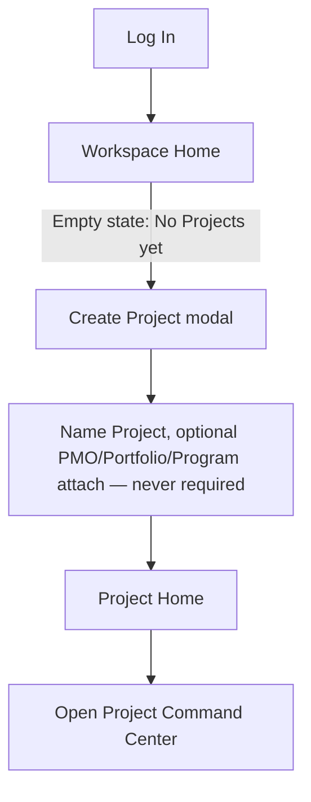
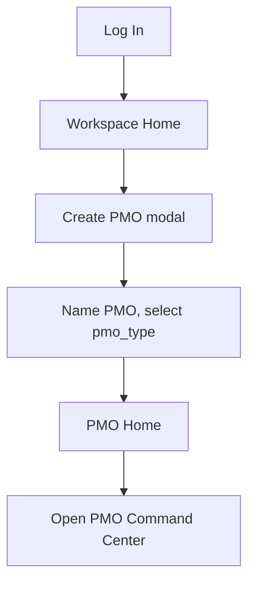
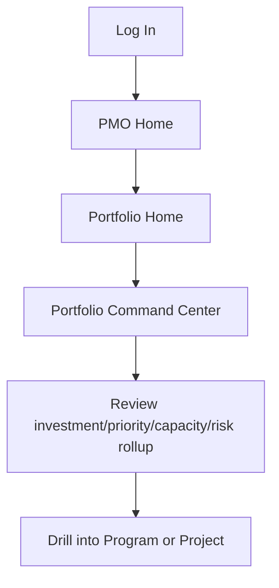
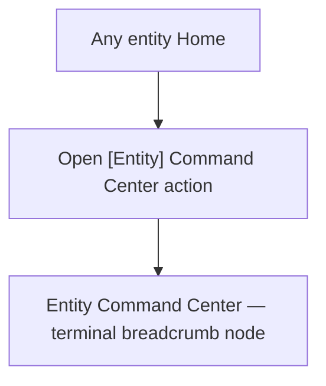
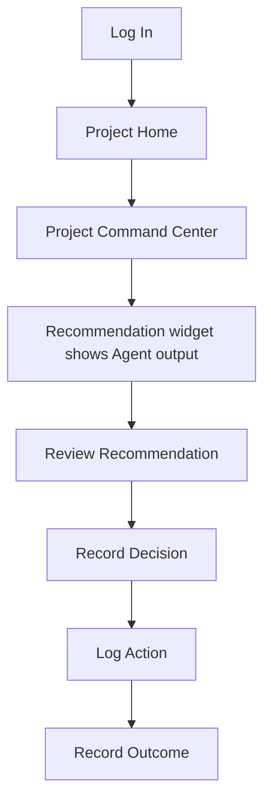

# PMFreak — User Journeys (PR3)

**Type:** Product/UX architecture. Documentation only. No product code, components, or routes were modified to produce this document.

**Authority:** Builds strictly on `03-canonical-information-architecture.md` §7, §9, §10, §23, §24 and the ratified hierarchy/vocabulary in PR1.1/PR2. Every journey below uses only screens defined in `03-canonical-information-architecture.md` §5 and only navigation edges defined in `03-navigation-contracts.md` §1.

---

## 1. Journey Notation

Each journey is a numbered sequence of `Screen → Action → Result`. No step implies an entity, screen, or edge not already ratified elsewhere in this PR.

---

## 2. Profile Journeys (Login → Mastery)

### 2.1 Independent PM

1. Landing → Sign Up → System auto-creates a default Workspace.
2. Workspace Home (Empty state: "No Projects yet. Create Project to get started.") → Create Project → **no PMO/Portfolio/Program/Enterprise creation required at any point** (ADR-PMF-006 Rule 11).
3. Project Home → Open Project Command Center.
4. Project Command Center → Log Task / Risk / Issue as work proceeds.
5. Project Command Center → Review Recommendation (once an Agent has observed enough activity) → Record Decision.
6. Mastery state: repeats steps 2–5 for additional Projects; PMO/Portfolio/Program/Enterprise remain permanently hidden unless deliberately revealed (§7 Progressive Disclosure, main IA document).

### 2.2 PM (team member)

1. Invitation link → Accept → Joins existing Workspace as a member, landing directly on the Project they were invited to (never on Workspace Home first).
2. Project Home → Open Project Command Center.
3. Execution Layer screens (Tasks, Risks, Issues) → contribute to assigned work.
4. Notifications → Recommendation/Decision alerts → Project Intelligence Feed → review.
5. Mastery state: navigates fluidly between assigned Projects via Search/Notifications; PMO/Portfolio context is visible only if their role has PMO access.

### 2.3 PMO Manager

1. Log In → Workspace Home (PMO already exists) → PMO Home (via Primary Navigation).
2. PMO Home → PMO Command Center → Review governance exceptions, Portfolio/Program/Project health rollup.
3. PMO Home → Create Portfolio or Create Program as needed.
4. PMO Command Center → drill into a Portfolio, Program, or Project requiring attention.
5. Mastery state: PMO Command Center becomes the daily landing screen (bookmarked/pinned), Workspace Home used only for cross-PMO orientation.

### 2.4 Executive

1. Log In → Enterprise Home (if Enterprise exists) or PMO Home (if not).
2. Enterprise Command Center or PMO Command Center → Review Health rollup, Reports.
3. Drill into a specific Workspace/PMO/Portfolio/Program/Project only when a Health indicator warrants it.
4. Exit without creating anything — Executive journeys are read-heavy by design; every screen they land on remains reachable without requiring a creation action first.
5. Mastery state: relies primarily on Notifications and Reports rather than manual drill-down.

### 2.5 Portfolio Manager

1. Log In → PMO Home → Portfolio Home (Portfolio already exists).
2. Portfolio Home → Portfolio Command Center → Review investment/priority/capacity/risk rollup.
3. Portfolio Home → Create Program or attach an existing Project.
4. Portfolio Command Center → drill into a Program or Project.
5. Mastery state: Portfolio Command Center is the daily landing screen; Program/Project drill-down is exception-driven.

### 2.6 Program Manager

1. Log In → PMO Home or Portfolio Home → Program Home (Program already exists).
2. Program Home → Program Command Center → Review coordination/benefit-tracking status.
3. Program Home → Create Project or Import Roadmap.
4. Program Command Center → drill into a Project, or open Roadmap.
5. Mastery state: alternates between Program Command Center (coordination view) and individual Project Command Centers (execution view).

### 2.7 Administrator

1. Log In → Workspace Home → Workspace Settings → Administration.
2. Administration → Users → invite/remove members, change roles.
3. Administration → Permissions → assign/revoke access.
4. Administration → Audit → review governance-relevant actions.
5. Mastery state: Administration becomes a periodic, deliberate destination — never the default landing screen (Administrator still lands on Workspace Home by default, consistent with IA Principle 8, Read before Configure).

### 2.8 Consultant

1. Log In → Workspace switcher (multiple client Workspaces) → select client Workspace.
2. Client Workspace Home → navigate within that client's hierarchy exactly as any other profile would.
3. Workspace switcher → move to a different client Workspace.
4. **At no point does any screen show data from more than one client Workspace simultaneously** — this is enforced at the RLS/data layer today and is a hard IA constraint, not a disclosure preference (§13 Visibility Matrix, main IA document).
5. Mastery state: the Workspace switcher becomes the Consultant's primary navigation action, used more frequently than any other profile's equivalent control.

### 2.9 Guest

1. Shared link → Read-only (Guest) state of the single shared screen (a Project, a Document, or a specific item).
2. No breadcrumb ancestors are rendered; no navigation to sibling or ancestor entities is offered.
3. If access expires or is revoked, the Guest is redirected to a plain "access ended" state (per Navigation Contracts §5, Redirects).
4. Mastery state: none — Guest access is single-purpose by design and does not accumulate navigation history or preferences.

---

## 3. The Five Required Journeys (Login → Completion)

### 3.1 Create First Project

1. **Log In** → redirected to Workspace Home.
2. **Workspace Home**, Empty state → "Create Project" primary action.
3. **Create Project modal** → name the Project; optionally attach PMO/Portfolio/Program if any already exist — never required (ADR-PMF-006 Rule 11).
4. Confirm → lands on **Project Home** (IA Principle 7 — creation always lands on the created entity's own Home, never a management screen).
5. **Project Home** → "Open Project Command Center" → **Project Command Center**. Journey complete.

### 3.2 Create PMO

1. **Log In** → Workspace Home.
2. **Workspace Home** → "Create PMO" primary action (never labeled "Create Command Center" — ADR-PMF-014 Rule 2).
3. **Create PMO modal** → name the PMO, select `pmo_type` (`company_pmo | team_portfolio | independent | client_portfolio | improvement_program | personal`).
4. Confirm → lands on **PMO Home**.
5. **PMO Home** → "Open PMO Command Center" → **PMO Command Center**. Journey complete.

### 3.3 Administer Portfolio

1. **Log In** → Workspace Home → **PMO Home** (via Primary Navigation, PMO already exists).
2. **PMO Home** → Portfolio list → select existing Portfolio (or "Create Portfolio" if none exists) → **Portfolio Home**.
3. **Portfolio Home** → "Open Portfolio Command Center" → **Portfolio Command Center**.
4. Review investment/priority/capacity/risk rollup widgets.
5. Drill into a Program or Project requiring attention → respective Home/Command Center. Journey complete.

### 3.4 Open Command Center

1. **Any entity Home** (Enterprise, Workspace, PMO, Portfolio, Program, or Project) — the entity already exists.
2. "Open [Entity] Command Center" action, always entity-qualified (ADR-PMF-014).
3. Lands on that entity's **Command Center**, always the terminal breadcrumb node. Journey complete. This journey is identical in shape across all six entities — only the entity name changes.

### 3.5 Use AI

1. **Log In** → Workspace Home → **Project Home** (an existing Project with Agent activity, e.g. Cost Governance Agent or Quality Governance Agent activated).
2. **Project Home** → **Project Command Center** → Recommendation widget shows Agent-produced output, visually and textually distinct from any Decision/Action/Outcome (§21 AI Interaction Model, main IA document).
3. **Review Recommendation** — the Agent never records a Decision itself; a human must act.
4. **Record Decision** — a human choice, referencing the originating Recommendation, never auto-derived from it.
5. **Log Action** — work performed as a result of the Decision, distinct from the Decision itself.
6. **Record Outcome** — what actually happened, recorded separately, never assumed simultaneous with the Action. Journey complete — the full Recommendation → Decision → Action → Outcome pipeline is now traceable end to end for this item.

---

## 4. Journey Cross-Reference

| Journey | Profiles it applies to |
| --- | --- |
| Create First Project | Independent PM, Small Team, PM |
| Create PMO | PMO Manager, Administrator |
| Administer Portfolio | Portfolio Manager, PMO Manager, Executive |
| Open Command Center | Every profile — identical shape at every hierarchy level |
| Use AI | Every profile with a Project and an activated Agent |

No journey in this document requires a step outside the screens, entities, or navigation edges ratified in `03-canonical-information-architecture.md` and `03-navigation-contracts.md`.
