# PMFreak — Canonical Application Architecture (PR4)

Status: Ratified
Date: 2026-07-19
Authority order: `01-canonical-domain-model.md` → `01.1-domain-ratification.md` → `02-canonical-product-language.md` / `02-product-copy-style-guide.md` → `03-canonical-information-architecture.md` / `03-screen-catalog.md` / `03-navigation-contracts.md` / `03-user-journeys.md` → `docs/adr/` (ADR-PMF-001 through ADR-PMF-032)
Scope: Documentation and architecture decision records only. No product code, routes, database schema, migrations, or dependencies are modified by this PR.

---

## 7.1 Executive Summary

PR0–PR3 established *what PMFreak is*: a canonical domain (Enterprise → Workspace → PMO → Portfolio/Program → Project), a canonical vocabulary (Recommendation ≠ Decision ≠ Action ≠ Outcome, Project Memory ≠ Chat History, Command Center is a projection not an entity), and a canonical information architecture (the screen catalog, navigation contracts, and Command Center experience model). None of that work says *how PMFreak is built* — and without an explicit answer, the next three PRs (Persistence, API Contracts, Frontend) would each have to invent one independently, under time pressure, from whatever the UI or the database happens to suggest. That is exactly how the current codebase arrived at three PMO representations, six Portfolio naming collisions, and a Command Center label glued onto five unrelated objects (PR1 §12, §22) — not through malice, but because no prior PR fixed *where a use case lives* before code needed to exist somewhere.

This PR fixes that. It defines the **Canonical Application Architecture**: the internal organization of bounded contexts, application services, commands, queries, domain events, ports, and workflows that PMFreak's future implementation must conform to. It formalizes:

- **Who owns what.** Every mutable domain concept ratified in PR1.1 (Enterprise, Workspace, PMO, Portfolio, Program, Project, Recommendation, Decision, Action, Outcome, Project Memory, Enterprise Intelligence, Agent Run, and the operational entities beneath Project) is assigned to exactly one bounded context with exclusive mutation authority.
- **How state changes.** Every state-changing operation is a named Command with an actor, an authorization rule, a target aggregate, and a set of resulting Domain Events. Every read is a named Query that touches a read model and never mutates state.
- **How AI participates without becoming authoritative.** Agents run inside a governed pipeline (Context Assembly → Policy → Retrieval → Model → Tools → Validation → Proposal) that can only ever produce a Recommendation or a Proposal — never a Decision, never a direct mutation — closing the loop this PR's own Human-in-the-Loop Matrix (§33) makes explicit.
- **How Project Memory and Enterprise Intelligence stay governed.** Both are modeled as bounded contexts with explicit provenance, lineage, and — for Enterprise Intelligence — a six-part elevation gate (evidence, confidence, review, lineage, applicability, ratification) that can never cross a Workspace boundary silently (ADR-PMF-010, restated here as ADR-PMF-029).
- **What stays undecided on purpose.** This PR does not choose a database, an ORM, an event bus, a workflow engine, a vector store, or a deployment topology (§55). Choosing those before the application boundaries are fixed is how frameworks become the architecture instead of serving it.

**What this PR does not do:** it does not write a line of product code, does not touch a route, a component, a table, or a migration, and does not implement CQRS, event sourcing, queues, agents, Project Memory, Enterprise Intelligence, or any repository. Every artifact produced by this PR is documentation and ADR (§4 restated below).

**What this PR enables:** PR5 (Canonical Persistence Architecture) can now design tables and migrations *against* fixed aggregate boundaries and repository contracts instead of inventing them from the current schema. PR6 (Canonical API Contracts) can derive endpoints directly from the Command and Query catalogs (§13–§14, and the companion `04-command-query-event-catalog.md`) instead of reverse-engineering routes from UI needs. PR7 (Canonical Frontend Architecture) can build against Read Model contracts (§42) instead of querying tables directly.

## 7.2 Purpose

This document is a contract, not a description of the current codebase. It exists to prevent five specific failure modes this audit trail has already observed once each in PMFreak's history (PR1 §9, §12):

- **The UI is not the architecture.** A route, a page, or a wizard step describes an experience, not a bounded context or a transaction boundary. `/command-center` is a route; Project Execution is a bounded context; they are not the same kind of thing, and a route being pleasant to navigate says nothing about who owns the data behind it.
- **Routes are not bounded contexts.** A bounded context is defined by ownership of a coherent set of domain concepts under one ubiquitous language and one consistency boundary — not by which folder under `src/app/(protected)/` happens to render it.
- **Tables are not automatically aggregates.** An aggregate is a consistency boundary with invariants a domain service enforces on every write. A table is a storage detail one specific repository is allowed to touch. PR5 will decide table shapes; this PR decides which aggregate each future table must serve.
- **Agents are not dominion owners.** An Agent (§31) observes, retrieves, and recommends. It never has direct write access to an aggregate, and it never counts as the authority behind a Decision (ADR-PMF-030, restating ADR-PMF-008's ratified separation of Recommendation from Decision).
- **AI models are not sources of truth.** A model's output is an unvalidated Proposal until it passes Output Validation and, where required, Human Review (§32–§33). Project Memory and Enterprise Intelligence are the sources of truth; models retrieve from them, they do not replace them.

Concretely, this document requires that:

- the future database (PR5) implements the aggregate ownership matrix (§12) and repository contracts (§18) defined here, not the other way around;
- every future use case (PR6 endpoint, PR7 screen action) traces to exactly one Command or Query defined here (or its companion catalog);
- every domain invariant ratified in PR1/PR1.1 (§8 there) is preserved by a named domain service or aggregate rule here — none are re-opened, loosened, or reinterpreted.

## 7.3 Architectural Principles

These are binding constraints on every future PR that touches implementation. They are not aspirational.

| # | Principle | What it forbids |
| --- | --- | --- |
| 1 | Domain before Framework | Choosing Next.js conventions, a Supabase table shape, or a queue library before the domain rule is written down |
| 2 | Application before Interface | Designing an API route or a screen before the Command/Query it invokes exists in this document |
| 3 | One Domain Concept, One Owner | Two bounded contexts mutating the same aggregate (the root cause of PR1's three-PMO-representations finding) |
| 4 | Commands Change State | A "query" that has side effects, or a GET-shaped read that also writes an audit row silently |
| 5 | Queries Do Not Change State | Any query handler that creates, updates, or deletes a row, publishes an event, or triggers a workflow |
| 6 | Human Authority over Autonomous Execution | An Agent or workflow executing an authoritative mutation without a Decision or approved Policy behind it |
| 7 | Evidence before Inference | A Recommendation, Pattern, or Memory record presented without its supporting Evidence reference |
| 8 | Recommendation is not Decision | Auto-converting a Recommendation into a Decision without an explicit human or governed-process act |
| 9 | Decision is not Action | Treating a recorded Decision as already executed |
| 10 | Action is not Outcome | Treating Action completion as proof of the intended effect — Outcome requires separate observation |
| 11 | Provenance is Mandatory | Any Recommendation, Memory record, or Enterprise Intelligence record without source/actor/timestamp/confidence |
| 12 | Workspace Isolation by Default | Any query, agent context, or projection that reads across Workspaces without an explicit governed contract |
| 13 | No Cross-Client Intelligence | Enterprise Intelligence or any projection blending data from two different Workspaces without ratified, consented elevation |
| 14 | Explicit Knowledge Elevation | Any pipeline that promotes an Observation directly to Enterprise Intelligence, skipping the six-part gate (§30) |
| 15 | Idempotency for Retryable Operations | A retried command, webhook, or agent run producing duplicate side effects |
| 16 | Events Describe Facts, Not Intentions | An event named `ShouldArchiveProject` or `WantsToApprove` instead of a past-tense fact |
| 17 | Policies Govern Cross-Context Behavior | Cross-context business rules implemented ad hoc inside a handler instead of as a named, testable policy |
| 18 | Read Models May Be Eventually Consistent | Blocking a command's completion on a projection rebuild finishing |
| 19 | Domain Invariants Require Stronger Guarantees | Treating an aggregate invariant (e.g., "PMO and Project must share a Workspace") as best-effort |
| 20 | AI Must Operate Through Explicit Ports | An agent calling a model SDK or a vector store directly from application code instead of through a declared outbound port |
| 21 | External Integrations Are Adapters | Domain or application code importing a third-party SDK type directly |
| 22 | Frameworks Are Replaceable | A domain rule that only makes sense in terms of a specific framework's primitives (e.g., a Next.js `Request` object) |
| 23 | Progressive Disclosure Does Not Alter Domain Ownership | Hiding Enterprise/Portfolio/Program in the UI being read as "these aggregates don't need an owner yet" |
| 24 | Auditability Is a First-Class Requirement | Any authoritative mutation, approval, or agent run that does not produce an audit record |
| 25 | Fail Closed for Authorization and Governance | Defaulting to "allow" when a policy evaluation errors, times out, or returns ambiguous |
| 26 | No Hidden Side Effects | A command handler that also sends an email, fires a webhook, or mutates an unrelated aggregate without that being part of its documented contract |
| 27 | No Direct Cross-Module Persistence Access | Any handler in one bounded context importing another context's repository |
| 28 | Orchestration Must Be Observable | A workflow or saga with no correlation ID, no visible state, no way to answer "where is this stuck" |
| 29 | Long-Running Workflows Require Explicit State | A multi-step process modeled as a chain of fire-and-forget calls with no persisted state machine |
| 30 | Implementation Must Evolve Incrementally | Treating this document as license to start a rewrite; it is a target contract for incremental, PR-by-PR convergence (§52) |

---

## 8. Architectural Style

PMFreak's target initial form is a **modular monolith**: one deployable application, internally organized into explicit domain modules with hexagonal (ports and adapters) boundaries, command/query separation at the application layer, and event-driven integration used *selectively* — only where a use case genuinely crosses a consistency boundary, not as a default communication style.

```
Target Initial Form
Modular Monolith
  + Explicit Domain Modules (bounded contexts, §10)
  + Application Layer (use cases, commands, queries, §9.2)
  + Ports and Adapters (§19)
  + Shared Infrastructure with Strict Boundaries (§48, §50)
  + Internal Domain Events (§20)
  + Selective Asynchronous Processing (§22)
```

**Microservices are explicitly not a requirement of this PR.** Splitting a bounded context into an independently deployable service is a decision to be made later, per module, only against demonstrated evidence of:

- sustained load that a shared deployment cannot absorb;
- a security or compliance boundary that requires physical, not just logical, isolation (a plausible future candidate: Agent Orchestration, if a customer's compliance posture requires agent execution to run in an isolated blast radius);
- a genuine need for independent deploy cadence (a plausible future candidate: Integration Management, whose release cycle is driven by external providers, not by PMFreak's own roadmap);
- scalability or availability requirements that differ materially from the rest of the system (a plausible future candidate: Search and Discovery, if indexing volume outgrows the monolith's write path); or
- a regulatory data-isolation requirement tied to a specific bounded context.

No module is pre-assigned to extraction. §10's "Future extraction candidate" column records only where the *conditions above* are plausible today — it is not a roadmap.

### 62.1 Canonical Layer Architecture

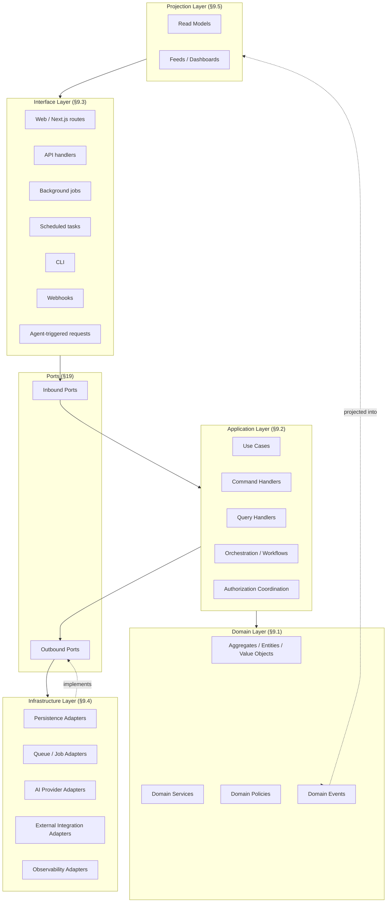

---

## 9. Canonical Layers

### 9.1 Domain Layer

**Contains:** aggregates, entities, value objects, domain services, domain policies, invariants, domain events.

**Does not contain:** HTTP concerns, React, the Supabase SDK, framework routing, UI copy, queue clients, model-provider SDKs. The domain layer has zero knowledge that Next.js, Supabase, or any specific AI provider exist. This is what makes "Frameworks Are Replaceable" (§7.3 #22) enforceable rather than aspirational.

### 9.2 Application Layer

**Contains:** use cases, commands, queries, handlers, orchestration, transaction demarcation, authorization coordination (delegating the actual decision to domain policies), ports, application-level policies, workflow state transitions.

The application layer is where a bounded context's public contract lives — it is the only layer another context, an interface adapter, or a workflow is allowed to call into.

### 9.3 Interface Layer

**Contains** inbound adapters: web (Next.js route handlers/server actions), API, background jobs, scheduled tasks, CLI, webhook receivers, agent-triggered requests. Every inbound adapter's only job is to authenticate the caller, translate its request into a Command or Query, and translate the result back into whatever shape the caller needs. It contains no business logic.

### 9.4 Infrastructure Layer

**Contains** outbound adapters: persistence, queues, object storage, search, vector storage, AI providers, email, calendar, external integrations, observability. Every infrastructure adapter implements exactly one outbound port (§19) declared by the application layer — it never introduces its own contract that the application layer must adapt to.

### 9.5 Projection Layer

**Contains:** Command Center read models, feeds, dashboards, reports, health summaries, cross-entity projections (§42).

A projection is derived, rebuildable, and disposable. **A projection must never become a source of truth by convenience** — the moment a projection is the only place a fact is durably recorded, it has silently become an aggregate without going through aggregate governance (invariants, ownership, transaction boundary), which is exactly how the current `pmo_command_center_snapshots` / `operational_command_centers` split happened (PR1 §12 C-3) without either one being clearly the record of truth.

---

## 10. Bounded Context Map

Twenty-five bounded contexts are recognized. None is required to be an independently deployable service (§8). Full per-context detail (ubiquitous language, prohibited responsibilities, examples/anti-examples) lives in the companion document `04-bounded-context-catalog.md`; this table is the architectural summary.

| Canonical name | Purpose | Owns | Consistency | Future extraction candidate |
| --- | --- | --- | --- | --- |
| Identity and Access | Authentication, membership, roles, sessions | User identity, `workspace_memberships`, role assignments | Strong | No |
| Enterprise Administration | Enterprise-level configuration and governance | Enterprise (ADR-PMF-001) | Strong | No |
| Workspace Management | Tenant root configuration, membership, policy | Workspace (ADR-PMF-002) | Strong | No |
| PMO Governance | Organizational governance entity administration | PMO (ADR-PMF-003) | Strong | No |
| Portfolio Management | Strategic grouping, prioritization, capacity | Portfolio (ADR-PMF-004) | Strong (membership) / Eventual (health) | No |
| Program Management | Coordination of related Projects for joint benefits | Program, and the Program-internal roadmap tree (Epic/Sprint/Card) | Strong (membership) / Eventual (health) | No |
| Project Management | Central execution aggregate | Project | Strong | No |
| Work Execution | Task tracking within a Project | Task | Strong (writes) / Eventual (projections) | No |
| Schedule and Milestones | Dated checkpoints, timeline | Milestone | Strong | No |
| RAID Management | Risks, Issues, Dependencies | Risk, Issue, Dependency | Strong | No |
| Stakeholder and Communication Management | Stakeholder records, communication log | Stakeholder record | Strong (writes) / Eventual (digest) | No |
| Document and Evidence Management | Evidence ingestion and linkage | Evidence | Strong (linkage) / Eventual (normalization) | No |
| Recommendation Management | Agent- or governance-produced suggestions | Recommendation | Strong | No |
| Decision Management | Authoritative recorded choices | Decision | Strong | No |
| Action and Outcome Management | Execution of Decisions and their observed results | Action, Outcome | Strong | No |
| Project Memory | Governed, curated Project knowledge | Project Memory Record | Strong (governance) / Eventual (retrieval projection) | No |
| Enterprise Intelligence | Governed cross-Workspace-provenanced knowledge, Enterprise-scoped | Enterprise Knowledge Record, Pattern (Candidate/Ratified) | Strong (ratification) / Eventual (projections) | No — isolation guarantee is the point |
| Agent Orchestration | Governed AI/agent execution pipeline | Agent Run, Agent Proposal | Strong (approval gate) / Eventual (run telemetry) | Plausible — compliance-driven blast-radius isolation |
| Integration Management | External-system adapters and sync | Integration connection/config, sync state | Eventual | Plausible — independent release cadence of providers |
| Notification Management | Delivery of notification intents to channels | Notification intent, delivery record | Eventual | No |
| Reporting and Analytics | Cross-entity reports, exports | Report definitions/runs | Eventual | No |
| Audit and Compliance | Immutable audit trail | Audit Record | Strong (write) / durable | Plausible — regulatory isolation |
| Billing and Entitlements | Plan, entitlement, usage | Billing account, entitlement | Strong | No |
| Search and Discovery | Full-text and semantic retrieval | Search/vector indexes (derived only) | Eventual | Plausible — indexing volume/scale |
| Configuration and Methodology | Precedence-governed configuration, methodology selection | Configuration values, methodology selection | Strong | No |

### 62.2 Bounded Context Map

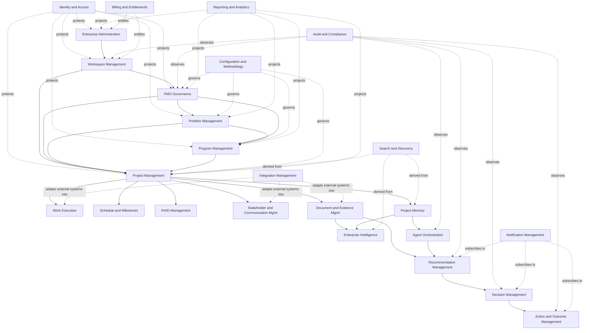

---

## 11. Context Relationship Map

| Upstream | Downstream | Relationship | ACL needed? |
| --- | --- | --- | --- |
| Identity and Access | All protected contexts | Open Host Service (published `ActorReference`/session contract) | No |
| Enterprise Administration | Workspace Management | Customer/Supplier | No |
| Workspace Management | PMO Governance | Customer/Supplier | No |
| Workspace Management | Project Management | Customer/Supplier | No |
| PMO Governance | Portfolio Management | Customer/Supplier | No |
| PMO Governance | Program Management | Customer/Supplier | No |
| PMO Governance | Project Management | Customer/Supplier | No |
| Project Management | Work Execution | Customer/Supplier | No |
| Project Management | RAID Management | Customer/Supplier | No |
| Project Management | Schedule and Milestones | Customer/Supplier | No |
| Project Management | Stakeholder and Communication Management | Customer/Supplier | No |
| Project Management | Document and Evidence Management | Customer/Supplier | No |
| Project Management | Project Memory | Customer/Supplier | No |
| Recommendation Management | Decision Management | Published Language (a Recommendation is read-only input; Decision Management never mutates it) | No |
| Decision Management | Action and Outcome Management | Published Language | No |
| Project Memory | Agent Orchestration | Open Host Service (governed retrieval contract) | Yes — Agent Orchestration must never see raw Project Memory internals, only the retrieval projection |
| Document and Evidence Management (as "Project Evidence") | Enterprise Intelligence (via Knowledge Elevation, §30) | Anti-Corruption Layer | Yes — Evidence must be translated into a Pattern Candidate through the elevation gate, never read directly |
| Integration Management | Document and Evidence Management, Stakeholder and Communication Management, Work Execution | Anti-Corruption Layer | Yes — every external system shape is normalized before it reaches a domain command |
| Agent Orchestration | Recommendation Management | Open Host Service (Agent Proposal → Recommendation contract) | No — same governed boundary; Agent Orchestration cannot skip Recommendation Management and write a Decision |
| All contexts | Audit and Compliance | Event Subscriber | No |
| All contexts | Search and Discovery | Event Subscriber (derived index only) | No |
| Recommendation/Decision/Action-Outcome | Notification Management | Event Subscriber | No |
| Configuration and Methodology | Project Management, Program Management, Portfolio Management, PMO Governance | Conformist (consumers apply configuration as given; they do not reinterpret precedence, §46) | No |

Anti-corruption layers are required wherever an external system's shape (an integration payload, a raw evidence upload, an AI model's raw output) would otherwise leak into a domain command's input directly.

---

## 12. Aggregate Ownership

| Aggregate / record | Owning context | Mutation authority | Read consumers |
| --- | --- | --- | --- |
| Enterprise | Enterprise Administration | Enterprise application services | Billing and Entitlements, Enterprise Intelligence, Reporting and Analytics |
| Workspace | Workspace Management | Workspace application services | All Workspace-scoped contexts |
| PMO | PMO Governance | PMO application services | Portfolio Management, Program Management, Project Management, Reporting and Analytics |
| Portfolio | Portfolio Management | Portfolio application services | Reporting and Analytics, Enterprise Intelligence (via elevation only) |
| Program | Program Management | Program application services | Project Management (read), Reporting and Analytics |
| Project | Project Management | Project application services | Work Execution, Schedule and Milestones, RAID Management, Project Memory, Agent Orchestration |
| Task | Work Execution | Work Execution application services | Project Management projections, Reporting and Analytics |
| Milestone | Schedule and Milestones | Schedule application services | Project Management projections, Reporting and Analytics |
| Risk | RAID Management | RAID application services | Project/Program/Portfolio health projections |
| Issue | RAID Management | RAID application services | Project/Program/Portfolio health projections |
| Dependency | RAID Management | RAID application services | Project/Program/Portfolio health projections |
| Stakeholder record | Stakeholder and Communication Management | Stakeholder application services | Project Management projections |
| Evidence | Document and Evidence Management | Evidence application services | Project Memory, Recommendation Management, Decision Management, Audit and Compliance |
| Recommendation | Recommendation Management | Recommendation application services | Decision Management, Project Intelligence Feed (projection) |
| Decision | Decision Management | Decision application services (authorized actors only) | Action and Outcome Management, Audit and Compliance |
| Action | Action and Outcome Management | Action application services | Project Management projections |
| Outcome | Action and Outcome Management | Outcome application services | Enterprise Intelligence (via elevation), Reporting and Analytics |
| Project Memory Record | Project Memory | Project Memory application services | Agent Orchestration, Project Management projections |
| Enterprise Knowledge Record | Enterprise Intelligence | Ratification application services | Enterprise Administration projections |
| Pattern (Candidate / Ratified) | Enterprise Intelligence | Ratification application services | Enterprise Administration, Recommendation Management (ratified only) |
| Agent Run | Agent Orchestration | Agent Orchestration application services | Audit and Compliance, Recommendation Management |
| Agent Proposal | Agent Orchestration | Agent Orchestration application services | Recommendation Management, Decision Management (read-only, pre-decision) |
| Audit Record | Audit and Compliance | Audit application services (append-only) | All contexts (read, scoped) |

### 62.3 Aggregate Ownership

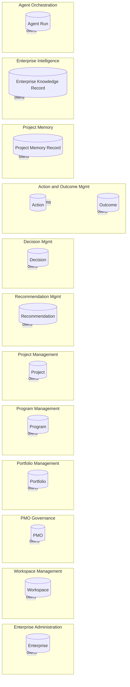

**Binding rules:**

1. No module modifies an aggregate it does not own — direct persistence access to another context's tables is forbidden regardless of how the current codebase does it today (§48, §64).
2. Cross-context mutation happens through a Command, a Policy, or a consumed Domain/Integration Event — never through a shared repository.
3. Read models may combine data from multiple aggregates without assuming ownership of any of it (§9.5, §42).
4. Agents never hold direct write access to any aggregate listed above (ADR-PMF-027, ADR-PMF-030). An Agent's only output is an Agent Proposal, which Recommendation Management may turn into a Recommendation — nothing upstream of a human/governed Decision writes to Decision, Action, Outcome, Enterprise Knowledge Record, or any operational aggregate.

---

## 13. Command Model

Full per-command detail (prerequisites, validation, failure modes) lives in `04-command-query-event-catalog.md`. This table is the architectural index — every command's target aggregate, actor, authorization class, idempotency requirement, and whether it requires human approval before taking effect.

| Command | Actor | Target aggregate | Idempotency | Human approval required |
| --- | --- | --- | --- | --- |
| CreateEnterprise | Founder / Enterprise Admin | Enterprise | Key: requester + name | No (governed by role) |
| UpdateEnterpriseProfile | Enterprise Admin | Enterprise | Key: entity id + version | No |
| CreateWorkspace | Enterprise Admin / self-service user | Workspace | Key: requester + name | No |
| ArchiveWorkspace | Workspace Owner / Enterprise Admin | Workspace | Key: workspace id | Yes — destructive |
| AssignWorkspaceMember | Workspace Owner/Admin | Workspace | Key: workspace id + user id | No |
| ChangeWorkspacePolicy | Workspace Owner/Admin | Workspace | Key: workspace id + policy version | No |
| CreatePMO | Workspace Owner/Admin | PMO | Key: workspace id + name | No |
| UpdatePMOGovernancePolicy | PMO Admin | PMO | Key: PMO id + version | No |
| CreatePortfolio | PMO Admin | Portfolio | Key: PMO id + name | No |
| AssignProjectToPortfolio | PMO Admin / Portfolio Owner | Portfolio, Project (link only) | Key: project id + portfolio id | No |
| RemoveProjectFromPortfolio | PMO Admin / Portfolio Owner | Portfolio, Project (link only) | Key: project id + portfolio id | No |
| CreateProgram | PMO Admin | Program | Key: PMO id + name | No |
| AssignProjectToProgram | PMO Admin / Program Owner | Program, Project (link only) | Key: project id + program id | No |
| RemoveProjectFromProgram | PMO Admin / Program Owner | Program, Project (link only) | Key: project id + program id | No |
| CreateProject | Any authorized Workspace/PMO member | Project | Key: requester + workspace id + name | No |
| UpdateProjectContext | Project member (authorized) | Project | Key: project id + version | No |
| ArchiveProject | Project Owner / PMO Admin | Project | Key: project id | Yes — destructive |
| ConfigureProjectMethodology | Project Owner | Project | Key: project id + methodology | No |
| AddProjectStakeholder | Project member (authorized) | Stakeholder record | Key: project id + stakeholder ref | No |
| CreateTask | Project member | Task | Key: requester + project id + idempotency token | No |
| AssignTask | Project member | Task | Key: task id + assignee | No |
| UpdateTaskStatus | Assignee / Project member | Task | Key: task id + status + version | No |
| CompleteTask | Assignee / Project member | Task | Key: task id | No |
| CreateMilestone | Project member | Milestone | Key: project id + name + date | No |
| CompleteMilestone | Project member | Milestone | Key: milestone id | No |
| RecordRisk | Project member / Agent Proposal (post-review) | Risk | Key: project id + fingerprint | No — record only; mitigation actions may require approval |
| UpdateRiskAssessment | Project member | Risk | Key: risk id + version | No |
| CloseRisk | Project member | Risk | Key: risk id | No |
| RecordIssue | Project member / Agent Proposal (post-review) | Issue | Key: project id + fingerprint | No |
| ResolveIssue | Project member | Issue | Key: issue id | No |
| SubmitEvidence | Project member / Integration adapter | Evidence | Key: source id + checksum | No |
| NormalizeSource | System (workflow step) | Evidence (derived) | Key: source id | No |
| ProposeMemoryRecord | System (workflow step) / Agent | Project Memory Record (candidate) | Key: source event id | No |
| ApproveMemoryRecord | Project member (authorized) | Project Memory Record | Key: candidate id | Yes — governance gate |
| RejectMemoryRecord | Project member (authorized) | Project Memory Record (candidate) | Key: candidate id | Yes — governance gate |
| GenerateRecommendation | Agent (via Agent Orchestration) | Recommendation | Key: agent run id | No — generation itself is not a mutation of authoritative state |
| ReviewRecommendation | Project member (authorized) | Recommendation | Key: recommendation id | Yes — review is the human step |
| ApproveRecommendation | Project member (authorized) | Recommendation | Key: recommendation id | Yes |
| RejectRecommendation | Project member (authorized) | Recommendation | Key: recommendation id | Yes |
| RecordDecision | Human decision authority (role-gated) | Decision | Key: decision id (client-generated) | Yes — Decision is always human/governed-process authored |
| RevokeDecision | Original authority / escalated authority | Decision | Key: decision id + revocation reason | Yes |
| CreateActionFromDecision | Project member (authorized) | Action | Key: decision id + action fingerprint | Per Human-in-the-Loop Matrix (§33) |
| RecordOutcome | Project member / governed monitoring process | Outcome | Key: action id + observation fingerprint | No — observation, not authorization |
| ProposeEnterprisePattern | System (workflow step) / Enterprise Intelligence service | Pattern (Candidate) | Key: aggregation batch id | No |
| RatifyEnterpriseKnowledge | Enterprise Admin (governance role) | Enterprise Knowledge Record | Key: pattern candidate id | Yes — ratification is the gate |
| RevokeEnterpriseKnowledge | Enterprise Admin (governance role) | Enterprise Knowledge Record | Key: knowledge record id + revocation reason | Yes |
| RequestAgentRun | Any authorized actor / scheduled trigger | Agent Run | Key: requester + context fingerprint | No |
| CancelAgentRun | Requesting actor / Admin | Agent Run | Key: run id | No |
| ApproveAgentProposal | Project member (authorized) | Agent Proposal → Recommendation | Key: proposal id | Yes |
| RejectAgentProposal | Project member (authorized) | Agent Proposal | Key: proposal id | Yes |

All commands are documented, none are implemented by this PR.

---

## 14. Query Model

Full per-query detail (filters, pagination, freshness, sensitive fields) lives in `04-command-query-event-catalog.md`. Queries never mutate state and never trigger automations as a side effect (§7.3 #5, #26).

| Query | Consumer | Source read model | Consistency |
| --- | --- | --- | --- |
| GetEnterpriseOverview | Enterprise Command Center | Enterprise read model | Eventual |
| GetWorkspaceOverview | Workspace Command Center | Workspace read model | Eventual |
| GetPMOOverview | PMO Command Center | PMO read model | Eventual |
| GetPortfolioOverview | Portfolio Command Center | Portfolio read model | Eventual |
| GetProgramOverview | Program Command Center | Program read model | Eventual |
| GetProjectOverview | Project Command Center | Project read model | Eventual |
| GetProjectCommandCenter | Project Command Center | Composite Project read model | Eventual |
| GetProjectIntelligenceFeed | Project Command Center | Project Intelligence Feed projection | Eventual |
| GetProjectMemory | Project Memory screen, Agent context assembly | Project Memory read model | Strong for approved records; eventual for retrieval projection |
| GetProjectHealth | Project Command Center, Health Center | Project Health projection | Eventual |
| GetPortfolioHealth | Portfolio Command Center, Health Center | Portfolio Health projection | Eventual |
| GetProgramHealth | Program Command Center, Health Center | Program Health projection | Eventual |
| GetPMOHealth | PMO Command Center, Health Center | PMO Health projection | Eventual |
| GetEnterpriseHealth | Enterprise Command Center, Health Center | Enterprise Health projection | Eventual |
| SearchWorkspace | Workspace-scoped Search | Search index (derived) | Eventual |
| SearchProject | Project-scoped Search | Search index (derived) | Eventual |
| ListRecommendations | Recommendation Queue | Recommendation read model | Eventual |
| GetRecommendationDetails | Recommendation Queue detail view | Recommendation read model | Strong (single-record read of authoritative aggregate) |
| ListDecisions | Decision Register | Decision read model | Eventual |
| GetDecisionDetails | Decision Register detail view | Decision read model | Strong |
| ListActions | Action Register | Action read model | Eventual |
| ListOutcomes | Outcome Register | Outcome read model | Eventual |
| GetAgentRun | Agent Center | Agent Run read model | Strong |
| ListAgentRuns | Agent Center | Agent Run read model | Eventual |
| GetEnterpriseIntelligence | Knowledge Center | Enterprise Knowledge read model | Strong for ratified records |
| GetKnowledgeLineage | Knowledge Center detail view | Knowledge lineage projection | Strong |
| GetAuditTrail | Audit Timeline | Audit read model | Strong (durable) |

---

## 15. Command Handlers and Query Handlers

**Command Handler — must:** authenticate the actor; resolve scope (Workspace/PMO/Project); authorize (via a domain or application policy, never an inline `if`); load the target aggregate through its owning repository; validate invariants; execute the operation; persist changes within the aggregate's transaction boundary; write the resulting domain event(s) to the outbox; produce an audit record; return the minimal result the caller needs (an id, a version, a status — never the full aggregate unless the caller is the same context).

**Command Handler — must not:** render UI; construct dashboards or projections; call an Agent or trigger a workflow arbitrarily outside its documented contract; mutate an aggregate it does not own; swallow or hide a failure (§7.3 #26, #24).

**Query Handler — must:** validate access (including field-level access where a projection contains sensitive data); read from a projection, never from another context's write-side repository; apply requested filters/pagination; return a view model shaped for the consumer.

**Query Handler — must not:** produce any side effect, including "helpful" ones like marking a notification read or refreshing a cache synchronously in a way that mutates shared state visible to other actors.

### 62.4 Command Flow

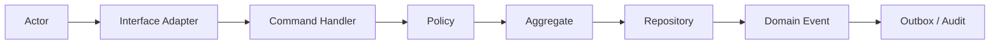

### 62.5 Query Flow

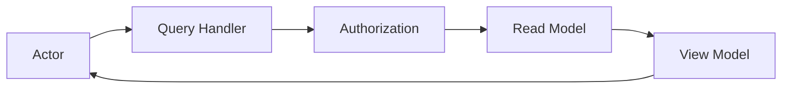

---

## 16. Domain Services

A domain service exists whenever a rule doesn't naturally belong to one entity — typically because it spans two aggregates within the same context, or encodes a policy that multiple use cases must apply identically.

| Domain service | Input | Output | Owner | Deterministic? |
| --- | --- | --- | --- | --- |
| ProjectAssignmentPolicy | Project, target Portfolio/Program/PMO | Allow/deny + reason | Project Management | Yes |
| PortfolioEligibilityPolicy | Project or Program, target Portfolio | Allow/deny + reason (enforces "at most one primary Portfolio," PR1.1 invariant 13) | Portfolio Management | Yes |
| ProgramMembershipPolicy | Project, target Program | Allow/deny + reason (enforces "at most one primary Program," PR1.1 invariant 17) | Program Management | Yes |
| WorkspaceIsolationPolicy | Actor, target Workspace-scoped resource | Allow/deny | Workspace Management (consumed by all contexts) | Yes |
| KnowledgeElevationPolicy | Pattern Candidate, supporting evidence/confidence/lineage | Eligible/not-eligible for next elevation stage | Enterprise Intelligence | Yes (rules), inputs may derive from non-deterministic agent output |
| RecommendationApprovalPolicy | Recommendation, reviewer role, action class | Approval requirement (auto-visible / review-required / approval-required) | Recommendation Management | Yes |
| DecisionAuthorityPolicy | Actor, decision scope/class | Allow/deny + required authority level | Decision Management | Yes |
| ActionCreationPolicy | Decision, proposed Action | Allow/deny, human-approval requirement per §33 | Action and Outcome Management | Yes |
| MethodologyCompatibilityPolicy | Project methodology, requested capability (Sprint/Epic) | Allow/deny (enforces ADR-PMF-011: Sprint/Epic never mandatory) | Configuration and Methodology | Yes |
| ProjectHealthPolicy | Project signals (schedule, cost, risk, quality) | Health status | Project Management (consumed by Reporting) | Yes, given inputs |
| EvidenceTrustPolicy | Evidence source, ingestion path | Trust classification | Document and Evidence Management | Yes |
| AgentExecutionPolicy | Agent definition, requested tool/scope | Allow/deny + required approval | Agent Orchestration | Yes |
| DataRetentionPolicy | Record type, scope, age | Retain/archive/purge decision | Configuration and Methodology (enforced per-context) | Yes |
| EnterpriseRatificationPolicy | Pattern Candidate, ratifier role, applicability scope | Ratify/reject | Enterprise Intelligence | Yes |

Every domain service above must expose which of its input/output fields are auditable — in every case listed, that is at minimum: actor, decision, reason, and timestamp.

---

## 17. Application Services

Application services coordinate use cases; they are not god services. Each corresponds to exactly one bounded context and exposes only that context's Commands and Queries.

`EnterpriseApplicationService` · `WorkspaceApplicationService` · `PMOApplicationService` · `PortfolioApplicationService` · `ProgramApplicationService` · `ProjectApplicationService` · `ExecutionApplicationService` · `RAIDApplicationService` · `EvidenceApplicationService` · `RecommendationApplicationService` · `DecisionApplicationService` · `ActionOutcomeApplicationService` · `ProjectMemoryApplicationService` · `EnterpriseIntelligenceApplicationService` · `AgentOrchestrationApplicationService` · `NotificationApplicationService` · `SearchApplicationService` · `ReportingApplicationService` · `AuditApplicationService`

**Rules:**

- Each application service's public surface is exactly its context's Command and Query catalog (§13–§14) — nothing more.
- None expose infrastructure types (no repository, SDK client, or ORM object crosses this boundary).
- None concentrate domain logic that belongs in a domain service or the aggregate itself — an application service orchestrates, it does not reimplement invariants inline.
- None call another context's repository directly; cross-context needs go through that context's application service, a policy, or a consumed event.

---

## 18. Repository Contracts

Conceptual interfaces only — no concrete types are defined by this PR. A repository represents access to one aggregate or one coherent transactional boundary; it must never become a generic table-access abstraction.

| Repository | Aggregate owned | Optimistic locking | Soft-delete policy | Forbidden cross-context access |
| --- | --- | --- | --- | --- |
| EnterpriseRepository | Enterprise | Yes (version) | Archive, not delete | No other context may load Enterprise directly |
| WorkspaceRepository | Workspace | Yes | Archive, not delete | No other context may load Workspace directly |
| PMORepository | PMO | Yes | Archive, not delete | No other context may load PMO directly |
| PortfolioRepository | Portfolio | Yes | Archive, not delete | No other context may load Portfolio directly |
| ProgramRepository | Program (incl. Epic/Sprint/Card tree) | Yes | Archive, not delete | No other context may load Program directly |
| ProjectRepository | Project | Yes | Archive, not delete | No other context may load Project directly |
| TaskRepository | Task | Yes | Soft-delete (cancel state) | Work Execution only |
| MilestoneRepository | Milestone | Yes | Soft-delete | Schedule and Milestones only |
| RiskRepository | Risk | Yes | Soft-delete (close state) | RAID Management only |
| IssueRepository | Issue | Yes | Soft-delete (resolve state) | RAID Management only |
| EvidenceRepository | Evidence | Yes | Retention-policy governed, never hard delete once linked to a Decision | Document and Evidence Management only |
| RecommendationRepository | Recommendation | Yes | Never deleted — superseded/expired states only | Recommendation Management only |
| DecisionRepository | Decision | Yes (append-only correction via revocation, never destructive edit — PR1.1 invariant, §27 below) | Never deleted | Decision Management only |
| ActionRepository | Action | Yes | Soft-delete (cancel state) | Action and Outcome Management only |
| OutcomeRepository | Outcome | Yes | Never deleted — superseded state only | Action and Outcome Management only |
| ProjectMemoryRepository | Project Memory Record | Yes | Never deleted — superseded/revoked states only | Project Memory only |
| EnterpriseKnowledgeRepository | Enterprise Knowledge Record, Pattern | Yes | Never deleted — revoked/expired states only | Enterprise Intelligence only |
| AgentRunRepository | Agent Run | Append-only | Never deleted, retention-policy archived | Agent Orchestration only |
| AuditRecordRepository | Audit Record | Append-only, no locking (immutable) | Never deleted, retention-policy archived | Audit and Compliance only (all others may only append via the audit port, §19) |

Every repository above requires a Workspace scope on every operation except EnterpriseRepository and AuditRecordRepository (which is scoped but may aggregate across Workspaces for a single Enterprise's authorized administrators only, per §35).

---

## 19. Ports and Adapters

**Inbound ports:** web use-case ports, API command ports, API query ports, background job ports, scheduled workflow ports, integration webhook ports, agent proposal ports.

**Outbound ports:** persistence, transaction manager, event publisher, outbox, job scheduler, queue, object storage, search index, vector retrieval, AI model provider, embedding provider, email, calendar, notification, identity provider, billing provider, audit sink, observability, secrets, feature configuration.

| Port | Owner | Failure semantics | Idempotency | Security classification |
| --- | --- | --- | --- | --- |
| Persistence | Infrastructure (per-context repository impl) | Fail closed; caller sees ConflictError/DependencyUnavailable | Required for retried writes | Internal |
| Transaction Manager | Infrastructure | Fail closed; partial writes never commit | N/A | Internal |
| Event Publisher / Outbox | Infrastructure | At-least-once delivery; consumers must be idempotent | Required (event id) | Internal |
| Job Scheduler / Queue | Infrastructure | At-least-once; dead-letter after max retries | Required (job key) | Internal |
| Object Storage | Infrastructure | Retryable transient errors; content-addressed writes idempotent | Required | Confidential (may hold Evidence) |
| Search Index | Infrastructure | Eventually consistent; rebuildable | Required | Internal (respects sensitivity) |
| Vector Retrieval | Infrastructure | Eventually consistent; rebuildable; must return provenance references | Required | Confidential |
| AI Model Provider | Infrastructure (via Agent Orchestration) | Timeout + retry with backoff; failure never corrupts domain state | Required (request id) | Confidential — governed by AgentExecutionPolicy |
| Embedding Provider | Infrastructure | Same as AI Model Provider | Required | Confidential |
| Email / Calendar / Notification | Infrastructure | Retryable; delivery record tracks final status | Required | Internal/PII |
| Identity Provider | Infrastructure | Fail closed on auth errors | N/A | Highly confidential |
| Billing Provider | Infrastructure | Fail closed on entitlement checks; webhook-driven reconciliation | Required (webhook id) | Confidential |
| Audit Sink | Infrastructure | Must never silently drop; local durable buffer on outage | Required (audit event id) | Highly confidential |
| Observability | Infrastructure | Best-effort; must never block a command on its own failure | N/A | Internal |
| Secrets | Infrastructure | Fail closed | N/A | Highly confidential |
| Feature Configuration | Infrastructure | Fail to safe default | N/A | Internal |

---

## 20. Domain Events

A domain event represents a fact that already happened; it is named in the past tense; it belongs to the context that emits it; it carries identifiers, scope, and a version; it contains no unnecessary secrets; it preserves correlation and causation identifiers; it is immutable once published; it may produce derived integration events.

Not every event listed below implies asynchronous delivery — see §21 for the domain/integration distinction and §22 for the sync/async classification.

`EnterpriseCreated` · `WorkspaceCreated` · `WorkspacePolicyChanged` · `PMOCreated` · `PortfolioCreated` · `ProjectAssignedToPortfolio` · `ProgramCreated` · `ProjectAssignedToProgram` · `ProjectCreated` · `ProjectArchived` · `ProjectMethodologyConfigured` · `TaskCreated` · `TaskCompleted` · `MilestoneCompleted` · `RiskRecorded` · `RiskClosed` · `IssueRecorded` · `IssueResolved` · `EvidenceSubmitted` · `EvidenceNormalized` · `MemoryRecordProposed` · `MemoryRecordApproved` · `RecommendationGenerated` · `RecommendationApproved` · `RecommendationRejected` · `DecisionRecorded` · `DecisionRevoked` · `ActionCreated` · `ActionCompleted` · `OutcomeRecorded` · `EnterprisePatternProposed` · `EnterpriseKnowledgeRatified` · `EnterpriseKnowledgeRevoked` · `AgentRunRequested` · `AgentRunStarted` · `AgentRunCompleted` · `AgentRunFailed`

Full producer/consumer/payload detail lives in `04-command-query-event-catalog.md`.

---

## 21. Domain Event vs. Integration Event

**Domain Event:** internal to the bounded context; may participate in the same logical unit of work as the command that caused it; describes a domain-internal fact.

**Integration Event:** published for other contexts or external systems; requires a versioned contract; may be eventually delivered; must minimize coupling; must use the outbox pattern when consistency requires it.

| Should stay internal (Domain Event only) | Integration Event candidate |
| --- | --- |
| TaskCreated, TaskCompleted, MilestoneCompleted (consumed inside Project Management/Work Execution/Schedule projections) | ProjectCreated (consumed by PMO Governance, Project Memory, Notification, Search) |
| RiskRecorded, RiskClosed, IssueRecorded, IssueResolved (consumed inside RAID health projections) | EvidenceSubmitted (consumed by Recommendation Management, Project Memory, Audit) |
| MemoryRecordProposed (internal governance step) | MemoryRecordApproved (consumed by Agent Orchestration, Search) |
| AgentRunStarted (internal orchestration telemetry) | RecommendationGenerated (consumed by Notification, Project Intelligence Feed projection) |
| — | DecisionRecorded, DecisionRevoked (consumed by Action and Outcome Management, Audit, Notification) |
| — | ActionCompleted, OutcomeRecorded (consumed by Enterprise Intelligence pipeline, Reporting) |
| — | EnterpriseKnowledgeRatified, EnterpriseKnowledgeRevoked (consumed by Enterprise Administration projections, Recommendation Management) |
| — | WorkspaceCreated, PMOCreated, PortfolioCreated, ProgramCreated (consumed by Notification, Search, Reporting) |

### 62.10 Event Flow

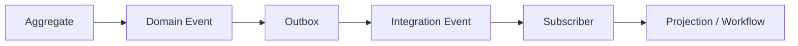

---

## 22. Synchronous vs. Asynchronous Operations

**Normally synchronous:** creation of Project; update of Risk; approval of Recommendation; recording of Decision; authorization checks; invariant validation; assignment of Project to Program; assignment of Project to Portfolio.

**Asynchronous candidates:**

| Operation | Job identity | Retry | Timeout | Dead-letter | Idempotency key | User-visible status |
| --- | --- | --- | --- | --- | --- | --- |
| Document ingestion | Per-upload job id | 3x exponential backoff | 5 min | Yes, with manual re-trigger | Source checksum + scope | "Processing" → "Ready"/"Failed" |
| Normalization | Per-source job id | 3x | 2 min | Yes | Source id | Reflected in Evidence status |
| Embeddings generation | Per-record job id | 5x | 1 min | Yes | Record id + content hash | Invisible; retrieval availability implies completion |
| Search index update | Per-record job id | 5x | 30 s | Yes | Record id + version | Invisible; eventual searchability |
| Recommendation generation | Per-agent-run job id | 2x (model calls are not free-retried indefinitely) | Per AgentExecutionPolicy | Yes, surfaced to Agent Center | Agent run id | Visible in Agent Center / Recommendation Queue |
| Health aggregation | Per-scope (Project/Program/Portfolio/PMO/Enterprise) recompute job | 3x | 2 min | Yes | Scope id + trigger event id | Reflected in Health projections' staleness indicator |
| Notification delivery | Per-notification-intent job | 5x with backoff | 30 s per channel | Yes, per channel | Notification intent id + channel | Delivery record status |
| Report generation | Per-report-run job | 2x | 5 min | Yes | Report definition id + parameters hash | Visible run status in Reporting |
| Knowledge elevation | Per-elevation-stage job | 2x (governance gate; failures require human re-trigger) | N/A — human-paced | No auto-dead-letter; stalls surface for review | Pattern candidate id + stage | Visible in Knowledge Center |
| Agent execution (full pipeline) | Per-agent-run job | Model-call retries only, per port | Per AgentExecutionPolicy | Yes | Agent run id | Visible in Agent Center |
| Cross-entity projections | Per-projection rebuild job | 3x | 5 min | Yes | Projection id + source version | Staleness indicator on read models |

---

## 23. Transaction Boundaries

Atomic within one transaction: creating an aggregate and recording its domain event(s); approving a Recommendation and changing its state; recording a Decision and its authority record; creating an Action from a Decision; ratifying Enterprise Knowledge; revoking a Decision; moving a Project within its permitted hierarchy links.

**Distributed transactions are prohibited.** When a use case crosses bounded contexts, it must use one of: a saga, a workflow with explicit state (§25), a policy evaluated synchronously before the boundary is crossed, a consumed event with idempotent handling, or an explicit compensating action. No implicit two-phase commit across contexts is permitted.

---

## 24. Consistency Model

| Area | Consistency | Why |
| --- | --- | --- |
| Authorization | Strong | A stale authorization check is a security defect, not a UX tradeoff |
| Workspace ownership | Strong | The tenancy boundary is the single most safety-critical invariant in the system (PR1 §16, §35) |
| Project membership | Strong | Determines what a user can read/write immediately |
| Decision status | Strong | A Decision is an authoritative record; an ambiguous status undermines its purpose |
| Recommendation approval | Strong | The approval gate is the human-authority boundary (§7.3 #6) |
| Action creation | Strong | Must reflect exactly one Decision's authorization |
| Command Center projections | Eventual (acceptable) | A projection lagging by seconds does not create a safety or correctness defect |
| Search index | Eventual | Rebuildable, never authoritative (§43) |
| Health aggregation | Eventual | Derived signal, not a control surface |
| Notifications | Eventual | Delivery timing tolerance is a UX concern, not a correctness one |
| Enterprise Intelligence projections | Eventual, with provenance preserved | The elevation gate itself (§30) is strongly consistent; the *read-side projection* of ratified knowledge may lag |
| Audit event persistence | Strong / durable | An audit record that can be lost defeats the purpose of auditability (§7.3 #24) |

---

## 25. Long-Running Workflows

Explicit workflows are required for: Document ingestion; Evidence normalization; Recommendation generation; Recommendation review; Decision-to-action; Action-to-outcome; Knowledge elevation; Agent execution; Project archival; Workspace archival; Cross-workspace knowledge ratification; Integration synchronization.

Each workflow's states, transitions, triggers, timeouts, retries, compensations, terminal states, audit, and manual-intervention points are documented in the companion `04-application-workflows.md`. Every workflow must expose a correlation id sufficient to answer "where is this stuck" without inspecting infrastructure internals (§7.3 #28).

### 62.11 Long-Running Workflow — Generic State Shape

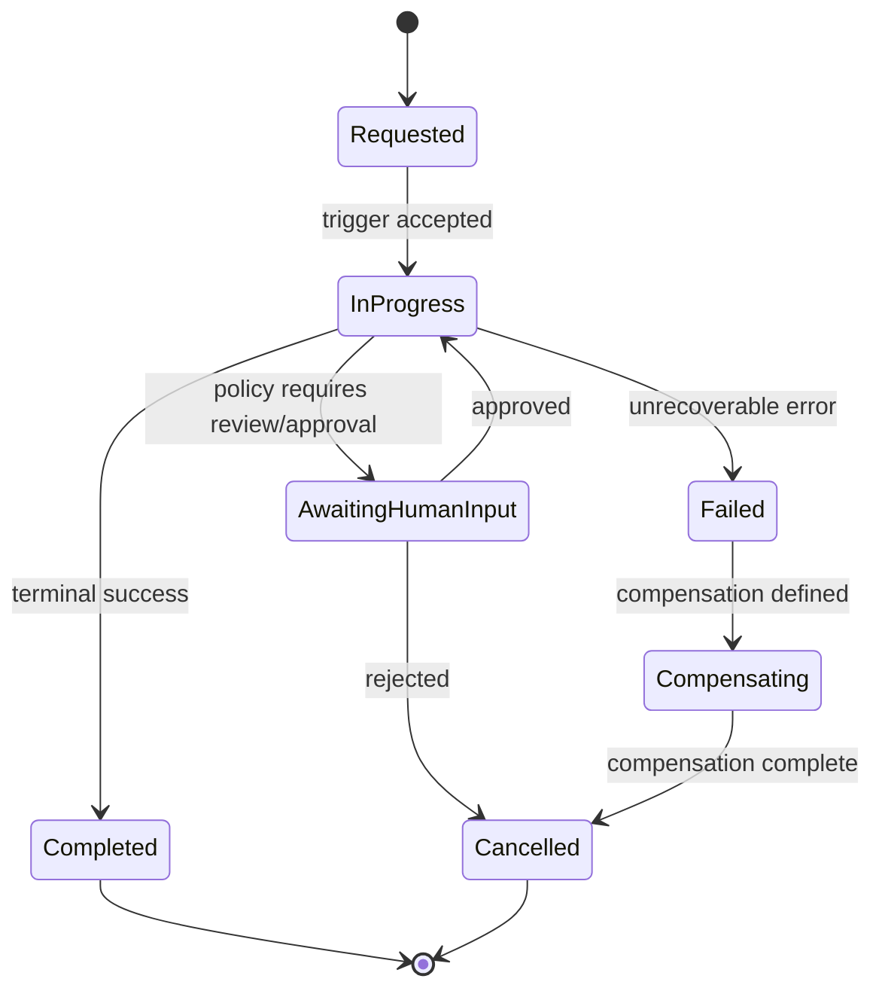

---

## 26. Recommendation Lifecycle

`Draft → Generated → Pending Review → Approved → Rejected → Superseded → Expired → Converted to Decision`

A Recommendation never modifies the domain automatically. Every Recommendation must carry provenance; when AI is involved it must record model, version, and context; it must record confidence and the Evidence it used; it must be able to expire, be contradicted, and be rejected; approval does not equal execution; conversion to a Decision is always an explicit, separate act (ADR-PMF-030).

## 27. Decision Lifecycle

`Proposed → Recorded → Active → Superseded → Revoked → Closed`

Every Decision preserves: authority, actor, timestamp, scope, rationale, alternatives considered, evidence, consequences, the Recommendation it relates to (if any), related Actions, and revocation lineage. A Decision is never destructively edited — corrections are made by superseding, preserving full history.

## 28. Action and Outcome Lifecycle

**Action:** `Draft → Planned → Active → Blocked → Completed → Cancelled`

**Outcome:** `Expected → Observed → Validated → Disputed → Superseded`

Completing an Action does not automatically prove an Outcome. An Outcome requires observation or evidence. Metrics must distinguish execution (did the Action happen) from effectiveness (did it produce the intended result). Agents may suggest Outcomes; they never ratify them automatically.

### 62.6 Recommendation-to-Outcome Flow

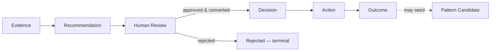

---

## 29. Project Memory Architecture

Project Memory is a governed bounded context, distinct in stages: raw sources → normalized events → evidence → observations → candidate records → approved records → decisions → outcomes → summaries → embeddings → retrieval projections.

**Every Project Memory Record preserves:** source, actor, timestamp, workspace, project, provenance, lineage, confidence, validation status, retention classification, sensitivity, supersession pointer, revocation pointer.

**Prohibited:** treating chat history as authoritative memory; treating the vector store as a source of truth; storing embeddings without a reference back to the canonical record; auto-elevating an inference to a fact; deleting lineage; mixing records between clients (Workspaces).

### 62.7 Project Memory Flow

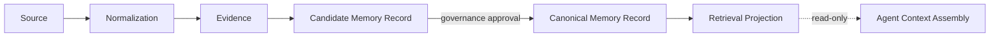

---

## 30. Enterprise Intelligence Architecture

`Project Evidence → Candidate Pattern → Aggregation (Program/Portfolio/PMO) → Review → Workspace Ratification → Enterprise Ratification → Enterprise Knowledge`

Every Enterprise Knowledge Record carries: scope, provenance, applicable contexts, originating Workspaces, supporting evidence, confidence, review status, ratifier, effective date, expiration, contradictions, revocation state, retention, and access policy.

**Prohibited:** cross-client blending; automatic elevation at any stage; generalization without supporting evidence; loss of Workspace provenance; treating Enterprise Knowledge as globally accessible by default; agent reuse of Enterprise Knowledge outside its declared applicability scope.

### 62.8 Enterprise Intelligence Elevation

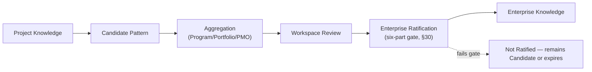

---

## 31–33. AI and Agent Architecture, Execution Pipeline, and Human-in-the-Loop Matrix

Fully specified in the companion document `04-ai-agent-application-architecture.md`. Summary of the binding rule: **Agents are governed consumers and producers of proposals. They are never aggregate owners and never authority roots** (ADR-PMF-027). An Agent Run records: agent identity, version, model, provider, prompt/template version, workspace, project, actor, inputs, evidence references, tools invoked, outputs, confidence, policy decisions, errors, duration, cost, approval status.

### 62.9 Agent Execution

```mermaid
flowchart LR
    REQ[Request] --> AUTHZ[Authorization]
    AUTHZ --> CTX[Context Assembly]
    CTX --> POL[Policy Evaluation]
    POL --> RET[Evidence Retrieval]
    RET --> MDL[Model Invocation]
    MDL --> TOOL[Tool Invocation]
    TOOL --> VAL[Output Validation]
    VAL --> PROP[Proposal Creation]
    PROP --> HR[Human Review]
    HR --> CMD[Domain Command]
    CMD --> AUD[Audit]
```

The Human-in-the-Loop Matrix (full table in the AI/Agent document) establishes, per action class, whether it is automatic, review-required, or approval-required — e.g., summarizing evidence is automatic; recording a Decision is never automatic; revoking Enterprise Knowledge always requires approval.

---

## 34. Authorization Architecture

Authorization is evaluated across multiple layers, not a single RBAC check: identity, enterprise membership, workspace membership, role, entity relationship, action permission, data classification, policy, ownership, delegated authority, time-bound access.

PMFreak's target authorization model combines RBAC (baseline role permissions), ABAC (attribute-based rules, e.g., data classification), relationship-based authorization (e.g., "assignee of this Task"), and policy-based authorization (the domain services in §16).

**Binding rules:** fail closed on any authorization ambiguity or evaluation error (§7.3 #25); Workspace scope is mandatory on every operational query and command; no query may rely on the UI to enforce security by hiding a control; Agents inherit the scope and policy of the actor or service account that requested the run — never a broader scope; service accounts have explicit, auditable identity, never a shared credential; every Decision records the authority under which it was made.

## 35. Tenancy and Isolation

```
Enterprise
└── Workspace
    └── Operational Data
```

Every operational access requires a Workspace scope. No repository accepts a global, unscoped query without an explicit, named policy exception. No event crosses a Workspace boundary automatically. No vector retrieval crosses Workspaces by default. No Agent context mixes clients. Logs must avoid exposing one tenant's data to another. Enterprise Intelligence does not remove segregation — it adds a governed, auditable crossing point (§30), not a bypass. Administrative support access must be auditable. Impersonation, if it exists, must be explicit and logged. Batch processes operate per-scope, never globally, unless the batch itself is the Enterprise-scoped elevation workflow (§30) operating under its own gate.

### 62.12 Tenancy Boundary

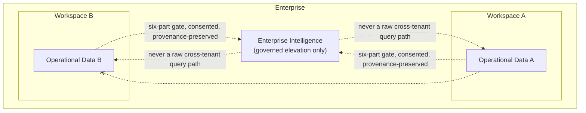

## 36. Security Architecture

| Threat | Conceptual control |
| --- | --- |
| Broken tenant isolation | Authorization at the use-case boundary + scoped repositories (§18) + fail-closed policy evaluation |
| Privilege escalation | Explicit role/policy checks per command; no ambient authority |
| Prompt injection | Content sanitization, tool allowlists, policy evaluation before tool invocation (§32) |
| Tool abuse | Explicit, scoped tool allowlists per Agent; dangerous operations require confirmation |
| Data exfiltration | Least-privilege retrieval scopes; output validation before any external channel |
| Unauthorized agent action | Agents never hold direct mutation authority (§7.3 #6, ADR-PMF-030) |
| Poisoned evidence | EvidenceTrustPolicy classification; provenance required before elevation eligibility |
| Stale authorization | Short-lived authorization context per request; no long-cached "is admin" flags |
| Insecure direct object reference | Repository-enforced scope on every load, not just on list endpoints |
| Event spoofing | Authenticated event producers; signature/origin validation on integration events |
| Replay | Idempotency keys (§37) + anti-replay windows on webhooks |
| Duplicate commands | Idempotency keys per command (§13, §37) |
| Compromised integration | Scoped credentials per integration; revocable independently (§44) |
| Secret leakage | Secrets port (§19), never embedded in domain/application code |
| Audit tampering | Append-only audit sink, durable, no update/delete path (§18, §41) |

Conceptual controls: authorization at the use-case boundary; scoped repositories; signed/authenticated integrations; idempotency; anti-replay; immutable audit; tool allowlists; content sanitization; provenance; a policy engine; retention; encryption; key rotation; redaction; least privilege; mandatory security review for any cross-workspace feature.

## 37. Idempotency

Required for: webhook processing, retries, agent runs, recommendation generation, action creation, notification delivery, ingestion, knowledge elevation, integration synchronization. Every idempotent operation defines: an idempotency key, its scope, a request fingerprint, an expiration window, prior-result handling, and conflict behavior (§13 lists the key per command).

## 38. Error Model

`ValidationError` · `AuthorizationError` · `NotFoundError` · `ConflictError` · `InvariantViolation` · `PolicyViolation` · `StaleVersionError` · `DependencyUnavailable` · `RateLimitExceeded` · `WorkflowTimeout` · `AgentExecutionError` · `IntegrationError` · `DataIntegrityError` · `UnexpectedError`

Each error category defines a user-safe message, an internal code, whether it is retryable, its audit requirement, its observability severity, and its exposure restrictions. No error surface may leak internal implementation, credentials, or another tenant's data.

## 39. Retry, Timeout, and Compensation

**Retryable:** transient provider errors, temporary queue errors, search indexing, notification sending, idempotent ingestion steps.

**Not retryable automatically:** authorization failure, validation error, invariant violation, rejected approval, destructive operation without confirmation, unknown scope.

Compensation must be explicit in every workflow definition (§25, `04-application-workflows.md`) — no implicit rollback is assumed across a context boundary.

## 40. Observability

**Identifiers carried on every operation:** correlation ID, causation ID, actor ID, workspace ID, project ID, workflow ID, agent run ID, command ID, event ID.

**Minimum metrics:** command success/failure, query latency, workflow duration, queue delay, retry count, agent failure rate, recommendation acceptance rate, decision conversion rate, action completion rate, outcome validation rate, knowledge ratification rate, authorization denials, cross-workspace policy attempts.

**Distinctions maintained:** operational logging (debugging), security audit (who did what, tamper-evident), business audit (governance record, §41), product analytics (usage patterns) — these are four different sinks with different retention and access rules, never one undifferentiated log stream.

## 41. Audit Architecture

Minimum audited events: membership changes, permission changes, Workspace creation/archival, Project ownership changes, Recommendations, approvals, Decisions, revocations, Actions, Outcomes, agent runs, tool invocations, knowledge elevation, integrations, administrative access, exports, deletions, policy changes.

Every audit record preserves: actor, action, target, before/after (where applicable), timestamp, scope, source, correlation, reason, authority, result.

## 42. Read Model Architecture

| Read model | Source contexts | Owner | Consistency |
| --- | --- | --- | --- |
| Enterprise Command Center | Enterprise Administration, Reporting | Enterprise Administration | Eventual |
| Workspace Command Center | Workspace Management, PMO Governance, Project Management | Workspace Management | Eventual |
| PMO Command Center | PMO Governance, Portfolio, Program, Project | PMO Governance | Eventual |
| Portfolio Command Center | Portfolio Management | Portfolio Management | Eventual |
| Program Command Center | Program Management | Program Management | Eventual |
| Project Command Center | Project Management, Work Execution, RAID, Schedule, Evidence, Project Memory | Project Management | Eventual |
| Project Intelligence Feed | Chat, Evidence, RAID, Decision, Task, Milestone | Project Management (projection owner) | Eventual |
| Project Health | Project Management, RAID, Schedule, Work Execution | Reporting and Analytics | Eventual |
| Portfolio/Program/PMO/Enterprise Health | Respective owning contexts | Reporting and Analytics | Eventual |
| Recommendation Queue | Recommendation Management | Recommendation Management | Eventual list / Strong detail |
| Decision Register | Decision Management | Decision Management | Eventual list / Strong detail |
| Action Register | Action and Outcome Management | Action and Outcome Management | Eventual |
| Outcome Register | Action and Outcome Management | Action and Outcome Management | Eventual |
| Knowledge Center | Enterprise Intelligence | Enterprise Intelligence | Strong for ratified, Eventual for candidates |
| Audit Timeline | Audit and Compliance | Audit and Compliance | Strong (durable) |

Every read model must expose a rebuild strategy and a stale-state indicator; none may be treated as a system of record (§9.5).

## 43. Search Architecture

Transactional retrieval (load-by-id through a repository), filtered search, full-text search, semantic retrieval, and knowledge retrieval are kept distinct. The search index and the vector store are never sources of truth; semantic retrieval must return provenance back to the canonical record; scope is applied before and after retrieval where relevant; results respect sensitivity classification; indexes must be fully rebuildable from source aggregates.

## 44. Integration Architecture

```
External System → Integration Adapter → Anti-Corruption Layer → Normalized Contract → Application Command/Event
```

Candidate integrations: email, calendar, Slack/Teams, Jira, GitHub, document storage, CRM, finance, HR, collaboration platforms. Each integration documents: owner, auth method, webhook vs. polling, sync direction, conflict resolution, retry, idempotency, rate limits, data classification, audit, and disable/revoke behavior.

## 45. Notification Architecture

Kept distinct: domain event, notification intent, channel delivery, user preference, delivery record. Future channels: in-app, email, mobile, Slack/Teams, webhook. Notifications are never emitted directly from an aggregate — they are produced by Notification Management subscribing to integration events.

## 46. Configuration Architecture

Precedence (a lower configuration may never weaken a higher one):

```
Security / Legal Constraints
  → Enterprise Policy
    → Workspace Policy
      → PMO Standard
        → Project Configuration
          → User Preference
```

Distinguished: product defaults, enterprise policy, workspace policy, PMO standards, project configuration, user preference, feature entitlement, temporary feature flag.

## 47. Methodology Architecture

Sprint remains optional (ADR-PMF-011). A Project may configure predictive, agile, hybrid, or a custom governed methodology. Methodology may enable capabilities (e.g., Sprint/Epic visibility) but must never alter Project identity, Workspace ownership, security, evidence handling, decisions, audit, memory, or outcomes.

## 48. Dependency Rules

**Permitted:**
```
Interface → Application → Domain
Infrastructure → Application Ports
Projection → Published Read Contracts / Events
```

**Prohibited:** Domain → Infrastructure; Domain → UI; Domain → database SDK; Application → concrete provider (must go through a port); Context A → Context B's repository; UI → persistence; Agent → database; Query handler → hidden command-side effect.

## 49. Module Structure Recommendation

Conceptual target only — no files are moved by this PR:

```
src/
  modules/
    enterprise/          {domain, application, interface, infrastructure}
    workspace/
    pmo/
    portfolio/
    program/
    project/
    execution/
    raid/
    evidence/
    recommendations/
    decisions/
    actions/
    memory/
    enterprise-intelligence/
    agents/
    integrations/
    notifications/
    audit/
  shared/
    domain/
    application/
    infrastructure/
```

This is a target for future PRs to converge toward incrementally (§52) — it is not implemented, and no files move as a result of this document.

## 50. Shared Kernel Rules

Only genuinely stable, cross-cutting primitives may be shared: `EntityId`, `WorkspaceId`, `ProjectId`, `Timestamp`, `Money`, `Percentage`, `DateRange`, `ActorReference`, `CorrelationId`, `ProvenanceReference`, `Result`/`Error` primitives. Domain-specific logic is never shared "for convenience" — the shared kernel must stay minimal and must never become a generic dumping ground.

## 51. Build vs. Buy Boundaries

**Core PMFreak (must be built in-house):** domain ownership, PMO governance, project intelligence, Recommendation lifecycle, Decision lifecycle, Action/Outcome lifecycle, Project Memory governance, Enterprise Intelligence governance, agent policy, audit lineage.

**Replaceable infrastructure (adapter candidates):** identity provider, email, queue, storage, vector database, AI provider, observability, billing, search engine.

## 52. Current State vs. Target Architecture

| Area | Current state (evidence-based, §64) | Target | Gap | Future action |
| --- | --- | --- | --- | --- |
| Module boundaries | Feature/route-based (60+ directories under `src/lib`, route folders under `src/app/(protected)`), not bounded-context-organized | Explicit bounded contexts (§10) | Architecture gap | Incremental, future PRs |
| UI/domain coupling | Not fully audited this PR; PR1 documents Command Center label applied across 5–6 unrelated objects (PR1 §22) | Strict separation (§9) | Coupling risk | Future PR |
| Repositories | No repository abstraction found; direct Supabase access from feature code (aligned with a monolith-without-hexagonal-boundary shape) | Aggregate-scoped repository ports (§18) | Contract gap | PR5 |
| Commands | Implicit — server actions/route handlers perform mutations directly without a named Command abstraction | Explicit catalog (§13) | Application gap | Future PR |
| Queries | Mixed with UI data-fetching (page-level Supabase queries) | Explicit read contracts (§14, §42) | Read model gap | PR6/PR7 |
| Events | No event infrastructure exists (confirmed, PR1 §33: "no event infrastructure exists in the codebase today") | Domain/Integration distinction (§20–§21) | Event gap | Future PR |
| Agents | Two of thirteen named agents implemented, both deterministic and recommendation-only (PR1 §25); no orchestration pipeline | Governed orchestration (§31–§33) | Control gap | Future PR |
| Memory | `project_memory_snapshots` real but no confirmed correction/audit-trail mechanism (PR1 §24) | Governed Project Memory (§29) | Architecture gap | Future PR |
| Enterprise Intelligence | No elevation pipeline exists; isolation enforced structurally via RLS instead (PR1 §27) | Governed elevation aggregate (§30) | Missing capability | Future PR, security-reviewed |
| Audit | Partial (`governance_audit_events` and related tables exist per PR1 evidence; not unified) | First-class audit architecture (§41) | Compliance gap | Future PR |
| Authorization | RLS-enforced at the database layer (408/409 tables, live cross-tenant test passed, PR1 §16, §35); no documented multi-layer application-level policy model | Multi-layer policy model (§34) | Security/architecture gap | Future PR |

No gap above is asserted without the PR1/PR1.2 evidence cited; none is treated as closed by this document.

## 53. Architecture Fitness Functions

Checks to define in a future PR, not implemented here: no module imports another module's concrete infrastructure; no handler accesses another context's repository; no agent writes directly to persistence; every command carries Workspace scope where applicable; every Recommendation has provenance; every Decision has recorded authority; every integration event has a version; every workflow has terminal states; no vector-retrieval result lacks a canonical record reference; no Command Center is modeled as an aggregate; no query produces a mutation.

## 54. Decision Matrix

| Topic | Decision |
| --- | --- |
| Deployment unit (initial) | Modular monolith |
| Domain organization | Bounded contexts |
| Integration style | Ports/adapters + selective events |
| Write model | Aggregate-oriented |
| Read model | Explicit projections |
| CQRS | Logical separation; no infrastructure mandate |
| Event sourcing | Not required initially |
| Microservices | Not initially (§8) |
| AI execution | Governed orchestration |
| Human approval | Required for authoritative mutations |
| Cross-Workspace data | Denied by default |
| Knowledge elevation | Explicit workflow, six-part gate |
| Search/vector | Derived indexes only |
| Audit | First-class |
| Consistency | Mixed, by use case (§24) |

## 55. Open Decisions

Deliberately not resolved by this PR: exact implementation language/framework choices beyond what's already in place; final physical folder structure; dependency-injection framework; final database technology; ORM/query builder; event bus; queue provider; workflow engine; vector store; search provider; AI providers and model routing; deployment topology; cache strategy; exact API transport (REST/GraphQL/RPC); exact authorization engine implementation; observability provider; event schema registry; exact module-extraction order/timing; whether event sourcing is ever adopted for any specific aggregate; multi-region strategy; disaster-recovery targets; exact retention periods per record type; detailed billing architecture; implementation sequencing beyond the PR5/PR6/PR7/PR8/PR9+ ordering already established.

---

## 63. Consistency Validation

**Domain consistency:** No entity changes meaning from PR1/PR1.1. No cardinality is contradicted (§12 restates PR1.1 §7 without modification). Command Center remains a projection, never an aggregate (§9.5, §12). Project Memory remains separate from Chat History (§29). Enterprise Intelligence remains scoped under Enterprise with governed elevation (§30). Workspace remains the tenancy/security boundary (§35). Recommendation, Decision, Action, and Outcome remain four separate lifecycles (§26–§28).

**Application consistency:** Every aggregate in §12 has exactly one owning context. Every command in §13 has a target aggregate. Every query in §14 has a source read model. Every domain event in §20 has a producing context. No Agent owns an aggregate (§12 rule 4, §31). No adapter is described as domain (§9.1 vs §9.4). No repository crosses contexts (§18). Every workflow in §25/`04-application-workflows.md` has terminal states. Every asynchronous operation in §22 has an idempotency key. Every sensitive mutation in §13 has a human-approval column. Every elevation stage in §30 preserves provenance.

**Documentation consistency:** ADR-PMF-023 through ADR-PMF-032 exist (`docs/adr/`). Relative links in this document resolve within the repository. Mermaid fences are balanced (12 diagrams, §62.1–§62.12, each opened and closed). Terminology matches PR2's canonical definitions verbatim where restated. Screens and Command Centers referenced in §10/§42 match PR3's screen catalog and navigation contracts. No claim in this document states that implementation is complete — every implementation-adjacent statement is qualified as target, contract, or gap.

---

## Related Documents

- `04-bounded-context-catalog.md` — full per-context detail
- `04-command-query-event-catalog.md` — full command/query/event reference, naming and versioning conventions
- `04-ai-agent-application-architecture.md` — AI and agent governance detail
- `04-application-workflows.md` — long-running workflow state machines
- `docs/adr/ADR-PMF-023-modular-monolith-initial-architecture.md` through `docs/adr/ADR-PMF-032-mixed-consistency-model.md`
