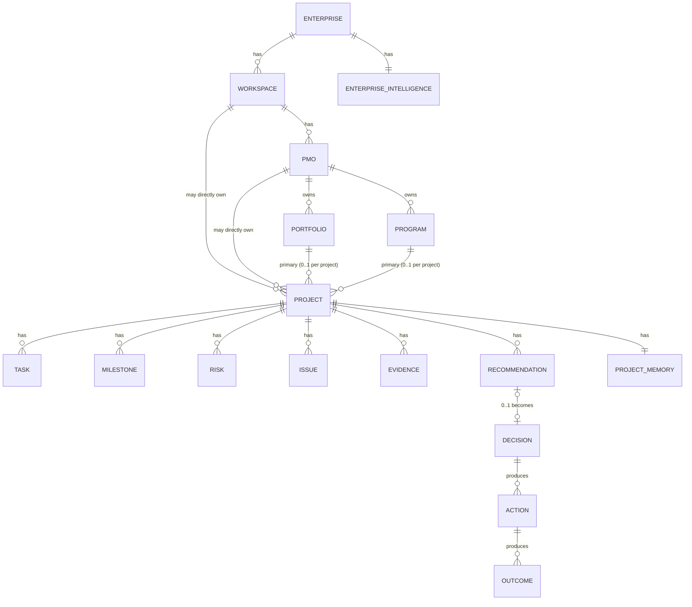
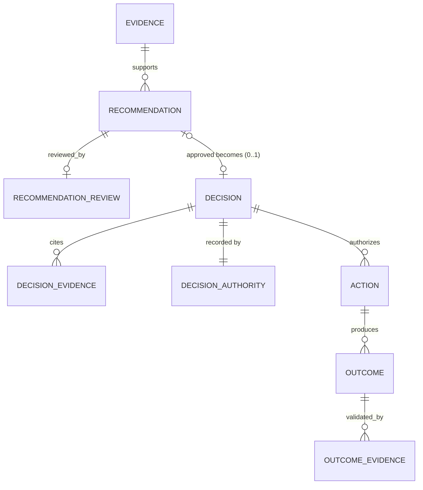
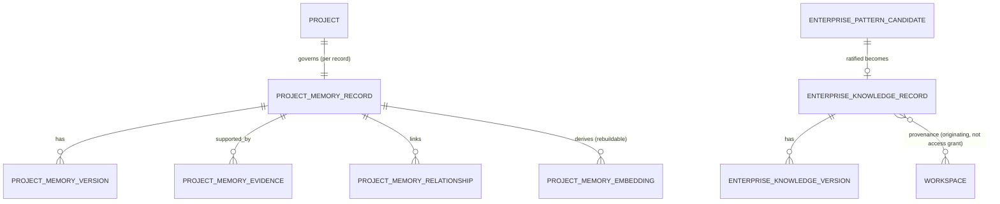

# Canonical Data Model (Conceptual)

Companion to `05-canonical-persistence-architecture.md`. This document is the full conceptual entity/record catalog: names, cardinalities, scope, common fields, mutability, provenance/lineage, source-of-truth classification, and read consumers. Names here are conceptual, not literal mandated table names — see `05-persistence-migration-strategy.md` for how each maps to (or diverges from) the current 423-table schema. No SQL is executable from this document; no migration is authorized by it.

## 1. Entity Catalog

| Entity | Definition | Parent cardinality | Key children |
|---|---|---|---|
| Enterprise | Canonical root for organizational identity, contract, billing, cross-Workspace administration, data sovereignty, Enterprise Intelligence (ADR-PMF-001) | None (root) | Workspace (1:N) |
| Workspace | Operational, data, and access boundary; RLS tenancy root (ADR-PMF-002) | N:1 to Enterprise | PMO (1:N), Project (1:N optional direct) |
| PMO | Governance entity administering standards, oversight of Portfolio/Program (ADR-PMF-003) | N:1 to Workspace | Portfolio (1:N), Program (1:N mandatory), Project (1:N optional direct) |
| Portfolio | PMO-owned strategic grouping for investment/priority/capacity/risk/value (ADR-PMF-004) | N:1 to PMO | Project (1:N optional, at most one primary per Project) |
| Program | PMO-owned coordination entity for related Projects' joint benefits (ADR-PMF-005) | N:1 to PMO (required); N:1 to Portfolio (optional, same PMO) | Project (1:N, at most one primary per Project) |
| Project | Central execution aggregate (ADR-PMF-006) | N:1 to Workspace (required); N:1 to PMO/Portfolio/Program (all optional) | Task, Milestone, Risk, Issue, Stakeholder, Document, Evidence, Recommendation, Decision, Action, Outcome, Project Memory |
| Task | Discrete assignable unit of execution | N:1 to Project | — |
| Milestone | Cross-methodology PMI-aligned checkpoint (ADR-PMF-011) | N:1 to Project | — |
| Risk | Potential future problem (RAID) | N:1 to Project (optional — may be Workspace-scoped only) | Risk Assessment history |
| Issue | Realized/current problem (RAID) | N:1 to Project (optional) | Issue status history |
| Stakeholder | Individual/group with interest in or influence over Project/Program/Portfolio | N:1 to Project | — |
| Document | Source material (raw) | N:1 to Project/Workspace | Document Version |
| Evidence | Source material substantiating a fact, decision, or recommendation | N:1 to Project/Workspace | Evidence Assessment, Evidence Link |
| Recommendation | Agent- or governance-produced suggestion requiring a separate Decision | N:1 to Project; 0..1 to Decision | Recommendation Evidence, Recommendation Review |
| Decision | Distinct, attributable choice; never auto-derived | 0..1 from Recommendation; N:1 to Project | Decision Evidence, Decision Authority, Decision History |
| Action | Work performed as a result of a Decision | N:1 to Decision (0..N) | Action Status History |
| Outcome | Observed result of an Action | N:1 to Action (0..N) | Outcome Evidence, Outcome Validation |
| Project Memory | Governed, structured, traceable Project knowledge (ADR-PMF-009, ADR-PMF-039) | 1:1 logical with Project | Memory Version, Memory Evidence, Memory Relationship |
| Enterprise Intelligence | Ratified, governed knowledge aggregate rooted at Enterprise (ADR-PMF-010, ADR-PMF-040) | 1:1 conceptual with Enterprise; provenance to N Workspaces | Pattern Candidate, Knowledge Record |
| Agent Run | One execution instance of an Agent Definition (ADR-PMF-027) | N:1 to Workspace; 0..1 to Project | Tool Invocation, Agent Proposal |
| Integration | External system connection/config | N:1 to Workspace | Sync state |
| Notification | Delivery of an intent to a channel | N:1 to Workspace (+ user) | Delivery record |
| Audit Record | Append-only record of an action | N:1 to scope (Workspace/Enterprise/system) | — |
| Workflow Instance | One execution of a defined workflow | N:1 to triggering scope | Workflow Step, Workflow Attempt |

**Cardinality notes ratified in PR1.1 (binding, not renegotiated here):** a Project has at most one primary Portfolio and at most one primary Program (invariants 13, 17); many-to-many Project↔Portfolio/Program is explicitly deferred future scope requiring its own future ADR (ADR-PMF-004 rule 8, ADR-PMF-005 rule 7); a Project may exist without PMO, Portfolio, or Program (invariants 19–21); every Program belongs to exactly one PMO, always (ADR-PMF-005).

## 2. Canonical Persistent Record Catalog (Conceptual Names)

### Enterprise and tenancy
`enterprises`, `workspaces`, `enterprise_memberships`, `workspace_memberships`, `workspace_policies`, `enterprise_policies`

### PMO structure
`pmos`, `pmo_memberships`, `pmo_standards`, `portfolios`, `programs`, `project_portfolio_assignments`, `project_program_assignments`

### Project
`projects`, `project_context`, `project_methodology`, `project_memberships`, `project_stakeholders`, `project_status_history`

### Execution
`tasks`, `task_assignments`, `task_status_history`, `milestones`, `milestone_status_history`, `dependencies`

### RAID
`risks`, `risk_assessments`, `risk_status_history`, `issues`, `issue_status_history`

### Evidence and documents
`documents`, `document_versions`, `source_records`, `evidence_records`, `evidence_links`, `evidence_assessments`

### Intelligence lifecycle
`recommendations`, `recommendation_evidence`, `recommendation_reviews`, `decisions`, `decision_evidence`, `decision_authority`, `decision_history`, `actions`, `action_status_history`, `outcomes`, `outcome_evidence`, `outcome_validations`

### Project Memory
`project_memory_records`, `project_memory_versions`, `project_memory_evidence`, `project_memory_relationships`, `project_memory_embeddings` (derived), `project_memory_retrieval_documents` (derived)

### Enterprise Intelligence
`enterprise_pattern_candidates`, `enterprise_pattern_evidence`, `enterprise_pattern_reviews`, `enterprise_knowledge_records`, `enterprise_knowledge_versions`, `enterprise_knowledge_scope`, `enterprise_knowledge_contradictions`, `enterprise_knowledge_revocations`

### Agents
`agent_definitions`, `agent_versions`, `agent_configurations`, `agent_runs`, `agent_run_inputs`, `agent_run_outputs`, `agent_tool_invocations`, `agent_proposals`, `agent_run_evidence`, `agent_run_approvals`, `agent_run_costs`

### Events and workflows
`domain_event_records`, `outbox_events`, `inbox_messages`, `integration_event_deliveries`, `workflow_instances`, `workflow_steps`, `workflow_attempts`, `idempotency_records`

### Audit and notification
`audit_records`, `notification_intents`, `notification_deliveries`, `notification_preferences`

### Search and projections
`search_documents` (derived), `semantic_index_records` (derived), `command_center_projections` (derived), `health_projections` (derived), `feed_projections` (derived), `reporting_snapshots` (derived)

These names are conceptual — they name the concept a canonical persistence unit must realize, not a literal, final table name. The migration strategy evaluates each against the current schema's existing tables (which frequently use different, overlapping, or duplicated names) before any table is created, renamed, or dropped.

## 3. Common Fields (Reference)

`id`, `enterprise_id`, `workspace_id`, `project_id`, `created_at`, `created_by`, `updated_at`, `updated_by`, `archived_at`, `archived_by`, `deleted_at`, `deleted_by`, `version`, `status`, `correlation_id`, `causation_id`, `source_type`, `source_id`, `provenance`, `metadata`, `classification`, `retention_policy` — not every record needs every field; see `05-canonical-persistence-architecture.md` §10 for the full discussion, including nullability discipline.

## 4. Mutability, Provenance, and Source-of-Truth Classification (Per Record Family)

| Record family | Mutability | Provenance required | Source of truth? | Primary read consumers |
|---|---|---|---|---|
| Enterprise / Workspace / PMO / Portfolio / Program / Project | Mutable, versioned | No (originating, not derived) | Yes | All owning-context projections |
| Task / Milestone | Mutable | No | Yes | Project Command Center, Reporting |
| Risk / Issue | Mutable + history table | Optional (if agent-sourced) | Yes | RAID projections, Feed |
| Evidence | Metadata-versioned, content immutable | Yes (source, actor, capture) | Yes | Project Memory, Recommendation Mgmt, Decision Mgmt, Audit |
| Recommendation | Status-transition only | Yes (agent run / evidence) | Yes | Decision Mgmt, Feed |
| Decision | Append-only authority fields, versioned | Yes (authority, rationale) | Yes | Action/Outcome Mgmt, Audit |
| Action / Outcome | Status-transition only | Yes (source Decision/Action) | Yes | Reporting, Enterprise Intelligence input |
| Project Memory Record | Versioned, revocable | Yes (full ADR-PMF-009 set) | Yes (approved only) | Agent Orchestration, Project projections |
| Enterprise Knowledge Record | Versioned, revocable | Yes (full elevation lineage) | Yes (ratified only) | Enterprise Admin projections, Recommendation Mgmt |
| Agent Run / Tool Invocation | Immutable after completion | Yes (model, provider, prompt version) | Yes | Audit, Recommendation Mgmt |
| Audit Record | Append-only | Yes | Yes | All contexts (scoped read) |
| Domain/Outbox Event | Immutable, versioned | Yes (correlation/causation) | No (mechanism, not a fact store) | Integration consumers |
| Workflow Instance/Step/Attempt | Mutable during execution, terminal-state immutable | Yes (trigger, correlation) | No (orchestration state, not domain fact) | Operational tooling |
| Search Document / Semantic Index Record | Fully derived, rebuildable | Yes (canonical record + version) | No | Search, Agent retrieval |
| Command Center / Health / Feed Projection | Fully derived, rebuildable | Yes (canonical sources) | No | Product UI |

## 5. Additional ER Detail — Intelligence Lifecycle

## 6. Additional ER Detail — Project Memory and Enterprise Intelligence

## Scope of This Document

This is a conceptual data model produced under PR5. It creates no SQL, no migration, and no generated database type. Deviations between this catalog and the current 423-table schema are inventoried, classified, and sequenced for reconciliation in `05-persistence-migration-strategy.md` — this document does not itself resolve them.
