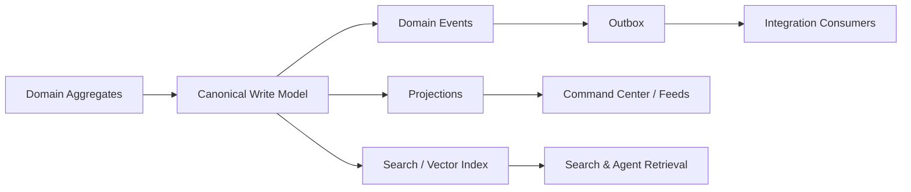
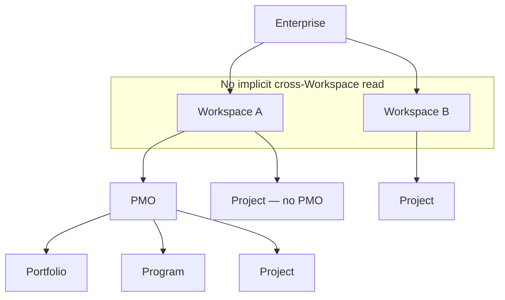
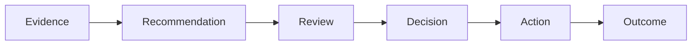
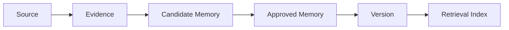
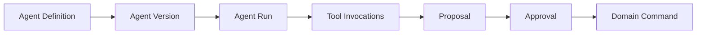
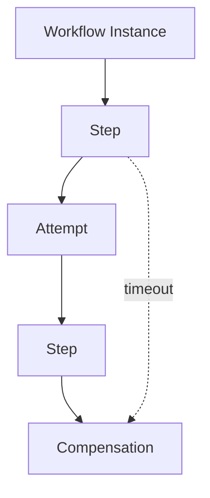
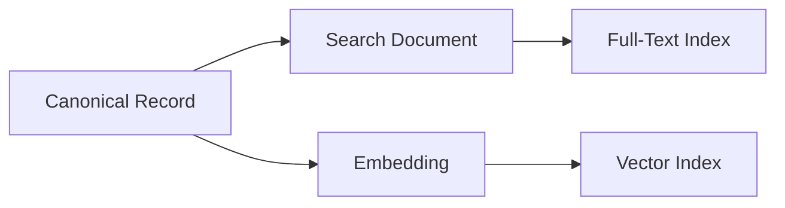
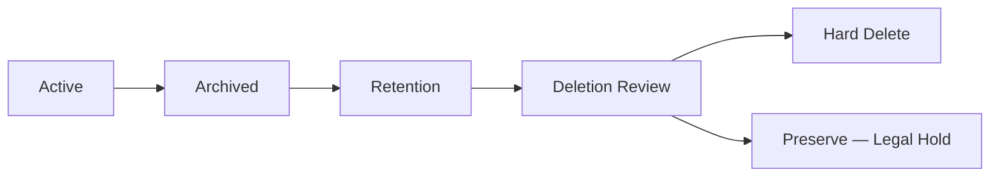
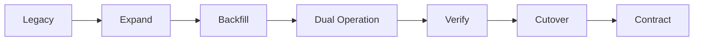

# PR5 — Canonical Persistence Architecture

Status: Documentary architecture (no implementation)
Authority order: `01-canonical-domain-model.md` → `01.1-domain-ratification.md` → `02-canonical-product-language.md` → `03-canonical-information-architecture.md` → `04-canonical-application-architecture.md` and its companion catalogs → `docs/adr/ADR-PMF-001` through `ADR-PMF-032` → this document and its companions (`05-*`) and `ADR-PMF-033` through `ADR-PMF-044`.

Companion documents:
- `05-canonical-data-model.md` — full entity/record catalog, ER diagrams
- `05-tenancy-rls-and-data-security.md` — tenancy, RLS, authorization, classification, encryption, residency
- `05-event-workflow-persistence.md` — domain/integration events, outbox, inbox, workflows
- `05-memory-knowledge-ai-persistence.md` — Project Memory, Enterprise Intelligence, Agent Run persistence
- `05-persistence-migration-strategy.md` — current-schema inventory, table classification, phased migration

---

## 1. Executive Summary

PMFreak's domain (PR1/PR1.1), product language (PR2), information architecture (PR3), and application architecture (PR4) are now ratified. None of them specify how their entities, commands, events, workflows, and AI-governed knowledge are physically stored. Left unspecified, that gap gets filled by accretion — exactly what the current-state inspection for this PR found: 423 tables across roughly 150 migrations, with Decision modeled independently four times, Recommendation modeled independently five times, two unreconciled Risk/Issue models, two unreconciled Task models, and a legacy `company_id`/`tenant_id` (text) tenant key still coexisting with the canonical `workspace_id` (uuid) key in migrations as recent as 2026-08-22. None of this is a moral failing of prior work — it is what happens when a fast-moving product accumulates schema one feature at a time without a canonical persistence contract to converge against. PR5 exists to write that contract before PR6 (API) and PR7 (frontend) give it a shape that would be even more expensive to unwind later.

This PR formalizes: which aggregate owns which storage unit; which identifiers and tenant keys are canonical; which records are mutable, append-only, or versioned; how Workspace/Enterprise scope is enforced in the schema and in RLS; how domain and integration events are durably published; how long-running workflows persist their state; how Project Memory and Enterprise Intelligence are governed as versioned, revocable records rather than ambient chat history or an unlabeled vector index; and how the current 423-table schema converges toward this model incrementally, without a big-bang rewrite.

What this PR does not do: it does not create a single migration, does not modify a single table, does not touch RLS, does not change application code, and does not resolve every open persistence question — a substantial list of decisions (exact identifier scheme, exact table names, exact retention periods, exact migration sequencing) remains explicitly open (§29), to be resolved with evidence during PR9+, not guessed here.

This reduces risk on three fronts: it prevents PR6 from designing API contracts against an unstated or contradictory storage model; it prevents PR7 from building UI assumptions (e.g., "a Recommendation always has a linked Decision") that the persistence layer cannot actually guarantee; and it gives the migration effort itself (PR9+) a target to converge toward instead of another ad hoc feature-by-feature accretion.

## 2. Purpose

This document exists to make several distinctions explicit, because the current-state inspection shows what happens when they are left implicit:

- **Aggregates are not automatically tables**, and a table is not automatically an aggregate. Program's internal roadmap tree (`program_epics`, `program_sprints`, `program_cards`) is several tables realizing one aggregate; the four independent `*_decisions` table families realize what should be one Decision aggregate spread across several unreconciled tables.
- **Read models are not source of truth.** `pmo_command_center_snapshots`, `program_card_context_projection`, and every future Command Center projection are derived and rebuildable; they never get to be the only place a fact lives.
- **Vector indexes and embeddings are not canonical memory.** The current schema already states this explicitly in its own migration comments ("No AI, no embeddings, no automatic learning") — this PR formalizes that stance as an architectural principle (ADR-PMF-041), not just a historical artifact of one migration's design choice.
- **Chat history is not Project Memory.** `context_conversations`/`context_messages` (or their canonical successors) are an ingestion source; `project_memory_records` (target) are the governed, approved output (ADR-PMF-039).
- **Audit records must not depend solely on application-level logs.** The current schema's `platform_events` table is the closest existing candidate for a durable, queryable audit/event backbone; most other subsystems still write their own parallel `*_events`/`*_audit*` tables instead of converging on it.
- **Event records do not substitute for the write model, and RLS does not substitute for application authorization** (nor the reverse) — each layer in the authorization chain (Authentication → Application Authorization → Scoped Repository → RLS → Database Constraints) is independently required to fail closed (ADR-PMF-042).
- **The future schema must preserve PR1.1's ratified invariants** — a persistence design that makes it easy to violate "a Project has at most one primary Portfolio" or "Enterprise membership does not grant cross-Workspace access" is not a valid target, regardless of engineering convenience.

## 3. Persistence Principles

These principles are binding for every canonical persistence decision made under this PR and every later implementation PR, unless superseded by a future ADR:

1. **Domain before Schema.** The ratified domain model (PR1/PR1.1) drives storage design; the current or historical schema never drives what the domain "should" mean.
2. **Aggregate Ownership before Table Ownership.** An aggregate's owning bounded context (PR4 §12) determines which storage units belong to it, not which table happens to exist.
3. **Workspace Scope by Default.** Every operational record has a resolvable Workspace scope (ADR-PMF-034).
4. **Enterprise Scope Explicitly Derived.** Enterprise-level access is never implied by Workspace membership; Enterprise scope is explicit and separately authorized.
5. **No Cross-Client Persistence Access.** No query or storage design may blend data across Enterprises (different customers), ever.
6. **Strong Integrity for Domain Invariants.** Foreign keys, unique constraints, and check constraints enforce ratified invariants declaratively wherever PostgreSQL can express them (ADR-PMF-033).
7. **Append-Only for Authority History.** Decisions, audit, and other authority-bearing records preserve history without destructive edits (ADR-PMF-036).
8. **Mutable State with Version Control.** Ordinarily mutable aggregates requiring concurrency protection use optimistic concurrency (§12).
9. **Provenance Is Persisted, Not Inferred.** Every derived or inferred record carries an explicit provenance reference (§15).
10. **Lineage Is First-Class.** Supersession, contradiction, and derivation relationships are explicit, queryable records (§15).
11. **Search Is Derived.** Full-text search indexes are rebuildable projections, never authoritative (ADR-PMF-041).
12. **Vector Storage Is Derived.** Embeddings and vector indexes are rebuildable projections referencing a canonical record and version, never authoritative (ADR-PMF-041).
13. **Read Models Are Rebuildable.** Every projection has a documented rebuild strategy and staleness indicator (§20).
14. **Audit Is Durable.** Audit records are append-only and never silently lost (ADR-PMF-036, §19).
15. **Events Are Versioned.** Every domain/integration event type carries an explicit version (ADR-PMF-037).
16. **Workflows Persist State Explicitly.** Long-running workflows record instance, step, and attempt state durably (ADR-PMF-038).
17. **Idempotency Is Stored.** Idempotent operations are protected by durable idempotency records, not assumed safe by convention (ADR-PMF-037).
18. **Soft Delete Is Not Universal.** Soft delete applies only where a genuine recovery-window requirement exists (ADR-PMF-043).
19. **Hard Delete Is Policy-Controlled.** Physical deletion is gated by an explicit pipeline, never a default operation (ADR-PMF-043, §50).
20. **Retention Is Domain-Specific.** Retention periods vary by record category and are configurable policy, not fixed constants (§14).
21. **Sensitive Data Is Classified.** Every record type has an explicit data classification (§45 reference, tenancy doc).
22. **Foreign Keys Protect Canonical Relationships.** Cardinalities ratified in PR1.1 are expressed as FK constraints wherever feasible (§10).
23. **Unique Constraints Protect Business Identity.** Business-meaningful uniqueness (a Project key within a Workspace, an idempotency key within a scope) is enforced declaratively (§11).
24. **RLS Fails Closed.** No operational table is left with RLS disabled or default-permissive (ADR-PMF-042).
25. **Service Operations Remain Scoped.** Elevated database roles never operate without an explicit, narrow, audited scope (ADR-PMF-042).
26. **No Generic Metadata Dumping.** `metadata`/JSONB columns never substitute for canonical, constrainable fields (§21).
27. **JSONB Requires a Contract.** Every JSONB column has a documented schema version, owner, and validation strategy (§21).
28. **Denormalization Requires a Read-Model Purpose.** Duplicated columns (e.g., `workspace_id` on child tables) exist for a stated integrity or performance purpose, not convenience alone.
29. **Migration Must Be Incremental.** Expand-contract, never big-bang (ADR-PMF-044).
30. **Rollback and Recovery Must Be Designed.** Every migration phase and backup strategy has an explicit rollback/recovery path (§25 migration doc reference).
31. **Data Portability Is First-Class.** Export by Enterprise/Workspace/Project/user is a designed capability, not an afterthought (§23).
32. **Deletion Must Preserve Legal and Audit Requirements.** Hard deletion never bypasses legal hold or audit preservation (ADR-PMF-043).
33. **Historical Truth Must Not Be Destructively Rewritten.** Append-only/versioned records are corrected by supersession, never by editing history (ADR-PMF-036).
34. **Tenant Context Must Be Present in Operational Records.** `workspace_id` (and `project_id` where applicable) is present on the record, not solely derivable via join (ADR-PMF-034).
35. **Derived Artifacts Must Reference Canonical Records.** Every projection, search document, and embedding carries a reference back to its canonical source and version.

## 4. Persistence Style

**Target: PostgreSQL / Supabase, relational canonical write model, explicit foreign keys and constraints, Workspace-scoped operational records, append-only authority/audit records, transactional outbox, explicit workflow state, derived read models, derived search and vector indexes** (ADR-PMF-033).

Explicitly not adopted at this stage:
- **Full event sourcing** as the sole source of aggregate current-state truth. Events are recorded for durability, integration, and audit — not as a replacement for relational current-state storage.
- **Multi-database / per-bounded-context micro-databases.** No bounded context has demonstrated a workload profile a single well-indexed PostgreSQL database cannot serve; extraction remains available if evidence emerges (ADR-PMF-023).

## 5. Persistence Layers

### 5.1 Canonical Write Model
Aggregate roots, aggregate-owned entities, value-object persistence, canonical relationships, version fields, ownership, transactionally consistent state. This is where Enterprise, Workspace, PMO, Portfolio, Program, Project, Task, Milestone, Risk, Issue, Recommendation, Decision, Action, Outcome, Project Memory Record, Enterprise Knowledge Record, and Agent Run all live as current, authoritative state.

### 5.2 Historical and Authority Records
Decisions' authority history, approvals, revocations, audit, lineage, version history, immutable evidence metadata — append-only or versioned per ADR-PMF-036.

### 5.3 Workflow Persistence
`workflow_instances`, `workflow_steps`, `workflow_attempts`, timeout/compensation/cancellation/terminal-status tracking — per ADR-PMF-038 and `05-event-workflow-persistence.md`.

### 5.4 Event Persistence
Domain event records where needed, transactional outbox, integration delivery state, inbox/deduplication, correlation/causation — per ADR-PMF-037 and `05-event-workflow-persistence.md`.

### 5.5 Projection Persistence
Command Center projections, health projections, feed projections, reporting tables, aggregate summaries, recommendation queues — always derived, always rebuildable (§20).

### 5.6 Search Persistence
Full-text indexes, search documents, semantic retrieval references, embeddings, canonical record IDs, scope, sensitivity — per ADR-PMF-041.

### 5.7 Binary and Object Storage
Object references, checksums, MIME type, size, retention, source, evidence links, access scope (§22 of this document).



## 6. Identifier Architecture

Canonical records use stable, globally unique, non-reused, non-name-derived identifiers as primary keys (ADR-PMF-035). Human-readable keys are optional, mutable, and never a foreign-key target. External identifiers are provider-namespaced and never a primary key.

| Concept | Canonical ID | Human-readable key | External IDs |
|---|---|---|---|
| Enterprise | `enterprise_id` | optional slug/code | provider IDs (billing, SSO) |
| Workspace | `workspace_id` | optional slug | external tenant ID |
| PMO | `pmo_id` | optional code | external PMO ID |
| Portfolio | `portfolio_id` | optional code | external portfolio ID |
| Program | `program_id` | optional code | external program ID |
| Project | `project_id` | project key/code | Jira/GitHub/etc. |
| Recommendation | `recommendation_id` | none required | model/run refs |
| Decision | `decision_id` | optional decision number | external approval ID |
| Action | `action_id` | optional action number | external task ID |
| Outcome | `outcome_id` | none required | measurement ID |
| Agent Run | `agent_run_id` | run reference | provider run ID |
| Evidence | `evidence_id` | optional evidence code | source object ID |
| Memory Record | `memory_record_id` | none required | source record ID |
| Knowledge Record | `knowledge_record_id` | none required | external knowledge ID |

IDs are never recycled after deletion. Slugs may change; external IDs are always stored as `(provider, external_id)` pairs, never bare values. The exact identifier generation scheme (UUID v4, UUIDv7, ULID, database-generated) is open (§29).

## 7. Tenancy Key Architecture

Formalized keys: `enterprise_id`, `workspace_id`, `pmo_id`, `portfolio_id`, `program_id`, `project_id` (ADR-PMF-034).

Rules:
1. Every Workspace has an `enterprise_id`.
2. Every Project has a `workspace_id` (`NOT NULL`).
3. Every PMO has a `workspace_id`.
4. Every Portfolio has a `workspace_id` (derived from PMO) and a `pmo_id`.
5. Every Program has a `workspace_id` (derived from PMO) and a `pmo_id`.
6. Project-scoped operational records carry both `workspace_id` and `project_id` — not solely derived via join.
7. Controlled duplication of `workspace_id` onto child records is accepted for RLS and integrity purposes.
8. `enterprise_id` does not by itself authorize cross-Workspace access.
9. No operational record is left without a resolvable scope.
10. Global system records are explicitly classified as such, not left ambiguous.
11. Cross-Workspace records (Enterprise Intelligence only) require a dedicated policy and model (ADR-PMF-040), distinct from ordinary Workspace scoping.

**Scope matrix (representative):**

| Record type | Enterprise scope | Workspace scope | Project scope | Notes |
|---|---|---|---|---|
| Enterprise | is the scope | — | — | Root |
| Workspace | required parent | is the scope | — | ADR-PMF-002 |
| PMO | derived | required | — | |
| Portfolio | derived | required | — | via PMO |
| Program | derived | required | — | via PMO |
| Project | derived | required | is the scope | |
| Task/Milestone/Risk/Issue | derived | required (duplicated) | required | |
| Recommendation/Decision/Action/Outcome | derived | required (duplicated) | required | |
| Project Memory Record | derived | required (duplicated) | required | ADR-PMF-039 |
| Agent Run | derived | required | optional | may run at Workspace scope with no Project |
| Enterprise Knowledge Record | is the scope | provenance-only | provenance-only | ADR-PMF-040 |
| Audit Record | derived where applicable | required where applicable | required where applicable | some audit records are Enterprise- or system-scoped |



## 8. Canonical Aggregate-to-Storage Mapping

A storage unit may involve several tables; a child table does not imply an independent aggregate; an aggregate does not depend on tables owned by another context to validate its own basic invariants — cross-context relationships are controlled references (IDs), never shared repositories.

| Aggregate / boundary | Canonical storage unit | Owned records | Scope | Transaction boundary |
|---|---|---|---|---|
| Enterprise | `enterprises` | profile, policy | Enterprise | Enterprise Administration |
| Workspace | `workspaces` + `workspace_memberships` + `workspace_policies` | membership, policy | Workspace | Workspace Management |
| PMO | `pmos` + `pmo_memberships` + `pmo_standards` | governance standards | Workspace (via PMO) | PMO Governance |
| Portfolio | `portfolios` + `project_portfolio_assignments` | assignment records | Workspace (via PMO) | Portfolio Management |
| Program | `programs` + `project_program_assignments` + roadmap tree (epic/sprint/card) | roadmap tree | Workspace (via PMO) | Program Management |
| Project | `projects` + `project_context` + `project_methodology` + `project_memberships` + `project_stakeholders` + `project_status_history` | context, methodology, stakeholders | Workspace + Project | Project Management |
| Task | `tasks` + `task_assignments` + `task_status_history` | assignment, status history | Workspace + Project | Work Execution |
| Milestone | `milestones` + `milestone_status_history` | status history | Workspace + Project | Schedule and Milestones |
| Risk | `risks` + `risk_assessments` + `risk_status_history` | assessments, history | Workspace + Project | RAID Management |
| Issue | `issues` + `issue_status_history` | status history | Workspace + Project | RAID Management |
| Stakeholder | `project_stakeholders` | — | Workspace + Project | Stakeholder and Communication Mgmt |
| Document | `documents` + `document_versions` | versions | Workspace + Project | Document and Evidence Mgmt |
| Evidence | `evidence_records` + `evidence_links` + `evidence_assessments` | links, assessments | Workspace + Project | Document and Evidence Mgmt |
| Recommendation | `recommendations` + `recommendation_evidence` + `recommendation_reviews` | evidence links, reviews | Workspace + Project | Recommendation Management |
| Decision | `decisions` + `decision_evidence` + `decision_authority` + `decision_history` | authority, history | Workspace + Project | Decision Management |
| Action | `actions` + `action_status_history` | status history | Workspace + Project | Action and Outcome Mgmt |
| Outcome | `outcomes` + `outcome_evidence` + `outcome_validations` | evidence, validations | Workspace + Project | Action and Outcome Mgmt |
| Project Memory | `project_memory_records` + `_versions` + `_evidence` + `_relationships` + `_embeddings` (derived) + `_retrieval_documents` (derived) | versions, evidence, lineage | Workspace + Project | Project Memory |
| Enterprise Intelligence | `enterprise_pattern_candidates` (+`_evidence`,`_reviews`) + `enterprise_knowledge_records` (+`_versions`,`_scope`,`_contradictions`,`_revocations`) | candidates, ratified records | Enterprise (provenance to Workspace/Project) | Enterprise Intelligence |
| Agent Run | `agent_definitions` + `_versions` + `_configurations` + `agent_runs` + `_inputs` + `_outputs` + `agent_tool_invocations` + `agent_proposals` + `_evidence` + `_approvals` + `_costs` | inputs, outputs, tool calls, proposals | Workspace (+ optional Project) | Agent Orchestration |
| Integration | integration connection/config, sync state (name TBD) | sync state | Workspace | Integration Management |
| Notification | `notification_intents` + `notification_deliveries` + `notification_preferences` | delivery, preferences | Workspace (+ user) | Notification Management |
| Audit Record | `audit_records` | — (append-only) | Workspace/Enterprise/system as applicable | Audit and Compliance |
| Workflow Instance | `workflow_instances` + `workflow_steps` + `workflow_attempts` | steps, attempts | Workspace/Project/Enterprise as applicable | owning workflow's triggering context |

Full entity/record catalog with cardinalities, common fields, and mutability: `05-canonical-data-model.md`.

## 9. Entity and Record Catalog (Summary)

The complete conceptual catalog (enterprise/tenancy, PMO structure, Project, execution, RAID, evidence/documents, intelligence lifecycle, Project Memory, Enterprise Intelligence, agents, events/workflows, audit/notification, search/projections) is maintained in `05-canonical-data-model.md` §2. These names are conceptual — they name concepts, not mandated literal table names; the migration strategy (`05-persistence-migration-strategy.md`) evaluates each against the current 423-table schema before any implementation decision is made.

## 10. Common Record Fields and Nullability

Common fields, applied where relevant (not every record needs every field): `id`, `enterprise_id`, `workspace_id`, `project_id`, `created_at`, `created_by`, `updated_at`, `updated_by`, `archived_at`, `archived_by`, `deleted_at`, `deleted_by`, `version`, `status`, `correlation_id`, `causation_id`, `source_type`, `source_id`, `provenance`, `metadata`, `classification`, `retention_policy`.

- `metadata`/JSONB never substitutes for a canonical, constrainable column (principle 26).
- `created_by` may be human, service account, or agent identity; the actor and the authority approving an action may differ (per ADR-PMF-030) — both must be separately recordable where authority matters (e.g., Decision).
- `version` is used for optimistic concurrency where §12 requires it.

**Nullability discipline:** NULL is not used indiscriminately for "unknown," "not applicable," "deleted," "not authorized," and "not yet calculated" where the distinction matters. Where it matters, use `status`, an explicit boolean, a reason code, a separate relation, or an explicit lifecycle state instead of overloading NULL. Example: a Project with no PMO uses `pmo_id IS NULL` deliberately (per PR1.1 invariant 8, "a Project may exist without a PMO" — a real, permitted state, not an unknown); a Recommendation not yet reviewed uses an explicit `status='pending_review'`, not a NULL `reviewed_at` standing in for both "not yet reviewed" and "reviewed but the timestamp was lost."

## 11. Foreign Key Architecture

Conceptual foreign keys (exact SQL is implementation, PR9+):

```
workspace.enterprise_id → enterprise.id
pmo.workspace_id → workspace.id
portfolio.pmo_id → pmo.id
program.pmo_id → pmo.id
project.workspace_id → workspace.id
project.pmo_id → pmo.id (nullable)
project.portfolio_id → portfolio.id (nullable, at most one primary — §6 of the domain authority reference)
project.program_id → program.id (nullable, at most one primary)
task.project_id → project.id
milestone.project_id → project.id
risk.project_id → project.id
issue.project_id → project.id
recommendation.project_id → project.id
decision.project_id → project.id
action.project_id → project.id
outcome.project_id → project.id
memory_record.project_id → project.id
enterprise_knowledge.enterprise_id → enterprise.id
agent_run.workspace_id → workspace.id
agent_run.project_id → project.id (nullable)
```

Whether Portfolio/Program are represented as direct nullable FKs on Project or via assignment tables (`project_portfolio_assignments`, `project_program_assignments`) is an implementation choice; either way, the ratified constraint holds: **a Project has at most one active primary Portfolio and at most one active primary Program** (PR1.1 invariants 13/17; ADR-PMF-004 rule 8, ADR-PMF-005 rule 7 — many-to-many is explicitly deferred future scope, not designed here). Portfolio and Program never cross Workspace; PMO belongs to exactly one Workspace.

### Composite Integrity Constraints

Prevent cross-Workspace references:
- `(project_id, workspace_id)` must resolve to the same Project.
- `(pmo_id, workspace_id)` must resolve to the same PMO.
- Portfolio and Project must share a Workspace.
- Program and Project must share a Workspace.
- Portfolio and Program must belong to compatible PMOs.
- Evidence and its target record must share authorized scope.
- Agent Run and Project must share a Workspace.
- Memory Record and Project must share a Workspace.
- Enterprise Knowledge may only reference Workspaces belonging to the same Enterprise.

Techniques to evaluate at implementation time: composite foreign keys, denormalized scope columns (preferred default, per ADR-PMF-034), deferred constraints, triggers, validation functions, or an application-level invariant paired with a database constraint. Declarative constraints are preferred wherever PostgreSQL can express them.

## 12. Unique Constraints

Representative catalog (not exhaustive — see `05-canonical-data-model.md` for the full set):
- Enterprise slug unique within its permitted global scope.
- Workspace slug unique within Enterprise.
- PMO code unique within Workspace.
- Portfolio code unique within PMO.
- Program code unique within PMO.
- Project key unique within Workspace.
- Idempotency key unique within scope and operation.
- Integration external ID unique per provider and scope.
- Agent version unique per Agent Definition.
- Event ID unique.
- Outbox event ID unique.
- Inbox message ID unique per source.
- Active primary Portfolio assignment unique per Project.
- Active primary Program assignment unique per Project.
- Active approved memory version unique per Memory Record.
- Active knowledge version unique per Enterprise Knowledge Record.

No uniqueness is imposed on human names without justification (a Project's display name is not required to be globally or Workspace-unique; its key/code is).

## 13. Check Constraints and Enum Strategy

The current schema already demonstrates a working convention: it has exactly one native Postgres enum (`trial_status`) and otherwise uses `text` + `CHECK (... IN (...))` for lifecycle states — a deliberate, consistent pattern this architecture continues rather than reverses.

| Situation | Preferred mechanism |
|---|---|
| Small, stable lifecycle (Project status, Task status) | `text` + `CHECK` constraint, consistent with current convention |
| Values extensible by configuration (methodology types, PMO types) | lookup/config table |
| Integration-specific status | adapter-layer mapping, not a canonical enum |
| Free text for canonical states | never — canonical lifecycle states are always constrained |

Lifecycle states to define (values as target-state placeholders, not literal SQL, pending implementation): Project, Task, Milestone, Risk, Issue, Recommendation, Decision, Action, Outcome, Agent Run, Workflow, Knowledge Record.

## 14. Optimistic Concurrency

Required for: Project, Task, Risk, Issue, Recommendation, Decision, Action, Project Memory Record, Enterprise Knowledge Record, policy records, configuration records.

Model: `version bigint not null`, incremented on every mutating write.

Rules: a Command loads the current version; the update applies only if the version matches; a mismatch produces `StaleVersionError` (per PR4 §38's error model); silent overwrite is never acceptable; read models do not require the same mechanism; append-only records are not updated destructively in the first place, so optimistic concurrency does not apply to them the same way (their protection is against concurrent *creation* of conflicting versions, not overwrite).

The current-state inventory found optimistic concurrency (`version integer`) in only four subsystems (`project_discovery`, one operational-evidence table, `project_constitution_amendment_governance`, `program_roadmap_sources`) — this is a gap to close during migration (`05-persistence-migration-strategy.md`), not a pattern already achieved schema-wide.

## 15. Mutability Classification

| Record | Mutable | Append-only | Versioned | Revocable |
|---|---|---|---|---|
| Enterprise profile | Yes | No | Yes (recommended) | No |
| Workspace profile | Yes | No | Yes (recommended) | No |
| PMO | Yes | No | No | No |
| Portfolio | Yes | No | No | No |
| Program | Yes | No | No | No |
| Project | Yes | No | Yes (concurrency) | No |
| Task | Yes | No | No | No |
| Risk / Issue | Yes | No | No (history table) | No |
| Evidence | Metadata-corrections only | No (content) | Yes | No |
| Recommendation | Status transitions only | No | Yes | No (superseded/expired instead) |
| Decision | No (authority fields) | Yes (history) | Yes | Yes (via revocation record) |
| Action | Yes (status) | No | No | No |
| Outcome | Status transitions only | No | Yes | No (disputed/superseded instead) |
| Project Memory Record | No (content) | No | Yes | Yes |
| Enterprise Knowledge Record | No (content) | No | Yes | Yes |
| Audit Record | No | Yes | No | No |
| Domain Event | No | Yes | Yes (event_version) | No |
| Outbox Event | No | Yes | Yes (event_version) | No |
| Agent Run | No (after completion) | Yes | No | No |
| Tool Invocation | No | Yes | No | No |
| Workflow Attempt | No | Yes | No | No |

Key rules: audit records and event records are append-only/immutable; Decisions preserve history and are never destructively edited (ADR-PMF-036); Evidence corrections create a new assessment/version rather than mutating captured content; Project Memory and Enterprise Knowledge are versioned and revocable (ADR-PMF-039, ADR-PMF-040); Agent output is immutable once the run completes; mutable current-state rows may coexist with a history/version table for the same aggregate.

## 16. Archive, Soft Delete, Hard Delete, Retention, Legal Hold

Full treatment: ADR-PMF-043. Summary:

- **Archive:** entity leaves active operation, relationships and audit preserved, restorable per policy. Applies by default to Enterprise, Workspace, PMO, Portfolio, Program, Project.
- **Soft delete:** logical hiding with a possible recovery window; does not by itself satisfy legal retention. Reserved for records with a genuine recovery-window product need — not a universal default (principle 18).
- **Hard delete:** physical removal, gated by the pipeline in §23, blockable by legal hold, never the default for authority-bearing or evidentiary records (Decision, Audit, Evidence).

**Retention categories** (default periods, policy owners, and legal overrides are explicitly left open per §29 — this table names the categories that require a retention policy, not the values):

| Category | Policy owner | Workspace override | Legal override |
|---|---|---|---|
| Operational records | Product/Engineering | Permitted within bounds | Yes |
| Audit records | Compliance/Security | Not permitted below floor | Yes |
| Security logs | Security | Not permitted below floor | Yes |
| Evidence | Compliance | Limited | Yes (legal hold) |
| Agent runs | Product/Engineering | Permitted | Yes |
| Model inputs/outputs | Product/Engineering/Legal | Limited | Yes |
| Notifications | Product | Permitted | No |
| Workflow attempts | Engineering | Permitted | No |
| Search indexes | Engineering | N/A (derived) | N/A |
| Embeddings | Engineering | N/A (derived) | N/A |
| Billing records | Finance/Legal | Not permitted | Yes |
| Integration payloads | Engineering | Permitted | Limited |
| Deleted user data | Legal/Compliance | Not permitted | Yes |

**Legal hold:** conceptual support for hold scope, reason, authority, start, end, affected records, release, and audit. A legal hold blocks deletion of: Evidence, Decisions, Audit, Documents, relevant agent records, and related Memory/Knowledge records for its duration.

## 17. Provenance and Lineage Model

Every inferred or derived record must be able to answer: where it came from, who/what produced it, when, with what input, what evidence supports it, what transformation occurred, what model or agent participated, what version, who approved it, what it supersedes, and its scope. Concepts (never stored solely as free text): `source_reference`, `actor_reference`, `transformation_reference`, `evidence_reference`, `agent_run_reference`, `approval_reference`, `supersedes_reference`, `derived_from_reference`.

**Lineage** applies to document versions, evidence, recommendations, decisions, actions, outcomes, memory records, enterprise knowledge, agent proposals, summaries, and embeddings, supporting relationship types: parent, child, derived-from, supersedes, contradicts, validates, invalidates, aggregates, references — via a conceptual `record_relationships` table (source type/ID, relationship type, target type/ID, scope, created by/at). Polymorphic relationships of this kind carry real risk (referential-integrity enforcement is harder across heterogeneous target types) — this is explicitly flagged, not silently assumed safe.



## 18. Evidence, Recommendation, Decision, Action, and Outcome Persistence

**Evidence:** separates source, document, document version, extracted content, normalized event, evidence record, evidence assessment, and evidence link. Every evidence record includes scope, source, integrity hash, captured-at, observed-at, actor, classification, sensitivity, trust assessment, status, retention, object reference, and canonical target links. Evidence is never mutated destructively; corrections create a new version or assessment.

**Recommendation:** `recommendation_id`, `workspace_id`, `project_id`, `status`, `recommendation_type`, `title`, `summary`, `rationale`, `confidence`, `generated_by_agent_run_id`, `model_provider`, `model_name`, `model_version`, `prompt_version`, `expires_at`, `approved_at`, `approved_by`, `rejected_at`, `rejected_by`, `rejection_reason`, `converted_decision_id`, `version`. Approval never implies an automatic Action (ADR-PMF-030).

**Decision:** current record plus history, authority, evidence, alternatives, consequences, revocation, and supersession. Preserves actor, authority, rationale, timestamp, effective date, scope, status, evidence, originating Recommendation, superseded Decision, revocation reason, correlation. Rationale is never destructively edited (ADR-PMF-036).

**Action:** source Decision, owner, status, due date, dependencies, completion, cancellation, evidence — never auto-created from a Decision without a separate Command (ADR-PMF-030).

**Outcome:** expected result, observed result, metric, observation date, validation, dispute, evidence, related Action, related Decision, scope. Action completion and Outcome validation are distinct, separately recorded states.

Full field-level catalog: `05-canonical-data-model.md` §2 (Evidence, Intelligence lifecycle sections).

## 19. Project Memory, Enterprise Intelligence, and Agent Run Persistence

Full treatment: `05-memory-knowledge-ai-persistence.md`, ADR-PMF-039, ADR-PMF-040. Summary:

- **Project Memory** is persisted as versioned, governed records with a candidate → approved → (superseded | revoked | expired) lifecycle; embeddings and retrieval documents are derived; chat history is an ingestion source, never itself memory; only approved records feed agents as authoritative knowledge by default.
- **Enterprise Intelligence** is persisted as ratified, versioned, revocable Enterprise Knowledge Records reached only through the six-part elevation gate (evidence, confidence, review, lineage, applicability, ratification); provenance to originating Workspace(s)/Project(s) is never discarded; cross-Workspace elevation requires explicit per-Workspace consent.
- **Agent Runs** are append-only, auditable records of definition/version/configuration/run/input/context/evidence/tool-invocation/output/proposal/review/approval/cost/error; agents never write authoritative aggregates directly — their only persisted output is an Agent Proposal, converted to a Recommendation only after passing output validation and human review.

## 20. Event, Outbox, Inbox, and Workflow Persistence

Full treatment: `05-event-workflow-persistence.md`, ADR-PMF-037, ADR-PMF-038. Summary:

- Domain events are recorded where durability/integration/audit require it; integration events are versioned, cross-context contracts (ADR-PMF-026).
- Outbox events are written in the same transaction as the aggregate mutation they describe; publication is at-least-once.
- Consumers deduplicate via inbox/idempotency records scoped by `(source, message_id)` or `(idempotency_key, operation, scope)`.
- Long-running workflows (fourteen defined in PR4) persist instance, step, and attempt state explicitly; no workflow auto-retries a human governance step.

## 21. Audit Persistence

Audit records (`audit_records`) are append-only: `audit_record_id`, `enterprise_id`, `workspace_id`, `project_id`, `actor_type`, `actor_id`, `authority_type`, `authority_id`, `action`, `target_type`, `target_id`, `result`, `reason`, `before_reference`, `after_reference`, `correlation_id`, `causation_id`, `occurred_at`, `source`, `ip_or_client_context`.

Audit is not product analytics and not an operational log; it is never updated; corrections create new records; access to audit is restricted; export of audit is itself audited. The current schema's closest candidate, `platform_events`, is append-only (no UPDATE/DELETE policies) and already carries `correlation_id`/`causation_id` — a strong starting point, though most other subsystems still write parallel, unconverged `*_events`/`*_audit*` tables that the migration strategy must evaluate for consolidation.

## 22. Read Model, Project Intelligence Feed, Search, and Object Storage Persistence

**Read models** exist for: Enterprise/Workspace/PMO/Portfolio/Program/Project Command Center, Project Intelligence Feed, Project/Portfolio/Program/PMO/Enterprise Health, Recommendation Queue, Decision Register, Action Register, Outcome Register, Knowledge Center, Audit Timeline. Each has documented canonical sources, projection storage, refresh mechanism, freshness target, authorization scope, rebuild strategy, stale marker, version, and failure behavior. None is a domain table; a Command Center is never itself created as an entity (PR1.1 invariant 23–25).

**Project Intelligence Feed** is a projection combining events, evidence, recommendations, decisions, actions, outcomes, agent activity, and user activity; each item references a canonical source type/ID, timestamp, actor, scope, visibility, feed category, and projection version. It is reconstructable and never the sole copy of its content (ADR-PMF-008).

**Search and vector indexes** are derived and reconstructable (ADR-PMF-041); see §6 of `05-canonical-persistence-architecture.md`'s layer definitions and the dedicated ADR for the full rule set.

**JSONB policy:** permitted for provider payload snapshots, agent model metadata, workflow contextual data, non-authoritative extensions, read-model payloads, and time-limited integration raw snapshots — never as a substitute for status, ownership, Workspace scope, relationships, authority, evidence links, provenance, lifecycle, or any field used in a constraint. Every JSONB column has a documented schema version, owner, validation approach, size limit, sensitivity classification, and migration strategy.

**Object storage** separates object, object metadata, document, document version, evidence record, and access policy: bucket, object path, checksum, size, MIME, uploaded-by, scope, classification, encryption, retention, status, version. Paths never confer authorization by themselves; canonical object metadata lives in the database; signed URLs are temporary; DB and object deletion are coordinated; orphaned objects are detected as a data-quality check (§26); evidence objects preserve their checksum. The current schema's single service-role-gated bucket (`pmfreak-documents`, no direct authenticated access) is a sound existing pattern this architecture continues.

## 23. Tenancy, RLS, Classification, Encryption, Backup, Export, Deletion, Residency

Full treatment: `05-tenancy-rls-and-data-security.md`, ADR-PMF-042, ADR-PMF-043. Summary of the persistence-relevant points:

- RLS is mandatory defense in depth, never a substitute for application authorization, and fails closed (ADR-PMF-042).
- Service role/elevated database access is restricted, scoped, and audited — never used from a client, never a general-purpose bypass.
- Data classification (Public/Internal/Confidential/Restricted/Highly Restricted) applies per record type and governs access, encryption, logging, export, retention, agent usage, indexing, and redaction.
- Encryption at rest and in transit is assumed via the managed platform; field-level/application-level encryption is evaluated for credentials, integration tokens, highly sensitive evidence, and regulated identifiers — secrets belong in a secrets manager, not an ordinary table.
- Backup/recovery covers RPO/RTO, tenant-scoped restoration, projection/search/vector rebuild, and audit/workflow recovery — exact values are open (§29).
- Export/portability is designed by Enterprise/Workspace/Project/user/audit/evidence/memory/decisions, producing canonical records, relationships, version history per policy, provenance, attachments, a manifest, and checksums — never secrets or provider tokens.
- Deletion and right-to-erasure follows: Request → Scope Validation → Identity Verification → Dependency Analysis → Legal Hold Check → Deletion Plan → Approval → Execution → Derived Index Cleanup → Audit → Completion Record.
- Data residency (region, backup location, AI/vector provider region) is explicitly left as an open topology decision (§29).

## 24. Current State vs. Target and Table Classification

Full inventory and per-table classification: `05-persistence-migration-strategy.md`. Summary of the gap:

| Area | Current state | Target | Gap |
|---|---|---|---|
| Enterprise | No table exists; only a `plan='enterprise'` billing-tier string | First-class `enterprises` table, parent of Workspace | Entire aggregate missing |
| Workspace | `workspaces` + `workspace_memberships`, well-established, RLS-hardened | Same, with `enterprise_id` parent | Small — add Enterprise linkage |
| PMO | `pmos` (introduced 2026-08-28, newest migration) | Canonical PMO aggregate | New; not yet universally backfilled (`project.pmo_id` nullable) |
| Portfolio | Only `personal_portfolios` (unrelated per-user watchlist) | First-class strategic Portfolio aggregate | Entire domain-sense aggregate missing |
| Program | `programs` + roadmap tree, real but disconnected (no FK to `projects`/`pmos`) | Canonical Program under PMO, linked to Project | Needs reconciliation, not deletion |
| Project | `projects`, best-implemented entity, workspace-scoped | Same, plus optional Portfolio/Program links | Small |
| Memberships/roles | `workspace_memberships` RBAC + 2 more parallel authorization models (capability grants, authority delegation) | One coherent entitlements model | Consolidation needed |
| Commands/write model | Implicit, direct Supabase access from application code | Explicit repository-per-aggregate, command handlers | Repository layer does not yet exist |
| Events | `platform_events` (event-sourcing-styled, underused) + many parallel `*_events` tables | Outbox-based, converged event model | Consolidation + outbox needed |
| Audit | Multiple parallel audit-event families, most on legacy `company_id` | Single append-only `audit_records` | Consolidation needed |
| Project Memory | `project_memories` (legacy `company_id`) + `organizational_memory`-adjacent tables | Governed, versioned `project_memory_records` | Governance metadata missing |
| Enterprise Intelligence | 2 of ~14 aspirational tables built; no elevation pipeline | Full elevation pipeline, ratified records | Mostly missing |
| Agents | Three generations coexist; `agent_execution_*`/`agent_tool_*`/`agent_pmo_*` is current | Converged Agent Run model per ADR-PMF-040/PR4 | Older generations (`ai_agents`, early `agent_runs`) orphaned, not cleaned up |
| Workflows | Ad hoc per-subsystem state machines (e.g. governance policy chain) | `workflow_instances`/`workflow_steps`/`workflow_attempts` | Not unified |
| Outbox | Does not exist | Transactional outbox | New |
| Inbox | Ad hoc idempotency patterns (quota reservations, dispatch idempotency, webhook lifecycle) | Unified inbox/idempotency model | Consolidation, not creation from nothing |
| Search | Does not exist | Derived full-text index | New |
| Vector storage | Explicitly, deliberately not adopted | Derived, optional, when justified | Intentional gap, not a defect |
| RLS | Extensive (885 policies), documented incident history, currently fail-closed-trending | Same posture, formalized as mandatory | Mostly aligned; needs consistency enforcement |
| Soft delete | Inconsistent (`status`/`archived_at`/`deleted_at` mixed) | Explicit archive/soft-delete/hard-delete distinction | Convention consolidation needed |
| Retention | Not formally defined anywhere | Category-based retention policy | New |
| Provenance | Only in `platform_events` + agent execution subsystem | Universal for derived/inferred records | Partial |
| Lineage | Ad hoc FK chains only | Explicit `record_relationships` model | New |

## 25. Migration Strategy (Summary)

Full strategy: `05-persistence-migration-strategy.md`, ADR-PMF-044. Incremental expand-contract, per migration unit: Phase 0 (Inventory and Freeze) → 1 (Canonical IDs and Scope) → 2 (Additive Canonical Tables) → 3 (Dual Write/Sync) → 4 (Backfill) → 5 (Read Migration) → 6 (Write Migration) → 7 (Legacy Freeze) → 8 (Deprecation) → 9 (Removal after Evidence). No phase is executed by this PR. Big-bang migration is prohibited absent a specific, separately reviewed exception.

## 26. Performance, Indexing, Partitioning, Caching, Functions/Triggers, Schema Organization, Naming

**Indexing principles:** index foreign keys; index tenant scope columns; use composite indexes for common scoped-access patterns; use partial indexes for active-only records; avoid unbounded JSONB scans; support keyset pagination; consider audit/event partitioning candidates; review query plans before assuming an index is sufficient. No indexes are created by this PR.

**Partitioning candidates** (future, evidence-gated, not applied prematurely): audit records, events, notifications, agent runs, workflow attempts, feed projections — criteria: row count, retention, time-based access, deletion, backup, maintenance, tenant distribution.

**Caching principles:** cache is always derived; authorization never relies on stale cache; cache keys include tenant scope; invalidation has a named owner; no caching of secrets; no cross-tenant cache keys.

**Database functions and triggers:** acceptable for immutable timestamps, audit support, outbox writing, integrity enforcement, derived search fields, and safe defaults — consistent with the current schema's own `*_touch_updated_at`/`*_frozen_guard`/`SECURITY DEFINER` helper conventions. Not acceptable: hidden business workflows, agent invocation, external calls, complex cross-context orchestration, or opaque side effects. Every function/trigger has a named owner, is documented, tested, observable, and scope-respecting.

**Schema organization:** single `public` schema (current state), schemas by technical concern, schemas by bounded context, or a hybrid — evaluated at implementation time against Supabase tooling, RLS, generated types, migrations, developer ergonomics, security, and cross-context boundaries. The current schema uses a single `public` schema exclusively; this document does not mandate changing that, only records it as an open evaluation (§29).

**Naming conventions** (illustrative, not literal mandates): `snake_case`; table names generally plural (`project_memory_records`); `pk: <table>_pkey`; `fk: <table>_<column>_fkey`; `unique: <table>_<constraint>_key`; `index: idx_<table>_<columns>`; `policy: <table>_<action>_<rule>`; e.g. `project_memory_records`, `project_memory_records_pkey`, `project_memory_records_project_id_fkey`, `project_memory_records_active_version_key`, `idx_project_memory_records_workspace_project_status`, `project_memory_records_select_workspace_member`.

## 27. Persistence Fitness Functions (Future Checks, Not Implemented Here)

- Every operational table has `workspace_id`.
- No foreign key permits a cross-Workspace reference.
- Every mutable critical table has `version`.
- Every append-only table has no ordinary update path.
- Every Recommendation has provenance.
- Every Decision has an authority record.
- Every Outcome has evidence or a validation state.
- Every embedding references a canonical record and version.
- Every outbox event has a version.
- Every inbox message has a source identity.
- Every RLS policy fails closed.
- No projection is source of truth.
- No agent run writes an aggregate directly.
- Every JSONB column has a schema version.
- Every archived record is excluded from active-scope queries.
- Every deletion cleans up its derived indexes.

## 28. Decision Matrix

| Topic | Decision |
|---|---|
| Primary persistence | PostgreSQL/Supabase |
| Write model | Relational canonical model |
| Tenant boundary | Workspace |
| Enterprise scope | Explicit parent, not automatic access |
| IDs | Stable global identifiers |
| Concurrency | Optimistic where required |
| Authority history | Append-only/versioned |
| Audit | Durable append-only |
| Events | Transactional outbox |
| Consumer dedupe | Inbox/idempotency |
| Workflows | Persisted state |
| Search | Derived |
| Vector storage | Derived |
| Project Memory | Versioned governed records |
| Enterprise Intelligence | Ratified versioned records |
| Delete model | Archive + policy-controlled deletion |
| RLS | Mandatory defense in depth |
| Migration | Incremental expand-contract |
| JSONB | Restricted and versioned |
| Event sourcing | Not general source of truth |
| Read models | Rebuildable projections |

## 29. Open Persistence Decisions

Deliberately left open, not resolved by guesswork:

- Exact UUID version (v4 / UUIDv7 / ULID / database-generated).
- Exact schema organization (single `public` schema vs. multiple).
- ORM or query builder choice.
- Additional migration framework tooling beyond what Supabase already provides.
- Exact table names (conceptual names in this PR are not literal mandates).
- Exact column types.
- Exact enum strategy per individual lifecycle field.
- Exact partitioning thresholds.
- Exact retention periods per category.
- Exact legal hold rules and workflow.
- Exact field-level encryption scope.
- Exact data residency topology.
- Exact backup RPO/RTO values.
- Exact outbox publisher mechanism.
- Exact workflow engine (custom vs. adopted).
- Exact vector provider, if/when adopted.
- Exact search provider (native Postgres full-text vs. external).
- Exact object storage layout beyond the current single-bucket pattern.
- Exact archive duration defaults.
- Exact deletion window defaults.
- Exact RLS SQL.
- Exact database roles beyond the current `authenticated`/`service_role`/`anon` set.
- Exact service account model for background jobs.
- Exact migration unit sequencing across the current 423-table schema.
- Exact legacy-table removal order.

## 30. Additional Mermaid Diagrams

### Recommendation-to-Outcome Persistence


### Project Memory Persistence


### Enterprise Intelligence Persistence


### Agent Run Persistence


### Outbox and Inbox


### Workflow Persistence


### Search and Vector Derivation


### Archive and Deletion


### Expand-Contract Migration


---

## Validation Notes

This document, its five companions, and ADR-PMF-033 through ADR-PMF-044 are the complete PR5 deliverable. No migration, table, RLS policy, API, or application code was created or modified to produce them. The current-state figures cited throughout (423 tables, 885 RLS policies, 73 functions, 60 triggers, 1 native enum, 154 migration files, specific table names and their classifications) were gathered by direct inspection of `supabase/migrations/*.sql` and are recorded in full in `05-persistence-migration-strategy.md`.
