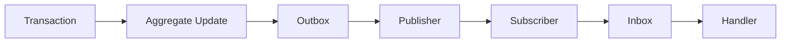
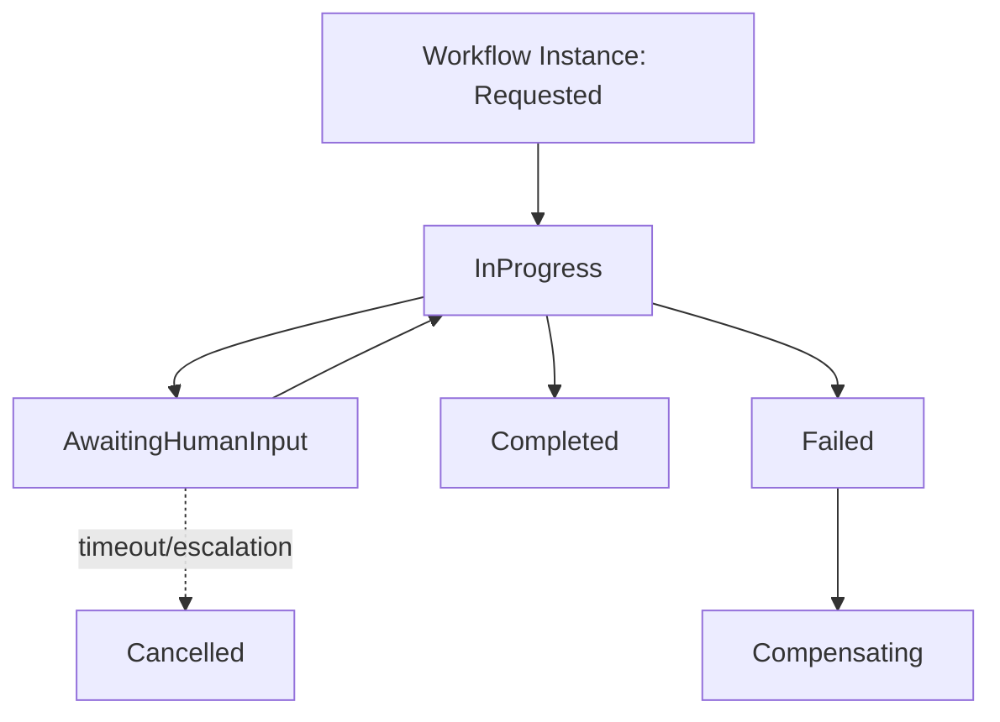
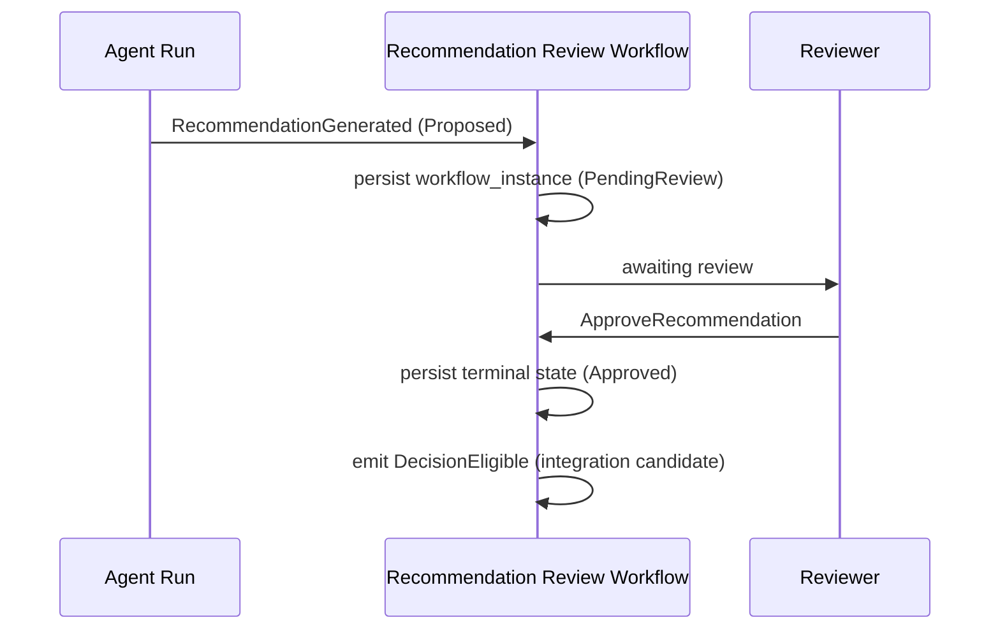

# Event, Outbox, and Workflow Persistence

Companion to `05-canonical-persistence-architecture.md`. Documentary only — no migration, table, queue, or code is created by this document.

## 1. Domain Event Persistence

A domain event is internal to its emitting bounded context and may share a unit of work with the command that caused it (ADR-PMF-026). Not every domain event requires a durable record — a purely in-process event consumed synchronously within the same command handler's transaction may remain transient. A domain event requires a durable record when: it must survive a process crash, it has a consumer in a different bounded context, it feeds audit, or it feeds a workflow that may pause and resume later.

## 2. Integration Events

An integration event is a versioned, cross-context or cross-system contract, created only where a real external or cross-context consumer exists — never a speculative promotion of an internal event "just in case" (ADR-PMF-026 rule 3). PR4's command/query/event catalog identifies the current integration event candidates: `ProjectCreated`, `EvidenceSubmitted`, `MemoryRecordApproved`, `RecommendationGenerated`, `DecisionRecorded`, `DecisionRevoked`, `ActionCompleted`, `OutcomeRecorded`, `EnterpriseKnowledgeRatified`, `EnterpriseKnowledgeRevoked`, `WorkspaceCreated`, `PMOCreated`, `PortfolioCreated`, `ProgramCreated`. Every integration event is versioned (`event_version`) so consumers can support at least the current and immediately prior version during a rollout window.

## 3. Outbox

Durable event publication uses the transactional outbox pattern (ADR-PMF-037): an outbox record is written in the same database transaction as the aggregate mutation it describes, and a separate publisher reads and publishes at-least-once.

`outbox_events` fields: `event_id`, `event_type`, `event_version`, `aggregate_type`, `aggregate_id`, `enterprise_id`, `workspace_id`, `project_id`, `occurred_at`, `payload`, `correlation_id`, `causation_id`, `published_at`, `attempt_count`, `last_error`.

Rules: outbox write is never separated from the aggregate's own transaction; payloads are minimal (enough to act on or to fetch full detail from the canonical record, never a full aggregate dump); no secrets in payloads; publication never silently drops an event; outbox is never a substitute for a generic activity-feed table.

The current schema has no literal outbox table. `platform_events` (`20260616000000`) is the closest existing analog — append-only, `correlation_id`/`causation_id`-bearing, explicitly self-described as an "event sourcing foundation" — and is a reasonable base to extend with outbox semantics (an unpublished/published state, attempt tracking) rather than building a wholly separate table, though that consolidation decision belongs to the migration strategy, not this document.

## 4. Inbox and Idempotency

Consumers deduplicate using an inbox or idempotency record:

**Inbox** fields: source, message ID, event type, received-at, processed-at, result, attempt, error.

**Idempotency record** fields: key, operation, actor, scope, request fingerprint, created-at, expires-at, status, prior-result reference.

Rules: idempotency keys are scoped by tenant and operation — the same key with a different payload is a conflict, not a silent retry acceptance; expiration is use-case-dependent; sensitive prior results are not stored unprotected.

The current schema already demonstrates several independently invented idempotency patterns worth converging toward one model: `quota_reservations.request_id` (two-phase reserve/commit/cancel), `billing_webhook_events.processing_status` (fixing a real prior bug where a crashed handler permanently marked a Stripe event "seen," silently absorbing retries), `agent_execution_dispatch_idempotency` (`idempotency_key` + `idempotency_fingerprint`, unique per `(workspace_id, idempotency_key)`) paired with `agent_execution_dispatch_locks` (named advisory locks), and `pg_advisory_xact_lock` used directly for check-then-insert races (the PMO backfill and `ensure_default_pmo()` RPC). These are real, working solutions to the same underlying problem solved independently each time — a target unified inbox/idempotency model consolidates them, per the migration strategy, rather than adding a fifth independent pattern.

A genuine inbox pattern already exists in one subsystem: `agent_human_review_action_inbox` (`agent_review_queues`/`_items`/`_assignments`/`_decisions`/`_events`/`_action_drafts`) — a human-review inbox for agent-proposed actions awaiting approval. This is a distinct concept from message deduplication (it's a work queue, not a delivery-dedup mechanism) but is cited here as evidence the "inbox" pattern is not foreign to this codebase.

## 5. Delivery Attempts, Retries, Dead Letters

Every outbox publication attempt and every consumer processing attempt is individually recorded (`attempt_count`, `last_error`), not merely overwritten with the latest attempt's outcome. A message or event that repeatedly fails to publish or be consumed is routed to a dead-letter state requiring manual intervention rather than retried indefinitely or silently dropped.

## 6. Workflow Instances

Long-running, multi-step workflows persist their state explicitly (ADR-PMF-038). PR4 defines fourteen workflows (`04-application-workflows.md`): Document Ingestion, Evidence Normalization, Recommendation Generation, Recommendation Review and Approval, Decision-to-Action, Action-to-Outcome, Project Memory Promotion, Enterprise Intelligence Elevation, Agent Run, Project Archival, Workspace Archival, Cross-Workspace Knowledge Ratification, Integration Synchronization, Notification Delivery.

`workflow_instances` fields: `type`, `version`, `scope`, `status`, `current_state`, `trigger`, `started_by`, `correlation_id`, `started_at`, `updated_at`, `completed_at`, `timeout`, `cancellation` reason, `failure_reason`.

## 7. Workflow Steps

`workflow_steps` fields: `name`, `state`, `attempt_count`, `retry_policy`, `started_at`, `completed_at`, `output_reference` (pointer to the canonical record produced/affected — never inlined content), `error`, `compensation_state`.

## 8. Workflow Attempts, Timeouts, Cancellation, Compensation

`workflow_attempts` preserves each retry's outcome individually, never overwritten by a later attempt's result. A workflow's explicit `timeout` field governs whether a paused (especially human-input-pending) step is eventually escalated — no workflow times out a human governance step into a false-success terminal state; timeout handling for a paused human step is an explicit escalation, not a silent auto-approval or auto-rejection. Cancellation is an explicit, recorded terminal transition, not merely stopping execution. Compensation (undoing a partial effect) is tracked per step via `compensation_state`, supporting workflows that must roll back a side effect on failure.

## 9. Correlation and Causation

Every command, event, outbox record, and workflow instance carries a `correlation_id` (grouping everything belonging to one end-to-end operation) and, where triggered by a prior event or command, a `causation_id` (the specific trigger). This is the mechanism that lets a Decision-to-Action-to-Outcome chain, or an Agent Run's full pipeline, be reconstructed end to end for debugging or audit. The current schema's `platform_events` table and the newer `agent_observability_audit_trail`/`agent_execution_request_runtime` tables already use this convention — evidence of convergence toward it, which this architecture formalizes as mandatory rather than optional.

## 10. Replay

Because domain/integration events are durable and versioned, a consumer's projection or read model can be rebuilt by replaying its relevant event history from the outbox/event record store — this is the mechanism underlying "read models are rebuildable" (principle 13 of the main architecture document). Replay is a capability this persistence design enables; it does not require full event sourcing (ADR-PMF-033) because current aggregate state is never solely derived by replay — replay serves read-model reconstruction and audit, not primary state recovery.

## 11. Retention

Event, outbox, inbox, and workflow-attempt records are candidates for partitioning and archival as they grow (per §26 of the main architecture document) — exact retention periods are an open decision (§29), but the category itself (operational/audit-adjacent, high-volume, time-partitionable) is established here.

## 12. Audit Integration

Workflow terminal states, especially for governance-sensitive workflows (Recommendation Review and Approval, Enterprise Intelligence Elevation, Cross-Workspace Knowledge Ratification), produce corresponding `audit_records` entries — a workflow reaching `Approved`/`Rejected`/`EnterpriseRatified`/`Revoked` is itself an auditable act, not merely an internal state transition invisible outside the workflow engine.

## 13. Recovery

On process restart or deployment, in-flight workflow instances resume from their last persisted step state — this is the entire reason workflow state is durable rather than in-memory (ADR-PMF-038). Recovery logic must be idempotent with respect to steps that may have partially executed before a crash, relying on the same idempotency infrastructure (§4) used for event consumption.

## 14. Diagrams

## Scope of This Document

No outbox table, inbox table, workflow-state table, message broker, or workflow engine is created or selected by this document. It defines the persistence contract these future components must satisfy (ADR-PMF-037, ADR-PMF-038) and records the current-state evidence (existing idempotency patterns, `platform_events`, the agent-review inbox) that any future implementation should build from rather than duplicate.
