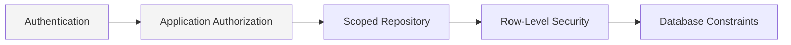

# PR6 Companion — API Security Model

Status: Documentary architecture (no implementation)
Parent: `06-canonical-api-contracts.md`

Purpose: give the full authentication, authorization, tenancy propagation, idempotency, optimistic concurrency, and transport-security contract for the API surface. Builds directly on PR4 §34's authorization model, PR5's tenancy/RLS/defense-in-depth model (ADR-PMF-034, ADR-PMF-042), and PR4's human-authority principle (ADR-PMF-030) — this document adds the API-layer contract for each; it does not redefine the underlying model.

## 1. Authentication

| Mechanism | Status | Caller type | Token/session |
|---|---|---|---|
| Supabase Auth | Current, primary | Human users via web/mobile client | Session JWT, short-lived, refresh-rotated |
| Service accounts | Current concept, API contract formalized here | Background jobs, internal service-to-service calls, Agent Orchestration's own outbound calls | Explicit, auditable service-account credential — **never a shared credential** (PR4 §34) |
| Agent identity | Current concept, API contract formalized here | Agent Runs acting within a requesting actor's delegated scope | Short-lived, run-scoped token, minted at `RequestAgentRun` time, expiring with the run |
| OIDC / future SSO | Open (§33 of the parent document) | Enterprise customers requiring their own identity provider | N/A — future |
| Personal Access Tokens (PATs) | Open (§33 of the parent document) | Future developer/integration self-service use | N/A — future |

Every authenticated request resolves to exactly one of: a human actor, a service account, or an Agent Run acting on behalf of a requesting actor (§16). No request is anonymous except narrowly designated public endpoints (health checks; any future public marketplace surface remains open, §33 of the parent document).

**Authentication is verified in the inbound API port, before translation to a Command or Query** (§5 of the parent document) — signature, expiry, issuer, and audience are all checked; a failure returns `401 Unauthorized` (`06-error-model.md` §4), not any of the fourteen domain error categories.

## 2. Authorization

Authorization reuses PR4's multi-layer model in full (`04-canonical-application-architecture.md` §34) — identity, Enterprise membership, Workspace membership, role, entity relationship, action permission, data classification, policy, ownership, delegated authority, time-bound access. The API command/query port's only responsibility is invoking the existing application-layer authorization check and failing closed on any ambiguity or evaluation error; it never reimplements a parallel authorization check of its own.

### 2.1 Roles and Capabilities

| Concept | Scope | Notes |
|---|---|---|
| Enterprise role | Enterprise | e.g., Enterprise Administrator |
| Workspace role | Workspace | Observed values today: `owner`, `admin`, `pm`, `viewer` (`workspace_memberships`, PR5 §24 current-state) |
| PMO role | PMO (within Workspace) | Governance-scoped |
| Project role | Project | Execution-scoped |
| Capability | Named, grantable permission | Fine-grained, resource-level, or time-boxed grant, layered on top of role (capability-grant model) |
| Policy | Named, evaluable rule | e.g., `RecommendationApprovalPolicy`, `DecisionAuthorityPolicy`, `ActionCreationPolicy`, `KnowledgeElevationPolicy`, `AgentExecutionPolicy` — every policy name referenced in `06-command-catalog.md` is defined once here as a concept, evaluated by the application layer, never re-derived by the API layer |
| Service Account | Explicit, auditable identity | Never a shared credential (PR4 §34) |
| Agent | Inherits requesting actor's scope | Never a broader scope than the requester (PR4 §34) |
| Support Access | Explicit, time-bound, audited | Never a silent, unscoped superuser bypass (ADR-PMF-042 rule 9) |

### 2.2 Current-State Gap (inherited from PR4 §34, not resolved by this PR)

Three parallel, unconsolidated authorization models currently exist: (1) simple RBAC via `workspace_memberships`; (2) a capability-grant/request/revocation model (`capability_grants`, `capability_requests`, `capability_policies`, `capability_revocation_registry`); (3) an authority-delegation/escalation model (`authority_delegations`, `authority_escalations`, `authority_registrations`, `governance_delegations`) plus agent-specific scoping (`ai_agent_permissions`, `ai_agent_scopes`). The API layer's authorization check is designed to be insulated from which of these three the application layer resolves against at any given time (mirroring the migration-insulation principle already stated for persistence phases, ADR-PMF-044 API Implications) — consolidation is migration-strategy work, not resolved here.

### 2.3 Human Authority Boundary (ADR-PMF-030, API-enforced)

- `ApproveRecommendation`, `RecordDecision`, `CreateActionFromDecision`, and `RecordOutcome` are four distinct endpoints; no composite endpoint performs more than one in a single call (binding, restated from ADR-PMF-030's own API Implications).
- None of the four is callable by an Agent identity, under any authorization grant — this is enforced at the API command port, not left to policy evaluation alone, as a defense-in-depth measure consistent with ADR-PMF-042's layered-failure-closed posture.
- `ApproveMemoryRecord`/`RejectMemoryRecord` and `RatifyEnterpriseKnowledge`/`RevokeEnterpriseKnowledge` carry the same restriction.

### 2.4 Agent Authorization Boundary (ADR-PMF-027, API-enforced)

An Agent identity's token (§1) is scoped, at mint time, to exactly the four Commands ADR-PMF-027 names (`RequestAgentRun`, `CancelAgentRun`, `ApproveAgentProposal`, `RejectAgentProposal`) and to the requesting actor's own Workspace/Project scope — never wider. The API command port rejects any Agent-identity-authenticated call to a Command outside this set with `AuthorizationError`, independent of whatever the underlying policy evaluation would otherwise return, as a second, API-layer enforcement point.

## 3. Tenancy Propagation

Every request resolves `enterprise_id` and `workspace_id`, and `project_id` where applicable, **entirely server-side**:

1. From the authenticated actor's session/token (their own Enterprise/Workspace memberships), for requests that create or list top-level scoped resources.
2. From the target resource's own parent chain, for requests addressing an existing resource or its children (e.g., a Task's Workspace is derived from its Project, never accepted as a client-supplied field) — this is ADR-PMF-034's binding API implication, enforced without exception.
3. A request whose resolved scope cannot be established fails closed with `AuthorizationError`, never proceeds with a partial or assumed scope.
4. No endpoint accepts an implicit or explicit cross-Workspace query. The sole exception is the Enterprise Intelligence elevation surface (`06-api-resource-catalog.md` §13), which requires its own dedicated, separately authorized endpoint design and explicit per-Workspace consent (PR5 §7 rule 11) — it is never reached via an ordinary Workspace-scoped filter parameter.
5. `enterprise_id` membership alone never authorizes a Workspace-scoped request (PR5 §7 rule 8, ADR-PMF-042).

This complements, and never substitutes for, PR5's RLS defense-in-depth chain (§6 below).

## 4. Idempotency

| Element | Contract |
|---|---|
| Header | `Idempotency-Key`, client-generated, opaque string |
| Scope | `(actor or service account, Command, resolved tenant scope, key)` — the same key under a different actor or scope is a different idempotency record |
| TTL | Command-specific, sourced from PR5's idempotency-record model (PR5 §21, ADR-PMF-037); exact values open (§33 of the parent document) |
| Replay (same key, same payload, within TTL) | Returns the original result without re-executing side effects |
| Conflict (same key, different payload) | Returns `ConflictError` (`06-error-model.md`) — never a silent overwrite or a silently different result |
| Expiry (same key, after TTL) | Treated as a new request |

Idempotency is required for every Command `06-command-catalog.md` flags "Yes," and always recommended for any Command a client might plausibly retry after a timeout — a client should never need to guess whether retrying a timed-out mutating request is safe.

## 5. Optimistic Concurrency

| Element | Contract |
|---|---|
| Version exposure | `ETag` header on every Response DTO for a resource backed by a PR5-versioned aggregate (PR5 §14: Project, Task, Risk, Issue, Recommendation, Decision, Action, Project Memory Record, Enterprise Knowledge Record, policy/configuration records) |
| Mutation precondition | `If-Match` header, required on mutating requests to versioned resources |
| Mismatch | `StaleVersionError` (`06-error-model.md`) — the caller must refetch the current state and reapply its change, never silently overwrite |
| Append-only/versioned-by-supersession resources | Decision's history and Audit do not use `If-Match` the same way — their protection is against concurrent conflicting *creation*, not overwrite (PR5 §14) |

## 6. Defense in Depth (API's Position in the Chain)

The API layer is the outermost of five independently fail-closed layers PR5 already established (ADR-PMF-042): **Authentication → Application Authorization → Scoped Repository → RLS → Database Constraints.** The API command/query port performs Authentication (§1) and invokes Application Authorization (§2) — it never assumes RLS or database constraints will catch what it misses, and it never exposes a direct-database-access pattern to end clients that would rely on RLS as the sole authorization mechanism (ADR-PMF-042's binding API implication).

## 7. Security

- **CSRF:** required for browser-originated, session-authenticated (cookie-based) requests; not applicable to bearer-token-authenticated service/Agent calls.
- **JWT validation:** signature, expiry, issuer, and audience checked on every authenticated request (§1); an Agent-identity token additionally carries and is validated against its scoping claim (§2.4).
- **Replay protection:** nonce/timestamp on signed requests (webhook deliveries per `06-event-catalog.md` §3.2, service-to-service calls); a stale timestamp is rejected regardless of signature validity.
- **Input validation:** wire-format and shape validation at the API boundary (§3 principle 15 of the parent document); domain validation remains entirely in the application layer and is never duplicated or diverged from at the API layer.
- **Output encoding:** response bodies are encoded appropriately for their declared content type; no endpoint returns unescaped user-supplied content into a context (e.g., a rendered HTML fragment) where it could execute.
- **Secrets:** never appear in a request/response body, query string, or log (PR5 §23) — webhook signing secrets, service-account credentials, and Agent tokens are issued once and never echoed back.
- **Least privilege:** every service account and Agent identity is scoped to exactly what its stated purpose requires, reviewed as narrowly as the outbound ports they're permitted to reach (ADR-PMF-031's per-port security classification).

Full transport-security detail (rate limiting dimensions, observability fields): `06-canonical-api-contracts.md` §25–27.

---

## Validation Notes

The authorization layers, role/policy vocabulary, human-authority boundary, and defense-in-depth chain in this document are taken verbatim from PR4 §34, ADR-PMF-030, ADR-PMF-027, and ADR-PMF-042. The specific API-layer mechanics — token scoping, idempotency header contract, `ETag`/`If-Match` contract, and the API-layer enforcement points in §2.3–2.4 — are this PR's original contribution.
