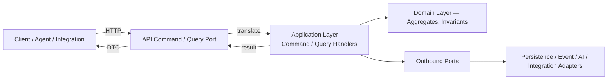
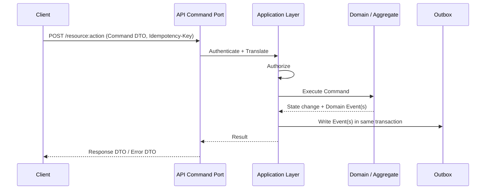
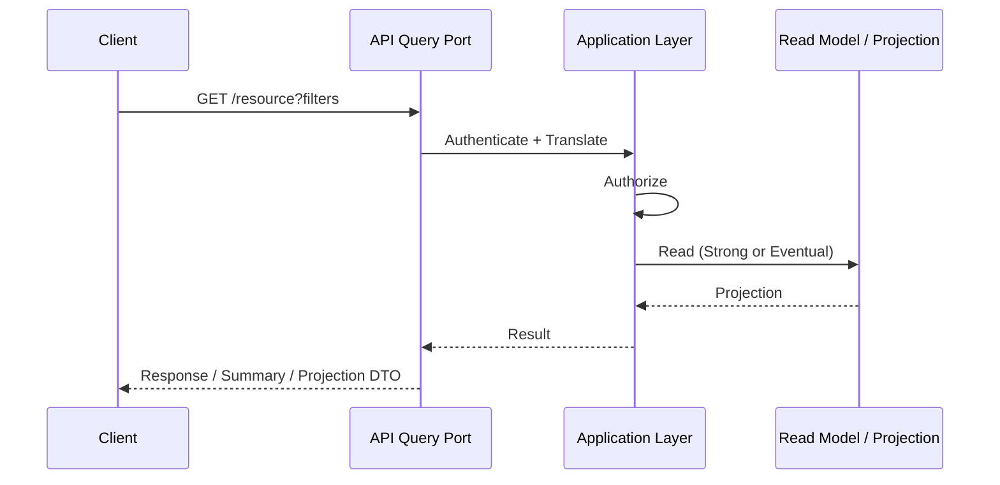
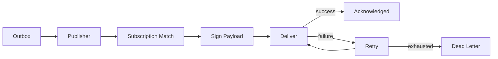
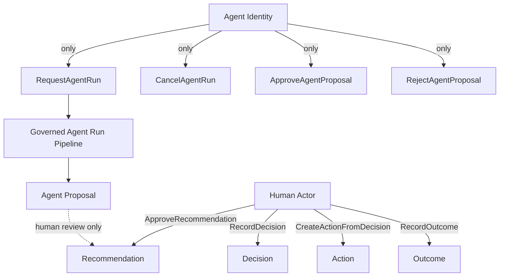

# PR6 — Canonical API Contracts

Status: Documentary architecture (no implementation)
Authority order: `01-canonical-domain-model.md` → `01.1-domain-ratification.md` → `02-canonical-product-language.md` → `03-canonical-information-architecture.md` → `04-canonical-application-architecture.md` and its companion catalogs → `docs/adr/ADR-PMF-001` through `ADR-PMF-032` → `05-canonical-persistence-architecture.md` and its companions → `ADR-PMF-033` through `ADR-PMF-044` → this document and its companions (`06-*`) and `ADR-PMF-045` through `ADR-PMF-056`.

Companion documents:
- `06-api-resource-catalog.md` — full resource model and per-resource endpoint catalog
- `06-command-catalog.md` — full Command API (request, validation, authorization, side effects, emitted events per Command)
- `06-query-catalog.md` — full Query API (request, response, authorization, consistency per Query)
- `06-event-catalog.md` — event publication catalog and webhook strategy
- `06-error-model.md` — full API error catalog, HTTP mapping, retry classification
- `06-api-security-model.md` — authentication, authorization, tenancy propagation, idempotency, concurrency, transport security

---

## 1. Executive Summary

PR1 through PR5 ratified what PMFreak *is*: its domain, its language, its screens and journeys, its application architecture (bounded contexts, Commands, Queries, Events, workflows), and its persistence model. None of them specify how a client outside the application process — a browser, a mobile client, an integration, an autonomous agent, a future partner system — invokes any of it. Left unspecified, that gap gets filled the same way the current-state persistence inspection found 423 tables filled it: by accretion, one route handler and one ad hoc shape at a time, until the API surface no longer reflects the domain it was meant to expose. PR6 exists to write the API contract before PR7 (frontend) and PR9+ (implementation) give that gap a shape that would be far more expensive to unwind later.

**The domain must not depend on the transport.** A Command, a Query, and the aggregate they act on were defined in PR4 with no reference to HTTP, JSON, or any wire format — that was deliberate (ADR-PMF-025, ADR-PMF-031). If REST were replaced tomorrow by GraphQL, gRPC, or something not yet invented, every Command, Query, Event, aggregate, and invariant ratified in PR1–PR5 would still hold, unchanged. That is the test this PR's API principles must pass: nothing here may leak into the domain, and nothing in the domain may depend on this.

**REST does not define the domain — it exposes it.** REST is chosen (§4) as the primary transport because it is well understood, cacheable, tooling-rich, and maps cleanly onto the Command/Query separation PR4 already ratified. But REST's resource-and-verb shape is a *rendering* of the domain's Commands, Queries, and aggregates — never the other way around. An endpoint is not created because a table exists; a table does not exist because an endpoint needs it (that ordering violation was named explicitly as a Layering Violation in PR4 §7.3, and this PR does not reopen it).

**GraphQL is not obligatory.** Nothing about PMFreak's domain requires a single flexible query language at the edge. GraphQL remains a legitimate future option (§4) if evidence of a specific unmet need (e.g., a frontend or partner integration genuinely blocked by REST's fixed shapes) emerges — it is not adopted here, and it is not rejected outright either.

**The frontend must never know a table.** PR7's screens (PR3) consume Response DTOs and Query results, not persistence rows. A Recommendation Response DTO omits `model_provider` internals a screen doesn't need and never leaks a foreign-key column that only exists for referential integrity; the DTO's shape is designed for its consuming screen and its authorization context, not copied from `05-canonical-data-model.md`.

**A DTO is not an Aggregate.** An Aggregate (PR4 §12, PR5 §8) is a transactional consistency boundary with internal invariants, private state, and a version. A DTO is a wire-format projection of some or all of an aggregate's state, shaped for one direction (request in, response out) and one consumer. Conflating the two — serializing an aggregate directly onto the wire — has historically been how internal implementation details, cross-tenant leakage, and accidental coupling enter an API; PR6 forbids it explicitly (§9).

This PR formalizes: API philosophy and principles; API style (REST primary, events secondary, GraphQL open); the resource model and endpoint catalog for every PR4-ratified aggregate; the Command and Query APIs (every Command and Query from `04-command-query-event-catalog.md`, given a wire contract); DTO philosophy; pagination, filtering, sorting, and search; authentication and authorization; tenancy propagation; idempotency and optimistic concurrency; the error model; versioning; event publication and webhook strategy; Agent and Workflow APIs; observability; rate limiting; security; OpenAPI and SDK strategy; and an API maturity model. It also states, explicitly, what remains open (§33) rather than guessing.

What this PR does not do: it does not create a single endpoint, route handler, controller, or schema; it does not modify Next.js, React, Supabase, or RLS; it does not generate a real OpenAPI document; it does not resolve every open API question — GraphQL, gRPC, a public developer API, a marketplace API, and OAuth apps all remain explicitly open (§33), to be resolved with evidence during PR9+, not guessed here.

## 2. Purpose

This document exists to make several distinctions explicit, because PR4 and PR5 already show what happens when they are left implicit:

- **Commands mutate, Queries never do — at the wire boundary too.** PR4's Command/Query separation (ADR-PMF-025) is a domain-layer rule; PR6 must carry that guarantee across the wire without weakening it. A `GET` that silently updates `last_viewed_at` is exactly the kind of "harmless" read-side effect ADR-PMF-025 already prohibits at the application layer — the API layer must not reintroduce it at the transport layer.
- **A URL is not a database table.** `/projects/{id}` names the Project resource (an aggregate exposed as a resource, PR4 §12); it does not name the `projects` table, and its shape is never derived by inspecting `05-canonical-data-model.md` directly.
- **The API layer contains no business logic.** Per ADR-PMF-031 rule 2, every inbound port — including API command ports and API query ports — has exactly one job: authenticate the caller, translate the request into a Command or Query, and translate the result back. Validation beyond wire-format correctness, authorization, and every domain rule live in the application and domain layers PR4 already defined; PR6 does not duplicate them here, only names where each responsibility is discharged (§3, principle 14).
- **Tenancy is resolved by the server, never trusted from the client.** ADR-PMF-034's API implication is explicit: no endpoint accepts a caller-supplied `workspace_id` for a record whose Workspace is otherwise determined by its parent. PR6 formalizes this as a binding rule (§16), not a suggestion.
- **Authorization evaluates before validation's side effects, and both evaluate before execution.** PR4 §38 already fixed authorization-before-validation ordering to avoid leaking existence/validity information to unauthorized callers; PR6's Command and Query API (companions) inherit that ordering exactly (§23, `06-error-model.md`).
- **Approval boundaries are endpoints, not options on an endpoint.** ADR-PMF-030's API implication is explicit and binding: `ApproveRecommendation`, `RecordDecision`, `CreateActionFromDecision`, and `RecordOutcome` are four distinct operations; no composite endpoint may perform more than one in a single call (`06-command-catalog.md`).
- **An Agent is a distinctly scoped caller, never an implicit human.** ADR-PMF-027's API implication restricts agent-facing mutation to exactly four Commands (`RequestAgentRun`, `CancelAgentRun`, `ApproveAgentProposal`, `RejectAgentProposal`); PR6's authorization model (§15, `06-api-security-model.md`) enforces this at the API boundary, not merely by convention.

## 3. API Principles

These principles are binding for every canonical API decision made under this PR and every later implementation PR, unless superseded by a future ADR:

1. **API Follows Domain.** Every endpoint corresponds to a Command, a Query, or a resource already ratified in PR1–PR4. No endpoint is designed first and back-filled into the domain (ADR-PMF-045).
2. **Transport Is Replaceable.** The Command/Query/Event/aggregate contract does not depend on REST, GraphQL, or any specific wire format. Swapping transport must not require redesigning the domain (ADR-PMF-031, ADR-PMF-045).
3. **Commands Mutate.** Every Command endpoint changes state, is explicit about what it changes, and returns confirmation, not raw persistence rows (ADR-PMF-047).
4. **Queries Never Mutate.** No Query endpoint — including "harmless" telemetry side effects — writes state (ADR-PMF-025, ADR-PMF-047).
5. **Resources Are Stable.** A resource name and its identifier persist across implementation changes to the underlying persistence model; migration-strategy phases (PR5 §25) are invisible to API consumers (ADR-PMF-046).
6. **URLs Are Not Database Tables.** Resource URLs name domain concepts (PR1–PR4), never literal table names (§2, ADR-PMF-046).
7. **DTOs Are Not Persistence Models.** Every request and response body is an explicitly designed DTO, never a serialized aggregate or table row (§9).
8. **APIs Are Tenant-Scoped.** Every request resolves `enterprise_id`/`workspace_id`/`project_id` server-side; no query or Command executes without a resolvable scope (§16, ADR-PMF-034).
9. **APIs Are Versioned.** No breaking change ships without a version increment and a deprecation path (§20, ADR-PMF-048).
10. **APIs Are Observable.** Every request carries a Correlation ID, Trace ID, Request ID, resolved actor, and resolved Workspace, and every response is measurable for latency and status (§25, ADR-PMF-053).
11. **APIs Are Secure by Default.** No endpoint is reachable without authentication unless explicitly and narrowly designated public; authorization is evaluated before business logic runs (§14–15, ADR-PMF-050, ADR-PMF-055).
12. **APIs Are Idempotent Where Required.** Every Command capable of an unsafe retry (payment-adjacent, side-effecting, or explicitly flagged in `06-command-catalog.md`) accepts an `Idempotency-Key` (§17, ADR-PMF-054).
13. **Errors Are Explicit.** Every error returned maps to the canonical error catalog (`06-error-model.md`); no endpoint invents an ad hoc error shape (ADR-PMF-049).
14. **Authorization Before Execution.** No Command or Query begins domain execution before authorization succeeds (§15, PR4 §38).
15. **Validation Before Authorization Side Effects.** Wire-format and request-shape validation happens before authorization is evaluated only insofar as it does not leak information about resources the caller is not authorized to know exist; PR4's authorization-before-validation ordering for domain rules is preserved unchanged (§2, `06-error-model.md`).
16. **Contracts Before Implementation.** This document and its companions exist before a single endpoint is implemented, and any implementation PR that contradicts them requires an explicit superseding ADR, not a silent deviation.

## 4. API Style

**Primary: REST.** Resource-oriented HTTP, JSON request/response bodies, standard HTTP verbs and status codes, resources mapped from PR4's aggregates and PR1's domain entities. Chosen because it is cacheable, universally tooled, maps cleanly onto Command/Query separation (Commands as `POST`/`PUT`/`PATCH`/`DELETE`, Queries as `GET`), and requires no new client-side query runtime for PR7's frontend (ADR-PMF-046).

**Secondary: Event-driven.** Domain and Integration Events (PR4 §26, `04-command-query-event-catalog.md`) are published via the transactional outbox (ADR-PMF-037) and made available to internal consumers directly and to external consumers via signed webhooks (§22, `06-event-catalog.md`). Event-driven is secondary, not competing with REST — REST is synchronous request/response for Commands and Queries; events are the asynchronous notification layer for state changes and cross-context integration.

**Future: GraphQL, only if justified.** Not adopted at this stage. A future adoption requires a documented, evidence-based need — e.g., a screen or partner integration that REST's fixed-shape resources cannot serve without an unacceptable number of round trips — evaluated against REST's existing composite Query endpoints (`GetProjectCommandCenter`-style Queries already solve most "many resources, one screen" cases without GraphQL, `06-query-catalog.md`).

**No RPC proliferation.** Commands are exposed as action-oriented endpoints on resources (e.g., `POST /projects/{id}:archive`) or as dedicated Command resources where the action does not map to a single resource (e.g., `POST /recommendations/{id}:approve`) — never as an unbounded set of ad hoc RPC-style endpoints disconnected from the resource model.

**One lifecycle-action convention, chosen and applied consistently.** Two conceptual conventions were considered for lifecycle actions: subresource-style (`POST /recommendations/{id}/approvals`) and action-suffix style (`POST /recommendations/{id}:approve`). PR6 adopts action-suffix style exclusively, applied identically across every Command catalogued in `06-command-catalog.md` and every action listed in `06-api-resource-catalog.md` — the two styles are never mixed within this contract.

**No CRUD-first design.** Endpoints are not "give every table a CRUD interface." Several aggregates deliberately expose only a subset of CRUD-shaped operations (e.g., Decision has no `PATCH` — rationale content is never destructively edited per ADR-PMF-036 — only `RecordDecision` and `RevokeDecision`, `06-command-catalog.md`); the Command catalog is the source of truth for what an aggregate's API surface actually permits, not a generic CRUD template.

## 5. API Sits at the Inbound Port Boundary

Per ADR-PMF-031, the API is one of several inbound adapters (alongside web use-case routes, background jobs, scheduled tasks, webhook receivers, and agent-triggered requests), each implementing a named inbound port: **API command ports** and **API query ports** (distinct from web use-case ports, even where both ultimately invoke the same Command or Query). An inbound port's only responsibility is: authenticate the caller, translate the request into a Command or Query, invoke it, translate the result back. It contains no business logic, no validation beyond wire-format correctness, and no authorization decision beyond calling the application layer's authorization check.

## 6. Resource Model (Summary)

Full resource model and per-resource endpoint catalog: `06-api-resource-catalog.md`. Twenty resources are exposed, one per PR4/PR1-ratified concept: Enterprise, Workspace, PMO, Portfolio, Program, Project, Recommendation, Decision, Action, Outcome, Evidence, Project Memory, Enterprise Knowledge, Workflow, Agent, Agent Run, Audit, Notification, Integration, and the cross-cutting Search resource. Task, Milestone, Risk, Issue, and Stakeholder are exposed as Project-scoped sub-resources rather than top-level resources, reflecting their PR4 ownership (owned by Project Management/Work Execution/Schedule and Milestones/RAID Management/Stakeholder and Communication Management, always resolved through their owning Project).

Resource identity uses the same canonical identifiers PR5 §6 already fixed (`project_id`, `recommendation_id`, etc.) — an API resource is never identified by a slug, name, or database row number where a canonical ID exists.

## 7. Command API (Summary)

Full catalog (every Command from `04-command-query-event-catalog.md`, with request/response DTO, validation, authorization, side effects, and emitted events): `06-command-catalog.md`.

Every Command endpoint:
- Maps 1:1 to a PR4-catalogued Command — no endpoint invents a Command PR4 did not already name.
- Accepts a Command DTO (§9), never an aggregate.
- Evaluates authorization before domain execution (§15, PR4 §38).
- Returns a Response DTO confirming the result — an updated resource projection, a created identifier, or an explicit acknowledgment — never a raw row.
- Documents every event it may emit, sourced from `04-command-query-event-catalog.md` — no endpoint emits an event PR4 did not already catalogue for that Command.
- Is idempotent where `06-command-catalog.md` flags it (§17).

The four-Command approval chain (`ApproveRecommendation` → `RecordDecision` → `CreateActionFromDecision` → `RecordOutcome`) is exposed as four distinct endpoints per ADR-PMF-030's binding API implication; no composite "approve and decide" endpoint exists.

## 8. Query API (Summary)

Full catalog (every Query from `04-command-query-event-catalog.md`, with request filters, response DTO, authorization, and consistency expectation): `06-query-catalog.md`.

Every Query endpoint:
- Maps 1:1 to a PR4-catalogued Query.
- Is side-effect free — no Query endpoint writes state, including telemetry writes that could be mistaken for harmless (§2, ADR-PMF-025).
- Returns a Response, Summary, Projection, Search, or Feed DTO (§9), shaped for its consumer, never a domain aggregate.
- Documents its consistency expectation (Strong or Eventual, inherited from PR4 §24) so consumers do not assume Strong consistency from a Query PR4 already classified as Eventual (e.g., Command Center projections, Search).
- Redacts rather than errors when the caller lacks field-level visibility into part of an otherwise-authorized result (sensitive-field Queries: `GetProjectMemory`, `GetEnterpriseIntelligence`, `GetKnowledgeLineage`, `GetAuditTrail`).

## 9. DTO Philosophy

**A DTO is never a domain entity or a persistence row.** Every DTO is purpose-built for one direction and one consumer context.

| DTO kind | Direction | Purpose |
|---|---|---|
| Request DTO | Inbound | Shape of a Command or Query's input; validated for wire-format correctness before invoking the application layer |
| Response DTO | Outbound | Full detail view of a single resource, shaped for its consuming screen/integration, never a raw aggregate |
| Summary DTO | Outbound | Reduced-field view for list/collection endpoints — avoids over-fetching detail fields a list view never renders |
| Projection DTO | Outbound | Shape of a read-model/Command Center/health/feed Query result; explicitly carries a projection version and staleness indicator (PR5 §20) |
| Search DTO | Outbound | Shape of a search result — always references the canonical record and version (PR5 §41), never returns an embedding (§13) |
| Feed DTO | Outbound | Shape of a Project Intelligence Feed item — canonical source type/ID, timestamp, actor, scope, category (PR5 §22) |
| Command DTO | Inbound | Shape of a Command's request payload — imperative, narrow, matches exactly the fields that Command's validation requires, never a partial-aggregate PATCH bag |
| Error DTO | Outbound | Canonical error shape (`06-error-model.md`) — code, category, user-safe message, correlation ID, retryable flag |

**Binding rules:**
1. No DTO is generated by reflecting over a database table or ORM model — every DTO is explicitly authored against its Command/Query/resource contract.
2. A Response DTO never includes a field solely because the underlying table has it; it includes a field because a consumer needs it.
3. A Request DTO for a Command includes exactly the fields that Command's catalogued validation (`06-command-catalog.md`) requires — no generic "send the whole resource back" PATCH semantics for Commands where PR4/PR5 already restrict what may change (e.g., Decision's rationale is never received as a mutable Request DTO field; only `RevokeDecision`'s reason is, per ADR-PMF-036).
4. Internal identifiers with no external meaning (e.g., an internal foreign key existing purely for RLS denormalization, PR5 §7 rule 7) are never exposed in a Response DTO unless the consumer has an actual use for them.
5. Every DTO used by more than one endpoint is named and versioned once, not redefined inline per endpoint.
6. Sensitive/classified fields (PR5 §45 classification levels) are included in a DTO only when the DTO's authorization context supports that classification; a DTO is never designed at the highest classification "just in case" and filtered ad hoc at runtime — the DTO shape itself reflects the classification boundary.

## 10. Pagination

**Cursor pagination is the default** for all collection and search endpoints. A cursor is an opaque, server-issued token encoding sort position — never a raw offset, row ID, or timestamp a client could construct or manipulate.

**Keyset pagination** underlies cursor pagination's implementation for large, frequently-mutating collections (e.g., `ListActions`, `GetAuditTrail`) where offset pagination would double-count or skip rows under concurrent writes.

**Offset pagination is acceptable only** for small, rarely-mutating, or already-fully-loaded collections where total count and jump-to-page are a genuine product need and the collection size makes the correctness risk negligible (e.g., a Workspace's PMO list). It is never the default and never used for any collection PR4 classifies as high-volume or high-mutation (Task, Audit Record, Notification, Agent Run).

Every paginated response includes: `next_cursor` (nullable), `has_more`, and, where the endpoint explicitly supports it, an approximate `total_count` (never guaranteed exact for Eventually-consistent projections, PR4 §24).

## 11. Filtering

Standard filter parameters, applied where the resource supports them: `status`, `owner`, `workspace_id` (resolved server-side, never a filter override — §16), `portfolio_id`, `program_id`, `tags`, `classification` (subject to caller's authorized classification ceiling), `created_after`, `updated_after`. Resource-specific filters (e.g., Recommendation's `confidence` threshold, Agent Run's `agent_id`) are documented per endpoint in `06-api-resource-catalog.md` and `06-query-catalog.md`.

Filters never allow a caller to widen scope beyond what authorization already permits (§15) — a `workspace_id` filter, where accepted at all, may only narrow within the caller's already-authorized scope, never substitute for it.

## 12. Sorting

Default sort is resource-specific and documented per endpoint (typically `created_at desc` for activity-shaped resources, `updated_at desc` for Command Center/feed-shaped resources). Sortable fields are an explicit allowlist per resource, never arbitrary column names — this both prevents leaking internal column names and keeps sort compatible with keyset pagination (§10). Multi-field sort is supported where the resource's access pattern requires stable ordering (e.g., `status, created_at`).

## 13. Search

Three distinct search capabilities, never conflated:

1. **Lookup** — exact or near-exact identifier/key resolution (e.g., a Project key). Synchronous, Strong consistency where the underlying resource is Strong (PR4 §24).
2. **Full-text search** — `SearchWorkspace`/`SearchProject` Queries (`06-query-catalog.md`), backed by PR5's derived, rebuildable full-text indexes (ADR-PMF-041). Eventual consistency, explicitly documented as such in the response.
3. **Semantic search** — retrieval over Project Memory/Enterprise Intelligence for Agent context assembly (PR4 Agent Run pipeline) and, where a product need is evidenced, user-facing semantic search. Also Eventual, also backed by PR5's derived vector indexes.

**Embeddings are never returned by any API response**, under any endpoint, at any authorization level (PR5 principle 12, ADR-PMF-041) — a Search DTO returns the canonical record reference, a relevance/similarity score, and a highlighted excerpt, never the vector itself.

## 14. Authentication

| Mechanism | Status | Caller type |
|---|---|---|
| Supabase Auth (session/JWT) | Current, primary | Human users via web/mobile client |
| Service accounts | Current concept, API contract formalized here | Background jobs, internal service-to-service calls, Agent Orchestration's own outbound calls |
| Agent identity | Current concept, API contract formalized here | Agent Runs acting within a requesting actor's delegated scope (never a broader scope, PR4 §34) |
| OIDC / future SSO | Open, evidence-gated | Enterprise customers requiring their own identity provider |
| Personal Access Tokens (PATs) | Open, evidence-gated | Future developer/integration self-service use |

Every authenticated request resolves to exactly one of: a human actor, a service account, or an Agent Run acting on behalf of a requesting actor. No request is anonymous except the narrow, explicitly designated public endpoints (health checks, and any future public marketplace surface — §33). Full treatment: `06-api-security-model.md`.

## 15. Authorization

Authorization is evaluated using the same multi-layer model PR4 already ratified (§34 of `04-canonical-application-architecture.md`) — identity, Enterprise membership, Workspace membership, role, entity relationship, action permission, data classification, policy, ownership, delegated authority, time-bound access — never a single RBAC check reimplemented at the API layer. The API command/query port's only authorization responsibility is invoking this existing application-layer check and failing closed if it errors or is ambiguous (§3 principle 14).

**Concepts formalized for the API surface:** Enterprise-scoped roles, Workspace-scoped roles, PMO-scoped roles, Project-scoped roles, Capability (a named, grantable permission), Policy (a named, evaluable rule — e.g., `RecommendationApprovalPolicy`), Service Account (explicit, auditable, non-shared identity), Agent (inherits the scope of its requesting actor, never broader), Support Access (explicit, time-bound, audited elevated access for platform support — never a silent superuser bypass, ADR-PMF-042 rule 9).

Full authorization model, including the API-facing consequences of PR4's three-parallel-models current-state gap (RBAC/`workspace_memberships`, capability-grant, authority-delegation): `06-api-security-model.md`.

## 16. Tenancy Propagation

Every request resolves `enterprise_id` and `workspace_id`, and `project_id` where the resource is Project-scoped, **entirely server-side** — from the authenticated actor's session/token and from the resource's own parent chain, never from a client-supplied field (ADR-PMF-034's binding API implication).

Rules:
1. A nested resource's Workspace (e.g., a Task's Workspace, derived from its Project) is never accepted as client input — the server derives it from the parent resource.
2. No endpoint accepts an implicit or explicit cross-Workspace query; the sole exception is the Enterprise Intelligence elevation surface, which requires its own dedicated, separately authorized endpoint design (§27 reference, PR5 §7 rule 11).
3. A request whose resolved scope cannot be established fails closed with `AuthorizationError`, never proceeds with a partial or assumed scope.
4. `enterprise_id` membership alone never authorizes a Workspace-scoped request (PR5 §7 rule 8, ADR-PMF-042).

## 17. Idempotency

Commands flagged in `06-command-catalog.md` as idempotency-required (aligned with PR4's per-Command idempotency-key catalog, `04-command-query-event-catalog.md` §5) accept an `Idempotency-Key` header.

- **TTL:** the idempotency record's validity window is scoped per Command per PR5's idempotency-record model (PR5 §21, ADR-PMF-037) — exact TTL values are open (§33), the mechanism is not.
- **Conflict behavior:** the same key replayed with a different request payload returns `ConflictError` (`06-error-model.md`), never a silent overwrite or a silently different result.
- **Replay:** the same key replayed with an identical payload within the TTL returns the original result without re-executing the Command's side effects.

Full model: `06-api-security-model.md`, ADR-PMF-054.

## 18. Optimistic Concurrency

Resources backed by a PR5-versioned aggregate (Project, Task, Risk, Issue, Recommendation, Decision, Action, Project Memory Record, Enterprise Knowledge Record, policy/configuration records — PR5 §14) expose their `version` via `ETag`. Mutating requests supply `If-Match`; a mismatch returns `StaleVersionError` (`06-error-model.md`) rather than silently overwriting a concurrent change. Append-only/versioned-by-supersession resources (Decision's history, Audit) do not use `If-Match` the same way — their protection is against concurrent conflicting *creation*, not overwrite, consistent with PR5 §14's distinction.

## 19. Error Model (Summary)

Full catalog, HTTP mapping, and retry classification: `06-error-model.md`. Every API error maps to one of PR4's fourteen canonical error categories (`04-canonical-application-architecture.md` §38: `ValidationError`, `AuthorizationError`, `NotFoundError`, `ConflictError`, `InvariantViolation`, `PolicyViolation`, `StaleVersionError`, `DependencyUnavailable`, `RateLimitExceeded`, `WorkflowTimeout`, `AgentExecutionError`, `IntegrationError`, `DataIntegrityError`, `UnexpectedError`) — the API layer adds an HTTP status mapping and wire shape, it does not invent new error semantics. No endpoint returns an error outside the set `06-command-catalog.md`/`06-query-catalog.md` document for it, mirroring PR4 §4's per-Command/Query binding rule.

## 20. API Versioning

**URI versioning** (`/v1/...`) is the primary mechanism for major, breaking changes to a resource's shape or a Command/Query's contract. **Header versioning** (`Accept`/custom version header) is reserved for minor, additive, non-breaking evolution within a major version, where a client may opt into new optional fields without a URI change.

A version is **deprecated** with an explicit `Deprecation` header and a published sunset date before it is ever removed; **sunset** follows a minimum notice period (exact period open, §33); backward compatibility within a major version is additive-only (new optional fields, new endpoints) — never a silent breaking change to an existing field's type or meaning. Full policy: ADR-PMF-048.

## 21. Event Publication (Summary)

Full catalog and delivery model: `06-event-catalog.md`. Domain Events (internal, cross-context within the platform), Integration Events (the explicit PR4-catalogued subset intended for external/cross-boundary consumption, `04-command-query-event-catalog.md` §8), and Notification Events (drive the Notification Delivery workflow, PR4 workflow 14) are kept distinct. Publication is via the transactional outbox (ADR-PMF-037, PR5 §20) — the API layer never publishes an event directly; it only triggers the Command whose handler writes the outbox record in the same transaction as the aggregate mutation.

## 22. Webhook Strategy

Webhooks expose the Integration Event subset (`04-command-query-event-catalog.md` §8: `ProjectCreated`, `EvidenceSubmitted`, `MemoryRecordApproved`, `RecommendationGenerated`, `DecisionRecorded`, `DecisionRevoked`, `ActionCompleted`, `OutcomeRecorded`, `EnterpriseKnowledgeRatified`, `EnterpriseKnowledgeRevoked`, `WorkspaceCreated`, `PMOCreated`, `PortfolioCreated`, `ProgramCreated`) to external subscribers.

- **Subscription:** Workspace-scoped, explicit event-type allowlist per subscription, never "subscribe to everything."
- **Signature:** every delivery is signed (HMAC over payload + timestamp, shared secret issued at subscription time); receivers must verify signature and timestamp freshness before trusting a payload.
- **Retry:** at-least-once delivery with exponential backoff, bounded attempt count.
- **Dead-letter:** deliveries exhausting retry land in a per-subscription dead-letter queue, inspectable and manually replayable, never silently dropped.
- **Ordering:** best-effort per-aggregate ordering (events for the same aggregate carry increasing sequence within the outbox), never a cross-aggregate global ordering guarantee.
- **Version:** every webhook payload carries the same `event_version` as its source Domain/Integration Event (ADR-PMF-026, PR5 §20) — a subscriber pinned to `v1` continues receiving `v1` payloads until the event type's deprecation policy (§20) retires it.

Full model: ADR-PMF-052.

## 23. Agent APIs

Per ADR-PMF-027's binding API implication, the **only** agent-facing mutation surface is four Commands: `RequestAgentRun`, `CancelAgentRun`, `ApproveAgentProposal`, `RejectAgentProposal`. No endpoint permits an Agent identity to invoke any other Command.

- **Run Agent** → `RequestAgentRun` (Command API).
- **Agent Status** → `GetAgentRun`/`ListAgentRuns` (Query API), reflecting the Agent Run pipeline's persisted state (PR4 workflow 9, PR5 §19).
- **Agent Output** → surfaced via `GetAgentRun`'s output reference and, once converted, via `GetRecommendationDetails` — raw model output is never exposed as a first-class API artifact outside its governed Agent Run record.
- **Approve/Reject Proposal** → `ApproveAgentProposal`/`RejectAgentProposal` (Command API), converting an Agent Proposal into a Recommendation or discarding it — never a shortcut to Decision (ADR-PMF-030 remains binding for Agent-originated Proposals exactly as it is for human-originated Recommendations, PR4 AI-agent doc §9).
- **Memory Approval / Knowledge Ratification** → `ApproveMemoryRecord`/`RejectMemoryRecord` and `RatifyEnterpriseKnowledge`/`RevokeEnterpriseKnowledge` (Command API) — these are human-authority Commands (PR4 Human-in-the-Loop Matrix), never invocable by an Agent identity, only by a human actor reviewing an Agent-originated candidate.

Full catalog: `06-command-catalog.md`, `06-query-catalog.md`.

## 24. Workflow APIs

Per ADR-PMF-038's API implication, workflow status endpoints are backed directly by `workflow_instances`/`workflow_steps` (PR5 §20), giving product surfaces a genuine status source instead of an inferred one.

- **Create** — implicit, triggered by the originating Command (e.g., `RequestAgentRun` creates a Workflow 9 instance) — there is no standalone "create a workflow" endpoint disconnected from its triggering Command.
- **Pause** — reflected as `AwaitingHumanInput` state, surfaced via the status Query; not a client-invoked action for workflows that pause automatically at a governance gate.
- **Resume** — implicit, triggered by the human Command that satisfies the pause (e.g., `ApproveRecommendation` resumes Workflow 4).
- **Cancel** — explicit Command where the workflow catalog (PR4 `04-application-workflows.md`) defines a cancellable state (e.g., `CancelAgentRun` cancels Workflow 9).
- **Retry** — automatic, for the transient/technical failures PR4 §39 classifies as retryable, recorded per-attempt in `workflow_attempts` (PR5 §20); never a client-invoked retry of a human governance step (PR4 §38, PR5 §20).
- **History** — `GetAgentRun`-style Queries expose `workflow_steps`/`workflow_attempts` history for the workflow instances they front; a dedicated generic "get workflow history" endpoint is evaluated in `06-api-resource-catalog.md`'s Workflow resource.

## 25. Observability

Every request carries: **Correlation ID** (propagated from the originating Command/Query per PR4 §3, inherited by every resulting Event), **Trace ID**, **Request ID**, resolved **Actor** (human/service account/agent identity), resolved **Workspace**, **Latency**, and **Status**. These are logged for every request regardless of outcome, including failures and authorization denials, and are never omitted to save volume on high-traffic endpoints. Full model: ADR-PMF-053.

## 26. Rate Limiting

Limits apply **per user**, **per Workspace**, and **per service account**, with burst allowances and Workspace-level quotas distinct from per-user limits (a single noisy user must not exhaust a whole Workspace's quota, and a single Workspace's aggregate load must not be invisible to per-user limiting). Exceeding a limit returns `RateLimitExceeded` (`06-error-model.md`) with a `Retry-After` hint. Exact numeric thresholds are open (§33); the dimensions and failure behavior are not.

## 27. Security

CSRF protection for browser-originated session-authenticated requests; JWT validation (signature, expiry, issuer, audience) for every authenticated request; replay protection via nonce/timestamp on signed requests (webhooks, service-to-service); input validation at the API boundary for wire-format and shape (domain validation remains in the application layer, §3 principle 15); output encoding appropriate to the response format; secrets never appear in a request/response body, query string, or log (PR5 §23); least privilege for every service account and Agent identity, scoped to exactly what its purpose requires. Full model: `06-api-security-model.md`, ADR-PMF-055.

## 28. OpenAPI Strategy

**OpenAPI is a derived artifact, never the source of truth.** The Command/Query/Event/DTO catalogs in this PR's companion documents are authoritative; a future implementation PR generates (or hand-maintains, evaluated at that time) an OpenAPI document from the endpoints those catalogs define — the OpenAPI document does not get to define an endpoint the catalog doesn't already name. No OpenAPI document is generated by this PR.

## 29. SDK Strategy

A TypeScript SDK is the primary target, generated from (or hand-maintained against) the same Command/Query/DTO contracts this PR defines — never a separate, independently designed client library. A future Python SDK and a future CLI are explicitly out of scope for this PR but are expected, when built, to derive from the same contract rather than reinvent it. No SDK code is generated by this PR.

## 30. API Maturity Model

| Stage | Meaning | Consumer guarantee |
|---|---|---|
| Experimental | Under active design; may change or be removed without notice | None |
| Preview | Shape is largely settled; breaking changes possible with notice | Best-effort notice |
| GA (General Availability) | Stable, versioned, covered by the deprecation policy | Full (§20) |
| Deprecated | Scheduled for removal; a GA replacement exists | Continues to function until Sunset |
| Sunset | Removal date published and imminent | Continues to function until the published date |
| Removed | No longer reachable | None |

No endpoint is created by this PR at any maturity stage — this is the classification scheme future implementation PRs use.

## 31. Current vs. Target

| Area | Current state | Target | Gap | Future action |
|---|---|---|---|---|
| REST API | Ad hoc Next.js route handlers, inconsistent shapes, direct Supabase access in places (PR5 §24) | Resource-oriented REST per this PR's catalog, routed through Command/Query handlers only | Substantial — no consistent resource model exists today | PR9+ implementation, per migration unit |
| Auth | Supabase Auth session/JWT, functioning | Same, formalized contract; service-account and Agent-identity contracts added | Service-account/Agent-identity API contract not yet formalized | PR9+ |
| Authorization | Three parallel, unconsolidated models (RBAC `workspace_memberships`, capability-grant, authority-delegation — PR4 §34 current-state gap) | One coherent, layered model surfaced consistently at the API boundary | API-level authorization does not yet reflect a single consolidated model | Consolidation is migration-strategy work (PR5 §24), API surface follows once resolved |
| Pagination | Inconsistent (mixed offset/none) across existing routes | Cursor/keyset default per §10 | No consistent pagination contract exists today | PR9+ |
| Search | Does not exist (PR5 §24: "Search — Does not exist") | Derived full-text + semantic per §13 | Entire capability missing | PR9+, gated on PR5's derived search index existing first |
| Events (API-facing) | `platform_events` exists internally; no external event API/webhook surface | Outbox-backed webhook delivery per §22 | Webhook delivery infrastructure does not exist | PR9+ |
| Webhooks | Some inbound webhook receivers exist (e.g., billing); no outbound webhook subscription system | Signed, retried, dead-lettered outbound webhooks per §22 | Outbound webhook system does not exist | PR9+ |
| Agents (API-facing) | Agent execution exists internally (agent_execution_* tables, PR5 §24); no formalized external Agent API contract | Four-Command Agent API surface per §23 | API contract not yet formalized against existing execution runtime | PR9+ |
| Workflows (API-facing) | Ad hoc per-subsystem state, no unified workflow status API | Status endpoints backed by `workflow_instances`/`workflow_steps` per §24 | Both the underlying persisted workflow state (PR5 §24 gap) and the API surface are missing | PR9+, gated on PR5's workflow persistence existing first |
| Integrations | Some integration-specific sync logic exists per-integration | Normalized Integration resource + webhook contract per `06-api-resource-catalog.md` | No unified integration contract | PR9+ |
| SDK | Does not exist | TypeScript SDK derived from the contract per §29 | Entire capability missing | PR9+ |
| Observability | Partial (some logging, `correlation_id`/`causation_id` present in `platform_events`) | Full per-request Correlation/Trace/Request ID + actor/Workspace/latency/status per §25 | Not consistently applied across all existing routes | PR9+ |
| Rate limiting | Not formally implemented at the API layer (some quota logic exists internally, e.g. `quota_reservations`) | Per-user/Workspace/service-account limiting per §26 | API-layer rate limiting does not exist | PR9+ |

## 32. Decision Matrix

| Topic | Decision |
|---|---|
| Primary API style | REST |
| Async | Events (transactional outbox + webhooks) |
| Queries | Side-effect free |
| Commands | Explicit, one endpoint per catalogued Command |
| Auth | Supabase Auth (current), service accounts and Agent identity formalized |
| Authorization | Policy-based, multi-layer, evaluated before execution |
| Versioning | URI for breaking changes, header for additive evolution |
| SDK | Generated/derived, TypeScript first |
| OpenAPI | Derived artifact, never source of truth |
| Search | Separate lookup / full-text / semantic capabilities |
| Webhooks | Signed, retried, dead-lettered, versioned |
| Idempotency | Required for flagged Commands |
| Concurrency | Optimistic (`ETag`/`If-Match`/`version`) |
| Pagination | Cursor/keyset default, offset only where justified |
| Tenancy | Server-resolved, never client-supplied |
| GraphQL | Not adopted; future, evidence-gated |

## 33. Open API Decisions

Deliberately left open, not resolved by guesswork:

- GraphQL adoption.
- gRPC adoption for internal service-to-service calls.
- A CLI.
- A public developer-facing API and portal.
- A Marketplace API for third-party integrations.
- OAuth application model (third-party apps acting on a user's behalf).
- API monetization/metering.
- A dedicated API Gateway (vs. platform-native routing).
- Multi-region API routing/failover.
- Exact idempotency-key TTL values per Command.
- Exact rate-limit thresholds.
- Exact deprecation/sunset notice periods.
- Exact webhook retry backoff schedule and dead-letter retention.
- Exact SDK release/versioning cadence.
- Exact OpenAPI generation tooling.
- Personal Access Token (PAT) design.
- OIDC/SSO provider selection.

## 34. Additional Mermaid Diagrams

### Command Flow

### Query Flow

### Webhook Delivery

### Agent API Boundary

### API Versioning and Deprecation

---

## Validation Notes

This document, its six companions, and ADR-PMF-045 through ADR-PMF-056 are the complete PR6 deliverable. No endpoint, controller, route handler, schema, migration, or application code was created or modified to produce them. Every Command, Query, Event, aggregate, workflow, and error category referenced was taken verbatim from `04-command-query-event-catalog.md`, `04-application-workflows.md`, `04-canonical-application-architecture.md`, `05-canonical-persistence-architecture.md`, and their respective ADRs — none was renamed, reinterpreted, or redefined.
