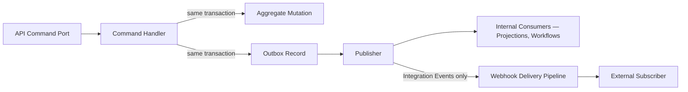

# PR6 Companion — Event Catalog and Webhook Strategy

Status: Documentary architecture (no implementation)
Parent: `06-canonical-api-contracts.md`

Purpose: give every event already catalogued in `04-command-query-event-catalog.md` (36 events) its API-facing classification — Domain, Integration, or Notification-triggering — and define the webhook strategy by which the Integration Event subset reaches external subscribers. This document does not add, rename, or redefine a single event; every event listed is taken verbatim from PR4, published via the transactional outbox PR5 already defined (ADR-PMF-037, PR5 §20).

**Category definitions (kept distinct per the task's charge, never conflated):**
- **Domain Event** — internal fact of the domain, published for any consumer within the platform (other bounded contexts, projections, workflows). All 36 events below are Domain Events; every Domain Event is a candidate outbox record.
- **Integration Event** — the explicit PR4-catalogued subset (`04-command-query-event-catalog.md` §8) intended for cross-boundary consumption outside the platform process — these, and only these, are eligible for webhook delivery (§3 below).
- **Notification Event** — a Domain Event consumed by the Notification Delivery workflow (PR4 workflow 14) to drive a user-facing notification. This is a *consumption role*, not a separate wire format — an event already published as a Domain Event may also be consumed by the notification pipeline.

---

## 1. Full Event Catalog

| Event | Version | Source Command | Aggregate | Integration Event | Notification-triggering | Cross-Workspace |
|---|---|---|---|---|---|---|
| `EnterpriseCreated` | v1 | `CreateEnterprise` | Enterprise | No | No | No |
| `WorkspaceCreated` | v1 | `CreateWorkspace` | Workspace | Yes | No | No |
| `WorkspacePolicyChanged` | v1 | `ChangeWorkspacePolicy` / `ArchiveWorkspace` | Workspace | No | No | No |
| `PMOCreated` | v1 | `CreatePMO` | PMO | Yes | No | No |
| `PortfolioCreated` | v1 | `CreatePortfolio` | Portfolio | Yes | No | No |
| `ProjectAssignedToPortfolio` | v1 | `AssignProjectToPortfolio` | Portfolio | No | No | No |
| `ProgramCreated` | v1 | `CreateProgram` | Program | Yes | No | No |
| `ProjectAssignedToProgram` | v1 | `AssignProjectToProgram` | Program | No | No | No |
| `ProjectCreated` | v1 | `CreateProject` | Project | Yes | No | No |
| `ProjectArchived` | v1 | `ArchiveProject` | Project | No | No | No |
| `ProjectMethodologyConfigured` | v1 | `ConfigureProjectMethodology` | Project | No | No | No |
| `TaskCreated` | v1 | `CreateTask` | Task | No | No | No |
| `TaskCompleted` | v1 | `CompleteTask` | Task | No | No | No |
| `MilestoneCompleted` | v1 | `CompleteMilestone` | Milestone | No | No | No |
| `RiskRecorded` | v1 | `RecordRisk` | Risk | No | No | No |
| `RiskClosed` | v1 | `CloseRisk` | Risk | No | No | No |
| `IssueRecorded` | v1 | `RecordIssue` | Issue | No | No | No |
| `IssueResolved` | v1 | `ResolveIssue` | Issue | No | No | No |
| `EvidenceSubmitted` | v1 | `SubmitEvidence` | Evidence | Yes | No | No |
| `EvidenceNormalized` | v1 | `NormalizeSource` | Evidence | No | No | No |
| `MemoryRecordProposed` | v1 | `ProposeMemoryRecord` | Project Memory Record | No | No | No |
| `MemoryRecordApproved` | v1 | `ApproveMemoryRecord` | Project Memory Record | Yes | No | No |
| `RecommendationGenerated` | v1 | `GenerateRecommendation`, `ApproveAgentProposal` | Recommendation | Yes | Yes | No |
| `RecommendationApproved` | v1 | `ApproveRecommendation` | Recommendation | No | No | No |
| `RecommendationRejected` | v1 | `RejectRecommendation` | Recommendation | No | No | No |
| `DecisionRecorded` | v1 | `RecordDecision` | Decision | Yes | Yes | No |
| `DecisionRevoked` | v1 | `RevokeDecision` | Decision | Yes | No | No |
| `ActionCreated` | v1 | `CreateActionFromDecision` | Action | No | No | No |
| `ActionCompleted` | v1 | Action lifecycle terminal transition | Action | Yes | Yes | No |
| `OutcomeRecorded` | v1 | `RecordOutcome` | Outcome | Yes | Yes | Conditional — only where elevation/consent applies |
| `EnterprisePatternProposed` | v1 | `ProposeEnterprisePattern` | Pattern Candidate | No | No | Conditional — only where elevation/consent applies |
| `EnterpriseKnowledgeRatified` | v1 | `RatifyEnterpriseKnowledge` | Enterprise Knowledge Record | Yes | No | Yes |
| `EnterpriseKnowledgeRevoked` | v1 | `RevokeEnterpriseKnowledge` | Enterprise Knowledge Record | Yes | No | Yes |
| `AgentRunRequested` | v1 | `RequestAgentRun` | Agent Run | No | No | No |
| `AgentRunStarted` | v1 | System (pipeline transition) | Agent Run | No | No | No |
| `AgentRunCompleted` | v1 | System (pipeline transition) | Agent Run | No | No | No |
| `AgentRunFailed` | v1 | System (pipeline transition) | Agent Run | No | No | No |

Every event carries the same `correlationId` as its triggering Command, and a `causationId` referencing that Command's ID (PR4 §3) — this is what makes a webhook delivery traceable back to the API call that caused it, without the API layer publishing anything directly (§2 below).

## 2. Publication Mechanism

The API layer never publishes an event directly. A Command's application-layer handler writes the event to the transactional outbox in the same database transaction as the aggregate mutation it describes (ADR-PMF-037); a separate publisher process reads unpublished outbox records and delivers them at-least-once to internal consumers (projections, workflows) and, for the Integration Event subset, to the webhook delivery pipeline (§3).

## 3. Webhook Strategy

Webhooks expose exactly the fourteen events flagged "Integration Event: Yes" in §1 — the same subset PR4 already named as Integration Event candidates (`04-command-query-event-catalog.md` §8). No Domain Event outside that subset is ever delivered externally, regardless of subscription configuration.

### 3.1 Subscription

- Subscriptions are Workspace-scoped — a subscriber configures one or more subscriptions, each bound to exactly one Workspace and an explicit allowlist of event types from the fourteen eligible types. "Subscribe to everything" is not offered.
- A subscription records: owning Workspace, target URL, event-type allowlist, shared signing secret, status (Active/Paused/Revoked), created-by, created-at.
- Creating, pausing, and revoking a subscription are themselves Commands, authorized to Workspace Owner/Admin, and audited (PR5 §21) like any other mutation.

### 3.2 Signature

- Every delivery is signed: `signature = HMAC-SHA256(secret, timestamp + "." + raw_payload)`, sent as a request header alongside a delivery timestamp header.
- Receivers are expected to verify the signature and reject payloads with a stale timestamp (replay protection, `06-api-security-model.md` §7) — this expectation is documented for subscribers, not enforced on their infrastructure.
- Secrets are issued at subscription creation, rotatable on demand, and never logged or echoed back in any API response after initial issuance (PR5 §23).

### 3.3 Retry

- Delivery is at-least-once. A failed delivery (non-2xx response, timeout, connection error) is retried with exponential backoff up to a bounded attempt count.
- A successful delivery (2xx response) is never retried, even if the subscriber's own downstream processing later fails — that is the subscriber's responsibility to handle idempotently (consistent with inbox/idempotency expectations, ADR-PMF-037).

### 3.4 Dead-Letter

- A delivery that exhausts its retry budget lands in a per-subscription dead-letter queue, inspectable via a dedicated endpoint (`GET /workspaces/{workspaceId}/webhook-subscriptions/{id}/dead-letters`) and manually replayable — never silently dropped.
- Dead-lettered deliveries are retained for a bounded period (exact retention open, `06-canonical-api-contracts.md` §33), after which they are purged with the fact of purge itself recorded, not the payload.

### 3.5 Ordering

- Best-effort per-aggregate ordering: events for the same aggregate are delivered in outbox sequence order for that aggregate.
- No cross-aggregate global ordering guarantee is made — a subscriber must not assume `ProjectCreated` for Project A necessarily arrives before `DecisionRecorded` for unrelated Project B, even if the underlying Commands were issued in that order.
- Ordering is best-effort even per-aggregate under retry: a retried delivery may arrive after a later event for the same aggregate has already succeeded; subscribers are expected to use each payload's `occurred_at`/sequence field to reorder if strict ordering matters to them.

### 3.6 Version

- Every webhook payload carries the same `event_version` as its source Domain Event (§1). A subscriber pinned to `v1` continues receiving `v1` payloads until that event type's deprecation policy retires it (`06-canonical-api-contracts.md` §20).
- A breaking change to an event's payload shape ships as a new version (e.g., `ProjectCreated.v2`), delivered only to subscriptions that have explicitly opted in — never a silent reshape of `v1` payloads already in flight to existing subscribers.

## 4. Notification Events (Consumption Role)

The Notification Delivery workflow (PR4 workflow 14) consumes `RecommendationGenerated`, `DecisionRecorded`, `ActionCompleted`, and `OutcomeRecorded` — the same events, unmodified, that are also Domain Events and (for all four) Integration Event candidates. Notification delivery is a downstream consumer of the outbox, not a separate publication path; the API layer exposes no endpoint that directly triggers a notification outside this event-driven pipeline (`06-api-resource-catalog.md` §18).

---

## Validation Notes

Every event name, source Command, and Integration Event classification in this catalog is taken verbatim from `04-command-query-event-catalog.md`. The webhook subscription/signature/retry/dead-letter/ordering/version mechanics in §3 are this PR's original contribution — PR4's ADR-PMF-026 explicitly left "PR6 is not required to expose events as an API surface directly; webhooks... are a PR6+ decision" open, and this section resolves that decision at the documentary level without implementing it.
