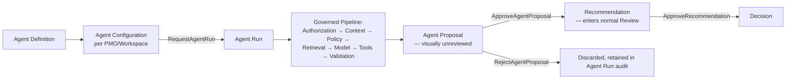

# PR7 Companion — AI, Memory, and Intelligence Experience

Status: Documentary architecture (no implementation)
Parent: `07-canonical-frontend-architecture.md`
Authority: `04-ai-agent-application-architecture.md` (all sections), `04-canonical-application-architecture.md` §12, §30, §33, `05-memory-knowledge-ai-persistence.md`, ADR-PMF-027, ADR-PMF-029, ADR-PMF-030, ADR-PMF-040

Purpose: fix how the frontend presents PMFreak's governed AI surfaces — Recommendation through Outcome, Project Memory, Enterprise Intelligence, and the Agent experience — so that no screen ever presents unapproved AI output with the visual or interactive authority of a human decision, and no screen ever blends provenance, confidence, or tenancy in a way that misleads the user about what they are looking at.

## 1. Recommendation, Decision, Action, Outcome — Four Distinct States

Per ADR-PMF-030 and `04-canonical-application-architecture.md` §7.3 principles 8–10, these four concepts are never visually or interactively conflated anywhere in the frontend:

| Concept | What it is | Frontend treatment |
| --- | --- | --- |
| **Recommendation** | A suggestion — Agent- or governance-produced — awaiting review | Distinct card/row styling signaling "awaiting your review," with its supporting Evidence (§4) visible before any action is offered (Evidence before Inference, §7.3 principle 7) |
| **Decision** | An authoritative, attributable choice recorded by a human/governed-process actor | Distinct, more permanent-feeling styling (never "just another card" indistinguishable from a Recommendation); shows recording actor and timestamp; never editable in place — only superseded via `RevokeDecision` (`05-canonical-persistence-architecture.md` §15) |
| **Action** | Work performed as a result of a Decision | Distinct from Decision — its own status (not-started/in-progress/complete/cancelled), never presented as automatically implying the Decision is "done" (Decision is not Action, §7.3 principle 9) |
| **Outcome** | What actually happened following an Action, recorded separately | Never auto-populated from Action completion — its own explicit recording step, its own card, visually marked as an *observation*, not a status derived from the Action (Action is not Outcome, §7.3 principle 10) |

No single control anywhere in the frontend performs more than one of `ApproveRecommendation` → `RecordDecision` → `CreateActionFromDecision` → `RecordOutcome` — restated from `07-command-query-and-error-experience.md` §4, this is the frontend-layer enforcement of ADR-PMF-030 and `06-canonical-api-contracts.md` §7's no-composite-endpoint rule.

## 2. Evidence

Every Recommendation, Project Memory record, and Enterprise Knowledge record the frontend renders links to its supporting Evidence, visible before or alongside the claim it supports — never a claim rendered with no way to inspect its basis (`04-canonical-application-architecture.md` §7.3 principle 7, Evidence before Inference). An Evidence reference is rendered as a link into the Document/Evidence screen (`03-canonical-information-architecture.md` §5.8), never inlined wholesale where doing so would exceed the viewer's authorized classification (§8 below).

## 3. Project Memory — Governed, Not a Chat Transcript

Project Memory is presented as structured, curated, traceable knowledge — Facts, Inferences, Decisions, Outcomes browsable with lineage and correction history — categorically distinct from Chat History (`03-canonical-information-architecture.md` §5.9's binding distinction). The frontend never renders Project Memory as a scrolling message list; it renders it as a browsable, filterable, provenance-linked record store, matching `GetProjectMemory`'s Strong-consistency guarantee for approved records (`04-canonical-application-architecture.md` §14). A candidate Memory record (not yet approved via `ApproveMemoryRecord`) is visually distinct from an approved one and is never presented to a user without appropriate review authority as though it were already governed knowledge.

## 4. Enterprise Intelligence — Ratified, Not Raw Output

The Knowledge Center (`03-canonical-information-architecture.md` §5.9) presents only knowledge that has passed the six-part elevation gate — evidence, confidence, review, lineage, applicability, ratification (ADR-PMF-029, ADR-PMF-040) — and always with its provenance visible via `GetKnowledgeLineage`. The frontend never presents a Pattern Candidate (pre-ratification) in the same surface or with the same visual authority as a Ratified Enterprise Knowledge Record; where both are shown to an authorized reviewer (e.g., during the ratification workflow itself), their distinct status is unmistakable, not a subtle badge easily missed.

## 5. Agent Definition, Configuration, and Run — Kept Separate

Restated verbatim from `04-ai-agent-application-architecture.md` §2, because collapsing these three at the UI layer is the most likely place a future implementation PR would accidentally blur governed AI back into an ungoverned shortcut:

| Concept | Frontend surface | Who can change it |
| --- | --- | --- |
| **Agent Definition** | Read-only catalog view (purpose, allowed tools, output shape) in the Agent Center | Not user-created; product-level |
| **Agent Configuration** | Per-PMO/Workspace activation toggle and parameters, in Agent Center settings | PMO Manager / Workspace Administrator |
| **Agent Run** | One execution instance, its own status/history entry (`GetAgentRun`/`ListAgentRuns`) | Requested via `RequestAgentRun`; cancellable via `CancelAgentRun` by the requesting actor/Admin |

The Agent Center never presents "configure this Agent" and "run this Agent" as the same action, and never presents a past Agent Run's record as editable — Agent Run records are append-only (`05-canonical-persistence-architecture.md` §19, `AgentRunRepository`).

## 6. Agent Proposals and Approval

An Agent Proposal is the *only* thing an Agent Run is permitted to produce (ADR-PMF-027) and it has **no domain effect** until a human explicitly converts it via `ApproveAgentProposal` (`04-canonical-application-architecture.md` §13's note on `GenerateRecommendation`'s removal). The frontend enforces this distinction visually and interactively:
- An Agent Proposal is rendered in a visually distinct "AI-suggested, unreviewed" state — never styled identically to a Recommendation, which by definition has already passed at least the approval step that converts a Proposal into one.
- The only actions available on an unreviewed Proposal are `ApproveAgentProposal` and `RejectAgentProposal` — never a shortcut that also records a Decision in the same interaction (restating §1's four-distinct-actions rule one level earlier in the chain).
- Once approved, the resulting Recommendation is indistinguishable in the Recommendation Queue from a non-Agent-originated Recommendation *in required review steps* (it still requires its own `ApproveRecommendation`/`RejectRecommendation`) but retains its Agent-Run provenance link (§8) for anyone inspecting its origin.

## 7. Workflow State

The Agent Center and any screen surfacing an Agent Run show the run's actual persisted pipeline stage (Authorization → Context Assembly → Policy Evaluation → Evidence Retrieval → Model Invocation → Tool Invocation → Output Validation → Proposal Creation → Human Review → Domain Command → Audit, `04-ai-agent-application-architecture.md` §3) rather than a binary running/done indicator — consistent with `07-command-query-and-error-experience.md` §9's long-running-workflow treatment. A Tool Invocation classified dangerous (`04-ai-agent-application-architecture.md` §6) always renders its own explicit confirmation step before execution, even mid-run, never silently auto-confirmed because the surrounding run is otherwise automatic (§1 principle 6 of that document).

## 8. Authority, Provenance, and Confidence

Every Recommendation, Agent Proposal, Project Memory record, and Enterprise Knowledge record the frontend renders shows, at minimum: its source (Agent Run ID and Agent Definition, or the human/system actor), a confidence indicator where the source produces one, and a timestamp — provenance is never optional chrome hidden behind an extra click for these record types (`04-canonical-application-architecture.md` §7.3 principle 11, Provenance is Mandatory). A confidence value is presented as a qualified signal ("moderate confidence, based on 3 supporting records"), never as a bare, context-free percentage a user could mistake for a certainty measure the underlying model does not actually provide.

## 9. Generated-Content Labeling

Any AI-generated text, summary, or suggestion rendered anywhere in the frontend — not only inside the Agent Center — carries a visible "AI-generated" label at the point of display, distinct from the Proposal/Recommendation-status distinctions in §1/§6 (a Recommendation that has been human-approved is still AI-originated content and still carries this label; approval changes its domain authority, not its authorship). This applies uniformly regardless of which module renders the content, so a user is never left inferring authorship from context alone.

## 10. Revoked Knowledge

A revoked Enterprise Knowledge Record (`RevokeEnterpriseKnowledge`) or a revoked/superseded Project Memory Record is never presented as active guidance once revoked — the frontend's Query layer relies on `06-canonical-api-contracts.md` §9's rule that a Search DTO always references the canonical record and its version, so a revoked record surfaces (where shown at all, e.g., in a lineage/history view) with an explicit "revoked" state and its revocation reason/actor, never silently omitted in a way that would make its prior existence undiscoverable to an authorized reviewer, and never still-actionable in any Recommendation-generation surface.

## 11. Cross-Tenant Protection

No frontend surface — Agent Center, Knowledge Center, Search, or otherwise — blends two Workspaces' Project Memory or Recommendation data in one view (`04-canonical-application-architecture.md` §7.3 principle 12, Workspace Isolation by Default). The only frontend surface that ever shows content whose provenance spans more than one originating Workspace is the Knowledge Center's ratified Enterprise Intelligence view (§4), and even there, per-item provenance (§8) always discloses that the item passed the elevation gate rather than presenting it as though it originated in the Workspace currently being viewed. An Agent Run's context, and therefore anything its Agent Center surface renders, is always scoped to the one Workspace (and typically one Project) that authorized it (`04-ai-agent-application-architecture.md` §12) — the frontend never offers a control that would let an Agent Run's displayed context span two Workspaces.
