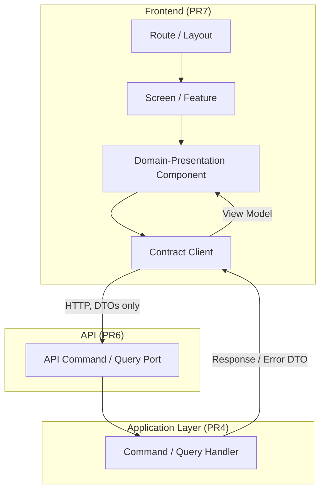
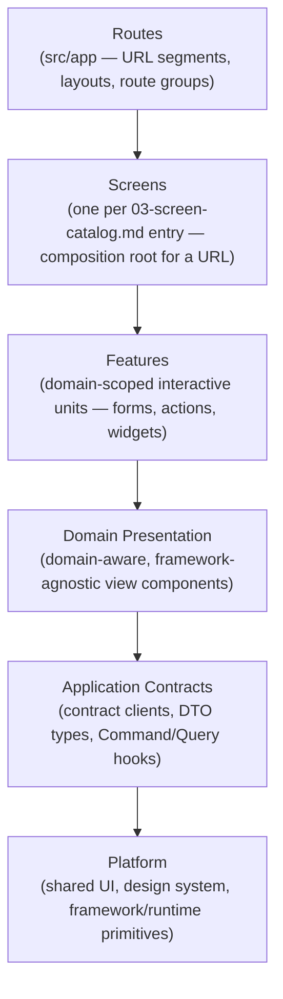
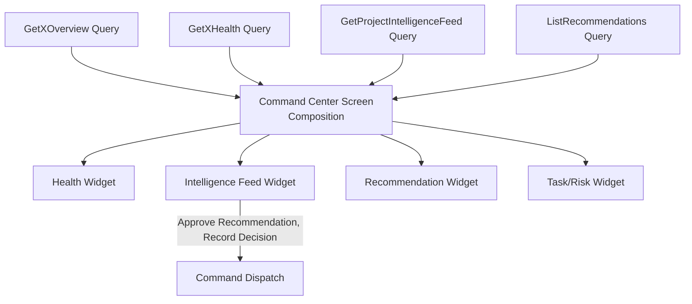
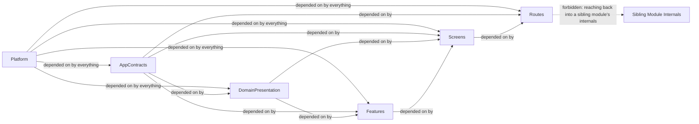
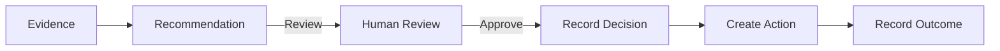

# PR7 — Canonical Frontend Architecture

Status: Documentary architecture (no implementation)
Authority order: `01-canonical-domain-model.md` → `01.1-domain-ratification.md` → `02-canonical-product-language.md` → `03-canonical-information-architecture.md` and its companions (`03-screen-catalog.md`, `03-navigation-contracts.md`, `03-user-journeys.md`) → `04-canonical-application-architecture.md` and its companions → `docs/adr/ADR-PMF-001` through `ADR-PMF-032` → `05-canonical-persistence-architecture.md` and its companions → `ADR-PMF-033` through `ADR-PMF-044` → `06-canonical-api-contracts.md` and its companions → `ADR-PMF-045` through `ADR-PMF-056` → this document and its companions (`07-*`) and `ADR-PMF-057` through `ADR-PMF-068`.

Companion documents:
- `07-frontend-module-boundaries.md` — layer model, module catalog, public entry points, allowed/forbidden dependencies, current classification, ownership matrix, fitness functions
- `07-route-layout-and-navigation-architecture.md` — canonical route map, screen-to-route mapping, layouts, tenant context resolution, breadcrumbs, unauthorized/archived/not-found behavior
- `07-frontend-state-and-data-architecture.md` — state taxonomy, data fetching, caching, optimistic UI, idempotency, concurrency
- `07-command-query-and-error-experience.md` — query consumption, command execution, pending/error/empty/stale states, idempotency and concurrency UX, audit feedback
- `07-ai-memory-and-intelligence-experience.md` — Recommendation/Decision/Action/Outcome experience, Project Memory, Enterprise Intelligence, Agent experience, approval workflow
- `07-frontend-migration-strategy.md` — current-state inventory, current-to-target map, strangler migration phases

---

## 1. Executive Summary

PR1 through PR6 ratified what PMFreak *is* (domain), what it *says* (language), what a user *sees and does* (information architecture), how it is *built internally* (application architecture: bounded contexts, Commands, Queries, Events, workflows), how it is *stored* (persistence architecture), and how an external caller *invokes* it (API contracts). None of them says how the one caller every other caller exists to serve — the browser rendering PMFreak's own product — is itself built. Left unspecified, that gap is filled the way PR1's current-state inspection found every other unspecified gap filled: by accretion, one page and one ad hoc `fetch` call at a time, until the frontend no longer reflects the domain it renders. `04-canonical-application-architecture.md` already named this failure mode once, at the API boundary, before any endpoint existed ("Application before Interface," §7.3 principle 2); PR7 exists to name it a second time, at the UI boundary, before a frontend module structure is retrofitted onto whatever `src/app/(protected)/` currently contains.

**The frontend renders the domain; it does not define it.** Every screen in this document traces to a screen already ratified in `03-screen-catalog.md`; every mutation traces to a Command already ratified in `04-command-query-event-catalog.md` and exposed by `06-command-catalog.md`; every read traces to a Query the same catalogs already name. PR7 introduces no new entity, no new Command, no new Query, and no new screen — it only decides how already-ratified screens are organized into routes, layouts, and modules, and how already-ratified Commands and Queries are consumed by components.

**Server-first, not server-only.** PMFreak's frontend defaults to server rendering (ADR-PMF-062) because most of its screens (Command Centers, Registers, Feeds — `03-canonical-information-architecture.md` §5, `05-canonical-persistence-architecture.md` §22) are read-heavy, tenant-scoped, and benefit from the server already holding the authenticated, tenant-resolved session. Client Components are not forbidden; they are reserved for genuine interactivity — a form, a live filter, a floating action (`03-canonical-information-architecture.md` §8.8) — never used as the default simply because it is the more familiar mental model.

**The frontend never touches a table.** Per ADR-PMF-060, every read and every write a component performs goes through a contract client consuming `06-canonical-api-contracts.md`'s Command and Query API — never Supabase, never SQL, never a persistence row. A component that would need to "just check the database directly" is a sign a Query does not yet exist for that need, not license to bypass the contract (§9 below).

**Command Centers are compositions, not sources of truth.** Per ADR-PMF-065, restating `04-canonical-application-architecture.md` §9.5's warning about projections becoming accidental sources of truth (the `pmo_command_center_snapshots` / `operational_command_centers` split, PR1 §12 C-3): a Command Center screen composes one or more Query results into a single operational view; it never accumulates its own independent, durable state that isn't already the responsibility of some Command elsewhere.

**Agents propose; humans decide; the frontend never blurs the two.** Per ADR-PMF-066, an Agent Run's output is an Agent Proposal until a human explicitly approves it into a Recommendation (`04-ai-agent-application-architecture.md` §8–§9); no frontend affordance ever presents Agent output with the visual authority of a human-authored Decision, and no single click performs more than one step of the Recommendation → Decision → Action → Outcome chain (ADR-PMF-030).

**Accessibility and migration are structural, not aspirational.** Every route, layout, component, state, and workflow this document defines carries an accessibility requirement (§11, ADR-PMF-067) and every module this document defines has a named migration path from its current state (`07-frontend-migration-strategy.md`, ADR-PMF-068) — a big-bang rewrite is rejected explicitly (§12, ADR-PMF-068).

This PR formalizes: the frontend layer model and module boundaries; route, layout, and navigation architecture aligned to `03-navigation-contracts.md`; the frontend state taxonomy (server, URL, local, form, session, global); the contract-client data-access model; Command and Query consumption patterns and their pending/error/empty/stale/degraded states; idempotency and optimistic-concurrency UX; Command Center composition; the Intelligence Feed as a derived projection; the governed AI and Agent experience; accessibility as a structural requirement; and an incremental, strangler-pattern migration strategy from the current codebase. It also states, explicitly, what remains open (§13) rather than guessing.

What this PR does not do: it does not create, move, or modify a single route, component, hook, API call, style, or dependency; it does not touch Next.js, React, Supabase, or any configuration file; it does not resolve every open frontend question — the exact state-management library, server-state library, form library, validation library, design-system implementation, and a dozen other choices (§13) remain explicitly open, to be resolved with evidence during PR9+, not guessed here.

## 2. Purpose

This document exists to make several distinctions explicit, because PR1 and PR4 already show what happens when they are left implicit:

- **A route is not a module boundary, and a folder under `src/app/(protected)/` is not a bounded context.** `04-canonical-application-architecture.md` §7.2 already made this point for the API layer ("A route, a page, or a wizard step describes an experience, not a bounded context"); PR7 makes the same point for the folder that renders that route. `src/app/(protected)/command-center/` is a route; Project Execution is a bounded context (PR4 §10); a page being reachable at a convenient URL says nothing about which domain module owns the data it renders.
- **A screen is not a component tree accident.** Every screen in `03-screen-catalog.md` has a name, a purpose, an entity, and a required role. A frontend module structure that cannot answer "which module owns this screen" for every one of the fifty canonical screens (`03-canonical-information-architecture.md` §6) has re-introduced the ambiguity PR3 spent an entire document resolving.
- **Server state is not local state with a delay.** A Query result is owned by the server and only ever cached, never duplicated into a client store the server does not know about and cannot invalidate (§4 of `07-frontend-state-and-data-architecture.md`). Treating a fetched Project as "just some state" that a Zustand store also holds a copy of is exactly the kind of accidental second source of truth PR4 §9.5 forbids at the projection layer, repeated at the component layer.
- **The frontend does not resolve tenancy.** Per ADR-PMF-034's persistence rule and its API-layer restatement (`06-canonical-api-contracts.md` §16), no frontend code determines `enterprise_id`/`workspace_id`/`project_id` from `localStorage`, a client-side guess, or a URL parameter trusted without server validation — every tenant-scoped read or write is resolved and re-validated server-side, and the frontend's URL/route parameters are a *request*, never an *authority* (§5 of `07-route-layout-and-navigation-architecture.md`).
- **A pending Command is not a completed one.** `04-canonical-application-architecture.md` §7.3 principle 6 ("Human Authority over Autonomous Execution") has a UX-layer twin: a Command that has been submitted but not yet confirmed by its Response DTO must never be rendered as if it already succeeded — optimistic UI (§8 of `07-frontend-state-and-data-architecture.md`) is permitted only where its rollback path is as well-defined as its success path.
- **An Agent Proposal is not a Recommendation, and neither is a Decision.** Restated at the UI layer from ADR-PMF-030/066: three visually distinct states, three distinct required actions, never one button that performs more than one.

## 3. Frontend Principles

These principles are binding for every canonical frontend decision made under this PR and every later implementation PR, unless superseded by a future ADR:

1. **Frontend Follows Domain and API.** Every screen corresponds to a screen already ratified in `03-screen-catalog.md`; every data access corresponds to a Command or Query already ratified in `04-command-query-event-catalog.md` and exposed by `06-canonical-api-contracts.md`. No screen, module, or data call is designed first and back-filled into the domain (ADR-PMF-057, ADR-PMF-058).
2. **Server-First Rendering.** Server Components and server-rendered data are the default; a Client Component boundary exists only where interactivity, browser APIs, or genuinely client-local state require it (ADR-PMF-062).
3. **Domain-Aligned Modules, Not Technical Piles.** Frontend modules are organized by capability/domain (Project Execution, Recommendation Review, Knowledge Center — mirroring PR4's bounded contexts), never by technical type (`components/`, `utils/`, `hooks/` as top-level organizing principles) or by persisted table name (ADR-PMF-058).
4. **Contract Clients Only.** All server data access — read or write — goes through a generated or hand-maintained client consuming `06-canonical-api-contracts.md`'s Command/Query API; no component, hook, or server action queries Supabase, SQL, or any persistence technology directly (ADR-PMF-060).
5. **Persistence Access Is Prohibited from UI Components.** Restated as an explicit prohibition, not merely an absence of a pattern: a component importing a database client, an ORM type, or a table name is a defect, not a shortcut (ADR-PMF-060, §7.3 of `07-frontend-module-boundaries.md`).
6. **Server State Is Owned by Canonical APIs.** A Query result is fetched, cached, and invalidated — never duplicated into independently-authoritative client state (ADR-PMF-059).
7. **URL State Is Explicit and Shareable Where Safe.** Filters, pagination, sort, and selected-tab state that a user would reasonably expect to survive a page reload or a shared link live in the URL — not in memory, not in `localStorage` — except where the underlying data is itself not shareable across authorization boundaries (ADR-PMF-059, §5 of `07-frontend-state-and-data-architecture.md`).
8. **Local State Is Component/Feature-Local by Default.** Ephemeral UI state (an open dropdown, a draft form field before submission, a hover state) never escapes its owning component/feature without a documented reason (ADR-PMF-059).
9. **Global State Is Exceptional and Governed.** A cross-cutting client store is justified only for state that is genuinely global, ephemeral, and not server-owned (e.g., an in-progress multi-step wizard's draft, a toast queue, a feature-flag snapshot) — never as a general-purpose cache substituting for the API layer's own caching (§6 of `07-frontend-state-and-data-architecture.md`).
10. **Tenant Boundary Is Workspace, Resolved Server-Side.** Every screen resolves its Enterprise/Workspace/Project context the same way `06-canonical-api-contracts.md` §16 requires the API to: server-side, from session and parent chain — never from client-side `localStorage`, a cookie the client itself wrote, or an unvalidated route parameter (ADR-PMF-061).
11. **Commands Are Explicit Mutations; Queries Are Side-Effect Free.** Restated at the UI layer from ADR-PMF-025/047: no component performs a "helpful" read-triggered write (marking something read as a side effect of rendering it, for instance) without that being an explicit, named Command the user or the system triggered deliberately (ADR-PMF-063).
12. **Optimistic Concurrency Is ETag/Version-Aware.** Any screen editing a versioned resource (`06-canonical-api-contracts.md` §18) surfaces a `StaleVersionError` as an explicit, comparable conflict — never a silent overwrite (ADR-PMF-064).
13. **Idempotency Is Required for Critical Commands.** Every Command flagged idempotency-required in `06-command-catalog.md` is submitted from the UI with a client-generated `Idempotency-Key`, and the UI's own retry/double-submit protection (double-click guards, network-retry logic) relies on that key rather than inventing a separate mechanism (ADR-PMF-064).
14. **Command Centers Are Projection Compositions.** A Command Center screen composes Query results; it is never itself a source of truth and never accumulates state a Command elsewhere doesn't already own (ADR-PMF-065, restating PR4 §9.5).
15. **Agent Execution Is Agent Run → Proposal → Approval → Command.** No frontend affordance skips a stage of this chain or presents an unapproved Agent Proposal with a Recommendation's visual/interactive authority (ADR-PMF-066).
16. **Accessibility Is a Structural Requirement.** Every route, layout, component, state, and workflow meets WCAG 2.2 AA as a baseline, verified as part of the same review that verifies functional correctness — never a separate, optional pass (ADR-PMF-067).
17. **Migration Is Incremental; Big-Bang Rewrite Is Rejected.** Every module and route this document defines has a named current-state classification and a strangler-pattern path to target — no PR replaces the whole frontend at once (ADR-PMF-068).

## 4. Frontend Sits at the Client Boundary of the API

Per ADR-PMF-060 and `06-canonical-api-contracts.md` §5, the frontend is one of the API's callers — a first-party one, with no special access the API contract doesn't already grant a client. It never reaches "around" the API into the persistence layer, and the API layer never designs an endpoint shape to match a component's convenience (§3 principle 1) — the dependency runs from frontend to API to application to domain, never the reverse.

## 5. Frontend Layer Architecture

Six layers, strictly ordered by dependency direction — a layer may depend only on the layers below it, never sideways across a domain boundary or upward toward a layer that should not know it exists. Full module catalog, allowed/forbidden dependency table, and fitness functions: `07-frontend-module-boundaries.md`.

| Layer | Contains | Knows about domain? | Knows about HTTP/DTO shape? |
| --- | --- | --- | --- |
| Routes | `src/app` route segments, layouts, route groups, middleware-level tenant/auth resolution | No (delegates to Screens) | No |
| Screens | One composition root per `03-screen-catalog.md` screen; assembles Features and Domain Presentation for one URL | Yes (owns exactly one ratified screen) | No (consumes Application Contracts only) |
| Features | Domain-scoped interactive units: a form, a floating action (`03-canonical-information-architecture.md` §8.8), a filter bar, a Command trigger | Yes, scoped to its owning module | No (calls Application Contracts) |
| Domain Presentation | View components that render a domain concept's shape (a Recommendation card, a Health badge) without owning data-fetching | Yes, read-only awareness of shape | No (receives already-fetched view models as props) |
| Application Contracts | Contract clients, generated/hand-maintained types from `06-canonical-api-contracts.md`, Command/Query hooks, error mapping | No (transport-shaped, not domain-shaped) | Yes — this is the only layer that does |
| Platform | Shared UI primitives (buttons, inputs, layout primitives), design tokens, framework/runtime setup, accessibility primitives | No | No |

**Binding rule:** Platform never imports Application Contracts, Domain Presentation, Features, Screens, or Routes (§3.5 of `07-frontend-module-boundaries.md`); Application Contracts never imports Domain Presentation, Features, Screens, or Routes; and no layer imports "sideways" into another domain module's Features or Screens layer without going through that module's public entry point (§4 of `07-frontend-module-boundaries.md`).

## 6. Module Boundaries (Summary)

Full layer model, module catalog, public entry points, allowed/forbidden dependencies, current classification, proposed structure, ownership matrix, and fitness functions: `07-frontend-module-boundaries.md`.

Frontend modules are domain-aligned, one per PR4 bounded context or a small cluster of tightly related ones, never one module per technical concern. A module's public entry point is the only way another module may consume it; its internals (components, hooks, local state) are never imported directly across a module boundary.

## 7. Route, Layout, and Navigation Architecture (Summary)

Full canonical route map, screen-to-route mapping, layout hierarchy, tenant-context resolution, breadcrumbs, navigation contracts, and unauthorized/archived/not-found behavior: `07-route-layout-and-navigation-architecture.md`.

Every route in the canonical route map corresponds to exactly one screen from `03-screen-catalog.md`; every layout corresponds to one level of `03-navigation-contracts.md` §2's breadcrumb trail; navigation between routes follows only the edges `03-navigation-contracts.md` §1 already ratifies.

## 8. State and Data Architecture (Summary)

Full state taxonomy, data-fetching model, caching/invalidation, optimistic UI, idempotency, and concurrency: `07-frontend-state-and-data-architecture.md`.

Five state kinds are formally separated — server, URL, local, form, session — and global client state is treated as exceptional, requiring justification (§3 principles 6–9). No canonical state kind is ever silently merged into another (a filter that should be URL state kept only in `useState` loses shareability; a form draft promoted into global state without reason gains unnecessary cross-component coupling).

## 9. Command, Query, and Error Experience (Summary)

Full query-consumption and command-execution model, pending/confirmation/idempotency/conflict UX, error taxonomy and recovery, and loading/empty/stale/degraded states: `07-command-query-and-error-experience.md`.

Every screen's data need maps to one or more Queries from `06-query-catalog.md`; every mutating action maps to exactly one Command from `06-command-catalog.md`. Every error a Query or Command can return (`06-error-model.md`'s fourteen categories) has a defined frontend presentation — no category is left to a generic, unhandled fallback.

## 10. AI, Memory, and Intelligence Experience (Summary)

Full Recommendation/Decision/Action/Outcome experience, Project Memory, Enterprise Intelligence, and Agent experience: `07-ai-memory-and-intelligence-experience.md`.

Recommendation, Decision, Action, and Outcome remain four visually and interactively distinct states across every frontend surface that touches them (ADR-PMF-030); Project Memory is presented as governed, curated knowledge, never as a chat transcript; Enterprise Intelligence is presented as ratified, provenanced knowledge, never as an unreviewed model output.

## 11. Command Centers as Projection Compositions

Per ADR-PMF-065, every Command Center screen (`03-canonical-information-architecture.md` §11 — Enterprise, Workspace, PMO, Portfolio, Program, Project) is architected identically at the frontend layer: a Screen that composes one or more Query results (`GetProjectCommandCenter`-style composite Queries, `04-canonical-application-architecture.md` §14) into widgets, never a Screen with its own independent write path or durable client-side state.

The Intelligence Feed (`03-canonical-information-architecture.md` §5.9) is architected the same way — a derived, composite projection over `GetProjectIntelligenceFeed`, never an independent store of Chat, Evidence, RAID, Decision, or Task state (ADR-PMF-065, restating PR4 §9.5's projection-is-not-a-source-of-truth rule).

## 12. Accessibility as a Structural Property

Accessibility is not a component-library concern layered on afterward — it is a property of routes (focus management on navigation), layouts (landmark regions, skip links), Screens (heading hierarchy matching the breadcrumb trail, `03-navigation-contracts.md` §2), Features (keyboard operability of every Command trigger), and workflows (announced state transitions for pending/error/success). WCAG 2.2 AA is the initial target (ADR-PMF-067); exact automation tooling is open (§13).

## 13. Open Frontend Decisions

Deliberately left open, not resolved by guesswork — full context in each companion document where relevant:

- Exact state-management library (for the exceptional global-state cases, §9 of `07-frontend-state-and-data-architecture.md`).
- Exact server-state/data-fetching library.
- Exact form library.
- Exact validation library.
- Exact design-system implementation (tokens, component library internals).
- Storybook or an equivalent component workshop.
- Component-testing framework.
- E2E framework.
- Visual-regression tooling.
- Exact route migration order (phases are fixed in `07-frontend-migration-strategy.md`; the order within a phase is not).
- Exact cache durations.
- Exact performance budgets.
- Exact realtime provider (for any screen requiring live updates beyond polling).
- Exact analytics provider.
- Exact feature-flag provider.
- Exact i18n library.
- Exact error-reporting provider.
- Exact accessibility automation tooling.
- Exact public component entry points (package/export boundaries, if any are ever published).
- Exact folder names (this document fixes the layer model, §5, not literal directory names).
- Exact naming conventions beyond what `02-canonical-product-language.md` already binds.
- Exact deprecation windows for legacy screens/routes.
- Microfrontends.
- Module federation.
- Native mobile frontend.

## 14. Decision Matrix

| Topic | Decision |
| --- | --- |
| Framework | Next.js + React + TypeScript |
| Architectural style | Server-first, feature-oriented |
| Router | Canonical route architecture aligned to `03-canonical-information-architecture.md`/`03-navigation-contracts.md` |
| Domain boundary | Domain-aligned frontend modules |
| API access | Contract clients only |
| Persistence access | Prohibited from UI components |
| Server state | Owned by canonical APIs |
| URL state | Explicit and shareable when safe |
| Local state | Component/feature-local by default |
| Global state | Exceptional and governed |
| Tenant boundary | Workspace |
| Enterprise access | Explicit, not automatic |
| Commands | Explicit mutations |
| Queries | Side-effect free |
| Optimistic concurrency | ETag/version-aware |
| Idempotency | Required for critical commands |
| Command Centers | Projection composition |
| Intelligence Feed | Derived projection |
| Agent execution | Agent Run → Proposal → Approval → Command |
| Project Memory | Governed records |
| Enterprise Intelligence | Ratified knowledge |
| Shared UI | Domain-free |
| Accessibility | Structural requirement |
| Migration | Incremental strangler approach |
| Big-bang rewrite | Rejected |

## 15. Current vs. Target

| Area | Current state | Target | Gap | Future action |
| --- | --- | --- | --- | --- |
| Route organization | `src/app/(protected)/` holds 54 flat feature folders alongside domain routes (`command-center`, `pmo-command-center`, `projects`, `governance`, `intelligence`, etc.) with no consistent screen-to-route discipline | Canonical route map, one segment per `03-screen-catalog.md` screen, organized by entity hierarchy (`07-route-layout-and-navigation-architecture.md`) | Route set does not yet trace 1:1 to the fifty canonical screens; several folders (`playground`, `debug-session`, `change-detection`) have no corresponding canonical screen | PR9+, per migration unit (`07-frontend-migration-strategy.md`) |
| Module organization | Mixed technical (`components/`, `hooks/`, `ui-core/`) and partial domain (`features/`) top-level folders, plus a separate `src/aoc/` protocol/enterprise package boundary | Domain-aligned modules per `07-frontend-module-boundaries.md`, Platform layer isolated | No enforced dependency-direction boundary between technical piles and domain code today | PR9+ |
| Data access | Not inventoried by this PR at the call-site level (see `07-frontend-migration-strategy.md` for the counted inventory) | Contract clients only, per `06-canonical-api-contracts.md` | Existing direct-access patterns, where present, are a named migration target | PR9+ |
| State management | No single documented pattern; component-local `useState`/`useEffect` predominant per repo conventions, exact library usage inventoried in `07-frontend-migration-strategy.md` | Five-kind taxonomy (§8) with global state exceptional | State taxonomy is not currently formalized | PR9+ |
| Command execution | Ad hoc per-route form submission and mutation handling | Explicit Command dispatch with idempotency-key and pending/error states per `07-command-query-and-error-experience.md` | No uniform Command-dispatch pattern exists today | PR9+, gated on PR6's API existing first |
| Accessibility | Not formally audited by this PR | WCAG 2.2 AA structural baseline per §12, ADR-PMF-067 | No accessibility baseline currently enforced as a merge gate | PR9+ |
| Agent/Recommendation UI | `capabilities`, `intelligence`, `copilot`, `escalation-guide` and related folders exist in `src/app/(protected)/` with no formalized Agent Run/Proposal/Approval separation at the UI layer | Agent Run → Proposal → Approval → Command experience per `07-ai-memory-and-intelligence-experience.md` | Current UI's treatment of Agent output vs. human decisions is not inventoried at the component level by this PR | PR9+ |

## 16. Additional Mermaid Diagrams

### Module Dependency Rules (summary — full version in `07-frontend-module-boundaries.md`)

### Recommendation-to-Outcome Experience

---

## Validation Notes

This document, its six companions, and ADR-PMF-057 through ADR-PMF-068 are the complete PR7 deliverable. No route, component, hook, style, dependency, or application/persistence/API artifact was created or modified to produce them. Every screen, entity, Command, Query, error category, workflow, and Agent concept referenced was taken verbatim from `03-canonical-information-architecture.md` and its companions, `04-canonical-application-architecture.md` and its companions (including `04-ai-agent-application-architecture.md`), `05-canonical-persistence-architecture.md` and its companions, `06-canonical-api-contracts.md` and its companions, and their respective ADRs — none was renamed, reinterpreted, or redefined.
