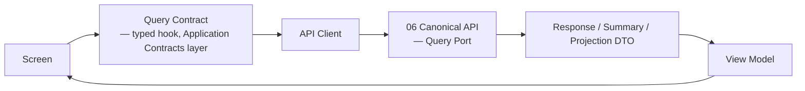
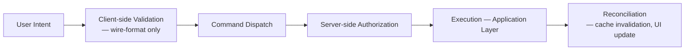
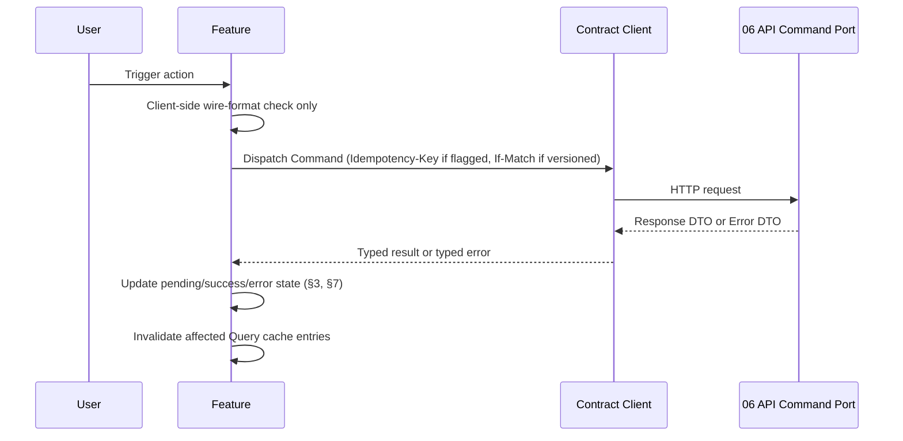
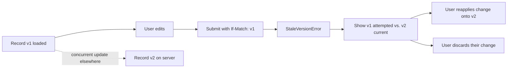

# PR7 Companion — Command, Query, and Error Experience

Status: Documentary architecture (no implementation)
Parent: `07-canonical-frontend-architecture.md`
Authority: `06-canonical-api-contracts.md` §7–§8, §17–§19, `06-error-model.md`, `04-canonical-application-architecture.md` §13–§14, §22, §25

Purpose: fix, for every Query and Command a screen consumes, what the user sees in every state that operation can be in — not only the success case. `06-error-model.md` already gives the API layer's fourteen error categories a wire contract; this document gives each of them, and every non-error state, a UI presentation.

## 1. Query Consumption

Every screen's data need traces to one or more Queries in `06-query-catalog.md`. A Screen's data-fetching declares, per Query it consumes: the Query name, its consistency expectation (Strong/Eventual, `04-canonical-application-architecture.md` §24), and which of this document's states (§6) it renders for loading/empty/error/stale. A Screen never fetches data through any path other than the Application Contracts layer's typed Query hooks (`07-frontend-state-and-data-architecture.md` §8).

## 2. Command Execution

Every mutating user action traces to exactly one Command in `06-command-catalog.md`. A Feature that triggers a Command declares: the Command name, whether it requires confirmation (§4), whether it is idempotency-flagged (§5), whether its target resource is version-checked (§6), and which of this document's error categories (§7) it is expected to surface, mirroring `06-canonical-api-contracts.md` §19's rule that no endpoint returns an error outside what it documents — restated here as no Feature handles an error category its owning Command was never documented to return.

## 3. Pending States

From the moment a Command is dispatched until its Response or Error DTO returns, the triggering control enters an explicit pending state: disabled or visually distinct from its idle state, with a busy indicator, and — for Commands expected to take longer than a brief interaction (anything backed by an asynchronous workflow, `04-canonical-application-architecture.md` §22) — a message indicating the operation is in progress rather than a bare spinner with no context. A pending Command is never rendered with the same visual weight as its confirmed-success state (`07-canonical-frontend-architecture.md` §2's binding distinction).

## 4. Confirmations

A Command requiring human approval per `04-canonical-application-architecture.md` §13's "Human approval required" column, or classified destructive (`ArchiveWorkspace`, `ArchiveProject`, `RevokeDecision`, `RevokeEnterpriseKnowledge`, `RejectRecommendation`, `RejectAgentProposal`, `CancelAction`), requires an explicit confirmation step between the triggering click and Command dispatch — a distinct dialog or inline confirmation naming the entity and the action, never a single click that both expresses intent and executes it. This restates ADR-PMF-030 at the interaction layer: `ApproveRecommendation`, `RecordDecision`, `CreateActionFromDecision`, and `RecordOutcome` are four separate user actions, each with its own confirmation and its own Command dispatch — no composite "approve and decide" control exists anywhere in the frontend, mirroring `06-canonical-api-contracts.md` §7's "no composite endpoint" rule.

## 5. Idempotency UX

For idempotency-flagged Commands (`07-frontend-state-and-data-architecture.md` §11), a network failure or timeout during dispatch triggers an automatic retry using the same `Idempotency-Key`, presented to the user as continued pending state, not as a failure requiring their own re-click — the whole point of the key is that the frontend, not the user, absorbs a transient network retry safely. If the retry itself returns `ConflictError` (the same key replayed with a different payload than what the server recorded — an internal-consistency defect, not a user-facing scenario under normal operation), the UI surfaces a generic retry-failed error (§7) rather than a specialized message, since this case indicates a client bug, not a recoverable user situation.

## 6. Stale-Version Conflict UX

When a versioned Command returns `StaleVersionError` (`06-error-model.md`, `06-canonical-api-contracts.md` §18), the UI presents an explicit conflict state: the user's attempted change, and an affordance to refetch the current server state and either reapply their change on top of it or discard it — never a silent overwrite and never an automatic retry (`StaleVersionError` is documented "not retryable" in `06-error-model.md` §3, and the frontend honors that classification exactly).

## 7. Error Taxonomy and Recovery

Every one of `06-error-model.md` §1's fourteen categories has a defined frontend presentation and recovery path — no category falls through to an unhandled generic error by default:

| Category | Frontend presentation | Recovery |
| --- | --- | --- |
| `ValidationError` | Field-level messages from the Error DTO's `details` array, inline on the form (§5 of `07-frontend-state-and-data-architecture.md`) | User corrects and resubmits |
| `AuthorizationError` | Explicit "you don't have permission" state, distinct from Not Found (`07-route-layout-and-navigation-architecture.md` §7) | Request access, or navigate away — never auto-retried |
| `NotFoundError` | Not-found state (`07-route-layout-and-navigation-architecture.md` §7) | Navigate away; no retry affordance for a resource that doesn't exist |
| `ConflictError` | Contextual message naming the conflicting condition (e.g., duplicate idempotency payload, a uniqueness rule) | User changes input and resubmits — never auto-retried |
| `InvariantViolation` | Domain-rule-specific message (e.g., "at most one primary Portfolio" — PR1.1 invariant 13) surfaced near the violated field/action | User adjusts the request to satisfy the invariant |
| `PolicyViolation` | Similar to `AuthorizationError` but naming the specific policy where safe to disclose (e.g., `RecommendationApprovalPolicy` requiring a higher role) | Escalate to an authorized actor |
| `StaleVersionError` | Conflict UX, §6 | Compare and reapply/discard |
| `DependencyUnavailable` | Transient-failure banner with automatic retry (respecting backoff) | Automatic retry; manual retry affordance after repeated failure |
| `RateLimitExceeded` | "Please wait" state honoring the `Retry-After` value | Automatic retry after the indicated delay |
| `WorkflowTimeout` | "Still processing" state distinct from failure — re-polls status rather than re-issuing the original Command | Status re-poll; the underlying workflow may still complete |
| `AgentExecutionError` | Agent Run failure state in the Agent Center (`07-ai-memory-and-intelligence-experience.md` §7) | Per-cause: automatic retry for transient provider failures, explicit re-request for output-validation failures |
| `IntegrationError` | Integration-specific failure state naming the affected external system | Per-cause, mirrors `DependencyUnavailable` for transient cases |
| `DataIntegrityError` | Generic, non-retryable failure state; always logged for investigation | User cannot self-recover; support escalation |
| `UnexpectedError` | Generic failure state, safe message only (never a stack trace or internal detail, `06-error-model.md` §2) | Retry only if the original request was itself idempotent (§5) |

Authentication failures (401, `06-error-model.md` §4) are handled distinctly from every category above — a re-authentication redirect, never presented as a domain error state.

## 8. Loading, Empty, Stale, and Degraded States

Every Query-backed view defines all four states explicitly — a screen that only implements "loading" and "loaded" has an incomplete data-state contract:

| State | Definition | Presentation |
| --- | --- | --- |
| **Loading** | Initial fetch in flight, no prior cached data to show | Skeleton or spinner matching the eventual content's layout, never a blank screen |
| **Empty** | Query succeeded, result set is genuinely empty | A stated empty condition with, where a Command exists to populate it, a call to action (e.g., "No Risks logged yet — Log a Risk") — never indistinguishable from a loading or error state |
| **Stale** | An Eventually-consistent projection's cached result is older than its provider considers fresh (`06-canonical-api-contracts.md` §9's Projection DTO staleness indicator) | Visible staleness indicator (timestamp or "updating…" affordance), content still shown, never blocked from view while refreshing |
| **Degraded** | Part of a composite Command Center query succeeded while another part failed (`DependencyUnavailable`/`IntegrationError` on one widget's source) | The composite screen renders every widget whose source succeeded and shows a scoped, per-widget failure state for the rest — one failed source never blanks the entire Command Center (restates `07-canonical-frontend-architecture.md` §11's composition model: independently-sourced widgets fail independently) |

## 9. Long-Running Workflows

Screens backed by a workflow `04-canonical-application-architecture.md` §25 classifies as long-running (Document ingestion, Evidence normalization, Recommendation generation/review, Decision-to-action, Action-to-outcome, Knowledge elevation, Agent execution, Project/Workspace archival) surface the workflow's persisted state directly (`06-canonical-api-contracts.md` §24's Workflow API) rather than inferring progress from a generic spinner: a named current step, whether it is `AwaitingHumanInput` (and if so, what input), and a way to reach the workflow's own status/history view. A workflow paused at a human governance gate is presented as **waiting on you** (or another named actor), never as an error or a stall.

## 10. Audit Feedback

Every Command that produces an audit record (`04-canonical-application-architecture.md` §7.3 principle 24 — every authoritative mutation, approval, or agent run) surfaces, on success, a confirmation that names what happened, who did it, and when — matching what `06-canonical-api-contracts.md` §25's Correlation ID/Actor/Workspace observability fields already capture server-side. Sensitive or governance-relevant actions (`RecordDecision`, `RevokeDecision`, `RatifyEnterpriseKnowledge`, `ApproveAgentProposal`) additionally surface a link to their entry in the Audit Timeline (`03-canonical-information-architecture.md` §5.10) from the confirmation itself, so the user can verify the record without a separate navigation.
