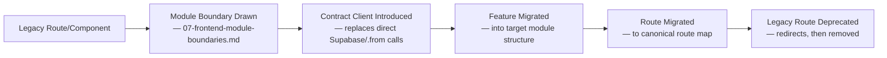
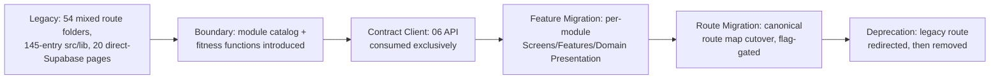

# PR7 Companion — Frontend Migration Strategy

Status: Documentary architecture (no implementation)
Parent: `07-canonical-frontend-architecture.md`
Authority: ADR-PMF-068, `07-frontend-module-boundaries.md` §5, `07-route-layout-and-navigation-architecture.md` §9

Purpose: give the strangler-pattern migration ADR-PMF-068 mandates a concrete inventory to migrate from and a phased plan to migrate by. Every count below is reproducible from the commands shown, run against this repository at the HEAD this PR started from (`438cf2be79736f726aeb563277e43673947a2a0b`) — no number in this document is estimated.

## 1. Methodology

All counts were produced with `find`/`grep` against `src/` and `tests/` at repository HEAD, on 2026-07-20. Commands are shown per metric so any reviewer can rerun them and get the same result. Where a metric required a judgment call (e.g., distinguishing a true React Context Provider from an AI-model "Provider" naming collision), the judgment and the raw grep result are both shown, not silently resolved.

## 2. Current Frontend Inventory

| Metric | Command | Count |
| --- | --- | --- |
| Route (page) count | `find src/app -name "page.tsx" -o -name "page.ts" \| wc -l` | 82 |
| Page count | Same as above (1:1 in this codebase — no route has more than one page file) | 82 |
| Layout count | `find src/app -name "layout.tsx" -o -name "layout.ts" \| wc -l` | 3 |
| Route groups | `find src/app -type d -name "(*)"` | 1 — `(protected)` |
| `(protected)` immediate children | `ls "src/app/(protected)" \| wc -l` | 54 |
| Dynamic route segments, total | `find src/app -type d -name "[*]" \| wc -l` | 90 |
| Dynamic route segments, UI (excluding `src/app/api`) | Same, filtered to exclude `/api/` | 6 |
| Dynamic route segments, API | 90 − 6 | 84 |
| API route handlers (`route.ts` under `src/app/api`) | `find src/app/api -name "route.ts" \| wc -l` | 536 |
| `"use client"` files (`src/app`, `src/components`, `src/features`, `src/ui-core`) | `grep -rl '^"use client"' src/app src/components src/features src/ui-core \| wc -l` | 98 |
| Total `.tsx` files in the same four directories | `find src/app src/components src/features src/ui-core -name "*.tsx" \| wc -l` | 230 |
| Implied Server Components (proxy: `.tsx` files without a `"use client"` directive, same four directories) | 230 − 98 | 132 |
| Component-ish files (`.tsx`) in `src/components`, `src/features`, `src/ui-core` (excludes `src/app`, which holds routes, not reusable components) | `find src/components src/features src/ui-core -name "*.tsx" \| wc -l` | 124 |
| Hooks (files named `use-*.ts(x)`) | `find src -name "use-*.ts" -o -name "use-*.tsx" \| wc -l` | 8 — 2 in `src/hooks/`, 6 in `src/features/enterprise-ux/hooks/` |
| React Context usage (`createContext`/`React.createContext`) | `grep -rl "createContext" src --include="*.ts*" \| wc -l` | 0 |
| Files matching `*Provider` naming | `grep -rl "export function.*Provider\|export const.*Provider" src \| wc -l` | 15 — on inspection, every match is an AI/model-provider abstraction (`src/lib/ai/providers/*`, `src/aoc/enterprise/runtime/authority-provider.ts`), not a React Context Provider; combined with the 0 `createContext` result above, this codebase currently has **no React Context-based state provider** |
| State-management library imports (zustand/redux/jotai/valtio/recoil) | `grep -rl 'from "zustand"\|from "redux"\|from "jotai"\|from "valtio"\|from "recoil"' src \| wc -l` | 0 — no client state-management library is in use today |
| API-client-shaped directories | Manual inspection | `src/lib/api/` (`http.ts`, `reliability.ts`, `validation.ts`, `error-codes.ts`) and `src/sdk/` (`client.ts`, `errors.ts`, `types.ts`, `index.ts`) — the latter is a working `AocClient` contract-client precedent, scoped to `src/aoc/` today (`07-frontend-module-boundaries.md` §5) |
| Direct Supabase query calls (`.from(`) in UI route files, excluding `src/app/api` | `grep -rl '\.from(' src/app src/components src/features src/ui-core --include="*.tsx" \| grep -v "/api/" \| wc -l` | 20 — all in `page.tsx`/`layout.tsx` files under `src/app/(protected)/` and the root `(protected)` layout (full list in §4) |
| Direct Supabase client instantiation (`createClient`) in the same UI dirs | `grep -rl "createClient" src/app src/components src/features src/ui-core \| wc -l` | 0 — the 20 files above consume an already-instantiated server client rather than instantiating their own |
| `localStorage` usage | `grep -ro "localStorage\." src \| wc -l` | 24 occurrences |
| `sessionStorage` usage | `grep -ro "sessionStorage\." src \| wc -l` | 0 |
| Forms using `useForm`/`react-hook-form` | `grep -rl "useForm\|react-hook-form" src \| wc -l` | 1 |
| Files containing `<form` | `grep -rl "<form" src --include="*.tsx" \| wc -l` | 27 — forms are predominantly hand-rolled today, not library-driven |
| `loading.tsx` files | `find src/app -name "loading.tsx" \| wc -l` | 11 |
| `error.tsx` files | `find src/app -name "error.tsx" \| wc -l` | 3 — `(protected)/error.tsx`, `(protected)/follow-up-dashboard/error.tsx`, `(protected)/projects/[id]/follow-up/error.tsx` |
| `not-found.tsx` files | `find src/app -iname "not-found*" \| wc -l` | 0 |
| `middleware.ts` | `find . -maxdepth 3 -iname "middleware.ts" -not -path "*/node_modules/*"` | 0 — no root or `src`-level middleware exists; tenant/auth resolution happens inline in page/layout Server Components today (consistent with the 20-file direct-Supabase-access finding above) |
| Total `.ts`/`.tsx` files under `src/` | `find src -name "*.ts" -o -name "*.tsx" \| wc -l` | 2,576 |
| `src/lib/` top-level entries | `ls src/lib \| wc -l` | 145 (full classification: `07-frontend-module-boundaries.md` §5) |
| Test files (`tests/`) | `find tests -name "*.test.ts" -o -name "*.test.mjs" -o -name "*.test.tsx" \| wc -l` | 455 |
| Test files referencing `src/app`, `src/components`, or `src/features` | `grep -rl "src/app\|src/components\|src/features" tests \| wc -l` | 245 (a proxy for frontend-relevant coverage — includes UI-config/view-model tests such as `pmfreak-aoc-gate-result-ui-*`, not only component-rendering tests; this document does not claim a stronger classification than the grep supports) |
| Full repository test suite (`npm test`) | `npm test` | 12,453 tests, 12,453 pass, 0 fail, exit code 0 |
| Typecheck (`npm run typecheck`) | `tsc --noEmit` | Exit code 0, zero errors |
| `npm run lint:aoc-boundaries` | Existing AOC package-boundary linter | Exit code 0, "no forbidden product/API/SDK/test imports of legacy governance runtime" |
| Installed Next.js version | `grep '"next"' package.json` | `16.2.10` — consistent with `AGENTS.md`'s repository-level warning that this is "NOT the Next.js you know" |

No number above is estimated; every one is the literal output of the shown command against repository HEAD `438cf2be79736f726aeb563277e43673947a2a0b`.

## 3. Current Component Classification

Full classification and rationale: `07-frontend-module-boundaries.md` §5. Summary:

| Directory | Classification |
| --- | --- |
| `src/app/` | Routes layer, present but not yet screen-mapped (54 folders under `(protected)`, several with no canonical-screen counterpart) |
| `src/components/` | Mixed Domain Presentation and Platform, not yet separated |
| `src/features/` | Partial Features layer, not yet domain-aligned to the module catalog |
| `src/ui-core/` | Partial Platform layer (narrower scope than the target) |
| `src/hooks/` | Minimal (2 files); most hook-shaped logic lives in `src/lib/` instead |
| `src/lib/` | The single largest source of layer ambiguity — 145 mixed technical/domain/persistence-adjacent entries |
| `src/sdk/` | A real, working precedent for the target Application Contracts pattern, currently scoped to `src/aoc/` |
| `src/aoc/` | A separately versioned package boundary with its own existing, working dependency-direction linting — proof the fitness-function pattern (`07-frontend-module-boundaries.md` §4) is already viable in this codebase |

## 4. Current Route Classification

Full classification: `07-route-layout-and-navigation-architecture.md` §9. Of the 82 UI page routes:

- **Direct match to a canonical screen:** includes `billing`, `evidence`, `projects`, `programs`, `portfolio`, `workspace`, `workspaces`, `pmo`, `pmos`, `audit`.
- **Near match, needs remapping:** `command-center` (bare, not entity-qualified — the exact anti-pattern ADR-PMF-014 Rule 6 warns against; PR1 §11 already flagged today's `/command-center` as mixing Project- and Workspace-level data on one screen), `pmo-command-center`, `create-command-center`, `create-pmo`.
- **No canonical counterpart yet:** `playground`, `debug-session`, `change-detection`, `follow-up-dashboard`, `message-nudges`, `pilot-agreement`, `founder-circle`, `founder-program`, `early-access`, `trial-inactive`, `getting-started`, `input-hub`, `operational-memory`, `trust`, `political-risk`, `stakeholder-intel`, `escalation-guide`, `meetings`, `copilot`.

The twenty files performing direct Supabase queries at the page/layout level (§2 above) are:

```
src/app/(protected)/executive/page.tsx
src/app/(protected)/projects/[id]/page.tsx
src/app/(protected)/projects/[id]/chat/page.tsx
src/app/(protected)/projects/[id]/settings/page.tsx
src/app/(protected)/projects/page.tsx
src/app/(protected)/team/page.tsx
src/app/(protected)/command-center/page.tsx
src/app/(protected)/governance/page.tsx
src/app/(protected)/policies/page.tsx
src/app/(protected)/audit/page.tsx
src/app/(protected)/capabilities/page.tsx
src/app/(protected)/chat/page.tsx
src/app/(protected)/pmos/[pmoId]/page.tsx
src/app/(protected)/pmos/[pmoId]/reports/page.tsx
src/app/(protected)/trust/agents/page.tsx
src/app/(protected)/layout.tsx
src/app/(protected)/playground/page.tsx
src/app/(protected)/dashboard/page.tsx
src/app/(protected)/founder-circle/page.tsx
src/app/(protected)/early-access/page.tsx
```

These twenty are the concrete, named instances of the ADR-PMF-060 gap ("no component queries Supabase directly") — every one is a named migration item, not a hypothetical risk.

## 5. Current-to-Target Map

| Current | Target | Governing document |
| --- | --- | --- |
| 54 mixed `(protected)` route folders | Canonical route map, one segment per `03-screen-catalog.md` screen | `07-route-layout-and-navigation-architecture.md` §2 |
| `src/lib/` (145 mixed entries) + `src/components/` + `src/features/` | Domain-aligned module catalog (`src/modules/*`) | `07-frontend-module-boundaries.md` §2, §6 |
| 20 files with direct `.from(` Supabase calls | Contract-client-only data access | `07-frontend-state-and-data-architecture.md` §8, ADR-PMF-060 |
| 0 React Context providers / 0 state-management library | Five-kind state taxonomy, global state exceptional | `07-frontend-state-and-data-architecture.md` §1–§7, ADR-PMF-059 |
| No `middleware.ts`, tenant resolution inline per page | Server-side tenant-context resolution flow | `07-route-layout-and-navigation-architecture.md` §5, ADR-PMF-061 |
| 27 hand-rolled `<form>` usages, 1 `react-hook-form` usage | Consistent Command-dispatch form pattern | `07-command-query-and-error-experience.md` §2, §4 |
| 3 `error.tsx`, 11 `loading.tsx`, 0 `not-found.tsx` | Loading/empty/stale/degraded states defined per screen, Unauthorized/Archived/Not-Found behavior defined per route | `07-command-query-and-error-experience.md` §8, `07-route-layout-and-navigation-architecture.md` §7 |
| `src/sdk/`'s `AocClient` (scoped to `src/aoc/`) | Candidate basis for the product-wide contract client (evaluated, not mandated, during migration) | `07-frontend-module-boundaries.md` §5 |

## 6. Strangler Strategy

Per ADR-PMF-068: the target and current implementations coexist. A route or module migrates only when its target screen, module, and data contract are simultaneously ready; the legacy route continues to serve traffic until its replacement is verified; nothing is deleted as the first step of its own migration.



## 7. Phased Migration

1. **Phase 0 — Contract clients and module boundaries (no route changes).** Introduce the Application Contracts layer and target module skeleton (`07-frontend-module-boundaries.md` §6); replace the 20 direct-Supabase-call files' data access with contract-client calls in place, without moving them. Add the fitness functions (`07-frontend-module-boundaries.md` §4) so no new direct-persistence-access file can be introduced during the rest of migration.
2. **Phase 1 — Direct-match routes (Project, Workspace, PMO, Portfolio, Program).** Migrate the routes already classified "direct match" (§4) into the canonical route map and their owning modules — highest-confidence, lowest-risk migration units, and the routes most users depend on daily.
3. **Phase 2 — Command Center consolidation.** Split today's bare `/command-center` and `/pmo-command-center` routes into entity-qualified Command Centers per `07-canonical-frontend-architecture.md` §11 and ADR-PMF-065 — resolves PR1 §11's named defect directly.
4. **Phase 3 — Near-match and creation-flow routes.** Migrate `create-command-center`, `create-pmo`, and remaining near-match routes, aligning creation flows to land on the created entity's Home per IA Principle 7.
5. **Phase 4 — No-canonical-counterpart routes.** For each of the nineteen routes in §4's "no canonical counterpart yet" list, decide per-route: map onto an existing canonical screen as a Feature, or deprecate (§10). This phase is evidence-driven per route, not resolved in bulk by this document.
6. **Phase 5 — State and form consolidation.** Bring the 27 hand-rolled forms and any remaining ad hoc client state onto the taxonomy in `07-frontend-state-and-data-architecture.md`, once the exact form/state libraries (open, §13 of the parent document) are chosen with evidence from Phases 1–4.

No phase requires simultaneously migrating more than one module's routes, satisfying ADR-PMF-068's validation criterion.

## 8. Feature Flags

Each migrated route is gated behind a route-level feature flag during Phases 1–4, allowing the legacy and target implementations to be toggled independently per Workspace/tenant for staged rollout and fast rollback — exact feature-flag provider is open (`07-canonical-frontend-architecture.md` §13); the mechanism (route-level, tenant-scoped toggle) is fixed here.

## 9. Rollback

Because each migration unit is independently flag-gated (§8) and the legacy route is never deleted before its replacement is verified (§6), rollback for any unit is a flag flip, not a code revert — consistent with ADR-PMF-068's "every migration phase is independently revertible" rule.

## 10. Testing

Every migrated route/module carries, before its flag defaults to on: the accessibility conformance check (ADR-PMF-067), unit/component tests for its Features and Domain Presentation components, and an integration test exercising its Command/Query contract-client calls against `06-canonical-api-contracts.md`'s documented shapes. Exact component-testing and E2E frameworks are open (§13 of the parent document) — this document fixes the coverage requirement, not the tool.

## 11. Accessibility

Per ADR-PMF-067, accessibility conformance is a migration-phase gate, not a follow-up project: a route is not considered migrated until its focus management, landmark regions, heading hierarchy, and state announcements (`07-canonical-frontend-architecture.md` §12) are verified — the same gate applies uniformly across Phases 1–5.

## 12. Performance

Exact performance budgets are open (§13 of the parent document); the migration-relevant rule fixed here is that a migrated route's server-first rendering (ADR-PMF-062) and cache/invalidation behavior (`07-frontend-state-and-data-architecture.md` §9) are verified against its legacy equivalent before cutover — a migration is never allowed to regress a route's perceived load time silently.

## 13. Observability

Every migrated route's Command/Query calls carry the same Correlation ID/Actor/Workspace observability fields `06-canonical-api-contracts.md` §25 already requires server-side (`07-command-query-and-error-experience.md` §10) — migration does not reduce observability during the coexistence period; if anything, the legacy direct-Supabase-call routes (§4) are the ones with the weakest observability today, and Phase 0's contract-client migration improves it immediately.

## 14. Legacy Freeze

Once a route or module enters an active migration phase (§7), new feature work in its legacy implementation is restricted to defect fixes — new functionality is built directly against the target module/route, never added to the legacy side, to prevent the gap `07-frontend-module-boundaries.md` §5 documents from widening faster than migration closes it (the drift risk ADR-PMF-068 names explicitly).

## 15. Deprecation

A migrated legacy route is marked deprecated (redirected to its canonical replacement) only after its replacement has served production traffic behind a fully-enabled flag for a bake-in period; exact deprecation windows are open (§13 of the parent document).

## 16. Removal Criteria

A deprecated legacy route/component is removed only when: its replacement has been at 100% rollout for the bake-in period, its own test coverage (§10) has been ported or superseded, and no remaining code references it (verified by the same dependency-direction fitness functions used throughout migration, `07-frontend-module-boundaries.md` §4). No route is removed as part of this documentary PR.

## 17. Implementation Sequencing

Phases 0–5 (§7) execute in order; within a phase, routes are sequenced by the priority stated in that phase's description (e.g., Phase 1 by user traffic/dependency, Phase 4 by evidence of continued relevance). Exact route migration order within a phase is open (§13 of the parent document) — fixed by evidence gathered during Phase 0–1 execution, not guessed here.

## 18. Additional Mermaid Diagram — Frontend Migration


