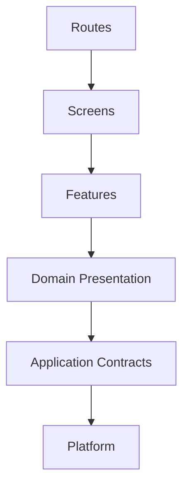
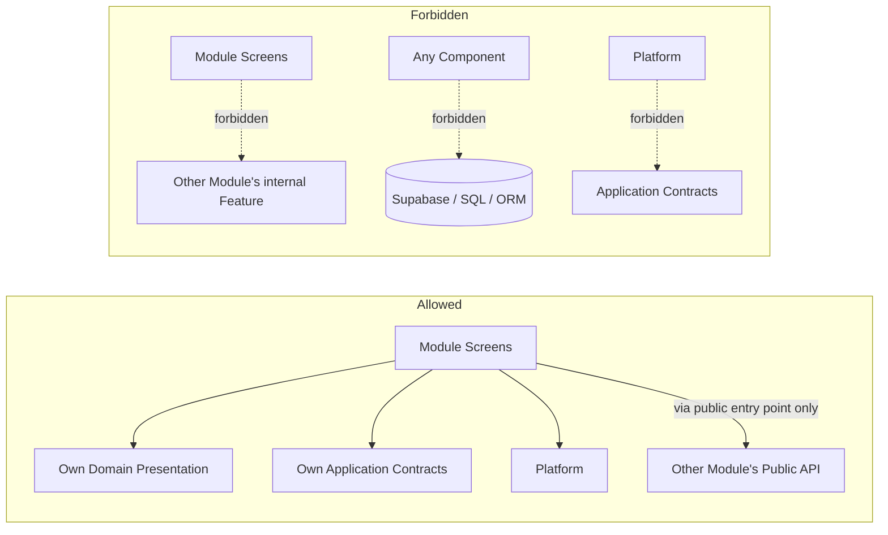

# PR7 Companion — Frontend Module Boundaries

Status: Documentary architecture (no implementation)
Parent: `07-canonical-frontend-architecture.md`

Purpose: fix the frontend's layer model, module catalog, dependency rules, and current-state classification with enough precision that a future implementation PR can answer "which module owns this component" and "is this import allowed" without guessing. This document renames nothing PR1–PR6 already ratified; it classifies the existing `src/` tree against the target it defines.

## 1. Layer Model (restated)

Six layers, restated from `07-canonical-frontend-architecture.md` §5, dependency direction strictly downward:



| Layer | Responsibility | Forbidden |
| --- | --- | --- |
| Routes | URL segment, layout composition, route-level tenant/auth resolution (delegated to middleware/server) | Domain logic, data fetching beyond invoking a Screen |
| Screens | One per `03-screen-catalog.md` screen; composition root | Owning more than one canonical screen; direct persistence access |
| Features | Domain-scoped interactive unit (form, Command trigger, filter) | Reaching into another module's Features |
| Domain Presentation | Presentational rendering of a domain shape, given a view model as props | Data fetching, Command dispatch |
| Application Contracts | Contract clients, DTO types, Command/Query hooks, error mapping | Domain business rules, UI rendering |
| Platform | Shared UI primitives, design tokens, accessibility primitives, framework setup | Any domain awareness, any API awareness |

## 2. Module Catalog

One frontend module per PR4 bounded context that has a user-facing surface, or a small cluster of tightly related contexts sharing one module where PR3's screen inventory groups them under one entity (e.g., RAID Management's three aggregates share one Project-scoped module, matching `03-canonical-information-architecture.md` §5.8's single-shape execution-layer treatment). Contexts with no direct frontend surface (Search and Discovery as an infrastructure concern, Configuration and Methodology as a cross-cutting policy input) are consumed by other modules rather than owning a screen of their own.

| Frontend module | PR4 bounded context(s) | Owns screens (examples, `03-screen-catalog.md`) | Public entry point (target) |
| --- | --- | --- | --- |
| Identity and Access | Identity and Access | Log In, Sign Up, session/Workspace switcher | `modules/identity` |
| Enterprise Administration | Enterprise Administration | Enterprise Home, Enterprise Command Center, Enterprise Settings | `modules/enterprise` |
| Workspace Management | Workspace Management | Workspace Home, Workspace Command Center, Workspace Settings | `modules/workspace` |
| PMO Governance | PMO Governance | PMO Home, PMO Command Center, PMO Settings | `modules/pmo` |
| Portfolio Management | Portfolio Management | Portfolio Home, Portfolio Command Center | `modules/portfolio` |
| Program Management | Program Management | Program Home, Program Command Center, Roadmap | `modules/program` |
| Project Management | Project Management | Project Home, Project Command Center | `modules/project` |
| Project Execution | Work Execution, Schedule and Milestones, RAID Management, Stakeholder and Communication Management | Tasks, Milestones, Risks, Issues, Dependencies, Stakeholders | `modules/project-execution` |
| Evidence and Documents | Document and Evidence Management | Documents | `modules/evidence` |
| Recommendation Review | Recommendation Management | Recommendations | `modules/recommendations` |
| Decision Register | Decision Management | Decisions | `modules/decisions` |
| Action and Outcome | Action and Outcome Management | Actions, Outcomes | `modules/actions-outcomes` |
| Project Memory | Project Memory | Project Memory screen | `modules/project-memory` |
| Enterprise Intelligence | Enterprise Intelligence | Knowledge Center | `modules/enterprise-intelligence` |
| Agent Experience | Agent Orchestration | Agent Center | `modules/agents` |
| Integrations | Integration Management | Integrations (Administration Layer) | `modules/integrations` |
| Notifications | Notification Management | Notifications (Global Layer) | `modules/notifications` |
| Reporting | Reporting and Analytics | Reports (cross-scope) | `modules/reporting` |
| Audit | Audit and Compliance | Audit (Administration Layer) | `modules/audit` |
| Billing | Billing and Entitlements | Billing (Administration Layer) | `modules/billing` |
| Search | Search and Discovery (consumed, not owned) | Search (Global), scoped Search variants | `modules/search` |

Cross-scope screens (Health Center, Forecast Center, Calendar, Timeline — `03-canonical-information-architecture.md` §5.11) are Domain Presentation components consumed by whichever scoping module renders them, never an independent module — they have no independent aggregate to own.

## 3. Allowed and Forbidden Dependencies

**Allowed:**
1. A module's Screens/Features may depend on its own Domain Presentation, Application Contracts, and Platform.
2. A module's Screens/Features may depend on another module's public entry point only (never that module's internal Features, Domain Presentation, or Application Contracts directly).
3. Any layer may depend on Platform.
4. Application Contracts may depend on Platform-level HTTP/fetch primitives, never on Domain Presentation or above.

**Forbidden:**
1. Reaching into a sibling module's internal (non-exported) components, hooks, or types.
2. A component of any layer importing a persistence client (Supabase SDK, an ORM type, a raw SQL string) — persistence access from UI components is prohibited outright (ADR-PMF-060), not merely discouraged.
3. Platform importing anything domain-aware, including Application Contracts.
4. A circular dependency between two modules' public entry points.
5. A Route importing a Feature or Domain Presentation component directly, bypassing its module's Screen composition root.
6. Two modules independently implementing a contract client for the same Command or Query (§4 rule 5, `07-frontend-state-and-data-architecture.md` §7).

### Module Dependency Rules



## 4. Fitness Functions

Automated checks a future implementation PR is expected to add (none created by this PR — this is a target specification, per §82 of the governing brief's rule against modifying code):

1. A dependency-direction linter (the existing `npm run lint:aoc-boundaries` / `check:aoc-dependency-direction` pattern already used for the `src/aoc/` packages, §5 below, is the template to extend to the module catalog above) forbidding any import from a lower layer into a higher one.
2. A cross-module import check forbidding any import path that reaches past a module's declared public entry point into its internals.
3. A persistence-import check forbidding `@supabase/*`, any ORM import, or a raw SQL template literal inside any file under a Screens/Features/Domain-Presentation/Routes directory.
4. A "screen coverage" check confirming every screen in `03-screen-catalog.md` maps to exactly one module and one route (`07-route-layout-and-navigation-architecture.md` §2).
5. A Platform-purity check forbidding any import of Application Contracts, Domain Presentation, Features, Screens, or Routes types from within Platform.

## 5. Current Module Classification

Methodology: direct enumeration of `src/` top-level directories and `src/app/(protected)/` route-group children via `ls`, run against the repository at the HEAD this PR started from. This is a structural classification, not an exhaustive per-file audit — per-file counts (components, hooks, API clients, direct persistence calls) are in `07-frontend-migration-strategy.md`.

| Current top-level directory | What it contains today | Classification against target layer model |
| --- | --- | --- |
| `src/app/` | Next.js App Router routes, including `(protected)/` with ~53 feature folders (`accept-invite`, `audit`, `billing`, `capabilities`, `chat`, `command-center`, `copilot`, `create-command-center`, `create-pmo`, `dashboard`, `evidence`, `executive`, `governance`, `intelligence`, `pmo`, `pmo-command-center`, `policies`, `portfolio`, `programs`, `project-memory`, `projects`, `workspace`, `workspaces`, and others) plus top-level `auth`, `login`, `logout`, `signup`, `pricing`, `api` | **Routes layer, present but not yet screen-mapped.** Several folder names (`playground`, `debug-session`, `change-detection`, `follow-up-dashboard`, `message-nudges`, `stakeholder-intel`, `political-risk`, `pilot-agreement`, `founder-circle`, `founder-program`, `early-access`, `escalation-guide`, `input-hub`, `operational-memory`, `trust`, `trials`) have no direct 1:1 counterpart in `03-screen-catalog.md`'s fifty canonical screens — each is a candidate for either mapping onto an existing canonical screen, reclassifying as a Feature within a canonical screen, or explicit deprecation, decided per-route in `07-frontend-migration-strategy.md`, not guessed here. |
| `src/components/` | Mixed: some domain-named (`command-center/`, `dashboard/`, `governance/`, `program-builder/`), some clearly shared (`brand/`, `landing/`, `marketing-navbar.tsx`), one auth-related (`auth/`, `auth-submit-button.tsx`) | **Mixed Domain Presentation and Platform, not yet separated.** `brand/` and generic layout pieces classify as Platform target; `command-center/`, `dashboard/`, `governance/`, `program-builder/` classify as Domain Presentation belonging to specific modules above. |
| `src/features/` | `command-center/`, `domain-policy-pack-runtime/`, `enterprise-ux/`, `follow-up/`, `live-federation/`, `navigation/`, `pmfreak/`, `pmfreak-integrations/`, `recognition-runtime/`, `runtime/`, `trial/` | **Partial Features layer, not yet domain-aligned to the module catalog.** Some names (`enterprise-ux`, `runtime`, `pmfreak`) are broader than one module; each requires per-file reclassification during migration, not renamed wholesale by this PR. |
| `src/ui-core/` | `auth/`, `forms/`, `index.ts` | **Partial Platform layer.** A real shared-primitives seam already exists; its scope (forms, auth-adjacent primitives) is narrower than the full target Platform layer (§6). |
| `src/hooks/` | `use-live-federation.ts`, `use-operational-federation.ts` (2 files) | **Minimal, not yet a general hooks/Application-Contracts seam.** Most hook-shaped logic appears to live inside `src/lib/` (below) rather than a dedicated hooks layer. |
| `src/lib/` | 145 top-level entries mixing framework utilities (`auth.ts`, `db/`), domain logic (`agents/`, `ai/`, `billing.ts`, `chat/`, `command-center/`, `decision-effectiveness/`, `decision-governance/`), and an `api/` subfolder (`http.ts`, `reliability.ts`, `validation.ts`, `error-codes.ts`) | **The single largest current source of layer ambiguity.** `src/lib/api/` is the closest existing seam to a target Application Contracts layer; `src/lib/db/` (`database-contract.ts`, `supabase-server.ts`) is persistence-adjacent and, per §3 rule 2, must never be imported from a Screens/Features/Domain-Presentation component directly — its consumers must be verified server-side/Application-Contracts-side during migration. The remaining ~140 entries require per-directory classification against the module catalog (§2) during migration; this PR does not classify each individually. |
| `src/sdk/` | `client.ts`, `errors.ts`, `types.ts`, `index.ts`, `examples/`, `README.md` — an `AocClient` typed HTTP client with auth/workspace/agent-scoping options | **A real, working precedent for the target Application Contracts pattern (§3 principle 4, ADR-PMF-060).** Currently scoped to the `src/aoc/` protocol/enterprise packages rather than the general product frontend; whether it becomes (or informs) the product-wide contract client is an open migration decision (`07-frontend-migration-strategy.md`), not decided here. |
| `src/aoc/` | `enterprise/`, `protocol/`, `runtime/`, `runtime-consumer/` — a separately versioned/published package boundary with its own existing dependency-direction and boundary linting (`scripts/lint-aoc-boundaries.mjs`, `scripts/check-aoc-dependency-direction.mjs`, `check:aoc-boundaries` npm script) | **An existing, working precedent for enforced module boundaries.** This is evidence that fitness-function-style enforcement (§4) is already a proven pattern in this codebase, not a novel proposal — PR7's fitness functions extend the same discipline to the product-module catalog above, they do not invent boundary enforcement from nothing. |

## 6. Proposed Target Module Structure

```
src/
  app/                     # Routes layer only — thin, delegates to modules' Screens
  modules/
    identity/
    enterprise/
    workspace/
    pmo/
    portfolio/
    program/
    project/
    project-execution/
    evidence/
    recommendations/
    decisions/
    actions-outcomes/
    project-memory/
    enterprise-intelligence/
    agents/
    integrations/
    notifications/
    reporting/
    audit/
    billing/
    search/
      screens/
      features/
      presentation/
      contracts/
      index.ts            # public entry point
  platform/                # shared UI, design tokens, accessibility primitives
```

This tree is a target for incremental migration (`07-frontend-migration-strategy.md`), not a directory rename this PR performs — no file moves are made here.

## 7. Ownership Matrix

| Module | Primary owner (mirrors PR4 §17 application service ownership) |
| --- | --- |
| Identity and Access | Identity and Access application service |
| Enterprise Administration | Enterprise application service |
| Workspace Management | Workspace application service |
| PMO Governance | PMO application service |
| Portfolio Management | Portfolio application service |
| Program Management | Program application service |
| Project Management | Project application service |
| Project Execution | Execution, RAID application services |
| Evidence and Documents | Evidence application service |
| Recommendation Review | Recommendation application service |
| Decision Register | Decision application service |
| Action and Outcome | Action/Outcome application service |
| Project Memory | Project Memory application service |
| Enterprise Intelligence | Enterprise Intelligence application service |
| Agent Experience | Agent Orchestration application service |
| Integrations | Integration Management (via its application service) |
| Notifications | Notification application service |
| Reporting | Reporting application service |
| Audit | Audit application service |
| Billing | Billing and Entitlements (via its application service) |
| Search | Search application service |

A module's frontend ownership mirrors its backend application-service ownership exactly (PR4 §17) — no frontend module is owned by a team or boundary that does not correspond to an already-ratified bounded context.

## 8. Shared UI, Platform, Domain Presentation, and Feature Boundaries

- **Shared UI (Platform, §5 of `07-canonical-frontend-architecture.md`):** domain-free by definition — a Button, a Table primitive, a Modal, a design token never renders a Recommendation, a Task, or any domain concept's shape. If a "shared" component starts branching on entity type, it has become a Domain Presentation component and belongs in a module.
- **Platform boundary:** owns no data fetching, no Command dispatch, no awareness of `06-canonical-api-contracts.md` DTOs.
- **Domain Presentation boundary:** renders a domain shape given a view model as props; never fetches its own data, never dispatches a Command directly (it emits an intent its owning Feature handles).
- **Feature boundary:** the smallest unit that owns a Command dispatch or a Query invocation; every Feature belongs to exactly one module.

No modificar componentes — this document classifies and targets; it does not touch a single component file.
