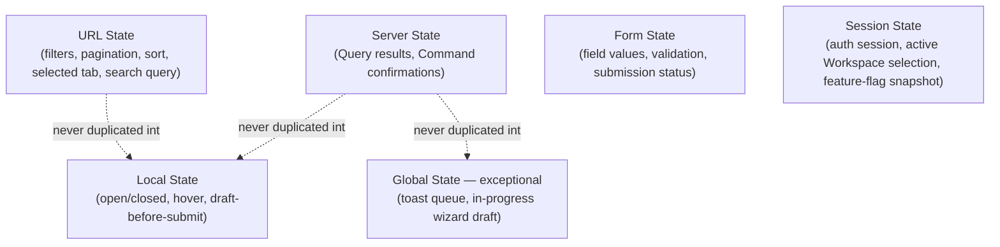
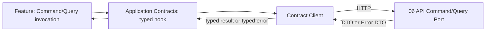

# PR7 Companion — Frontend State and Data Architecture

Status: Documentary architecture (no implementation)
Parent: `07-canonical-frontend-architecture.md`
Authority: `06-canonical-api-contracts.md` and companions, `04-canonical-application-architecture.md` §24 (Consistency Model), `05-tenancy-rls-and-data-security.md` §10 (Data Classification)

Purpose: separate the frontend's state kinds formally, so that "where does this value live" has one answer per kind, and fix the data-fetching, caching, optimistic-UI, idempotency, and concurrency model the frontend uses to consume `06-canonical-api-contracts.md`'s Command and Query API.

## 1. State Taxonomy

Five state kinds, each with exactly one legitimate home. A value that seems to fit two kinds is a sign the value has not been decomposed correctly, not license to duplicate it into both.

| Kind | Owner | Lives in | Survives reload? | Shareable via link? |
| --- | --- | --- | --- | --- |
| Server State | The canonical API (`06-canonical-api-contracts.md`) | Query cache (§4) | Yes (refetched) | N/A — the data itself, not a state concern |
| URL State | The current navigation | URL search params / route segments | Yes | Yes, where the underlying data is itself shareable (§3) |
| Local State | The owning component/Feature | Component memory | No | No |
| Form State | The owning form/Feature | Component/form-library memory until submission | No (until submitted, at which point it becomes a Command and its result becomes Server State) | No |
| Session State | The authenticated session | Server-issued session (cookie/JWT) plus a minimal client mirror for render decisions | Yes (session-scoped) | No |

## 2. Server State

**A Query result is owned by the server; the frontend only ever caches it.** No component, hook, or store treats a fetched Project, Recommendation, or Command Center projection as independently authoritative once fetched — every server-state value carries the staleness/consistency character `04-canonical-application-architecture.md` §24 already assigns it (Strong or Eventual), and the frontend never presents an Eventually-consistent projection (Command Center widgets, Search, Health) with the same "this is definitely current" affordance it would give a Strongly-consistent single-record read (`06-canonical-api-contracts.md` §8).

Binding rules:
1. Server state is never copied into a global client store "for convenience" — the cache (§4) is the only copy, and every consumer reads through it.
2. A component never mutates server state locally except through the optimistic-UI contract (§8) tied to an in-flight Command.
3. Server state's shape is exactly the Response/Summary/Projection DTO shape (`06-canonical-api-contracts.md` §9) — a component never reshapes a DTO into a new client-only model that then drifts from the contract.

## 3. URL State

Filters, pagination cursors, sort, selected tab/sub-view, and search query are kept in the URL wherever the underlying data itself is safe to share at that URL (i.e., where a recipient with the link would be independently authorized to see the same result, or where the URL only encodes presentation, not data). Where a filter's value would leak scope information to an unauthorized recipient of a shared link (e.g., an internal classification filter, §9), it stays as Local or Session state instead — URL shareability is a default, not an absolute rule, exactly as `07-canonical-frontend-architecture.md` §3 principle 7 states.

Restores `03-navigation-contracts.md` §6 Context Rules exactly: Filter state is screen-local, never implicitly carried to a different screen (Filters row); a Search result's return-navigation restores the exact prior query and filter state (Search row) — both are URL-state behaviors by construction, since the URL itself is what's being navigated back to.

## 4. Local State

Ephemeral, presentation-only state: an open dropdown, a hover/focus state, a draft value before a form is submitted, an expanded/collapsed row. Local state is scoped to its owning component and never promoted to Feature-, module-, or global-level state without a documented reason (`07-canonical-frontend-architecture.md` §3 principle 8) — the default assumption for any new piece of UI state is Local, not Global.

## 5. Form State

A form's field values, per-field and whole-form validation state, and submission status (idle/validating/submitting/succeeded/failed) are Form State until submission. On submission, a form's payload becomes a Command Request DTO (`06-canonical-api-contracts.md` §9) dispatched through the Application Contracts layer (`07-frontend-module-boundaries.md` §1) — the form does not construct or send its own ad hoc request shape; it is validated client-side for wire-format/UX responsiveness only, never as a substitute for the server-side validation the API command port and application layer already perform (`06-canonical-api-contracts.md` §2 principle "The API layer contains no business logic"). On success, the form's local state is discarded and the affected Server State (§2) is invalidated (§6); on failure, the form surfaces the returned Error DTO (`06-error-model.md` §2) mapped to field-level messages where the error's `details` array provides them.

## 6. Session State

The authenticated session (identity, active Enterprise/Workspace selection, resolved role, feature-flag snapshot) is server-issued and server-validated on every request (§5 of `07-route-layout-and-navigation-architecture.md`); the client holds a minimal mirror sufficient for render decisions (e.g., which nav items to show) but that mirror is never treated as authoritative for an authorization decision — every Command and Query re-resolves and re-authorizes server-side regardless of what the client's session mirror currently displays (ADR-PMF-061). The active-Workspace selection specifically is Session State, not URL state or `localStorage` — restating ADR-PMF-061's binding rule that tenancy is never trusted from client storage.

## 7. Global State — Exceptional and Governed

A cross-cutting client store is justified only where a value is: genuinely global (used by unrelated modules), genuinely not server-owned, and genuinely not expressible as URL or Session state. Examples that qualify: a toast/notification-banner queue, an in-progress multi-step creation wizard's unsaved draft (until submitted as a Command), a client-only feature-flag override for local development. Examples that do **not** qualify, restated from `07-canonical-frontend-architecture.md` §2: a cached copy of a fetched Project "so multiple components don't have to refetch it" (that is the Query cache's job, §4) — introducing a second, independently-updated copy is exactly the accidental-second-source-of-truth failure mode `04-canonical-application-architecture.md` §9.5 already named at the projection layer.

Every global store entry must name: what it holds, why it cannot be URL/Session/Server state, and which module(s) legitimately read it — an ungoverned, catch-all global store is itself a fitness-function violation (`07-frontend-module-boundaries.md` §4).

## 8. Data Fetching and the API Client

Every Query and Command is invoked through the Application Contracts layer's contract client (`07-frontend-module-boundaries.md` §1, ADR-PMF-060) — generated from or hand-maintained against `06-canonical-api-contracts.md`'s Command/Query/DTO catalogs, never a component-authored `fetch` call constructing its own URL and shape. The contract client is the only layer that knows an HTTP status code, a header name, or a DTO's wire shape exists; every layer above it (Domain Presentation, Features, Screens) works exclusively with typed view models and typed error categories (`06-error-model.md` §1).

## 9. Caching and Invalidation

Server state (§2) is cached per-Query, keyed by the Query's name and its resolved parameters (including the resolved tenant scope, never keyed in a way that could return one Workspace's cached result for another's request — restating ADR-PMF-061 at the cache-key layer). A Command's success invalidates exactly the Query cache entries `06-command-catalog.md` documents that Command as affecting — never a blanket cache-clear "to be safe," which would defeat the purpose of caching, and never a cache that is left stale because a Command's effect on a given Query was left undocumented (a documentation gap to close in `06-command-catalog.md`, not something the frontend silently guesses around).

Eventually-consistent Query results (Command Center projections, Search, Health — `04-canonical-application-architecture.md` §24) surface their staleness explicitly (`06-canonical-api-contracts.md` §9's Projection DTO staleness indicator) rather than being cached and presented identically to a Strongly-consistent read.

## 10. Optimistic UI

Optimistic UI — rendering a Command's expected result before its Response DTO confirms it — is permitted only where: (1) the Command's likely failure modes are known and narrow, (2) a rollback to the prior server-confirmed state is well-defined and actually implemented, and (3) the optimistic render is visually distinguishable from a confirmed state (§2 of `07-canonical-frontend-architecture.md`'s "a pending Command is not a completed one" rule). Commands with irreversible or sensitive effects (`04-canonical-application-architecture.md` §13's "Human approval required" column — `ArchiveProject`, `RecordDecision`, `RatifyEnterpriseKnowledge`, etc.) are never rendered optimistically; their UI waits for the Response DTO (full pending/confirmation UX: `07-command-query-and-error-experience.md` §3).

## 11. Idempotency

Every Command the frontend dispatches for an endpoint `06-command-catalog.md` flags idempotency-required carries a client-generated `Idempotency-Key` (UUID or equivalent), generated once per user-initiated attempt and reused across automatic network retries of that same attempt — never regenerated on retry (which would defeat idempotency) and never reused across two distinct user-initiated submissions (which would incorrectly collapse them into one, per `06-canonical-api-contracts.md` §17's replay-vs.-conflict distinction). Double-submit protection (disabling a submit button, ignoring a duplicate rapid click) relies on this same key rather than a separate, parallel mechanism.

## 12. Optimistic Concurrency

Every screen editing a resource `05-canonical-persistence-architecture.md` §14/`06-canonical-api-contracts.md` §18 classifies as versioned reads and stores that resource's `version`/`ETag` alongside its Server State cache entry and submits it as `If-Match` on the corresponding Command. A `StaleVersionError` response (`06-error-model.md`) is surfaced as an explicit, comparable conflict UI — never retried automatically and never silently overwritten (full UX: `07-command-query-and-error-experience.md` §5).

## 13. Polling and Realtime

Where a screen needs updates more current than a manual refetch-on-navigation provides (an in-progress Agent Run, an Evidence ingestion job — `04-canonical-application-architecture.md` §22's asynchronous-operation table), the frontend polls the relevant status Query at an interval appropriate to that operation's documented latency (e.g., `GetAgentRun` while `AgentRunStatus` is non-terminal) rather than inventing a bespoke push mechanism per screen. A dedicated realtime/push provider (WebSocket, SSE, or a specific vendor) is not adopted by this PR — it remains an open decision (§13 of `07-canonical-frontend-architecture.md`), evaluated against genuine evidenced need, consistent with `06-canonical-api-contracts.md` §4's "GraphQL, only if justified" precedent for not adopting infrastructure ahead of evidence.

## 14. Sensitive-Data Restrictions

The frontend's caches (§9), URL state (§3), and any client-side persistence (`localStorage`/`sessionStorage`, where used at all — restricted to non-sensitive UI preference values only, e.g. a collapsed-sidebar flag) never hold data above the "Internal" classification in `05-tenancy-rls-and-data-security.md` §10 without the same access-logging and export-restriction guarantees that classification requires server-side. Concretely:
- **Confidential and above** (Project financials, Evidence, Decisions, Agent prompts/outputs, secrets) are never written to `localStorage`/`sessionStorage`, never embedded in a shareable URL, and never sent to a client-side analytics/logging provider without field-level redaction.
- Search and Semantic Search results never carry an embedding to the client, mirroring `06-canonical-api-contracts.md` §13's API-layer prohibition — the frontend has nothing to accidentally cache or leak that the API never sent it.
- A signed object-storage URL (`05-tenancy-rls-and-data-security.md` §13) is treated as a short-lived secret by the frontend — never logged, never persisted beyond the component's in-memory lifetime.
- Session mirrors (§6) never include another tenant's data, even transiently, during a Workspace switch — the switch is treated as a full remount of tenant-scoped state, not an in-place patch that could momentarily show stale cross-tenant data.
