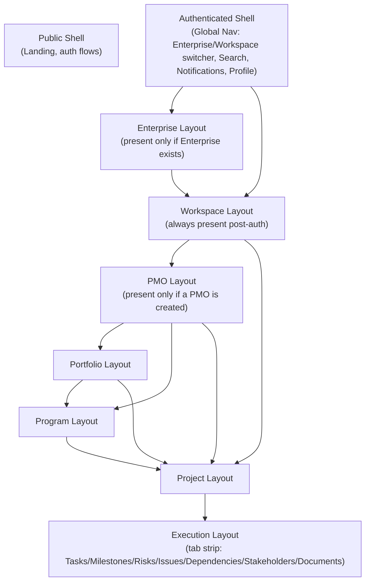
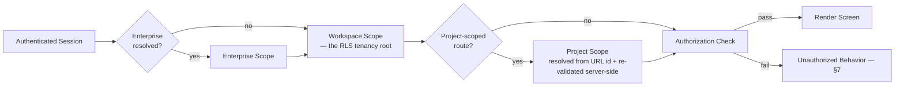

# PR7 Companion — Route, Layout, and Navigation Architecture

Status: Documentary architecture (no implementation)
Parent: `07-canonical-frontend-architecture.md`
Authority: `03-canonical-information-architecture.md` §5–§11, `03-navigation-contracts.md` (all sections), `03-screen-catalog.md`, `01.1-domain-ratification.md` (hierarchy and cardinalities)

Purpose: translate the fifty canonical screens and the navigation contracts PR3 already ratified into a concrete route and layout structure, without inventing a single new screen, edge, or navigation rule. Every rule below cites the PR3 section it restates.

## 1. Route Design Rule

**A route names the entity it addresses, using the entity's canonical identifier (`05-canonical-persistence-architecture.md` §6) — never a slug derived from its position in someone's current navigation path.** Because `03-canonical-information-architecture.md` §7's ratified hierarchy allows a Project to be reached via Workspace directly, via PMO directly, via Portfolio, or via Program (all ratified shortcuts, §1.1), and because Project's only *obligatory* structural parent is Workspace (`01.1-domain-ratification.md`), **Project and every Project-scoped Execution Layer screen use a Workspace-rooted route, never a route nested under whichever parent happened to be used to reach it.** The breadcrumb trail (§4 below) is computed from the entity's actual ratified ancestry and rendered independently of the URL's nesting — this is what keeps a single Project addressable by one canonical URL regardless of whether it was reached through PMO → Program or Portfolio → Program (`03-navigation-contracts.md` §2.2's shortcut-trail table already establishes that the *breadcrumb* varies by actual ancestry while the screen itself is one screen).

Portfolio and Program are PMO-scoped in their route because Program → PMO is the one relationship PR1.1 ratifies as always mandatory, never optional (`03-canonical-information-architecture.md` §1.1) — their canonical URL reflects that mandatory structural parent.

## 2. Canonical Route Map

Every route below corresponds to exactly one screen in `03-screen-catalog.md`; the "Screen" column uses the exact name from `03-canonical-information-architecture.md` §5. No screen is missing a route; no route lacks a screen (mirrors IA Principle 1, restated at the route layer).

| Route template | Screen | Layout chain |
| --- | --- | --- |
| `/` | Landing | Public Shell |
| `/login`, `/signup`, `/forgot-password` | (auth flows feeding Landing's children) | Public Shell |
| `/search` | Search (Global) | Authenticated Shell |
| `/notifications` | Notifications | Authenticated Shell |
| `/profile` | Profile | Authenticated Shell |
| `/profile/saved-projects` | Saved Projects | Authenticated Shell → Profile |
| `/enterprises/[enterpriseId]` | Enterprise Home | Authenticated Shell → Enterprise |
| `/enterprises/[enterpriseId]/command-center` | Enterprise Command Center | Authenticated Shell → Enterprise |
| `/enterprises/[enterpriseId]/settings` | Enterprise Settings | Authenticated Shell → Enterprise |
| `/enterprises/[enterpriseId]/knowledge` | Knowledge Center (Enterprise) | Authenticated Shell → Enterprise |
| `/workspaces/[workspaceId]` | Workspace Home | Authenticated Shell → Workspace |
| `/workspaces/[workspaceId]/command-center` | Workspace Command Center | Authenticated Shell → Workspace |
| `/workspaces/[workspaceId]/settings` | Workspace Settings | Authenticated Shell → Workspace |
| `/workspaces/[workspaceId]/pmos/[pmoId]` | PMO Home | Authenticated Shell → Workspace → PMO |
| `/workspaces/[workspaceId]/pmos/[pmoId]/command-center` | PMO Command Center | Authenticated Shell → Workspace → PMO |
| `/workspaces/[workspaceId]/pmos/[pmoId]/settings` | PMO Settings | Authenticated Shell → Workspace → PMO |
| `/workspaces/[workspaceId]/pmos/[pmoId]/portfolios/[portfolioId]` | Portfolio Home | Authenticated Shell → Workspace → PMO → Portfolio |
| `/workspaces/[workspaceId]/pmos/[pmoId]/portfolios/[portfolioId]/command-center` | Portfolio Command Center | Authenticated Shell → Workspace → PMO → Portfolio |
| `/workspaces/[workspaceId]/pmos/[pmoId]/portfolios/[portfolioId]/settings` | Portfolio Settings | Authenticated Shell → Workspace → PMO → Portfolio |
| `/workspaces/[workspaceId]/pmos/[pmoId]/programs/[programId]` | Program Home | Authenticated Shell → Workspace → PMO → Program |
| `/workspaces/[workspaceId]/pmos/[pmoId]/programs/[programId]/command-center` | Program Command Center | Authenticated Shell → Workspace → PMO → Program |
| `/workspaces/[workspaceId]/pmos/[pmoId]/programs/[programId]/settings` | Program Settings | Authenticated Shell → Workspace → PMO → Program |
| `/workspaces/[workspaceId]/pmos/[pmoId]/programs/[programId]/roadmap` | Roadmap | Authenticated Shell → Workspace → PMO → Program |
| `/workspaces/[workspaceId]/projects/[projectId]` | Project Home | Authenticated Shell → Workspace → Project |
| `/workspaces/[workspaceId]/projects/[projectId]/command-center` | Project Command Center | Authenticated Shell → Workspace → Project |
| `/workspaces/[workspaceId]/projects/[projectId]/tasks` | Tasks | Authenticated Shell → Workspace → Project → Execution |
| `/workspaces/[workspaceId]/projects/[projectId]/milestones` | Milestones | Authenticated Shell → Workspace → Project → Execution |
| `/workspaces/[workspaceId]/projects/[projectId]/risks` | Risks | Authenticated Shell → Workspace → Project → Execution |
| `/workspaces/[workspaceId]/projects/[projectId]/issues` | Issues | Authenticated Shell → Workspace → Project → Execution |
| `/workspaces/[workspaceId]/projects/[projectId]/dependencies` | Dependencies | Authenticated Shell → Workspace → Project → Execution |
| `/workspaces/[workspaceId]/projects/[projectId]/stakeholders` | Stakeholders | Authenticated Shell → Workspace → Project → Execution |
| `/workspaces/[workspaceId]/projects/[projectId]/documents` | Documents | Authenticated Shell → Workspace → Project → Execution |
| `/workspaces/[workspaceId]/projects/[projectId]/recommendations` | Recommendations | Authenticated Shell → Workspace → Project → Execution |
| `/workspaces/[workspaceId]/projects/[projectId]/decisions` | Decisions | Authenticated Shell → Workspace → Project → Execution |
| `/workspaces/[workspaceId]/projects/[projectId]/actions` | Actions | Authenticated Shell → Workspace → Project → Execution |
| `/workspaces/[workspaceId]/projects/[projectId]/outcomes` | Outcomes | Authenticated Shell → Workspace → Project → Execution |
| `/workspaces/[workspaceId]/projects/[projectId]/feed` | Project Intelligence Feed | Authenticated Shell → Workspace → Project |
| `/workspaces/[workspaceId]/projects/[projectId]/memory` | Project Memory | Authenticated Shell → Workspace → Project |
| `/workspaces/[workspaceId]/admin` | Administration (Workspace-scoped) | Authenticated Shell → Workspace → Admin |
| `/workspaces/[workspaceId]/admin/users`, `/workspaces/[workspaceId]/admin/permissions`, `/workspaces/[workspaceId]/admin/audit`, `/workspaces/[workspaceId]/admin/api-keys`, `/workspaces/[workspaceId]/admin/billing`, `/workspaces/[workspaceId]/admin/integrations` | Users, Permissions, Audit, API Keys, Billing, Integrations | Authenticated Shell → Workspace → Admin |
| `/enterprises/[enterpriseId]/admin/...` (same children) | Administration (Enterprise-scoped) | Authenticated Shell → Enterprise → Admin |

**Cross-scope screens** (Reports, Health Center, Forecast Center, Calendar, Timeline, Agent Center — `03-canonical-information-architecture.md` §5.11) are not separate routes; each is a sub-path or tab under the scoping entity's own route (e.g., `/workspaces/[workspaceId]/projects/[projectId]/health`, `/workspaces/[workspaceId]/projects/[projectId]/agents`), consistent with §5.11's rule that Parent = the scoping entity's Home/Command Center.

**Search variants** (Workspace Search, Project Search, Knowledge Search, Agent Search — `03-canonical-information-architecture.md` §5.12) are query-parameterized views of their scoping route (e.g., `/workspaces/[workspaceId]?q=...&scope=workspace`) or a dedicated sub-path, resolved during migration — the exact form is an open decision (§13 of the parent document does not fix this; it is a route-migration-order detail, not an architectural one).

Total: fifty canonical screens (`03-canonical-information-architecture.md` §6). Every one of the fifty resolves to either an explicit top-level route row above, or a sub-path/query-parameterized view of an already-listed route, per the two rules stated immediately below the table: the six cross-scope screens' sub-path form is fixed by this document; the four Search variants' exact route form is explicitly left open. So "every screen has a route" holds for all fifty, but "every screen's route form is already fixed by this document" does not — it holds for forty-six of the fifty; the four Search variants remain an open route-form decision (§13 of the parent document).

## 3. Layout Hierarchy

Each layout owns exactly the chrome `03-canonical-information-architecture.md` §8 assigns to its level: the Authenticated Shell owns Global Navigation (§8.1); the Workspace/PMO/Portfolio/Program layouts own Primary Navigation for their scope (§8.2); the Project layout owns Secondary Navigation across the Execution tab strip (§8.3); every layout in the chain contributes one node to Context Navigation (§8.4, §4 below). A layout is skipped, never rendered empty, when its entity does not exist for the current tenant (Enterprise and PMO layouts are absent for segments that have not created one, per the Progressive Disclosure Model, `03-canonical-information-architecture.md` §7) — skipping a layout is a presentation decision; it never changes the route template beneath it, since the route always names the entity actually being addressed, not a hypothetical full-depth path.

## 4. Screen-to-Route Mapping Rules

1. Every route resolves to exactly one screen; a screen is never split across two competing routes (restates IA Principle 5, One Entity One Home).
2. A route's *forward* navigation (a link or Quick Action offered from one screen to create or open a differently-scoped entity) never implies a navigation edge `03-navigation-contracts.md` §1 does not ratify — a Project screen never offers a direct-creation or direct-open action that would imply a fictitious Project→Portfolio edge, for instance. This does not restrict *ancestor-return* navigation: per `03-navigation-contracts.md` §2.3 rule 1 and §7, a breadcrumb node for an entity's actual resolved ancestor (e.g., a Project's Portfolio, where one exists in that Project's real ancestry) is always clickable and always navigates to that ancestor's Home — that is name-resolving an existing relationship (§6 below), not inventing a new edge.
3. Command Center routes are always the terminal segment under their entity (`/…/command-center`), mirroring the breadcrumb rule that Command Center is always the trail's terminal node (`03-navigation-contracts.md` §2.3 rule 4) — never a mid-path segment with children beneath it.
4. Dynamic route segments (`[workspaceId]`, `[projectId]`, etc.) use the canonical identifier only (`05-canonical-persistence-architecture.md` §6); no route segment is a name, slug, or display label that could collide or go stale.

## 5. Tenant Context Resolution

Per ADR-PMF-061 and `06-canonical-api-contracts.md` §16, tenant context is resolved **server-side, on every request**, from the authenticated session and the resource's own parent chain — a route's `[workspaceId]`/`[projectId]` segment is a *request* for that scope, subject to full re-authorization on the server, never an *authority* the client can use to widen its own access.

Rules (restating `05-tenancy-rls-and-data-security.md` §1, §3, §8 at the frontend layer):
1. No route handler, layout, or Screen trusts a client-supplied `workspace_id`/`project_id` cookie or `localStorage` value as authoritative — the server re-resolves and re-authorizes on every navigation, exactly as `06-canonical-api-contracts.md` §16 requires of every API request the route's data-fetching ultimately makes.
2. Workspace is the tenancy boundary at the route layer, exactly as it is at the persistence layer (ADR-PMF-002, restated ADR-PMF-061) — an Enterprise-scoped route never implies automatic access to any specific Workspace's data.
3. A route whose resolved scope cannot be established renders Unauthorized behavior (§7), never a partial or best-guess render.
4. The Workspace switcher (`03-canonical-information-architecture.md` §8.1) is the only sanctioned way a route's active Workspace changes — never an implicit change triggered by a screen transition (`03-navigation-contracts.md` §6 Context Rules, Workspace row).

## 6. Breadcrumbs

Breadcrumbs implement `03-navigation-contracts.md` §2 exactly: computed from the entity's actual resolved ancestry (never the URL's nesting depth, since Project routes are Workspace-rooted regardless of actual PMO/Portfolio/Program ancestry, §1 above), every node clickable to that ancestor's Home (never its Command Center, §2.3 rule 1), Command Center always terminal (§2.3 rule 4), Enterprise/Consultant cross-Workspace trails always show the Workspace name explicitly (§2.3 rule 5), and Guest trails show only the single shared item (§2.3 rule 6). The breadcrumb component is a Domain Presentation component (`07-frontend-module-boundaries.md` §1) fed a server-resolved ancestry view model — it never re-derives ancestry from the URL client-side.

## 7. Unauthorized, Archived, and Not-Found Behavior

| Condition | Behavior | Rationale |
| --- | --- | --- |
| **Unauthorized** — authenticated, but lacking the role/permission the resolved scope requires | Explicit "you don't have access to this" state, never a silent redirect to a different entity and never a bare 404 that would hide the resource's existence from someone who might legitimately request access | `06-error-model.md` §1's `AuthorizationError` (403) is the source category; the frontend must not collapse it into `NotFoundError`'s presentation, since the two answer different questions (`06-error-model.md` §4's authentication/authorization distinction extends here: existence-known-but-denied vs. genuinely absent) |
| **Archived** — the entity exists but has been archived (Project, Workspace archival per `04-canonical-application-architecture.md` §13 `ArchiveWorkspace`/`ArchiveProject`) | Read-only banner state showing the archived entity's last-known data where the viewer is still authorized, with mutation actions disabled and explained, never a redirect that hides the archival happened | Archival is a state transition (soft-delete equivalent, `05-canonical-persistence-architecture.md` §16), not a deletion — the frontend must reflect that distinction, not treat archived identically to not-found |
| **Not Found** — no entity resolves for the given identifier, or the requester is not authorized to know whether it exists (per §4's leakage-prevention ordering) | Generic not-found state, identical in presentation whether the record never existed or the requester's authorization would otherwise leak its existence, per `06-canonical-api-contracts.md` §3 principle 15's leakage-prevention rule extended to the UI | Matches the API layer's own authorization-before-validation-side-effects ordering (`06-canonical-api-contracts.md` §2, §3 principle 15) — the frontend must not accidentally leak more than the API already decided to reveal by rendering a different not-found page for "truly absent" vs. "exists but hidden" |
| **Guest access expired/revoked** | The dedicated "access ended" state `03-navigation-contracts.md` §5 redirect class 3 already names — never silently to Landing, never a bare 404 | Restates `03-navigation-contracts.md` §5 exactly |

## 8. Route Migration Strategy (Summary)

Full phased plan: `07-frontend-migration-strategy.md`. Summary rule: a route migrates to the canonical map (§2) only when its target screen, module (`07-frontend-module-boundaries.md` §2), and data contract (`07-frontend-state-and-data-architecture.md`, `06-canonical-api-contracts.md`) are all simultaneously ready — a route is never moved to a new URL ahead of its data layer being ready to serve it, and the old route continues to function (strangler pattern, ADR-PMF-068) until its replacement is verified.

## 9. Current Route Classification

Methodology: enumeration of `src/app/` and `src/app/(protected)/` directory children (see `07-frontend-module-boundaries.md` §5 for the full directory listing and `07-frontend-migration-strategy.md` for exact counts). Classification against the canonical map (§2):

| Classification | Meaning | Examples from current `src/app/(protected)/` |
| --- | --- | --- |
| **Direct match** | Current route name corresponds clearly to a canonical screen/entity | `billing`, `evidence`, `projects`, `programs`, `portfolio`, `workspace`, `workspaces`, `pmo`, `pmos`, `audit` |
| **Near match, needs remapping** | Current route addresses a canonical concept but under a non-canonical name or shape | `command-center` (canonical screens require entity-qualified Command Centers per `03-canonical-information-architecture.md` §11 — a bare `command-center` route is exactly the anti-pattern §2.4/ADR-PMF-014 Rule 6 warns about, and PR1 §11 already flagged today's `/command-center` as mixing Project- and Workspace-level data on one screen); `pmo-command-center` (must not be confused with the user-facing PMO Command Center per ADR-PMF-014 Rule 6, `03-canonical-information-architecture.md` §5.4); `create-command-center`, `create-pmo` (creation flows should land on the created entity's Home per IA Principle 7, not exist as standalone routes) |
| **No canonical counterpart yet** | No corresponding screen in `03-screen-catalog.md`'s fifty; requires a per-route decision (map to an existing screen as a Feature, or deprecate) during migration | `playground`, `debug-session`, `change-detection`, `follow-up-dashboard`, `message-nudges`, `pilot-agreement`, `founder-circle`, `founder-program`, `early-access`, `trial-inactive`, `getting-started`, `input-hub`, `operational-memory`, `trust`, `political-risk`, `stakeholder-intel`, `escalation-guide`, `meetings`, `copilot` |

No route above is renamed, removed, or modified by this PR — this table is the classification `07-frontend-migration-strategy.md`'s phased plan is built against.
