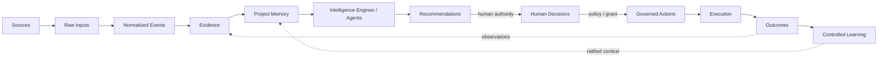

# PMFreak Product Baseline v2

**Status:** Normative target-product baseline (P0)
**Date:** 2026-08-10
**Scope:** Desired product contract; it is not evidence of implementation.
**Interpretation:** `MUST`, `SHOULD`, and `MAY` are normative. “Current” claims below describe ratified documentation, not runtime proof. P1 must verify all implementation claims. PMFreak is **PMI-aligned** where its practices correspond to general project-management practice; no PMI certification, endorsement, official compliance, or interoperability is claimed.

## Executive Product Definition

### Canonical definition — English

> **PMFreak is an AI-native Operational Command Center for project and portfolio execution. It maintains a persistent, temporal and verifiable operational model; converts authorized project signals into evidence; detects deviations and exposure; produces explainable recommendations; records governed human decisions; coordinates execution; observes outcomes; and improves organizational decision intelligence over time.**

### Definición canónica — español

> **PMFreak es un Centro de Comando Operacional nativo de IA para la ejecución de proyectos y portafolios. Mantiene un modelo operacional persistente, temporal y verificable; convierte señales autorizadas del proyecto en evidencia; detecta desviaciones y exposición; produce recomendaciones explicables; registra decisiones humanas gobernadas; coordina la ejecución; observa resultados; y mejora con el tiempo la inteligencia de decisión de la organización.**

**One line.** PMFreak shows whether execution is under control and governs the evidence-to-outcome loop needed to keep it—or return it—under control.

**Commercial paragraph.** General-purpose AI can help perform project work. PMFreak maintains the operational model required to understand, govern, and improve that work: it concentrates attention on material exposure, makes the evidence and uncertainty behind recommendations inspectable, preserves accountable decisions, closes follow-through, and learns only through controlled, longitudinal observation. It optimizes decisions and outcomes, not task volume.

**Technical definition.** PMFreak is a tenant- and authority-aware domain system that projects versioned project and portfolio state from authorized sources; preserves provenance; evaluates temporal intelligence; and manages separately persisted Recommendation → Decision → Action → Task → Outcome lifecycles. It consumes sovereign identity, integrity, capability, delegation, policy, grant, revocation, and audit contracts from AOC rather than owning them.

**PMFreak is not:** a chatbot for project managers; an agent-name catalogue; a general-purpose content generator; a replacement for every project tracker; an autonomous final authority; a decorative reporting layer; or a second implementation of AOC. Chat, agents, summaries, minutes, reports, task extraction, Q&A, and connectors are enabling surfaces only.

The product promise is bounded: PMFreak provides traceable operational understanding, governed intervention, and defensible forecasts. It does not guarantee project success or convert correlation into causality.

## Strategic Differentiation

PMFreak's defensible unit is the **closed, governed, longitudinal operational loop**, not any isolated AI operation.

| General-purpose capability | PMFreak-specific product contract | Verifiable consequence |
|---|---|---|
| Summarize or answer | Maintain typed, temporal operational state and authority-bounded memory | A claim resolves to state, time, source coverage, and evidence |
| Recommend | Explain alternatives, tradeoffs, confidence, urgency, and required authority | A reviewer can accept, reject, defer, or request evidence without treating AI as authority |
| Create work | Preserve Decision → Action → Task separation and commitments | Execution has owner, lifecycle, lineage, escalation, and audit events |
| Report status | Detect exposure and trend from snapshots with explicit evaluation context | A health claim is reproducible and admits stale/incomplete/degraded states |
| Learn preferences | Correlate recommendation/decision/action/outcome and require controlled elevation | One experience cannot silently become enterprise truth |
| Integrate tools | Treat tools as sources/execution providers, not the system of intelligence | Provenance and source-of-record ownership remain explicit |
| Coordinate agents | Apply identity, least authority, explicit handoffs, checkpoints, and attribution | Every material agentic action is attributable and governed |

The product answers two related control questions: **what requires attention and why**, then **what governed intervention should occur and did it produce the intended outcome**. The first without the second is a dashboard; the second without the first is workflow automation. PMFreak requires both.

## Target Personas and Jobs to Be Done

| Persona and dominant question | Jobs to be done | Key decisions | Required information | Permitted actions | Trust risks | Value criterion |
|---|---|---|---|---|---|---|
| **Project Manager** — “¿Qué requiere mi atención hoy para mantener este proyecto bajo control?” | Prioritize contextual attention; identify exposure early; make evidence-based decisions; close actions; reduce administration; defend forecasts; preserve continuity | Replan, mitigate/escalate risk, resolve dependency, request change/resources, assign follow-up | Current/stale deltas, milestones, dependencies, risk/issues, decisions, commitments, evidence, confidence and forecast bounds | Acknowledge/dismiss findings with rationale; propose/record authorized decisions; create/track actions; escalate; observe outcomes | Automation bias; stale/incomplete evidence; false precision; hidden external changes; excessive alerts | Less time to reliable attention; fewer surprise deviations; decisions and actions close with defensible lineage |
| **PMO Manager / Director** — “¿Dónde debo intervenir y qué patrón amenaza el desempeño del portafolio?” | Compare projects; detect deterioration; expose resource/cross-project conflicts; enforce methodology proportionately; see exceptions; ratify aggregate intelligence | Select interventions, arbitrate conflicts, escalate decisions, approve exceptions, ratify/reject learning candidates | Comparable health with quality limits; trends; systemic patterns; capacity; cross-project dependencies; escalations; authority | Filter/drill down; request evidence; intervene within authority; approve/escalate; ratify eligible organizational knowledge | Invalid comparisons; aggregation hiding uncertainty; leaking restricted projects; mistaking correlation for cause | Earlier, fewer, higher-leverage interventions with measurable portfolio effect |
| **Executive / Sponsor** — “¿Existe una decisión o exposición que requiere intervención ejecutiva?” | Understand strategic/outcome exposure; decide material escalations; test forecast confidence without operational noise | Fund/stop/re-scope; accept exposure; resolve executive dependency; change priority | Outcome alignment, material exposure, options/tradeoffs, pending decision, forecast range/confidence, evidence on demand | Approve/reject/defer within authority; request analysis; set strategic constraint; sponsor escalation | Compressed summaries hiding dissent or missing data; apparent certainty; unauthorized disclosure | Timely executive decisions with understood downside, confidence, and follow-through |
| **Enterprise / Governance Administrator** — “¿Quién o qué agente puede hacer qué, bajo cuál política y con qué evidencia?” | Administer identity/roles; delegation; policy/obligations; grants/revocation; audit; agent controls | Authorize/revoke, approve delegation/policy, investigate access/action, configure retention | Actor/agent identity references, authority scope, policy result, obligations, grant status, audit evidence | Govern via AOC-E contracts; inspect projections; revoke/escalate; export audit evidence | PMFreak shadow authority; stale projection; confused identity; overbroad delegation; cross-tenant leakage | Every access/material action is explainable, attributable, least-authorized, revocable, and exportable |

**Cross-persona rule:** visibility does not confer mutation authority. Every action is evaluated for actor, entity, scope, purpose, time, policy, and—where applicable—grant.

## Organizational Domain Hierarchy

Canonical target: `Enterprise → Workspace → PMO → Portfolio → Program → Project`.

| Level | Purpose and ownership | Originates / consumes | Decisions and intelligence | Aggregation, isolation, authority |
|---|---|---|---|---|
| **Enterprise** | Contractual/organizational root; owned by enterprise authority | Global policy/configuration, approved knowledge; consumes permitted cross-workspace projections | Data sovereignty, cross-workspace governance; ratified enterprise intelligence | No raw aggregation by default; Workspace remains isolation boundary; AOC-E authority applies |
| **Workspace** | Operational tenant and security boundary; workspace owner/admin | Membership, source configuration, local settings; consumes enterprise policy and scoped domain data | Access/configuration and operational administration; workspace trends | All reads/writes workspace-scoped; cross-workspace use needs explicit eligible projection and authority |
| **PMO** | Governance/methodology unit; PMO leadership | Standards, tolerances, exceptions, intervention records; consumes portfolio/project projections | Method exceptions, intervention and ratification; PMO intelligence | Compare only quality-qualified data; preserve source project and confidence; workspace-scoped |
| **Portfolio** | Investment/change grouping; portfolio owner/sponsor | Priorities, strategic outcomes, allocation constraints; consumes member programs/projects | Prioritization, tradeoffs, resource arbitration; portfolio exposure | Membership and effective-time explicit; no forced uniformity; authority scoped to portfolio |
| **Program** | Coordinated outcomes across related projects; program manager | Program outcomes, cross-project dependencies/benefits; consumes member project state | Sequencing, dependency resolution, benefit tradeoffs; program forecast | Optional; may belong to portfolio; projects need not belong to program; scoped aggregation |
| **Project** | Delivery/execution aggregate; accountable PM/sponsor | Objectives, outcomes, work, schedule, risks, decisions, actions, evidence links | Project control decisions; health, exposure, recommendations, forecast | Can exist directly under Workspace/PMO; project access and authority always enforced |

**Hierarchy invariants.** Command Center is an operational experience applied to an entity and persona, never another domain entity. Deployments may omit levels: a Project MUST exist without artificial Program or Portfolio creation. Relationships are explicit, effective-dated where material, and cannot imply access. Aggregated values retain membership snapshot, evaluation time, quality/confidence, and drill-down permissions. Knowledge elevation is opt-in/policy-controlled and, where required, human-ratified. Restricted underlying data never crosses Workspace or tenant boundaries through aggregates.

**Documented vocabulary conflicts for P1, not code changes.** Accepted ADRs establish Enterprise distinct from Workspace while historical material described Workspace as the whole organization. Historical `operational_command_centers` persistence conflicts with the newer invariant that Command Center is an experience/projection, not an entity. The canonical hierarchy permits optional Program/Portfolio, while existing relationships may encode different mandatory links. P1 must map runtime vocabulary and migration constraints without treating either filenames or docs as proof.

## Canonical Operational Closed Loop

| Stage | Inputs → outputs | Invariants | Failure/degraded behavior |
|---|---|---|---|
| **Sources** | Authorized external/internal systems → source descriptors and access scope | Source is not evidence; owner and authority are explicit | Unavailable/revoked source is shown; no fabricated continuity |
| **Raw Inputs** | Payloads/files/messages → immutable capture/reference | Raw input is not fact; content hash, capture time, source and scope retained | Quarantine malformed/unauthorized data; retry idempotently |
| **Normalized Events** | Raw inputs → typed, time-aware events | Preserve provenance, source event time, ingest time, identity and schema version | Unknown mappings are rejected/quarantined, never silently coerced |
| **Evidence** | Events plus validation/context → classified evidence items/claims | Fact, assumption, interpretation and dispute remain distinct; evidence may support or contradict | Mark incomplete/conflicting/stale and bound retrieval by authority |
| **Project Memory** | Eligible evidence, decisions and observations → temporal contextual memory | Personal/project/organizational/enterprise memory separated; retention/elevation controlled | Missing context is declared; deletion/retention and revocation respected |
| **Intelligence Engines / Agents** | Operational model, memory, evaluation context → findings/signals | Reproducible where material; agent is proposal producer, not authority | Abstain or degrade on insufficient coverage; record engine/model/error |
| **Recommendations** | Finding, evidence, options → explainable proposal | Not a Decision; includes uncertainty, tradeoffs, urgency and authority needed | May expire, be superseded, disputed, or rejected; never auto-mutate domain |
| **Human Decisions** | Recommendation/options/evidence + actor authority → recorded decision | Actor, authority, time, rationale, options and approvals explicit | Fail closed if authority/policy unavailable; preserve rejection/defer rationale |
| **Governed Actions** | Authorized Decision + obligations/grant when needed → committed Action | Decision is not execution; owner, lifecycle, scope and authority reference explicit | Block/expire/revoke without partial mutation; expose unmet obligation |
| **Execution** | Action → tasks/provider commands/status events | External system ownership and idempotency explicit; every material act attributable | Reconcile ambiguity; do not infer success from transport acceptance |
| **Outcomes** | Execution plus observations → Outcome and evidence-linked observations | Task completion is not outcome achievement; expected vs observed separate | Mark unobserved/inconclusive/adverse; request observation window/data |
| **Learning** | Correlated chain + repeated/qualified outcomes → candidate, then ratified knowledge | Correlation is not causality; no automatic organizational elevation | Keep candidate local, disputed, expired, or rejected; preserve lineage |

Every transition records correlation/causation identifiers where available, actor, occurred/recorded time, tenant/workspace, schema/version, and the authority decision appropriate to the transition.

## Canonical Domain Objects

This is semantic—not a physical schema. IDs are stable and tenant/workspace-scoped unless sovereign elsewhere. `SoR` means system of record.

### Organization and execution

| Object (SoR) | Purpose; minimum conceptual fields | Lifecycle / relationships | Authority, events, invariants |
|---|---|---|---|
| **Enterprise** (PMFreak organizational projection; AOC-E for governance) | Organizational root; id, name, status, sovereignty/config refs | proposed/active/suspended/closed; has Workspaces | Enterprise admin; created/configured/suspended; does not weaken Workspace isolation |
| **Workspace** (PMFreak) | Operational tenant; id, enterprise ref, name, locale/time zone, status | provisioning/active/suspended/archived; contains PMOs/Projects | owner/admin; membership/config changed; mandatory isolation key |
| **PMO** (PMFreak) | Governance unit; id, workspace, charter, tolerances, owner | draft/active/inactive; governs portfolios/programs/projects | PMO authority; standard/exception/intervention events; not Enterprise |
| **Portfolio** (PMFreak) | Strategic grouping; id, owner, objectives, membership effective times | proposed/active/on-hold/closed | portfolio authority; member/priorities changed; membership does not grant access |
| **Program** (PMFreak) | Coordinated outcomes; id, owner, outcomes, optional portfolio | proposed/active/on-hold/closed; relates projects | program authority; dependency/outcome changed; optional for Projects |
| **Project** (PMFreak) | Execution aggregate; id, workspace, owner, objective, outcome targets, status, dates | proposed/active/on-hold/completed/cancelled/archived | authorized PM/sponsor; baseline/status events; can exist without portfolio/program |
| **Project Membership** (PMFreak) | Participation; project, principal ref, role, effective range | invited/active/suspended/ended | membership admin; added/changed/ended; never substitutes authority grant |
| **Role / Authority Assignment** (AOC-E; PMFreak reference/projection) | Who may decide; assignment ref, principal, scope, role, validity, source | requested/active/expired/revoked | AOC-E authority; assigned/revoked; local copy cannot grant power |

### Planning and control

| Object (SoR) | Purpose; minimum conceptual fields | Lifecycle / relationships | Authority, events, invariants |
|---|---|---|---|
| **Deliverable** (PMFreak or external provider) | Accepted output; id, project, acceptance criteria, owner, due/status | planned/in-progress/submitted/accepted/rejected | PM/change authority; acceptance changed; acceptance evidence explicit |
| **Work Item / Task** (declared PMFreak or external) | Executable work; id, project, owner, dates, status, source/ref | proposed/ready/in-progress/blocked/done/cancelled | authorized user/provider; assigned/completed; done ≠ outcome |
| **Milestone** (PMFreak or external) | Zero-duration control point; id, project, target/forecast/actual, criteria | planned/at-risk/achieved/missed/cancelled | schedule authority; forecast/achieved; achieved needs evidence |
| **Dependency** (PMFreak) | Typed predecessor relationship; endpoints, type, lag, validity, confidence | proposed/confirmed/disputed/removed | PM/authorized planner; confirmed/breached; no dangling/self link; cross-project access guarded |
| **Constraint** (PMFreak) | Hard/soft limit; statement, type, source, effective range, owner | proposed/active/released/violated | PM/authority owner; activated/violated; distinguish from assumption |
| **Assumption** (PMFreak) | Unverified planning premise; statement, owner, review date, evidence | proposed/active/validated/invalidated/expired | PM/owner; reviewed/converted; never shown as fact |
| **Risk** (PMFreak) | Uncertain event/exposure; cause-event-impact, probability, impact, owner, response | identified/assessed/responding/monitoring/closed/materialized | PM/risk owner; assessed/escalated/materialized; materialized links Issue |
| **Issue** (PMFreak) | Current problem; description, impact, owner, severity, dates | open/triaged/in-progress/resolved/closed | PM/owner; escalated/resolved; resolution evidence retained |
| **Change** (PMFreak; provider may execute) | Proposed/approved baseline mutation; scope, impact, requester, decision ref | proposed/assessing/approved/rejected/implemented/withdrawn | change authority; approved/implemented; approval ≠ implementation |
| **Resource Commitment** (PMFreak or resource provider) | Time/capacity promise; resource ref, amount, period, owner, confidence | requested/tentative/committed/fulfilled/breached/released | resource authority; committed/breached; avoid exposing protected details |
| **Schedule Snapshot** (PMFreak projection) | Immutable temporal schedule; asOf/evaluatedAt, nodes/edges refs, calendars, source versions, hash | generated/validated/superseded/invalid | engine + validator; generated/invalidated; immutable and reproducible |
| **Forecast** (PMFreak) | Time/outcome estimate; target, range, method, evaluatedAt, horizon, confidence, assumptions | draft/published/superseded/expired | engine/human publisher; published/superseded; never a certainty |
| **Critical Path / Component** (PMFreak derived) | Path/segment/branch/component; snapshot, nodes, float, method/context | computed/validated/stale/superseded | deterministic engine; computed/stale; bound to snapshot and timestamp |

### Evidence and intelligence

| Object (SoR) | Purpose; minimum conceptual fields | Lifecycle / relationships | Authority, events, invariants |
|---|---|---|---|
| **Source** (external owner; PMFreak registry) | Origin/access descriptor; provider, resource, owner, auth scope, freshness | configured/active/degraded/revoked/removed | integration admin/AOC policy; connected/revoked; source ≠ evidence |
| **Raw Input** (PMFreak capture or external reference) | Uninterpreted payload; source, external id, hash/ref, occurred/capturedAt | received/quarantined/processed/rejected/retained/deleted | connector; received/quarantined; immutable or content-addressed |
| **Normalized Event** (PMFreak) | Typed projection; type/version, subject, occurred/recordedAt, raw ref, provenance | accepted/quarantined/superseded | normalizer; accepted/replayed; deterministic mapping/version |
| **Evidence Item** (PMFreak) | Usable support/contradiction; claim/classification, event refs, validity, confidence | candidate/validated/disputed/stale/retracted | authorized validator/engine; validated/disputed; no provenance-free evidence |
| **Signal** (PMFreak) | Potentially relevant change; type, subject, magnitude, threshold, evaluatedAt | detected/acknowledged/dismissed/expired/promoted | engine/user; detected/promoted; signal ≠ finding or fact |
| **Project Memory Item** (PMFreak) | Temporal domain memory; kind, content/ref, scope, effective/recorded time, retention, evidence | active/superseded/disputed/expired/deleted/elevated-copy | authorized actor/policy; remembered/forgotten/elevation-requested; memory tiers isolated |
| **Intelligence Finding** (PMFreak) | Explainable assessment; claim, engine, context, evidence, confidence, state | draft/published/disputed/stale/superseded | engine; published/disputed; inference label mandatory |
| **Recommendation** (PMFreak) | Proposed intervention; problem, context, evidence, options, selected option, impact, risks, confidence, urgency, authority, next steps | draft/proposed/under-review/accepted/rejected/deferred/expired/superseded | human/agent proposal pipeline; proposed/reviewed; never Decision |
| **Recommendation Option** (PMFreak) | Comparable course; option id, actions, impacts, tradeoffs, constraints | available/withdrawn/selected/not-selected | recommender/reviewer; selected; selection alone is not Decision |
| **Confidence / Uncertainty** (PMFreak value object) | Calibrated limits; level/score, method, reasons, missing data, interval | evaluated/stale/superseded | producing engine/human; recalibrated; always bound to claim/time |

### Decision, action and learning

| Object (SoR) | Purpose; minimum conceptual fields | Lifecycle / relationships | Authority, events, invariants |
|---|---|---|---|
| **Decision** (PMFreak business record) | First-class choice; subject, options, selected option, rationale, evidence, actor, authority ref, decidedAt | draft/pending/approved/rejected/deferred/implemented/superseded/expired | authorized human/policy; recorded/approved; Recommendation ≠ Decision |
| **Approval** (PMFreak workflow; AOC-E if governance approval) | Review act; subject, approver, scope, result, rationale, time, policy ref | requested/approved/rejected/withdrawn/expired | designated approver; decided; cannot approve beyond authority |
| **Obligation** (AOC-E; local projection) | Required condition/action; ref, subject, requirement, owner, due, status | pending/satisfied/breached/waived/expired | AOC-E/policy authority; imposed/satisfied; PMFreak cannot waive sovereign obligation |
| **Action** (PMFreak) | Governed commitment; decision ref, owner, intent, due, status, grant/obligation refs | proposed/authorized/committed/in-progress/blocked/completed/cancelled/failed | authorized human/executor; committed/completed; Decision ≠ Action |
| **Execution Grant Reference** (AOC-E) | Proof of execution permission; grant id, issuer, subject, capability/resource, validity/status | requested/active/consumed/expired/revoked/denied | AOC-E; granted/revoked; fail closed; no local issuance |
| **Outcome** (PMFreak) | Intended/observed result; target/metric/window, status, decision/action refs | expected/observing/achieved/partially-achieved/not-achieved/inconclusive | accountable owner/reviewer; observed/closed; Task completion ≠ achievement |
| **Outcome Observation** (PMFreak or source) | Time-stamped measurement; outcome, value/claim, observedAt, source/evidence, observer | recorded/validated/disputed/retracted | authorized observer/connector; recorded/disputed; append-only correction |
| **Decision Lineage** (PMFreak) | Traversable correlation; recommendation/evidence/decision/approval/action/task/outcome/event refs | open/complete/incomplete/superseded | system projection; link-added/gap-detected; never invent missing links |
| **Learning Candidate** (PMFreak) | Non-authoritative pattern hypothesis; pattern, cohort, evidence, limitations, confidence, owner | proposed/reviewing/validated/rejected/expired/elevation-requested | eligible analyst/engine; proposed/reviewed; no automatic elevation |
| **Ratified Organizational Knowledge** (PMFreak domain content; AOC-E governance) | Approved reusable knowledge; candidate ref, scope, statement, applicability, ratifier, validity | ratified/superseded/revoked/expired | authorized ratifier + governance; ratified/revoked; tenant-safe and scoped |

### Agents and governance

| Object (SoR) | Purpose; minimum conceptual fields | Lifecycle / relationships | Authority, events, invariants |
|---|---|---|---|
| **Agent Identity / Passport Reference** (AOC-P identity contract / issuer) | Portable identity pointer; issuer, subject, claims/digest, validity/status | presented/verified/expired/revoked/unknown | sovereign issuer/verifier; verified/revoked; PMFreak stores reference/projection only |
| **Capability Request** (PMFreak request; AOC contract) | Request to act; requester, capability, resource/scope, purpose, context, expiry | drafted/submitted/allowed/denied/expired/cancelled | authenticated actor/agent; submitted/decided; request is not grant |
| **Capability Grant Reference** (AOC-P primitive/AOC-E issuance) | Permission proof pointer; issuer, grantee, capability, scope, constraints, validity | active/consumed/expired/revoked | AOC-E; issued/revoked; locally cached status cannot extend validity |
| **Delegation Reference** (AOC-P primitive/AOC-E issuance) | Authority-chain pointer; delegator/delegatee, scope, constraints, lineage, validity | proposed/active/expired/revoked | AOC-E authority; delegated/revoked; no amplification of authority |
| **Policy Decision Reference** (AOC-E) | Evaluation result; request, policy/version, result, reasons, obligations, evaluatedAt | allow/deny/conditional/error/stale | AOC-E policy engine; evaluated; fail closed for material actions |
| **Revocation Reference** (AOC-P primitive/AOC-E issuance) | Invalidation pointer; target, issuer, reason, effectiveAt | pending/effective/superseded | authorized revoker; effective; checked at action time |
| **Audit / Evidence Reference** (AOC audit port/owner) | Tamper-evident audit pointer; event subject, digest/location, actor, time | recorded/verified/unavailable/retained/deleted-policy | audit owner; recorded/exported; PMFreak projection is not sovereign record |

## Product Capability Map

“Baseline” means the smallest coherent Founder Invite capability, not current implementation.

| Capability | Purpose; beneficiaries | Inputs → outputs; value | Dependencies / SoR | Minimum baseline → later | Demonstrable acceptance |
|---|---|---|---|---|---|
| **1. Operational Project Model** | Temporal control reality; PM, PMO | Objectives, scope, work, milestones, dependencies, constraints, assumptions, risks/issues, decisions/changes, resources/actions/history → coherent snapshots; more than task lists | Membership, source mapping; **PMFreak** with declared external task SoR | One project with typed, historical control objects → richer baselines/cost/resource models | Reconstruct state at two times and explain each material change without orphan references |
| **2. Evidence and Provenance** | Turn signals into inspectable support; all roles | Sources/raw/events → evidence/claim links, classification, coverage/confidence | Integrations, authority; **PMFreak evidence**, external content owner, AOC integrity primitives | One real or explicit-fixture source, immutable provenance chain, fact/assumption/inference labels → contradiction resolution and broader retrieval | From UI claim, authorized reviewer reaches source/ref, classification, timestamps and transformations; revoked scope is inaccessible |
| **3. Operational Memory** | Continuity without boundary collapse; PM/organization | Eligible evidence/decisions/outcomes → temporal retrieval by memory tier | Evidence, retention, authority; **PMFreak domain memory**, AOC-E elevation governance | Project memory and session continuity with scope/retention → personal, organizational and enterprise memory | New session retrieves relevant permitted context, excludes restricted tier, and shows stale/disputed status |
| **4. Project Intelligence** | Explain health/exposure/trend; PM/sponsor | Model snapshots/evidence → findings, anomalies, forecast/scenarios and why attention is needed | Model, schedule, trust metadata; **PMFreak** | Health/trend plus milestone/dependency/risk exposure and explainability → calibrated scenarios/anomaly models | Controlled fixture change produces expected finding with `evaluatedAt`, evidence, missing data and confidence |
| **5. Recommendation Intelligence** | Convert exposure into reviewable choices; PM/PMO | Findings/evidence/authority context → recommendation, alternatives, expected impact, risks/tradeoffs, confidence, urgency/window, authority, next steps | Intelligence, evidence; **PMFreak** | Complete recommendation contract and review lifecycle → ranking/personalization validated by outcomes | Reviewer can compare options, inspect evidence, accept/reject/defer; no path auto-records a Decision |
| **6. Decision Intelligence** | Preserve accountable choices; PM/sponsor/PMO | Recommendation/options/evidence/authority → Decision, approvals, rationale, obligations, lineage | Authority/approval; **PMFreak decision**, AOC-E governance decision refs | First-class decision with evidence and lifecycle audit → multi-stage/portfolio decisions and effectiveness analytics | Authorized actor records choice separately; unauthorized actor fails; audit reconstructs context and actor/time |
| **7. Execution Control** | Close decision-to-result follow-through; PM | Decision → governed Action → Task/provider status → verification | Decisions, grants, connectors; **PMFreak action/outcome**, declared task provider | Owner/commitment/status/escalation and outcome check → richer automation/reconciliation | Approved Decision creates Action only by separate command; task completion leaves outcome pending until observed |
| **8. Schedule and Critical Path Intelligence** | Reproducible temporal exposure; PM/PMO | Dependency topology, calendars, milestones, snapshot/context → paths/components/branch points/scenarios | Operational model; **PMFreak derivation**, source schedule owner | Deterministic snapshot, milestone/dependency exposure, critical path and one scenario → probabilistic/resource-aware analysis | Same snapshot/context yields same result; changed timestamp/input creates versioned result; invalid topology degrades safely |
| **9. Portfolio Execution Intelligence** | Direct scarce PMO/executive attention; PMO/executive | Authorized project projections, cross-links/resources → comparable health, deterioration, bottlenecks, conflicts, aggregated exposure | Project intelligence, hierarchy; **PMFreak** | One portfolio with quality-aware attention and drill-down → optimization and cross-workspace eligible views | PMO identifies deteriorating project/conflict; aggregate shows coverage/confidence and never reveals inaccessible details |
| **10. Organizational Learning** | Improve decisions from observed history; PM/PMO | Complete lineage/outcomes → candidates → validation/ratification → scoped knowledge | Outcomes, memory, governance; **PMFreak content**, **AOC-E elevation authority** | Create candidate with evidence; manual ratify/reject; personal vs organization separation → longitudinal calibration/sovereign learning | Single outcome remains candidate; only authorized ratification creates knowledge; revocation removes it from retrieval |
| **11. Agentic Coordination** | Safely compose intelligence/assistance; operators/admin | Capability request, controlled context/tools → attributable findings/proposals/handoffs | AOC identity/grants/policy; **PMFreak runs/proposals**, AOC sovereign controls | Explicit identity, context scope, tool allowlist, handoff, human checkpoint → policy-bounded multi-agent orchestration | Trace run from identity/context/evidence to proposal; agent cannot directly mutate authoritative domain object |
| **12. Governance and Auditability** | Make authority/action verifiable; admin/auditor | Identity, delegation, policy, obligation, grants/revocation → enforcement decisions/audit export | AOC-P/AOC-E; **AOC sovereign**, PMFreak references/business audit | Fail-closed material actions, traceability, governance projection/export → policy simulation and advanced attestations | Revoke grant then action is denied; export correlates policy, actor, business transition and evidence without shadow authority |
| **13. Integrations and Work Surfaces** | Bring signals/actions to existing tools; all roles | Trackers, collaboration, email/calendar, docs, APIs/webhooks → raw inputs/events and governed commands | Provider auth, normalization; **external source**, PMFreak registry | One ingestion and one action adapter, idempotency and degraded mode; explicit fixture option → connector catalogue | Duplicate webhook is idempotent; outage is visible; provider acceptance is not reported as outcome |
| **14. Commercial Product Foundation** | Operable, sellable service; buyer/admin | Signup/invite/roles/tenant/config/usage/runtime telemetry → activated users, metering/support evidence | Platform operations; **PMFreak**, billing provider for charges | Multiuser/multitenancy, onboarding/invites/roles, observability, usage metering, billing readiness, trial/founder invite, supportability, repeatable deploy → self-serve billing/SLA tooling | Two-tenant test proves isolation; invited PM completes demo loop; usage/support trace and clean deployment are reproducible |

No capability may claim completeness because one UI, endpoint, table, agent, type, mock, test, or document exists. Acceptance requires the stated behavior end-to-end.

## PMFreak / AOC Protocol / AOC Enterprise Boundaries

**Normative ownership.** PMFreak Core owns project/portfolio semantics, operational intelligence, recommendations, PM decisions, actions/tasks/outcomes, role experiences, and domain memory. AOC Protocol (AOC-P) owns open portable trust primitives/contracts—not an invented catalogue here. AOC Enterprise (AOC-E) owns organizational governance evaluation/enforcement. Current canonical AOC contracts must be referenced at implementation time; P1 must verify which repository source/version is authoritative.

For every AOC integration: PMFreak stores opaque references, verification status, bounded projections, and business correlation only; remote issuance/evaluation/revocation remains remote; material operations fail closed when current authority cannot be established; read-only analysis may degrade with an explicit stale/unverified label; generated evidence includes request/decision refs, actor, policy/version, time, obligations and correlation. PMFreak MUST NOT mint sovereign identities/grants/delegations, override revocation, reinterpret a deny, or present cache as authority.

| Capability | PMFreak responsibility | AOC-P responsibility | AOC-E responsibility | Integration status to verify in P1 |
|---|---|---|---|---|
| Identity / passport | Request verification; project reference/status | Identity/capability claim and verification contract | Enterprise agent/user admission and access | Agent passport source, verification and refresh **unknown** |
| Integrity / provenance | Domain evidence chain and content classification | Portable integrity/provenance primitives | Governance evidence retention/enforcement | Contract version and runtime verification **unknown** |
| Capability request/grant | Form domain-scoped request; project result | Capability semantics/verification primitive | Evaluate/issue/constrain grant | Local vs remote transport; fail-closed behavior **unknown** |
| Authority / role | Map PM operation to authority need; project assignment ref | Portable authority/delegation vocabulary if canonical contract provides it | Own assignment and effective authority evaluation | Existing local roles vs AOC authority reconciliation **unknown** |
| Delegation | Display/use reference and lineage | Delegation primitive/verification | Issue, constrain, expire, revoke | Chain verification and cache invalidation **unknown** |
| Policy / obligations | Send context; enforce returned result/obligations in workflow | Policy-decision reference semantics as applicable | Evaluate policies and own obligations | Governance intake and obligation enforcement **unknown** |
| Approval | Own PM business approval when it is domain review | Integrity/identity references | Own governance approval when policy/authority requires it | Boundary between business and governance approval **unknown** |
| Execution grant | Require/reference before material action | Verifiable grant/revocation primitives | Issue/deny/revoke; bridge resources | `allowDecisionWriteback`, grant consumption and remote transport **unknown** |
| Revocation | Recheck and stop/cancel where safe; project status | Revocation verification primitive | Issue/propagate/enforce | Latency, subscriptions and action-time checks **unknown** |
| Audit / evidence export | Emit domain events and correlate business lineage | Auditability/evidence ports and integrity | Governance evidence system/export | Canonical owner, durability and export composition **unknown** |
| External adapter / bridge | Domain command, idempotency and reconciliation | Capability/resource contract as applicable | Governed bridge/access to resource | Which adapters are AOC-E vs PMFreak/provider **unknown** |
| Organizational learning elevation | Create candidate/content; use ratified projection | Integrity/identity references | Authorize elevation/revocation and scope | Sovereign learning and ratification wiring **unknown** |

On AOC outage, PMFreak may continue already-authorized non-material reads within explicit cache policy, marked with verification time; it must queue or deny material actions rather than manufacture permission. Recovery revalidates authority and idempotency before dispatch.

## Intelligence, Evidence and Trust Model

Every material intelligence product MUST carry, where applicable: `evaluatedAt`; data horizon; source coverage; evidence references; assumptions; confidence; uncertainty; freshness; deterministic context (algorithm/version/calendars/time zone/parameters/seed where relevant); missing information; responsible actor/model/engine and version; classification as fact versus recommendation/inference; and required authority.

| Presentation state | Meaning | Required UI/contract behavior |
|---|---|---|
| **confirmed** | Supported by validated evidence under current authority | Show evidence, validation and observed/effective time |
| **inferred** | Derived interpretation | Name engine/actor, method/context, evidence and confidence |
| **assumed** | Unverified premise | Show owner/review date and downstream sensitivity |
| **disputed** | Credible conflict exists | Present competing evidence; do not collapse to a single fact |
| **stale** | Freshness threshold exceeded | Show last evaluation/source time; block time-sensitive claims/actions as policy requires |
| **incomplete** | Known coverage or required-field gap | State missing inputs and bounded impact |
| **unavailable** | Cannot retrieve/evaluate/authorize | State why and recovery/retry path; never substitute invented value |

Engines that materially depend on time MUST accept an explicit clock/evaluation context. Schedule materialization uses immutable snapshots and deterministic ordering/tie rules. Confidence cannot be a decorative percentage: its method/scale and major drivers must be inspectable. Retrieval applies current tenant, workspace, project, role, purpose, retention, source authority and revocation boundaries before ranking. The UI must not turn an inferred finding into grammatical or visual fact.

## Role-Based Operational Experiences

| Experience | Dominant question / decisions | Components and information hierarchy | Critical actions / progressive disclosure | Required data/contracts/events | States and acceptance |
|---|---|---|---|---|---|
| **PM Execution Center** | What needs attention today to stay in control? Acknowledge, decide, escalate, commit | 1 attention; 2 critical risks/issues; 3 pending decisions; 4 actionable recommendations; 5 exposed dependencies/milestones; 6 committed actions; 7 changes since review | Summary → rationale/confidence → evidence/lineage; acknowledge/dismiss with reason, review option, record separate Decision, create separate Action | Project snapshot, findings/recommendations/decisions/actions, evidence query, authority check; emits reviewed/acknowledged/decision/action events | Empty explains healthy vs no data; loading preserves timestamp; error/degraded identifies source. **Accept:** PM resolves seeded attention through distinct persisted stages and sees refresh delta |
| **PMO Command Center** | Where intervene and what pattern threatens portfolio? Prioritize intervention, arbitrate/escalate, ratify | 1 portfolio health/coverage; 2 deteriorating projects; 3 systemic risks; 4 resource/cross-project conflicts; 5 escalated decisions; 6 exceptions; 7 recommended intervention | Aggregate → cohort/project → evidence; intervene, request review, resolve conflict, approve exception, ratify candidate within authority | Membership snapshot, comparable project projections, cross-links/resources, authority; emits intervention/escalation/ratification events | Empty distinguishes no members/no exposure; degraded excludes/labels low-quality projects. **Accept:** PMO finds seeded deterioration and conflict without accessing restricted details |
| **Executive Brief** | Does exposure/decision need executive intervention? Fund, stop, re-scope, accept/escalate | 1 outcomes; 2 strategic exposure; 3 executive decisions; 4 investment/status; 5 forecast/confidence; evidence on demand | Minimal summary → options/tradeoffs → evidence; approve/reject/defer, ask for analysis | Outcome/strategy mapping, material findings, decisions, forecast, evidence/authority; emits executive-decision/request events | No operational noise; stale/incomplete prominent. **Accept:** sponsor decides seeded material case and can inspect confidence/lineage |
| **Governance Center** | Who/which agent can do what under what policy/evidence? Grant/revoke/investigate | 1 users/roles; 2 agents; 3 authority/delegation; 4 policy/obligations; 5 grants/revocations; 6 audit | Overview → effective authority chain → sovereign evidence; request/approve/revoke through AOC-E, export audit | AOC identity/policy/grant/revocation/audit ports plus PMFreak business refs; emits requests and consumes decisions | AOC outage makes material mutations unavailable, never locally permitted. **Accept:** admin revokes seeded grant; subsequent action fails and audit explains why |

These are experiences, not persisted Command Center entities. APIs may use projections/read models, but claim states and commands remain tied to canonical contracts.

## Canonical Vertical Slices

**Definition.** A vertical slice is end-to-end only when it includes an authorized user/context; real data or explicitly labeled fixtures; a defined source read/ingestion; verifiable transformation/intelligence; evidence/provenance; usable experience; a possible human decision/action; persisted state transition; event/audit trail; empty/loading/error/degraded handling; contract and critical-flow tests; and a reproducible acceptance demonstration. A table, endpoint, agent, test, or UI alone is not a slice.

| Future slice | Inputs / happy path and human gate | Governance / outputs | Acceptance condition |
|---|---|---|---|
| **Recommendation Slice** | Evidence-backed finding → complete options → human reviews and accepts/rejects/defers | Authority to review; Recommendation + lifecycle/audit, no Decision side effect | Replay fixture produces same finding; reviewer traces evidence and persisted review state |
| **Decision and Approval Slice** | Reviewed Recommendation/evidence → authorized actor records Decision → required approval | Business approval in PMFreak; governance approval via AOC-E when applicable; Decision/Approval/lineage | Unauthorized attempt denied; authorized decision records actor/time/rationale/options independently |
| **Governed Execution Slice** | Approved Decision → separate Action commitment → capability request/grant → idempotent dispatch | AOC-E grant/obligation/revocation; Action/task/provider/audit statuses | Revoked/absent grant blocks dispatch; retry does not duplicate; provider acceptance is not Outcome |
| **Outcome Observation Slice** | Expected Outcome + execution status + source observation → human validates result | Observation authority and evidence; observed/partial/adverse/inconclusive Outcome | Completed Task leaves Outcome open; validated observation closes it and lineage becomes traversable |
| **Dependency/Milestone Exposure Slice** | Typed dependency/milestone changes → snapshot → exposure finding → PM response | Project/cross-project visibility; finding/recommendation/events | Known delay exposes correct downstream milestone with time/context/evidence and degraded missing-data case |
| **Critical Path Scenario Slice** | Validated snapshot + explicit evaluation context + proposed change → deterministic base/scenario comparison | Scenario is advisory; change requires human Decision | Same inputs reproduce paths/components; invalid cycle/calendar fails visibly; no baseline mutation |
| **PM Daily Execution Slice** | Overnight/current signals → attention ranking → PM reviews, decides, commits action | Workspace/project authority; attention/review/decision/action trail | PM completes a daily control loop and next refresh reflects persisted action and source changes |
| **PMO Portfolio Attention Slice** | Eligible project projections → quality-aware aggregate/conflicts → PMO intervention | Portfolio scope, project restrictions, escalation authority | Seeded deterioration ranks correctly; coverage limits visible; restricted project does not leak |
| **Organizational Learning Candidate Slice** | Completed lineages/outcomes → candidate pattern → reviewer validates → authorized ratifier accepts/rejects | Elevation policy/AOC-E authority; candidate and ratified knowledge separately persisted | One case cannot auto-elevate; ratified scoped knowledge is retrievable; revoke removes future use |

All demonstrations declare fixture versus real data, actor/role, workspace, starting state, exact commands, expected events, and observable final state.

## Product Invariants

1. Human accountability remains explicit for every material decision and action; policy-based authority traces to a previously governed human decision.
2. A Recommendation is not a Decision and cannot silently create one.
3. A Decision is not execution and cannot silently dispatch an Action.
4. An Action and a Task are distinct: an Action expresses governed intent; a Task is executable work.
5. Task completion is not automatically Outcome achievement.
6. A Source is not automatically Evidence.
7. A Raw Input is not automatically a fact; an inference or assumption is never presented as confirmed fact.
8. Every Evidence Item preserves sufficient provenance, classification, effective time and authority scope.
9. Every meaningful forecast exposes evaluation time, horizon, source coverage, uncertainty, assumptions and responsible engine/actor.
10. Material temporal evaluation accepts explicit context and is reproducible from a versioned snapshot where reproducibility matters.
11. Organizational learning requires controlled elevation and, where policy requires, human ratification; a single experience cannot auto-elevate.
12. Cross-tenant/workspace intelligence cannot reveal underlying restricted data, including through counts, explanations, embeddings or drill-down.
13. Aggregation preserves membership time, quality/coverage, confidence and source scope; it does not manufacture comparability.
14. PMFreak domain ownership cannot silently duplicate AOC identity, authority, delegation, policy, grant, revocation or sovereign audit ownership.
15. Every material agentic action is attributable to verified identity, run, context, capability decision, evidence and human/policy checkpoint.
16. Agents create observations/findings/proposals; they do not own aggregates or bypass domain commands.
17. Revocation and current authority are checked at the material-action boundary; cached allow cannot outlive its validity.
18. UI claims trace to real contracts and honest data states; mock/fixture data is visibly identified.
19. External transport acceptance is not execution success, and execution success is not an Outcome.
20. Corrections preserve lineage; audit-significant history is append-only or equivalently reconstructable.
21. Command Center is a persona/entity-scoped experience, not a domain hierarchy level.
22. A Project can exist without Program or Portfolio; optional hierarchy never forces fictitious entities.
23. Missing, stale, disputed, incomplete and unavailable data produce explicit degraded states, not optimistic defaults.
24. No documentation, type, route, migration, mock or isolated test is proof of an end-to-end capability.

## MoSCoW Scope

### Must Have — coherent commercial demo and Founder Invite

| Scope | Why now | Risk if excluded |
|---|---|---|
| Operational Project Model (focused project subset) | Supplies persistent reality and temporal deltas | Product collapses into stateless assistant |
| Evidence/provenance minimum | Makes claims inspectable | Recommendations are untrustworthy assertions |
| Project Intelligence + dependency/milestone exposure | Answers what needs attention and why | No operational differentiation |
| Explainable Recommendation Slice | Converts exposure to choices | Dashboard identifies problems but cannot guide control |
| Decision + Approval minimum | Preserves accountable human choice | No governed loop or defensible audit |
| Execution Control + Outcome Observation minimum | Closes follow-through and distinguishes work/result | Product optimizes task movement, not outcomes |
| PM Daily Execution experience | Makes the loop usable by the primary persona | Capabilities remain disconnected plumbing |
| Governance/audit minimum and AOC fail-closed port | Makes material action safe and attributable | Founder Invite creates unacceptable authority risk |
| Commercial foundation minimum | Makes a multiuser tenant product operable | Demo cannot become a supported invite |

### Should Have — PM/PMO pilots

Portfolio Execution Intelligence and PMO Attention Slice; deterministic Critical Path Scenario Slice; project memory across sessions; Governance Center; Executive Brief; broader connectors; resource conflicts/cross-project dependencies; Learning Candidate creation and human ratification. These deepen multi-project value after the single-project loop is coherent.

### Could Have — expansion

Advanced probabilistic scenarios; calibrated intervention-effectiveness models; multi-workspace enterprise intelligence; richer personal PM memory; approved low-risk policy automation; connector marketplace; sophisticated resource optimization; reusable methodology packs.

### Won't Have Now

Universal PPM replacement; full autonomy; every methodology/industry; causal claims from observational correlation; a marketplace defined by named agents; comprehensive AOC reimplementation; general-purpose office assistant; automated enterprise knowledge promotion; cosmetic analytics without decisions/actions.

## Explicit Non-Goals

- Replace every project tracker, document store, collaboration tool, calendar, email system, or resource platform.
- Automate material decisions without explicit human authority or a previously approved, narrow and auditable policy.
- Guarantee project success, eliminate professional judgment, or claim that a forecast is certain.
- Claim causality where evidence supports only association or correlation.
- Elevate every datum, memory or learned pattern to organizational/enterprise scope.
- Duplicate AOC identity, trust, authority, delegation, policy, grant, revocation or sovereign audit services inside PMFreak.
- Initially support every methodology, industry, organization size or portfolio model.
- Turn a named-agent catalogue, chat, summaries, minutes, status reports, task extraction, connector count, or project Q&A into the core proposition.
- Produce decorative dashboards without a traceable decision or action pathway.
- Pursue total autonomy before the assisted, governed evidence-to-outcome loop works.
- Prematurely prescribe a full physical schema or mandate one user interface.
- Treat PMI alignment as PMI certification, endorsement, official compliance, or official interoperability.

## Commercial Demo Baseline

The Founder Invite demo MUST reproducibly tell one honest story: an invited PM enters an isolated Workspace; a real connector or clearly marked fixture changes a dependency/milestone; PMFreak preserves the raw-to-evidence chain and temporal snapshot; project intelligence identifies exposure with confidence and missing-data limits; PM reviews alternatives; an authorized person records a separate Decision; a separate governed Action is committed and optionally dispatched through a declared provider; completion does not close the expected Outcome; an evidence-linked observation records the actual result; the next review reflects the changed state and complete lineage.

Demo exit conditions:

1. A PM can finish the critical loop without developer/database intervention.
2. Empty, loading, source outage, stale evidence, unauthorized command, denied/revoked grant, and ambiguous provider result are demonstrable.
3. Tenant isolation, actor attribution, idempotency, audit reconstruction and fixture labeling are tested.
4. Health/forecast/exposure claims expose `evaluatedAt`, horizon, coverage, confidence, assumptions and evidence.
5. Onboarding, invitation, roles, observability, metering, support diagnostics, billing readiness, trial/founder entitlement, and repeatable deployment have operational owners.
6. A scripted demonstration defines preconditions, inputs, roles, commands, expected events, outputs, cleanup and known limitations.
7. No screen claims broader capability than its runtime data/contracts support.

Commercializable does not mean feature-complete. It means the minimum loop is useful, governable, repeatable, supportable, tenant-safe, honestly presented, and capable of conversion from demo to controlled use.

## Open Questions and Decisions Required

| Decision required | Why human/product authority is needed | P1 evidence needed / default until decided |
|---|---|---|
| Canonical external AOC-P and AOC-E contract sources/versions | This baseline must not redefine sovereign contracts | Locate dependency/source, version and runtime ports; fail closed and label integration unverified |
| Business approval vs AOC-E governance approval boundary by action class | Determines ownership and UX without duplicating authority | Map commands/policies/roles; require both when ambiguity is material |
| Enterprise target membership cardinality versus legacy Workspace-only runtime | Accepted intent may conflict with live tenancy | Inspect migrations/RLS/services; preserve Workspace isolation |
| Whether persisted `operational_command_centers` are snapshots/read models or obsolete domain semantics | Canonical model says experience, historical doc names an entity | Trace reads/writes/runtime; do not delete in P1 audit |
| Portfolio/Program optional membership rules actually encoded | Target allows Project shortcut paths | Inspect constraints, routes and fixtures; report conflict |
| System of record per Task, Deliverable, Milestone and Resource Commitment integration | Mixed ownership affects reconciliation and writes | Inventory connectors and authoritative IDs; declare owner per deployment |
| Minimum material-action taxonomy and required grant/obligations | Fail-closed enforcement needs explicit classification | Trace current decision writeback/execution paths; treat external writes as material |
| Status of `allowDecisionWriteback`, remote transport, agent passport, governance intake and sovereign learning | Historical names are not runtime proof | Require executable runtime evidence; classify unknown until P1 |
| Founder Invite's first source and execution adapter | Makes the demo reproducible and commercially credible | Choose provider or explicit fixture harness with outage/idempotency path |
| Confidence calibration thresholds and comparison eligibility | Product cannot present arbitrary scores as confidence | Inventory engines/data; document method before numerical confidence claims |
| Retention/deletion/elevation policy defaults per memory tier | Legal, trust and usability tradeoffs require owner decision | Identify existing policy contracts; default no elevation and least retention |
| Scope of pre-approved low-risk policy automation | Accepted ADR language allows policy but risk of authority loophole exists | Keep out of Must Have unless narrow policy, audit and revocation are ratified |

None blocks use of this target baseline for P1; each becomes a focused audit question. A decision becomes blocking for implementation only when its dependent slice is selected.

## P1 Audit Checklist

P1 MUST assess runtime evidence, not naming. For every capability and slice, populate:

| Field | Allowed values / required proof |
|---|---|
| `EXISTS` | `yes / partial / no` |
| `WIRED_END_TO_END` | `yes / partial / no` |
| `DATA` | `real / mixed / mock / none` |
| `UI` | `functional / partial / absent` |
| `TESTS` | `sufficient / partial / none` |
| `OWNER` | `PMFreak / AOC-P / AOC-E / external` |
| `ACTION` | `preserve / repair / connect / replace / remove / defer` |
| `EVIDENCE` | Exact paths, symbols, routes, migrations, tests **and runtime proof** |

Audit one row for each of the 14 capabilities and nine vertical slices, then answer:

- [ ] Canonical ES/EN definition and Operational Command Center positioning remain reflected in real product language.
- [ ] Organizational levels, optional relationships, tenant/workspace isolation and authority scopes match or conflict explicitly.
- [ ] Source → Raw Input → Normalized Event → Evidence provenance is executable and classification-aware.
- [ ] Personal/project/organizational/enterprise memory are separated with retention and elevation controls.
- [ ] Operational model contains objectives/outcomes, scope/deliverables, schedule/dependencies, risks/issues, decisions/changes, resources/commitments, actions and history—or each gap is recorded.
- [ ] Project intelligence exposes time, horizon, coverage, evidence, assumptions, uncertainty, freshness and engine/context.
- [ ] Recommendation contains the canonical explanation fields and cannot auto-create a Decision.
- [ ] Decision records actor, authority, time, options, rationale, evidence, approvals/obligations and lineage.
- [ ] Decision cannot auto-execute; Action/Task lifecycles and owner/commitment are persisted separately.
- [ ] Task completion cannot auto-assert Outcome; observations and inconclusive/adverse outcomes exist.
- [ ] Schedule snapshots and critical-path/scenario evaluation are deterministic under explicit context.
- [ ] Portfolio aggregation preserves access boundaries, membership snapshot, quality, coverage and confidence.
- [ ] Learning candidates cannot auto-elevate; ratification/revocation and memory tiers are enforced.
- [ ] Agent identities, controlled context, tools, handoffs and material actions are attributable; agents cannot directly own domain mutations.
- [ ] AOC-P/AOC-E contracts, calls, caches, failure behavior and sovereign owners are identified without local duplication.
- [ ] `allowDecisionWriteback`, remote transport, passport, governance intake, grants/revocation and audit export are proven or marked absent/partial.
- [ ] PM, PMO, Executive and Governance experiences use real contracts and honest empty/loading/error/degraded states.
- [ ] Multiuser onboarding, invites, roles, tenancy, observability, metering, billing readiness, trial/founder entitlement, support and deployment are verified.
- [ ] Each claimed slice includes source/data, transformation, evidence, UX, human gate, persistence, events, degraded behavior, tests and reproducible demo.
- [ ] Historical docs/types/routes/tables/mocks/tests are never independently counted as a complete capability.

P1 deliverable should add severity, dependency, remediation recommendation, and proof command to every gap, while avoiding implementation or wholesale redesign unless separately authorized.

## Traceability to Historical H3–H10

Historical labels preserve product intent only; P1 determines whether each is live, integrated and usable.

| Historical intent | Preserved canonical location | Required lineage / P1 question |
|---|---|---|
| **H3 — Recommended Actions** | Recommendation Intelligence; Recommendation Slice | Does a recommendation include evidence/options/tradeoffs/confidence/authority and remain separate from Decision? |
| **H4 — PM Decision Workflow** | Decision Intelligence; Decision and Approval Slice | Is Decision first-class, authorized, persisted and audited independently? |
| **H5 — Action to Task** | Execution Control; Governed Execution Slice | Is Action-to-Task explicit, owned, idempotent and provider-aware? |
| **H6 — Task Execution Lifecycle** | Work Item/Task lifecycle; Execution/Outcome stages | Are execution states real and is provider acceptance distinguished from completion/outcome? |
| **H7 — Dependencies** | Operational Model; Dependency/Milestone Exposure Slice | Are typed/cross-project dependencies temporal, authorized and intelligence-producing? |
| **H8 — Milestones and Schedule Health** | Project Intelligence; Schedule Snapshot/Milestone | Are health/exposure claims snapshot-bound, explainable and fresh? |
| **H9 — Critical Path Intelligence** | Schedule and Critical Path Intelligence; Scenario Slice | Are paths/components/branch points deterministic, safely materialized and explicitly evaluated? |
| **H10 — Portfolio Execution Intelligence** | Portfolio capability; PMO Attention experience | Are aggregates comparable only within declared data quality, confidence and access limits? |
| **Evidence-Linked Decisions** | Evidence → Recommendation → Decision lineage | Can an auditor reconstruct what evidence existed at decision time? |
| **Decision lineage / outcome correlation** | Decision Lineage, Outcome Observation, Learning Candidate | Is the full chain traversable without treating correlation as cause? |
| **Platform events** | Every closed-loop transition and audit requirement | Are event type/version, actor, tenant, time, correlation and causation durable? |
| **Operational memory** | Operational Memory and trust model | Is temporal continuity real and are memory tiers/elevation controlled? |
| **Governance, grants, delegation** | AOC boundary and Governance Center | Are sovereign objects referenced and remotely enforced rather than duplicated? |
| **AOC Protocol / Enterprise progression** | Boundary matrix | Which canonical contracts and remote paths are actually active, partial or absent? |

**P0 conclusion.** This baseline is ready to govern P1: all required product definitions, boundaries, acceptance contracts and audit dimensions are present. The open decisions are intentionally framed as P1 verification questions or later human product decisions and do not require speculative implementation claims.

### Executive summary and file manifest

- PMFreak is normatively an Operational Command Center, not a chatbot or agent catalogue.
- Its differentiator is a persistent, evidence-linked and governed evidence-to-outcome loop.
- Recommendation, Decision, Action, Task and Outcome are separate objects and transitions.
- Human accountability remains explicit; AOC supplies sovereign trust and governance contracts.
- Project execution is the minimum sellable loop; PMO/portfolio intelligence builds on qualified projections.
- Intelligence is temporal, uncertainty-aware, provenance-linked and honest about degraded data.
- Organizational learning begins as a candidate and requires controlled elevation or ratification.
- Founder Invite readiness requires a reproducible, tenant-safe, operable vertical slice—not disconnected assets.
- P1 can now audit the target contract using fixed status, ownership, data, UI, test and evidence fields.
- **File created:** `docs/product-baseline/PMFREAK_PRODUCT_BASELINE_V2.md`.
- **Other files modified:** none.
